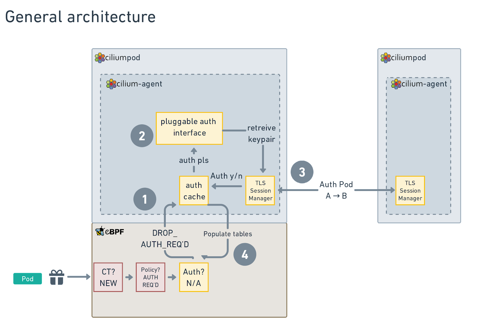
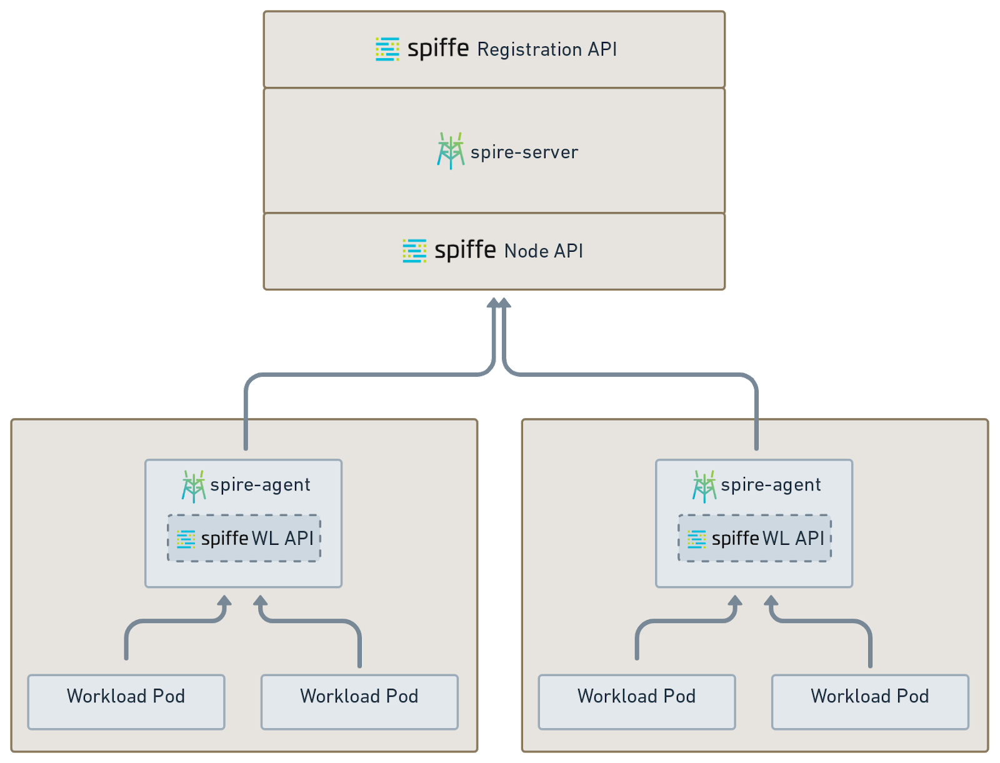
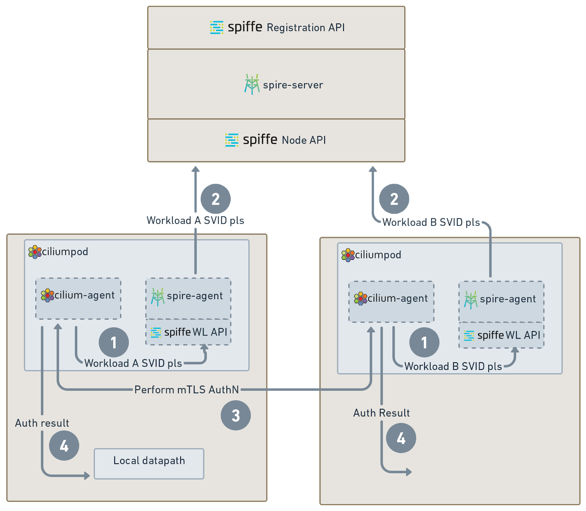
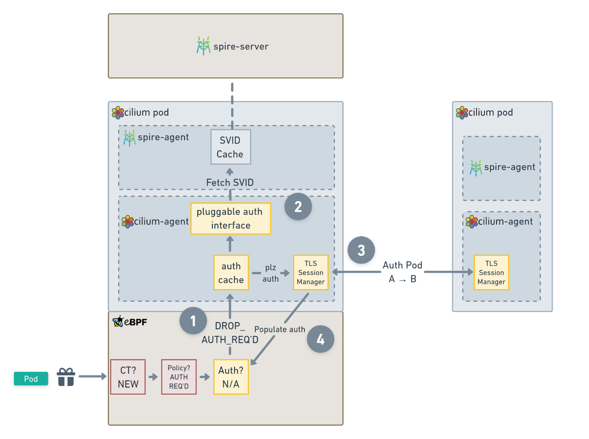

# CFP-2022-10-28: Mutual Authentication for Cilium Service Mesh


## Meta

**SIG: SIG-ServiceMesh**

**Sharing: Public**

**Begin Design Discussion:** October 28, 2022

**End Design Discussion:** November 25, 2022

**Cilium Release:** 1.13

**Roadmap:** [https://github.com/cilium/cilium/issues/22215](https://github.com/cilium/cilium/issues/22215)

**Authors:** Joe Stringer &lt;[joe@isovalent.com](mailto:joe@isovalent.com)>, Nick Young &lt;[nick.young@isovalent.com](mailto:nick.young@isovalent.com)>


## Summary

Enable Cilium to authenticate endpoints on peer nodes in the cluster and control dataplane connectivity based on successful mutual authentication.


## Motivation

Many users of existing service meshes consider pod mutual authentication to be a critical feature of a service mesh, and are looking for Cilium to provide an implementation of this feature as part of the Cilium Service Mesh offering.

Existing mutual authentication implementations put several restrictions upon users in order to attain additional security guarantees. These can range from requiring apps to use TCP+TLS for authentication/encryption to requiring (sidecar) proxies in the dataplane. These restrictions increase the baseline complexity and processing cost of implementing mutual authentication. We believe that by combining the best of session-based authentication and network-based authentication, we can provide a secure implementation that is faster and more flexible than prior implementations.


## Goals

* Provide a mechanism for pods to opt into peer authentication
* Pluggable for existing certificate management systems (SPIFFE, Vault, SMI, Istio, cert-manager, …)
* Configurable certificate granularity
* Leverage existing encryption protocol support for the dataplane


## Non-Goals

* Inline authentication via a proxy
* Dropless connection establishment


## Proposal

### Overview

The Isovalent blog [Next-Generation Mutual Authentication with Cilium Service Mesh](https://isovalent.com/blog/post/2022-05-03-servicemesh-security/) described the high level design for mutual authentication where there are two channels for connectivity: Firstly, a control plane connection between cilium-agent instances on each node provides authentication of connections between pods on the nodes. Secondly, the existing Cilium encryption support using WireGuard or IPsec provides an encrypted dataplane for the connections. This document seeks to describe the per-node implementation that coordinates these out-of-band authentication channels with the in-band network encryption channels.

Here is a diagram showing the key parts of the design




The following sub-sections are broken up by the aspects of the design where specific changes need to be made, starting from the k8s resource types that need to be modified, and followed by the considerations for the cert management control plane, the (local) control plane, and the data plane. While the following sections may focus more on SPIFFE as a default auth implementation for the pluggable interface, the same principles should apply for other auth mechanisms.


## Resources


### ConfigMap - cilium-config


* _option-name: **default**_
    * _description_
* mesh-auth-mode: **disabled**
    * enabled / disabled
* mesh-auth-cert-source: **directory**
    * Configure certificate mechanism, default to directory path
* mesh-auth-path: **/var/run/cilium/auth/**
    * Configure the directory to pull certificates from, if _mesh-auth-cert_ is **directory**
* mesh-auth-port: **4250**
    * Each agent opens this port for mutual authentication
    * TODO review port for conflicts


### CRD - CiliumNetworkPolicy, CiliumClusterwideNetworkPolicy


* Extend the existing policy structure to include a new Authentication field

    ```yaml
    apiVersion: "cilium.io/v2"
    kind: CiliumNetworkPolicy
    metadata:
      name: "l3-egress-rule"
    spec:
      endpointSelector:
        matchLabels:
          run: ssh-client
      egress:
      - toEndpoints:
        - matchLabels:
            run: sshd
        auth:
           enabled: true
    ```

* Semantics are:
    * Apply the policy to pods with the label ``run: ssh-client``
    * Allow traffic to pods with the label ``run: sshd``
    * Require authentication for these connections
    * Enable default deny
* Initially, require `toEndpoints` field when the `auth` field is set
    * Cannot provide mTLS with cluster-external peers
    * Cannot provide mTLS with cluster entities
* If there are two conflicting policies, one that requires authentication and one that does not require authentication, then authentication will be required
* If there are two policies with conflicting authentication fields, reject the rule
    * Log an error in the Cilium agent logs
    * Emit a warning status to in-pod ``cilium status`` output
* Gotchas / corner cases:
    * Avoid requiring auth to kube-apiserver
    * Avoid requiring auth to SPIRE


## mTLS, SPIFFE, and SPIRE

When building an mTLS solution, SPIFFE, the API for having workloads request an attested identity with a clear chain of custody, and SPIRE, the implementation of that API, are the state of the art. The SPIFFE project has spent a lot of time thinking deeply about how you can avoid common identity-sharing pitfalls like spoofing identities, getting identity details (commonly but not always X.509 TLS keypairs, but not always) to the workload security, and being able to easily rotate and revoke these identities when required.

This proposal recommends that, rather than trying to build something that will take a while to handle all of the above sharp edges, we use SPIFFE and SPIRE as essential parts of the Cilium Service Mesh story, and associate the Cilium Security Identity on a 1:1 basis with a SPIFFE identity and the associated X.509 keypairs.

Pros:

* We’re using another CNCF project, which means that we’re both being good citizens, and avoiding building something ourselves.
* We can avoid having to run down all the ways a fast, proof-of-concept implementation would create security issues in the future. There’s no such thing as temporary when it comes to APIs.
* We effectively add a second factor to the Cilium Security Identity - the SPIFFE identity and the keypair in the SVID.
* The certificates aren’t actually stored in the Kubernetes cluster as Secrets, so getting access to them is more difficult. For example, someone with filesystem access on the node does not automatically gain access to the certificates.

Cons:

* We pick up a dependency on SPIRE. We’ll need to be running a SPIRE server in the cluster somewhere, and a SPIRE agent on each node (the agent is required for the attestation process to work properly).


#### Other options for SPIFFE identity

Cert-manager CSI driver

Cert-manager has a SPIFFE-capable CSI plugin that makes SVIDs, including the X.509 TLS keypair, available as a dynamically-mounted Secret inside Kubernetes Pods. Because we don’t want the Pods to need to mount things for mTLS, this is not viable, unfortunately.

Istio

The Istio control plane issues SPIFFE IDs to all workloads, but it seems to do it on a per-service-hostname basis, which also doesn’t match up well with the Cilium Security ID.


#### Other mTLS options

We _could_ roll our own certificate distribution and attestation protocol, but in this proposal, we’ve made the call that:

* Doing security design on the run is a great way to end up with something that will be difficult to fix in the long term
* We run the risk of poorly reimplementing SPIFFE and SPIRE anyway.

With that in mind, let’s talk about what the moving pieces are in terms of making mTLS with SPIFFE and SPIRE work. This will need a short excursion into how SPIFFE and SPIRE actually work.


### A short tour of SPIFFE and SPIRE

SPIFFE is an API that allows _workloads_ to request an _identity_ from a central server. In our case, a _workload_ means the same thing that a Cilium Security Identity does - a set of pods described by a label set. A SPIFFE identity is a subclass of URI, and looks something like this:


```
spiffe://trust.domain/path/with/encoded/info
```

The _trust domain_ is a hostname-style string that usually corresponds to a cluster, but it can go larger (a hypothetical multi-cluster service mesh would share a trust domain). When using X.509 certificates, it’s roughly equivalent to a certificate authority (CA). The _path_ is an arbitrary string that the identity can use to disambiguate different identities. In Kubernetes usage, it often encodes the namespace and name of the pod or similar info, although crucially for us, it doesn’t _have_ to.

There are two main parts of a SPIFFE setup:

* A central SPIRE server, which forms the root of trust for the trust domain
* A per-node SPIRE agent, which first gets its own identity from the SPIRE server, then validates the identity requests of workloads running on its node.

When a workload wants to get its identity, usually at startup, it connects to the local SPIRE agent using the SPIFFE workload API, and describes itself to the agent. The SPIRE agent then checks that the workload is really who it says it is, and then connects to the SPIRE server and _attests_ that the workload is requesting an identity, and that the request is valid. The SPIRE agent checks a number of things about the workload, that the pod is actually running on the node it’s coming from, that the labels match, and so on. Once the SPIRE agent has requested an identity from the SPIRE server, it passes it back to the workload in the SVID (SPIFFE Verified Identity Document) format. This document includes a TLS keypair in the X.509 version that we’ll use (there’s also a JWT version available).

But how does the SPIRE server know that the workload should get that identity? Well, something had to _register_ the identity. The SPIRE server allows you to register a SPIFFE identity and an associated set of _selectors_, which can be as platform-specific as you want. Since we’re mainly interested in Kubernetes to begin with, we can lean into using label selectors. You can register an identity with as many selectors as you like, which in the Kubernetes case means that you can register an identity to correspond to a _set of labels_.

So, there’s an API call to the SPIRE server to associate the identity “`spiffe://trust.domain/identity/1`” with the labelset “`app=foo`”. Then, when the Pods start up and want their identity, they go to the SPIRE agent and request their own identity, supplying the label `"app=foo"`, and the SPIRE agent, after _verifying that they are who they say they are_, issues them the identity document that the SPIRE server provides (since the SPIRE server trusts the agent).

It’s the verification that’s the part that’s absolutely filled with sharp edges for implementers, and the main reason why this proposal recommends just using SPIRE to begin with.





This is a diagram of how it works in the normal case.


### SPIFFE, SPIRE, and the cilium-agent

So, in the usual flow for SPIRE, the workload requests its own information from the SPIRE server. But for Cilium Service Mesh, we want this mTLS interaction to be both seamless and transparent for the user. On top of that,

, just for mutual authentication. So, we need a way for a Cilium Security Identity to correspond one-to-one with a SPIFFE identity, for that identity to be registered with a SPIRE server, and then for the cilium-agent to be able to retrieve the identity’s keypair so that it can do a handshake to perform the actual authentication.

Luckily, we have something that already has all the information it needs for all of those things - the cilium-agent itself. And also luckily, when some other folk worked on ideas about integrating SPIFFE into Cilium [earlier](https://github.com/cilium/cilium/pull/16626), they also did a bunch of work with SPIFFE and SPIRE to create a [Delegated Identity API](https://github.com/spiffe/spire-api-sdk/pull/8) and [implemented it](https://github.com/spiffe/spire/pull/2481) in the SPIRE server. What this means is that we can give all the Cilium agents a common SPIFFE identity, register that identity with the SPIRE server, and then grant those identities the permission to be delegates and ask for identities on behalf of other workloads.





This diagram shows the way the API flows work. It’s assumed before we start that SPIFFE identities for the source and destination have already been created in the SPIRE server.

Then, when required (whether we do this at Endpoint creation or later is still TBD):


1. All cilium-agents running a workload mentioned in an auth-enabled policy connect to their local spire-agent, and ask for the relevant SVID. The cilium-agent identity is allowed to do Delegated Identity requests to the Workload API (WL API), so this is allowed.
2. The spire-agent passes the request back to the SPIRE server, retrieves the SVID, and passes it back to the cilium-agent.
3. The cilium-agent there figures out where the request is coming from, and connects to the cilium-agent on the source node to perform the mTLS handshake. Because this is a _mutual_ TLS, if it succeeds, then the workloads are authenticated.
4. The mTLS handlers in each cilium-agent then pass the auth success to their local dataplane, by telling it that identity A is authenticated to identity B for some period of time (the lifetime of the certificates in the mTLS handshake).

For that lifetime, traffic between Identity A and Identity B will flow without further checks..


### SPIFFE installation steps and flow

1. Cluster gets created, without CNI, per usual Cilium install
2. SPIRE server installed
3. Set up Cilium Agent SPIFFE identity, configured to be able to do Delegated Identity requests
4. Cilium installed, with mTLS enabled
5. mTLS enabled install also includes per-node SPIRE agent (putting the SPIRE agent inside the Cilium agent pod would mean that they can communicate over a domain socket rather than the network, which would remove one circular dependency, and a security risk as well).
6. Cilium starts up as normal, acts as CNI.
7. Cilium _also_ contacts the local SPIRE agent at startup and gets its own SPIFFE identity via the SPIRE workload API.
8. When generating Cilium Security Identities for identities with mTLS auth enabled, Cilium (could be agent or operator) also records the SPIFFE identity.
9. When checking auth-enabled policy, the agent either retrieves or caches the keypair associated with the SPIFFE identity, and handshakes with the agent on the other end of the connection (either source node agent will reach out to destination node agent, or vice versa), and performs a TLS handshake.
10. If the TLS handshake succeeds, then the connection is authenticated and the traffic protected by policy can proceed. The TLS connection between the agents can then be torn down and thrown away (since it’s not being used to tunnel the encrypted traffic through).


## Control Plane


### Structures

Session table - lookup table for caching + introspection into already-authenticated peers.


### Connections


#### Between Cilium Agent instances and the SPIFFE server

SPIFFE identity registration must occur out-of-band from when the actual SPIFFE identity usage is made via the workload API. In order to register the SPIFFE identities, the Cilium agent initiates a connection to the SPIFFE server. During Endpoint creation in cilium-agent, Cilium attempts to register a SPIFFE identity corresponding to the Cilium identity into the SPIFFE server.


#### Between Cilium Agent instance peers

Mutual authentication connections are established between the node IPs themselves. However, the peers that require authentication are not guaranteed to be these nodes. The section on Impact: Authentication connections per node describes how these options may impact the scalability of the implementation.

Some options for establishing connections to a peer node:

* **identity**: The client sets the SNI to the target pod's kubernetes namespace + pod name in standard k8s format. Connections between each deployment / Cilium security identity are authenticated independently.

Setting SNI during TLS session establishment based on the above options should allow the cilium-agent server to easily understand which mode and peer that the client is attempting to authenticate, and respond with appropriate certificates.  For the overall connectivity to work, the cilium-agent instances on the source/destination nodes establish two independent TLS sessions - The first client to server session authenticates the destination pod on the target server, then transmits the source pod to the server. Then the server initiates a separate session from the server to the client node in order to authenticate the source for the destination pod.


### Local agent Events


#### Startup

* If _mesh-auth-mode_ is enabled, listen on _mesh-auth-port_ for connections
    * When accepting new connections, check the target SNI and use GetCertificate() to locate the certificate corresponding to the local peer for the data session.
    * Q: How does this server know which peer (ie client pod) is initiating this connection? The node where the peer lives should be simple to identify but we may need a dedicated in-band protocol to query the client (node)'s true client (pod). Depending on the answer here, we may either attempt direct mTLS configuration in Go or use a successful connection establishment to trigger an out-of-band reverse TLS session establishment.
    * Q: How to make missing certificate errors super obvious for debugging?
        * Warning in the cilium-agent logs
* Initiate synchronization with certificate store, hook into lazy certificate evaluation logic described in the point above.
    * Option: k8s secrets
    * Option: files + file watcher
    * Option: SPIFFE
    * …


#### CiliumNetworkPolicy creation

* Parse CNPs for the new authentication field. When this is present, as part of policy plumbing, set a new field in the policymap entries that indicates that authentication is required for connectivity to this peer.


#### Triggered by datapath drop

* When the datapath generates a datapath drop message with the reason that _"authentication is required"_ for this peer, look up the corresponding node and establish an mTLS connection to the peer node. Connects to the port outlined in the Startup section above.
    * Set the SNI field based on the _mesh-auth-mode_ configuration
    * Special case: peer node may be the same node as the current node. Shortcut?
        * Related: How do we make this obvious in case we break the feature but connectivity works on the same node?
* Validate certificate of the peer
    * Q: How to make invalid certificate errors super obvious for debugging?
        * Logs
        * Show up in session table as attempted timestamp + failed?


#### Authenticated session established with peer

* Update datapath to inform it that this peer is authenticated (see Data Plane for details)
* Phase 2: validate the corresponding pod should exist on the peer node before updating the datapath (via ipcache?)


#### Endpoint deletion

* Node with endpoint must clear out CT table to remove any state that implies authentication occurred for connections with this endpoint _(This should already exist)_
* Do all other nodes need to clear out their corresponding state also?
    * Thinking of IP recycling case, eg in ENI mode an IP could move from one node to another.
    * Trigger on CiliumEndpoint deletion even for pods on remote nodes, delete authentication state corresponding to that peer. Including userspace authentication table entries, datapath CT/map entries.


#### Timer-based

* Garbage collection TBD
    * Do we need periodic garbage collection, e.g. of authenticated sessions? Tie this to active connection tracking entries for the corresponding peers? LRU for userspace auth session table?
* Attempt to re-authenticate sessions older than _mesh-auth-period_
    * If re-auth fails, terminate connections in datapath (?)


### Certificate management

Initial target dev-focused would be for the cilium-agent to have a _mesh-auth-cert_ directory to pull certificates from. The SPIFFE sections above outline the target production use case.


## Data Plane

### Structures

* Policy Entry - 1 bit: "Authentication Required"
* Dedicated bpf auth map, see Key question: How to implement dataplane auth check


### Logic

* Conntrack occurs before Policy. Provides access to the auth bit for the connection.
* When performing policy lookup, check 'authentication required' bit. If this bit is set and the conntrack entry's authentication bit indicates that authentication has not occurred, drop the traffic and emit an 'authentication required' event to the local control plane.
* Ensure both egress and ingress implement this logic
* TBD additional bpf auth map check, Key question: How to implement dataplane auth check


### Proxy

* For an initial target, do not support Envoy participating in the service mesh.

## Lifecycle / operations walkthrough

### Connection

From scratch, the following example assumes that SPIRE has been bootstrapped in the cluster and the spire-agent running as a container within the cilium-agent pod on each node. Additionally, a CiliumNetworkPolicy must be inserted that selects the target pods and enables the authentication options. We assume that these changes have been calculated and applied to the policymap entries for the pod in the example below.

When a pod sends a packet for a new connection that is selected by a CiliumNetworkPolicy which marks that connectivity as requiring authentication, the BPF datapath goes through a series of steps, from looking up the connection tracker (CT) to evaluating the network policy to checking the Authentication map (auth). When the packet hits the policymap lookup, the map entry will signal that the connection requires authentication. This triggers an additional check in the datapath into the bpf auth map to determine the authentication status between the peers involved in the connection. For the example below, we assume that this initial authentication check fails because the authentication has not yet occurred for these peers.





Steps following an authentication map lookup failure:

1. The packet is dropped. The BPF datapath emits a drop event to userspace notifying that the packet between these peers has been dropped due to the reason that "authentication is required" for this connection.
2. Cilium agent intercepts the event and initiates a request for certificate material that is necessary in order to establish a TLS session with the cilium-agent on the node where the peer application resides.
3. Cilium agent initiates the mTLS handshake with the peer node
4. Cilium agent populates the BPF auth map to indicate that these peers have authenticated, and as such subsequent packets between these peers can perform the lookup in this map and pass the policy/auth check and hence continue to the destination.

The above outline describes the process at the source node. A similar process needs to occur at the destination node, to allow the destination node to authenticate the source pod. A naive approach that should work is to naively execute the exact same logic at the destination node when packets are processed at ingress towards the destination pod. An improved implementation would initiate this process at the destination node when the source node initiates step (3) towards the destination node.


## Debuggability

* In-Pod CLI, extend cilium bugtool to gather this data so it gets into sysdumps:
    * `cilium status` - overview of authentication status
        * N/M pods configured for authentication
        * N authentication sessions with peers
    * `cilium auth list` - List all authentication sessions in cilium-agent
        * Local node
        * Peer node
        * Local pod (selector?)
        * Peer pod (selector?)
        * Last authentication timestamp
        * ETA next authentication timestamp
        * Inbound / Outbound session establishment (ie triggered locally or by remote peer)
        * Status (authenticating / authenticated / failed + err )
    * `cilium bpf auth list` - Dump bpf map state for authentication (if applicable)
* hubble events - Add "authenticated" timestamp to events so that hubble CLI, UI, etc can visualize authentication status of connections between in-cluster peers
    * Perhaps, "last authentication time" + "next authentication time"?
    * Was authentication required by the local peer or the remote peer for this traffic?
    * **Discussion needed: SIG-Hubble**
* Metrics
    * Total authentication sessions in the cilium-agent (inbound vs. outbound)
    * SPIFFE ID registration time (during CNI ADD)
    * TLS Session authentication time (during connection establishment)
    * Your metrics suggestions here


# Impacts / Key Questions

_List crucial impacts and key questions. They likely require discussion and are required to understand the trade-offs of the CFP. During the lifecycle of a CFP, discussion on design aspects can be moved into this section. After reading through this section, it should be possible to understand any potentially negative or controversial impact of this CFP. it should also be possible to derive the key design questions: X vs Y._


## Impact: Increased latency for authenticated sessions

The current design primarily relies upon dropping the first packet of a connection to trigger authentication. This will increase latency for new connections and will likely cause Cilium to compare poorly with corresponding implementations on a fresh start (eg Istio). Mitigating this issue is part of Deferred Milestone 2.


## Impact: Authentication connections per node

Depending on the options for establishing connections between nodes and options for the server to understand which client is establishing an authenticated connection from a peer node, connections may be established as:

* One connection per pair of nodes
* One connection per pair of namespaces
* One connection established per pair of deployments/identities establishing data connections, ie corresponding to the pod A (node A) -> pod B (node B)
* Two connections per pair, node A -> pod B (node B) + node B -> pod A (node A)

Considering the latter case, outbound connections to other nodes would be anticipated to be within roughly an order of magnitude of the number of local pods available, with the assumption that pods keep the number of in-cluster peers within a bounded number. Say 10x peers per pod * 100 pods = 1000 outbound sessions. One exception would be sessions established from Ingress pods which are likely to generate many connections to arbitrary peers inside the cluster. Considering 100 pods per node this would put an upper bound of 100 * nodes, but the average would likely be much lower.

Inbound sessions are not inherently limited in the same way.

It's probably worth considering whether any limits or at least metrics should be put onto inbound + outbound mTLS authentication requests to evaluate the resource impact of the feature.


## Impact: Connection authentication upon policy transition

Depending on [Key question: How to implement dataplane auth check](#), and the specifics of the CT entry handling, upgrades or policy transitions could adversely impact either connectivity of existing connections, or the validity of the authenticated sessions.

Specifically, if the CT entry contains an "authentication required" bit that is set when looking up the policy and cleared by userspace, this means that before a user installs any auth policy, no connections will be marked as "requiring authentication". As such, when the user then subsequently installs a policy that requires authentication for such connections, it will appear as though this existing connection already passed the authentication check, even though it hasn't. This will avoid connection disruption when the policy changes, but it will fail to enforce the new authentication requirement of the policy.

Alternatively, if the CT entry contains an "authentication confirmed" bit, then existing connections could be disrupted when an authentication policy is introduced. This is because the existing CT entries would not have the bit set (as there is no authentication configured), then the policy would be updated to require authentication and the datapath would immediately begin to drop traffic on the connection until the authentication is established.

Either of these impacts could be mitigated by delaying the policy implementation when handing a policy update until all impacted peers are authenticated and the dataplane CT entries are updated to reflect the change in authentication policy.  Careful attention should be paid to the implementation either way to ensure minimal disruption to existing connections while providing the maximal assurance that connections impacted by a new auth policy are in fact authenticated. If the peers for existing connections cannot be authenticated within a bounded period, these connections should be highlighted and potentially terminated.


## Impact: Connection disruption during Agent downtime

The current design relies primarily upon the datapath containing a cache of authenticated connections, and the datapath falls back to requesting authentication from the userspace agent when the cache does not indicate a connection is authenticated. This introduces a hard dependency on the availability of the agent.


### New connections

The simplest impact here is that it will not be possible to initiate connections between peers when there is a policy that requires mutual authentication and those peers have not previously established an authenticated session.


### Re-auth

Beyond this, any mechanisms that are created to allow connection reuse or re-auth will need to consider agent restart. Over time, the agent will itself initiate TLS connections and cache which workload peers have been authenticated. These would have expiry timestamps based upon some user-configurable cert rotation policies. Given that this lives in the userspace, when Cilium agent restarts, this state would be lost.

In order to mitigate this issue, the Cilium agent should periodically sync the state of authenticated peers to a longer-lived store, either as a datapath map or some filesystem state, and upon startup, reconstitute this state in the agent. At this time if any peers had previously been authenticated but timeouts had occurred, re-authentication of the sessions should be initiated.

Extended agent downtime could impact the ability to properly terminate session authentication for peers, depending on the datapath implementation.

[Option 2: N-tuple match on connection endpoints in new auth map](#) discusses how timestamps could be integrated into the datapath to ensure connection termination when mutual authentication reauthentication periods elapse. If these timestamps are not integrated into the datapath, then we would have to accept that authenticated sessions may remain authenticated indefinitely during agent downtime.


## Key question: How dynamic should the cert granularity be?

A few options for certificate granularity are described above, such as associating one cert with each node; one with each namespace; one with each deployment/identity. Should these be configurable based on the policy for individual endpoints, or statically defined across the cluster?


### Option 1: Define mesh-auth-mode via daemon config

#### Pros
* Upper bound for auth connections / node is pre-defined


#### Cons
*


## Key question: How to implement dataplane auth check

The dataplane authentication check in eBPF requires two components: One is a bit in the policy logic that marks that affected connections must be authenticated. This can be implemented with minimal changes by adding it into the existing policymap. The second is how we check that a connection is authenticated. This part must be informed by the userspace local control plane populating some state that is available to the eBPF dataplane.


### Option 1: N-tuple match on connection endpoints in new auth map

A new map is introduced into the eBPF dataplane that allows the packet-handling logic to look up for some subset of {src, dst, …} fields of the packet and confirm whether authentication has already occurred for this set of peers.


#### Pros

* Allow multiple connections between the same peers to leverage the same authentication channel, rather than forcing every connection to individually authenticate
* Could support pre-authentication + pre-population (subject to scale concerns)


#### Cons

* More expensive per-packet to look up an additional map using packet fields
* Additional memory overhead (~N MB)


#### Implementation details

Q: How big to make the auth map in BPF? Depends on the key type and target number of peers in the cluster. Assuming ~16B for IPv4 + ~40B for IPv6, => 56 (round to 64B), 64K peers could be supported in ~4MB of memory. This comes down to 1.5MB or less if keyed by identity.


##### Key

* If we only support 1:1 certificate to identity, the key could be the local+remote identities:

        ```c++
        struct auth_key {
        	__u32 local_id;
        	__u32 remote_id;
        }
        ```


* If we want more flexibility in certificate : workload mappings then IPs would be a more natural choice. Could follow ipcache_key for IPv4/IPv6 combined map or have independent maps for IPv4 / IPv6.

        ```c++
        struct auth_key {
        	__u32 local_addr;
        	__u32 remote_addr;
        }
        ```

* More complicated: If certificate : namespace mappings are desired, we could map the namespaces to some new "namespace_id" and teach the datapath about these. This would reduce the number of entries in the map vs. IPs but would be more complicated to track & restore.
* For even further future-looking approaches, it could be possible to tie IPAM to certificate management, eg "all pods in namespace foo are assigned IPs in range 10.0.0.0/24" + same cert for the namespace. We could then key by local+remote CIDR, then one entry could cover many pods in the same namespace. We don't have immediate plans to support such a dynamic IPAM mode however.

##### Value

* Simple: Presence of the entry in the map indicates authentication occurred.
* More advanced: Include a timestamp in kernel form (jiffies / ktime)
    * This could allow ongoing authentication checks by the datapath to enforce reauth automatically, without relying on the userspace agent to update entries to update the authentication status over time.

        ```
        struct auth_info {
        	__u32 auth_ts; // bpf_mono_now()
        	__u32 auth_expiry_ts; // auth_ts + REAUTH_PERIOD
        }

        ```

# Future Milestones

_List things that this CFP will enable but that are out of scope for now. This can help understand the greater impact of a proposal without requiring to extend the scope of a CFP unnecessarily._

The following milestones are not necessarily phrased in dependency ordering, some may be doable in parallel in future.


## Deferred Milestone 1

## Allow Cilium's Envoy Ingress/Gateway to participate in the mutual authentication mesh

## Deferred Milestone 2

Avoid the "authentication required" drop, perhaps via queueing or by authenticating during application connect call, trigger via socket LB at sender side


## Deferred Milestone 3

Validate that a workload is supposed to be running on the target node. Mitigate cert leaks where adversary launches pods on a different node.

## Deferred Milestone 4

Negotiate encryption key in mTLS connection

## Deferred Milestone 5

Transmit metadata on authentication connection. What is the identity of the sender? Does not require the application to be running HTTP, encoding in HTTP headers in-band
