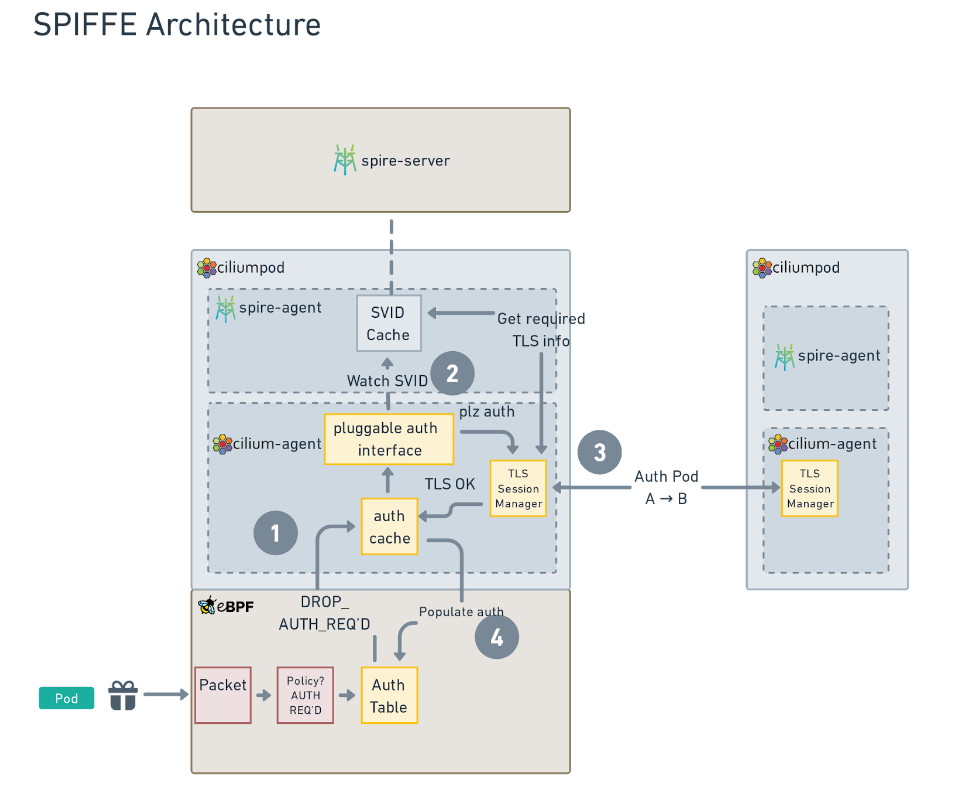

# CFP-22215: Mutual Authentication for Cilium Service Mesh

**SIG: SIG-ServiceMesh**

**Begin Design Discussion:** 2022-10-28

**Cilium Release:** 1.14

**Authors:** Joe Stringer <joe@isovalent.com>, Nick Young <nick@isovalent.com>

## Summary

Enable Cilium to authenticate endpoints on peer nodes in the cluster and control dataplane connectivity based on successful mutual authentication.

## Motivation

Many users of existing service meshes consider pod mutual authentication to be a critical feature of a service mesh, and are looking for Cilium to provide an implementation of this feature as part of the Cilium Service Mesh offering.

Existing mutual authentication implementations put several restrictions upon users in order to attain additional security guarantees. These can range from requiring apps to use TCP+TLS for authentication/encryption to requiring (sidecar) proxies in the dataplane. These restrictions increase the baseline complexity and processing cost of implementing mutual authentication. We believe that by combining the best of session-based authentication and network-based authentication, we can provide a secure implementation that is faster and more flexible than prior implementations.

## Goals

* Provide a mechanism for pods to opt into peer authentication
* Pluggable for existing certificate management systems (SPIFFE, Vault, SMI, Istio, cert-manager, …)
* Configurable certificate granularity
* Leverage existing encryption protocol support for the dataplane
* Minimize packets dropped as far as possible in a reasonable amount of effort.

## Non-Goals

* Inline authentication via a proxy
* _Guaranteed_ no-drop connection establishment. We will try to get as close as we reasonably can though.
* In the initial implementation, allow auth in Layer7 policies.


## Proposal

### Overview

The Isovalent blog [Next-Generation Mutual Authentication with Cilium Service Mesh](https://isovalent.com/blog/post/2022-05-03-servicemesh-security/)
described the high level design for mutual authentication where there are two channels for connectivity:
Firstly, a control plane connection between cilium-agent instances on each node provides authentication of connections between pods on the nodes.
Secondly, the existing Cilium encryption support using WireGuard or IPsec provides an encrypted dataplane for the connections. This document seeks to describe the per-node implementation that coordinates these out-of-band authentication channels with the in-band network encryption channels.

Here is a diagram showing the key parts of the design


The following sub-sections are broken up by the aspects of the design where specific changes need to be made, starting from the k8s resource types that need to be modified, and followed by the considerations for the cert management control plane, the (local) control plane, and the data plane. While the following sections may focus more on SPIFFE as a default auth implementation for the pluggable interface, the same principles should apply for other auth mechanisms.

### Resources

This is an example of what the config will look like; it's likely that extra fields will need to be added as part of the implementation process.

#### Config items

* `mesh-auth-mode`: needs to store what mesh auth mode should be used, if any. Probably `mtls-spiffe` or `disabled` to begin with.
* SPIRE server config:
  * SPIFFE trust domain (default `spiffe.cilium` so that it's not an actual domain name.)
  * SPIFFE ID for the Agent (default `spiffe://spiffe.cilium/cilium-agent`)
  * SPIFFE ID for the Operator (default `spiffe://spiffe.cilium/cilium-operator`)
  * SPIRE server location (default `spire-server.spire.svc.cluster.local`) The SPIRE server must be network accessible for attestation to work properly,
    and for the operator to be able to register identities correctly.
  * SPIRE Agent Admin socket location (default `unix://var/run/cilium/spiffe/admin/admin.sock`)
  * SPIRE Agent socket location (default `unix://var/run/cilium/spiffe/agent.sock`)
* `mesh-auth-port` (default `4250`) Configures the port that each agent opens for mutual authentication.

These will all need to be fit into the configuration and Helm charts somewhere, but the details are left to the implementers.
This section will be updated once this is implemented.

#### CRD - CiliumNetworkPolicy, CiliumClusterwideNetworkPolicy

* Extend the existing policy structure to include a new Authentication field

```yaml
apiVersion: "cilium.io/v2"
kind: CiliumNetworkPolicy
metadata:
  name: "l3-egress-rule"
spec:
  endpointSelector:
    matchLabels:
      run: ssh-client
  egress:
  - toEndpoints:
    - matchLabels:
        run: sshd
    auth:
       type: spiffe
```

* Semantics are:
  * Apply the policy to pods with the label `run: ssh-client`
  * Allow traffic to pods with the label `run: sshd`
  * Require authentication for these connections
  * Enable default deny
* Initially, require `toEndpoints` field when the `auth.type` field is set
  * Cannot provide mTLS with cluster-external peers
  * Cannot provide mTLS with cluster entities
* If there are two conflicting policies, one that requires authentication and one that does not require authentication, then authentication will be required
* If there are two policies with conflicting authentication fields, reject the rule
  * Log an error in the Cilium agent logs
  * Emit a warning status to in-pod `cilium status` output
  * Increment a metric, with tags
* Gotchas / corner cases:
  * Avoid requiring auth to kube-apiserver
  * Avoid requiring auth to SPIRE
  * Many more, still TBD, [#24552](https://github.com/cilium/cilium/issues/24552) is logged to investigate, and this document will be updated further once that work is done.


### mTLS, SPIFFE, and SPIRE

When building an mTLS solution, SPIFFE, the API for having workloads request an attested identity with a clear chain of custody, and SPIRE, the implementation of that API, are the state of the art. The SPIFFE project has spent a lot of time thinking deeply about how you can avoid common identity-sharing pitfalls like spoofing identities, getting identity details (commonly but not always X.509 TLS keypairs, but not always) to the workload security, and being able to easily rotate and revoke these identities when required.

This proposal recommends that, rather than trying to build something that will take a while to handle all of the above sharp edges, we use SPIFFE and SPIRE as essential parts of the Cilium Service Mesh story, and associate the Cilium Security Identity on a 1:1 basis with a SPIFFE identity and the associated X.509 keypairs.

Pros:
* We’re using another CNCF project, which means that we’re both being good citizens, and avoiding building something ourselves.
* We can avoid having to run down all the ways a fast, proof-of-concept implementation would create security issues in the future. There’s no such thing as temporary when it comes to APIs.
* We effectively add a second factor to the Cilium Security Identity - the SPIFFE identity and the keypair in the SVID.
* The certificates aren’t actually stored in the Kubernetes cluster as Secrets, so getting access to them is more difficult. For example, someone with filesystem access on the node does not automatically gain access to the certificates.

Cons:
* We pick up a dependency on SPIRE. We’ll need to be running a SPIRE server in the cluster somewhere, and a SPIRE agent on each node (the agent is required for the attestation process to work properly).

#### Other options for SPIFFE identity

##### cert-manager CSI driver

cert-manager has a SPIFFE-capable CSI plugin that makes SVIDs, including the X.509 TLS keypair, available as a dynamically-mounted Secret inside Kubernetes Pods. Because we don’t want the Pods to need to mount things for mTLS, this is not viable, unfortunately.

##### Istio

The Istio control plane issues SPIFFE IDs to all workloads, but it seems to do it on a per-service-hostname basis, which also doesn’t match up well with the Cilium Security ID.

##### Other mTLS options

We could roll our own certificate distribution and attestation protocol, but in this proposal, we’ve made the call that:
Doing security design on the run is a great way to end up with something that will be difficult to fix in the long term
We run the risk of poorly reimplementing SPIFFE and SPIRE anyway.

With that in mind, let’s talk about what the moving pieces are in terms of making mTLS with SPIFFE and SPIRE work. This will need a short excursion into how SPIFFE and SPIRE actually work.

#### A short tour of SPIFFE and SPIRE

SPIFFE is an API that allows workloads to request an identity from a central server. In our case, a workload means the same thing that a Cilium Security Identity does - a set of pods described by a label set. A SPIFFE identity is a subclass of URI, and looks something like this:

`spiffe://trust.domain/path/with/encoded/info`

The trust domain is a hostname-style string that usually corresponds to a cluster, but it can go larger (a hypothetical multi-cluster service mesh would share a trust domain). When using X.509 certificates, it’s roughly equivalent to a certificate authority (CA). The path is an arbitrary string that the identity can use to disambiguate different identities. In Kubernetes usage, it often encodes the namespace and name of the pod or similar info, although crucially for us, it doesn’t have to.

There are two main parts of a SPIFFE setup:
* A central SPIRE server, which forms the root of trust for the trust domain
* A per-node SPIRE agent, which first gets its own identity from the SPIRE server, then validates the identity requests of workloads running on its node.

When a workload wants to get its identity, usually at startup, it connects to the local SPIRE agent using the SPIFFE workload API, and describes itself to the agent. The SPIRE agent then checks that the workload is really who it says it is, and then connects to the SPIRE server and attests that the workload is requesting an identity, and that the request is valid. The SPIRE agent checks a number of things about the workload, that the pod is actually running on the node it’s coming from, that the labels match, and so on. Once the SPIRE agent has requested an identity from the SPIRE server, it passes it back to the workload in the SVID (SPIFFE Verified Identity Document) format. This document includes a TLS keypair in the X.509 version that we’ll use (there’s also a JWT version available).

But how does the SPIRE server know that the workload should get that identity? Well, something had to register the identity. The SPIRE server allows you to register a SPIFFE identity and an associated set of selectors, which can be as platform-specific as you want. Since we’re mainly interested in Kubernetes to begin with, we can lean into using label selectors. You can register an identity with as many selectors as you like, which in the Kubernetes case means that you can register an identity to correspond to a set of labels.

So, there’s an API call to the SPIRE server to associate the identity `spiffe://trust.domain/identity/1` with the label set `app=foo`. Then, when the Pods start up and want their identity, they go to the SPIRE agent and request their own identity, supplying the label `app=foo`, and the SPIRE agent, after verifying that they are who they say they are, issues them the identity document that the SPIRE server provides (since the SPIRE server trusts the agent).

It’s the verification that’s the part that’s absolutely filled with sharp edges for implementers, and the main reason why this proposal recommends just using SPIRE to begin with.


This is a diagram of how it works in the normal case.


#### SPIFFE, SPIRE, and the cilium-agent 

So, in the usual flow for SPIRE, the workload requests its own information from the SPIRE server. But for Cilium Service Mesh, we want this mTLS interaction to be both seamless and transparent for the user. On top of that, we’re not even going to be using the TLS keypairs for actual encryption, just for mutual authentication. So, we need a way for a Cilium Security Identity to correspond one-to-one with a SPIFFE identity, for that identity to be registered with a SPIRE server, and then for the cilium-agent to be able to retrieve the identity’s keypair so that it can do a handshake to perform the actual authentication.

Luckily, we have something that already has all the information it needs for all of those things - the cilium-agent itself. And also luckily, when some other folk worked on ideas about integrating SPIFFE into Cilium earlier, they also did a bunch of work with SPIFFE and SPIRE to create a Delegated Identity API and implemented it in the SPIRE server. What this means is that we can give all the Cilium agents a common SPIFFE identity, register that identity with the SPIRE server, and then grant those identities the permission to be delegates and watch for identities on behalf of other workloads. Those identities will be sent to the Cilium Agent as soon as they are created on the SPIRE server, as long as the SPIFFE selectors (in our case, the label selectors) are in the set being watched by the Cilium Agent.

This diagram shows the way the API flows work. It’s assumed before we start that SPIFFE identities for the source and destination have already been created in the SPIRE server.


Then, when required (whether we do this at Endpoint creation or later is still TBD):
1. All cilium-agents running a workload mentioned in an auth-enabled policy connect to their local spire-agent, and watch a set of SPIFFE labels that includes the labels for the relevant SVID. The cilium-agent identity is allowed to do Delegated Identity requests to the Workload API (WL API), so this is allowed.
1. The spire-agent watches SVIDs on the SPIRE server, sees any updates to all relevant SVIDs, and passes them back to the cilium-agent.
1. The cilium-agent then figures out where the request is coming from, and connects to the cilium-agent on the source node to perform the mTLS handshake. Because this  a mutual TLS, if it succeeds, then the workloads are authenticated.
The destination node will also record that the workload is authenticated for reverse traffic.
1. The mTLS handlers in each cilium-agent then pass the auth success to their local dataplane, by telling it that identity A is authenticated to identity B for some period of time (the lifetime of the certificates in the mTLS handshake).
The mTLS handlers will also need to indicate the remote node, along with the auth type.
For that lifetime, traffic between Identity A and Identity B will flow without further checks.

#### SPIFFE installation steps and flow

1. User creates a cluster, without CNI, per usual Cilium install process. 
1. User installs Cilium, with mTLS enabled, SPIFFE auth will not work until the following conditions are met:
    * SPIRE Server must be installed somewhere and configured correctly. (Bring-your-own-SPIRE-Server is an anticipated future need, but the initial implementation will use an in-cluster SPIRE server.)
    * Per-node SPIRE Agent must be installed in the cluster and configured correctly. The SPIRE agent talks to the SPIRE server over the network, but all other communication with the Cilium Agent is via domain sockets shared on the host's filesystem.
    * Cilium Agent SPIFFE Identity must be created as per SPIRE Agent config.
    * Cilium Operator SPIFFE Identity must be created as per SPIRE Server config.
    * (This document will be updated after [#23806](https://github.com/cilium/cilium/issues/23806) is done.)
1. Cilium agent starts up as normal, acts as CNI.
1. Cilium agent also contacts the local SPIRE agent at startup (via a domain socket shared on the host's filesystem) to watch the Delegated Identity API and gets its own SPIFFE identity via the SPIRE workload API.
1. When generating Cilium Security Identities for identities with mTLS auth enabled, Cilium Operator in SPIFFE mode also records the SPIFFE identity (that is, the string `spiffe://spiffe.cilium.io/identity/1337`).
For SPIRE implementations, the Cilium Operator also creates the required SPIRE server entries.
1. When checking auth-enabled policy, the datapath will flag that there is no entry in the auth table for the flow, and then the agent will use its cache of keypairs to handshakes with the agent on the other end of the connection (either source node agent will reach out to destination node agent, or vice versa), and performs a TLS handshake. Note that an optimization which may be included here is that the agent may pre-authenticate identities that it knows will need it, if we can make that work.
1. If the TLS handshake succeeds, then the connection is authenticated and the traffic protected by policy can proceed. The TLS connection between the agents can then be torn down and thrown away (since it’s not being used to tunnel the encrypted traffic through).
1. The details of the particular flow are saved to the auth table by the agent; note that this needs to include the remote node the auth was performed with.
It's not possible to reuse an identity-identity handshake across nodes without making bad-node attacks much easier.


### Control Plane

#### Connections

##### Between Cilium Operator instances and the SPIFFE server

SPIFFE identity registration must occur out-of-band from when the actual SPIFFE identity usage is made via the workload API. In order to register the SPIFFE identities, the Cilium Operator must communicate with the SPIRE server.

There are two ways to do this:
1. To communicate with the SPIRE server using its admin domain socket, which could be mounted into the host file system as we do with the Agent admin socket. However, this means that _one_ Pod out of the Operator deployment would need to be running on the _same node_ as the SPIRE Server's StatefulSet Pod. This will need Pod Affinity, and some way for the Operator to check if the domain socket is available. This process would also need to run independently of the usual Kubernetes Leadership, unfortunately.
2. As part of the installation, we configure a special SPIFFE ID that we will grant to the Cilium Operator and give it admin-level access to the SPIRE server. This will allow the Operator to manage SPIRE entries across the network safely (as it will use SPIFFE identities and SPIRE attestation to ensure that only the Operator gets to do it.)


##### Between Cilium Agent instance peers
Mutual authentication connections are established between the node IPs themselves. However, the peers that require authentication will not be these nodes.

The source agent determines the destination agent using the destination endpoint IP. It then reaches out and connects to the listening port on the destination agent, and completes a TLS handshake.
After the TLS handshake is complete, the session is torn down, as all the relevant information has been required. (Namely, did the authentication work, and when do the client and server expire?)
For the destination agent, this process is reversed (an incoming connection from identity A to B _from_ node A will create an entry with A, B, and Node A on Node B, whereas on Node A, the entry will have A, B, and Node B.)

This design has a few wins here:
- The Authentication only requires that the TLS Handshake succeed, it does not require that we keep the connection open, so we will be making short lived connections for each authentication check, and this will most likely need to be to a new, dedicated port.
- Because we will be controlling both ends of the TLS handshake, we can use any field we like in the certificates for authentication - SPIFFE certificates issued by SPIRE have the full SPIFFE ID URI as a SAN field, so we can use that for choosing both client and server certificates.
  - However, because the TLS handshake can only use a hostname for SNI, we make a standard "hostname" that encodes the source and destination security identities, `<destinationidentity>.<trustdomain>`, since the source identity is available from the client certificate.
- By encoding minimal information into the SNI (trust domain and Cilium Identity number), only trusting the information after a successful TLS handshake, and closing connections quickly after exchanging the relevant information, attacks involving information leakage or attacking long-lived connections are mitigated.


#### Local agent Events

##### Startup
* If mesh-auth-mode is enabled, listen on mesh-auth-port for connections
  * When accepting new connections, check the target SPIFFE ID URI and use GetCertificate() to locate the certificate corresponding to the local peer for the data session.
  * Q: How does this server know which peer (i.e client pod) is initiating this connection? The exact Pod IP on the source node is actually not important, as long as we can trust the Cilium agent to look up the Cilium Identity correctly for any Pod running on it, then we only need the source Cilium Identity (which can be used to derive the certificate for that workload from the certificates the agent has already seen). In the SPIFFE case, the client certificate issued to the workload by the SPIRE server includes the SPIFFE ID as a SAN field of type URI, so the server knows which _identity_ is attempting to authenticate, and can validate the connection on that basis. Other future certificate stores will also need to ensure that a SPIFFE ID or equivalent is populated into a SAN in the certificate.
  * Q: How to make missing certificate errors super obvious for debugging? We're attempting to route around this problem by having Pod startup blocked until the SPIRE server has completed issuing certificates for the identity given to any specific Pod, the same as we already do for Identity creation.

##### Pod Startup
* Similarly to holding Pod startup until after ensuring the ipcache is up to date, once mTLS is enabled in the cluster, we'll need to hold up Pod startup while certificates are provisioned. Still TBD is if this will be for _every_ Pod or only for Policy-relevant ones.

##### CiliumNetworkPolicy creation
Parse CNPs for the new authentication field. When this is present, as part of policy plumbing, set a new field in the policymap entries that indicates that authentication is required for connectivity to this peer.
This process will be skipped if the `mesh-auth-mode` config directive is not set.

##### Triggered by datapath drop
* When the datapath generates a datapath drop message with the reason that "authentication is required" for this peer, look up the corresponding node and establish an mTLS connection to the peer node. Connects to the port outlined in the Startup section above.
  * Use the Cilium Identity to look up TLS details.
  * Special case: peer node may be the same node as the current node. In this case, the Node can connect to its own serving port, and perform the handshake, just like a remote node.
  * Validate certificate of the peer. Note that since we are also planning to handle re-key events by pre-emptively re-authenticating, this should not occur very often.
  Intial implementation efforts show that when using SPIRE, the SPIRE server will pre-emptively re-key for you before the expiration time has elapsed, and send a new keypair via the DelegatedIdentity API - we are planning on triggering reauth when this occurs.
    * Q: How to make invalid certificate errors super obvious for debugging?
      * Logs
      * Metrics

##### Authenticated session established with peer

* Update datapath to inform it that this peer is authenticated (see Data Plane for details)
* The destination node is responsible for checking that a Pod matching the destination Identity is running on itself, and only allowing the authentication to succeed if it is.

##### Endpoint deletion

* Node with endpoint must clear out Auth table to remove any state that implies authentication occurred for connections with this endpoint
* Do all other nodes need to clear out their corresponding state also?
  * Thinking of IP recycling case, e.g. in ENI mode an IP could move from one node to another.
  * Trigger on CiliumEndpoint deletion even for CiliumEndpoints on remote nodes, delete authentication state corresponding to that peer. Including userspace authentication table entries, datapath CT/map entries.

##### Garbage collection
* Do we need periodic garbage collection, e.g. of authenticated sessions? Because the auth table has an expiry time, we have built-in garbage collection, in that the auth table entry will stop working when the shortest lifetime certificate in the A-B pair expires. The userspace will be responsible for pruning expired auth table entries if the identity has been deleted and the certificate validity period has passed.

#### Certificate management

Initial certificate management for this feature will be using SPIRE and SPIFFE, with interfaces built to allow us to walk back to other options once we have more user intent data.

### Data Plane


#### Structures
- Policy Entry - 1 bit: "Authentication Required"
- Drop events - 1 codepoint - "Authentication Required"
- Auth table - a BPF table needs to be added that records, at least:
  * Local Identity
  * Remote Identity
  * Remote Node ID
  * Authentication Type
  * Authentication expiry time

Further details of this table will be worked out as part of the implementation.

#### Logic
When performing policy lookup, check 'authentication required'.
If this bit is set and there is no corresponding entry in the BPF auth table, drop the traffic and emit an 'authentication required' event to the local control plane.
Ensure both egress and ingress implement this logic.

#### Proxy
For an initial target, do not support Envoy participating in the service mesh, although the amount of work can be checked once we've done other things.

### Lifecycle / operations walkthrough

#### Connection
From scratch, the following example assumes that SPIRE has been bootstrapped in the cluster and the spire-agent running as a container within the cilium-agent pod on each node. Additionally, a CiliumNetworkPolicy must be inserted that selects the target pods and enables the authentication options. We assume that these changes have been calculated and applied to the policymap entries for the pod in the example below.

When a pod sends a packet for a new connection that is selected by a CiliumNetworkPolicy which marks that connectivity as requiring authentication, the BPF datapath goes through a series of steps, from evaluating the network policy to checking the Authentication map (auth). When the packet hits the policymap lookup, the map entry will signal that the connection requires authentication. This triggers an additional check in the datapath into the bpf auth map to determine the authentication status between the peers involved in the connection. For the example below, we assume that this initial authentication check fails because the authentication has not yet occurred for these peers.



Steps following an authentication map lookup failure:
1. The packet is dropped. The BPF datapath emits a drop event to userspace notifying that the packet between these peers has been dropped due to the reason that "authentication is required" for this connection.
1. Cilium agent intercepts the event and initiates a request for certificate material that is necessary in order to establish a TLS session with the cilium-agent on the node where the peer application resides.
1. Cilium agent initiates the mTLS handshake with the peer node
1. Cilium agent populates the BPF auth map to indicate that these peers have authenticated, and as such subsequent packets between these peers can perform the lookup in this map and pass the policy/auth check and hence continue to the destination.

The above outline describes the process at the source node. A similar process needs to occur at the destination node, to allow the destination node to authenticate the source pod. A naive approach that should work is to execute the exact same logic at the destination node when packets are processed at ingress towards the destination pod. An improved implementation would initiate this process at the destination node when the source node initiates step (3) towards the destination node.

### Debuggability
* In-Pod CLI, extend cilium bugtool to gather this data so it gets into sysdumps:
  * cilium status - overview of authentication status
    * N/M pods configured for authentication
    * N authentication sessions with peers
  * cilium auth list - List all authentication sessions in cilium-agent
    * Local node
    * Peer node
    * Local pod (selector?)
    * Peer pod (selector?)
    * Last authentication timestamp
    * ETA next authentication timestamp
    * Inbound / Outbound session establishment (i.e. triggered locally or by remote peer)
    * Status (authenticating / authenticated / failed + err )
  * cilium bpf auth list - Dump bpf map state for authentication (if applicable)
* hubble events - Add "authenticated" timestamp to events so that hubble CLI, UI, etc can visualize authentication status of connections between in-cluster peers
  * Perhaps, "last authentication time" + "next authentication time"?
  * Was authentication required by the local peer or the remote peer for this traffic?
  * Discussion needed: SIG-Hubble
* Metrics
  * Total authentication sessions in the cilium-agent (inbound vs. outbound)
  * SPIFFE ID registration time (during CNI ADD)
  * TLS Session authentication time (during connection establishment) 
  * New SPIFFE Identities (with expiry age)
  * Updated SPIFFE Identities (with expiry age)
  * mTLS Handshake stats (succeeded, failed, reasons, etc.)
  * Your metrics suggestions here


## Impacts / Key Questions
List crucial impacts and key questions. They likely require discussion and are required to understand the trade-offs of the CFP. During the lifecycle of a CFP, discussion on design aspects can be moved into this section. After reading through this section, it should be possible to understand any potentially negative or controversial impact of this CFP. it should also be possible to derive the key design questions: X vs Y.

### Impact: Increased latency for authenticated sessions
The current design primarily relies upon dropping the first packet of a connection to trigger authentication. This will increase latency for new connections and will likely cause Cilium to compare poorly with corresponding implementations on a fresh start (e.g. Istio). This will be looked at closely as soon as we have a working implementation, as we intend to launch the feature with as much pre-warming as possible to mitigate or eliminate the packet drops.

### Impact: Authentication connections per node
Each node will establish multiple connections to other nodes in the cluster. For each unique identity for a local workload that makes outbound connections to another security identity on another node, a new auth session will be initiated. Likewise, the destination will also establish a connection to validate the authenticity of the same inbound connection at the remote node.

Depending on the options for establishing connections between nodes (link) and options for the server to understand which client is establishing an authenticated connection from a peer node (link), connections may be established as:
* One connection per pair of nodes
* One connection per pair of namespaces
* One connection established per pair of deployments/identities establishing data connections, i.e. corresponding to the pod A (node A) -> pod B (node B)
* Two connections per pair, node A -> pod B (node B) + node B -> pod A (node A)

It should be noted that these connections will be short-lived, since they can be torn down once the TLS handshake has completed.

Considering the latter case, outbound connections to other nodes would be anticipated to be within roughly an order of magnitude of the number of local pods available, with the assumption that pods keep the number of in-cluster peers within a bounded number. Say 10x peers per pod * 100 pods = 1000 outbound sessions. One exception would be sessions established from Ingress pods which are likely to generate many connections to arbitrary peers inside the cluster. Considering 100 pods per node this would put an upper bound of 100 * nodes, but the average would likely be much lower.

Inbound sessions are not inherently limited in the same way.

It's probably worth considering whether any limits or at least metrics should be put onto inbound + outbound mTLS authentication requests to evaluate the resource impact of the feature.

### Impact: Connection authentication upon policy transition
Using an auth table with an expiry time means that, on policy transition, the worst-case scenario is that a removed policy would still be valid for the shortest lifetime of the two certificates involved.

That is, there are four scenarios for the two transition types:
- Connection starts, auth disabled: This is not impacted
- Connection starts, auth enabled: The flow in the above diagrams is used; packets will be dropped until the mTLS handshake is complete.
- Connection running, auth disabled -> enabled: Once the policy is seen by the agent and the datapath programmed, packets will be dropped until the mTLS handshake is complete.
- Connection running, auth enabled -> disabled: Without any action from the userspace, packets will be permitted until the expiry time is hit; it seems likely that a periodic garbage-collection process will need to run in userspace to remove expired and invalid auth map entries.

Either of these impacts could be mitigated by delaying the policy implementation when handing a policy update until all impacted peers are authenticated and the dataplane CT entries are updated to reflect the change in authentication policy.  Careful attention should be paid to the implementation either way to ensure the minimal disruption to existing connections while providing the maximal assurance that connections impacted by a new auth policy are in fact authenticated. If the peers for existing connections cannot be authenticated within a bounded period, these connections should be highlighted and potentially terminated.

### Impact: Connection disruption during Agent downtime
The current design relies primarily upon the datapath containing a cache of authenticated connections, and the datapath falls back to requesting authentication from the userspace agent when the cache does not indicate a connection is authenticated. This introduces a hard dependency on the availability of the agent for _new_ identity->identity pairings. 

#### New connections
The simplest impact here is that it will not be possible to initiate connections between peers when there is a policy that requires mutual authentication and those peers have not previously established an authenticated session.

#### Re-auth
Beyond this, any mechanisms that are created to allow connection reuse or re-auth will need to consider agent restart. Over time, the agent will itself initiate TLS connections and cache which workload peers have been authenticated. These would have expiry timestamps based upon some user-configurable cert rotation policies. Given that this lives in the userspace, when Cilium agent restarts, this state would be lost.

In order to mitigate this issue, the Cilium agent will periodically sync the state of authenticated peers to a longer-lived store, that is, the auth map, and upon startup, reconstitute this state in the agent. At this time if any peers had previously been authenticated but timeouts had occurred, re-authentication of the sessions will be initiated.

Extended agent downtime could impact the ability to properly terminate session authentication for peers, depending on the datapath implementation. N-tuple match on connection endpoints in new auth map discusses how timestamps could be integrated into the datapath to ensure connection termination when mutual authentication reauthentication periods elapse. If these timestamps are not integrated into the datapath, then we would have to accept that authenticated sessions may remain authenticated indefinitely during agent downtime.

### Key question: How to enable and configure mTLS mode

#### Considered option: Define mesh-auth-mode via daemon config

##### Pros
* Upper bound for auth connections / node is pre-defined
##### Cons
* More difficult to test (can't use a always-yes or always-no certificate provider)

#### Option 2: Define mesh-auth-mode via CRD policy

##### Pros
More user control over the granularity. For high-connection pods like Ingress, it could help to bound the maximum number of auth connections per the discussion under Impact: Authentication connections per node.
##### Cons
More complicated
Let's say two peers have two different configurations, one with node authentication and another with namespace. Does that mean that 2+ different auth sessions are established to provide the authentication the user expects?

### Key question: How to implement dataplane auth check

The dataplane authentication check in eBPF requires two components: One is a bit in the policy logic that marks that affected connections must be authenticated. This can be implemented with minimal changes by adding it into the existing policymap. The second is how we check that a connection is authenticated. This part must be informed by the userspace local control plane populating some state that is available to the eBPF dataplane.

#### Chosen alternative: N-tuple match on connection endpoints in new auth map

A new map is introduced into the eBPF dataplane that allows the packet-handling logic to look up for some subset of `{src, dst, …}` fields of the packet and confirm whether authentication has already occurred for this set of peers.

*Pros*
- Allow multiple connections between the same peers to leverage the same authentication channel, rather than forcing every connection to individually authenticate
- Could support pre-authentication + pre-population (subject to scale concerns)

*Cons*
- More expensive per-packet to look up an additional map using packet fields
- Additional memory overhead (~N MB)

###### Implementation details
Q: How big to make the auth map in BPF? Depends on the key type and target number of peers in the cluster. Assuming ~16B for IPv4 + ~40B for IPv6, => 56 (round to 64B), 64K peers could be supported in ~4MB of memory. This comes down to 1.5MB or less if keyed by identity.

We will only support 1:1 certificate to identity, the key could be the local+remote identities:
```c++
struct auth_key {
  _u32 local_id;
  _u32 remote_id;
  __u32 remote_node_id;
}
```
Alternatively, we may need to also key by destination node (since that's what we need to know to do an authentication check, and we can't assume that _all_ nodes can accept traffic for an identity)

(This section will be updated under https://github.com/cilium/cilium/issues/24617 as the implementation proceeds.)

#### Alternative considered: Authentication confirmed bit in connection tracker
* The connection tracker gains a new bit in the ct_entry field that confirms this connection is authenticated. Each connection must be independently authenticated by the control plane.

*Pros*
  * Simple
  * Inherently tied to the connection that is authenticated

*Cons*
  * First packet of every connection that requires authentication is always dropped.
  * Requires at least one syscall per connection for userspace to confirm authentication.
  * Userspace CT map updates change access pattern: Could introduce jitter for all connections, regardless of whether auth is enabled or not.


## Future Milestones
List things that this CFP will enable but that are out of scope for now. This can help understand the greater impact of a proposal without requiring to extend the scope of a CFP unnecessarily.

The following milestones are not necessarily phrased in dependency ordering, some may be doable in parallel in future.
### Deferred Milestone 1
Allow Cilium's Envoy Ingress/Gateway to participate in the mutual authentication mesh

### Deferred Milestone 2
Validate that a workload is supposed to be running on the target node. Mitigate cert leaks where adversary launches pods on a different node.

### Deferred Milestone 3
Negotiate encryption key in mTLS connection
