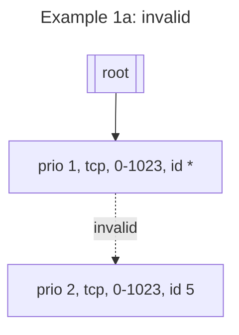
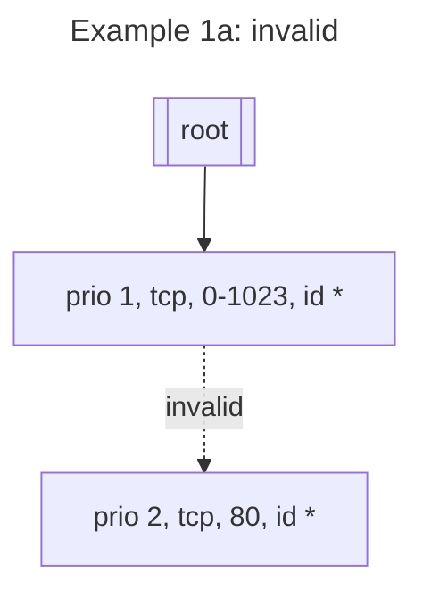
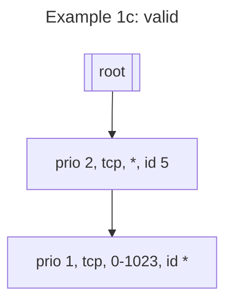
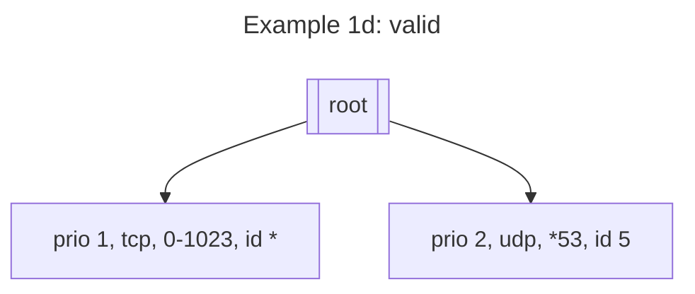
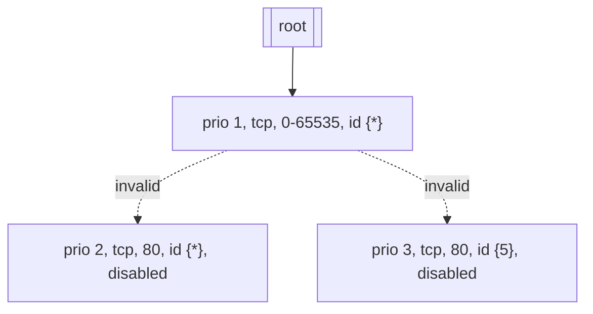
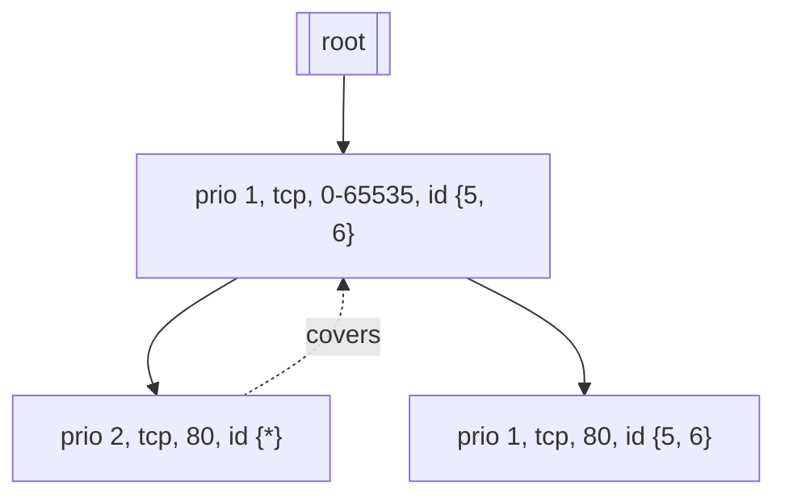
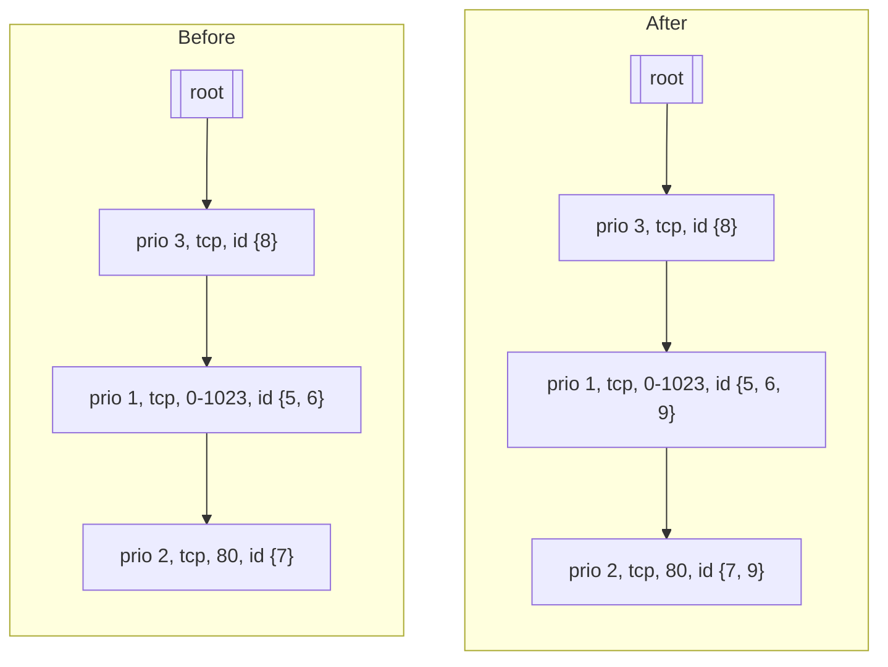

# CFP-23380: Ordered network policy

**SIG: sig-policy**

**Begin Design Discussion:** 2024-07-01

**Cilium Release:** 1.17

**Authors:** Casey Callendrello <cdc@isovalent.com>, You, and you too.

## Summary

Add explicit, user-supplied rule ordering to the policy engine.

## Motivation

Most firewall engines present an _iterative_ interface to their users. Users provide an _ordered_ list of rules. In comparison, Cilium policy is _commutative_, which is to say, the ordering of rules does not matter.

Iterative policy languages are more expressive. For example, consider the rules:

> 1. `env=qa, role=grafana`: allow access to `env=prod, role=artifacts`
> 2. `env=qa`: deny access to `env=prod`

These sorts of rules are awkward or impossible to express via the Cilium policy language, where Deny-based rules always take priority.

## Goals

* Allow expressing L3/L4 rules with order
* Add an explicit priority field to policy Rules
* Keep the datapath O(1)

## Non-Goals

* Add an ordered engine to the datapath
* Add an ordered engine to Envoy / L7 proxies

## Existing mechanism

Before outlining the proposed changes, it is important to understand the current policy resolution mechanism in detail. The basic shape:

1. From API objects, policy is lightly translated to an `[]api.Rule`
2. These rules are converted to a `L4Policy`, which is a `map[(proto,ports)]L4Filter`. The `L4Filter` is a `map[selector]PerSelectorPolicy`. `L4Filter` contains some bookkeeping information. The "policy judgement" is the `PerSelectorPolicy`. Informally, this can be considered a `map[(proto, port(s), selector)]PerSelectorPolicy`.
3. The `L4Policy` is then converted to a `MapState`, which is (logically) a `map[port+proto]map[identity]MapStateEntry`. The `MapStateEntry` is the actual configuration for the datapath.


### Existing logic: PerSelectorPolicy generation

When there are no existing entries, the translation from an `api.Rule` to its `L4Policy` and `PerSelectorPolicy` is straightforward. Most of the logic is in how to merge two `PerSelectorPolicies`. The `PerSelectorPolicy` merge logic primarily evaluates per-field precedence. For example, deny overrides all, auth overrides no-auth, L7 overrides no L7. In the event of a conflict (e.g. different L7 parsers for the same port), policy resolution fails. L7 rules are the exception: they are vectors that support merging.

Envoy directly consumes the `L4Policy`, the distilled per-selector policy. However, the BPF policy engine expects a different structure: the PolicyMap.

### Existing logic: Generating the PolicyMap

The policy map as stored in BPF is a map from `(identity, proto, port) -> MapStateEntry`. Thus, the `L4Policy` must be partially inverted to a per-identity policy result. This translation is not purely mechanical; it must also be precedence aware.

Why must PolicyMap generation be precedence aware? After all, `PerSelectorPolicy` merging *should* have included all the precedence logic. However, disjoint selectors may select the same identity. Thus, when resolving the `MapStateEntry` for a `(id, proto, port)` key, it may be that a tiebreaker is needed between two `MapStateEntries`.

## Proposal

This proposal outlines a way to add explicit order-based precedence to L3/L4 policies. This proposal explicitly does not permit L7 policies with a specified order. See below for how ordering may interact with L7 rules.

There are two key sections for this proposal. The first is the technical implementation of policy ordering. The second is an outline of the algorithm for generating an endpoint-specific BPF PolicyMap from an ordered set of policies.

### Ordered PerSelectorPolicy resolution

Quick summary:
- Generate a partial order of PerSelectorPolicies, based on specified order and tie-breakers.
- Merge PerSelectorPolicies with the same order number, using existing precedence logic.

The first step is to generate an ordered list of PerSecectorPolicies. This should be sorted according to explicit order, then tie-broken according to the existing precedence logic.

Then, PerSelectorPolicies with the same order should be *merged*. This means there will be exactly one PerSelectorPolicy for the key `(proto, port, selector, priority)`. This prevents conflicts while determining L7 policies, and preserves existing behavior, where each policy can be considered to have priority 0.

Finally, the full set of PerSelectorPolicies is flattened, retaining the first PerSelectorPolicy per `(proto, port(s), selector)` key.


### Generating the MapState

Quick summary:
- Apply the ordered list of PerSelectorPolicies to the MapState
- Resolve conflicts, preferring existing entries

Once the ordered, flattened set of PerSelectorPolicies has been created, it must be translated to the MapState. Recall that the MapState is almost equivalent to `map[proto + port]map[identity]MapStateEntry`, where `MapStateEntry` is

```go
ProxyPort uint16
Listener string
AuthType AuthType
IsDeny bool
```

This step must *also* be priority aware, as **selectors can overlap**. 

The sketch of the algorithim is:
- For every PerSelectorPolicy, highest priority first:
    - For every selected identity:
        - Insert in to the MapState *if this would not affect an existing entry*
        - Propagate authentication mode to descendants

The MapState *isn't* a map, however. It is a longest-prefix-match trie, whose key is chosen to match the datapath. In other words, MapState's precedence matches the datapath's precedence. A longer-prefix MapState key will be preferred over a shorter prefix match.

This step must allow for deconfliction, to cover two cases:
1. A higher-priority PerSelectorPolicy has been inserted
2. An overlapping PerSelectorPolicy has been inserted

### MapState conflict resolution

The key observation is this: **we cannot insert a lower-priority, higher-precedence entry in to the MapState**. Since MapState precedence mirrors datapath precedence, determining this is relatively straightforward: to insert a given key, we scan all ancestor keys, checking if the same identity is selected. If a lower-precedence entry is found, we cannot insert the higher-precedence, lower-priority entry.

#### Example

A MapState contains the entry `(tcp, port 0-1023, identity *)`.

**Example 1a:** Can we insert `(tcp, port 0-1023, identity 5)`? No, because this would cover a parent key.



**Example 1b:** Can we insert `(tcp, port 80, identity *)`?
    No, for the same reason
    


**Example 1c:** Can we insert `(tcp, port *, identity 5)`?
    Yes, because this has lower precedence.



**Example 1d:** Can we insert `(udp, port 53, identity 5)`?
    Yes, because this does not cover a higher-priority entry.
    


#### Wildcard and non-wildcard interaction

Special care must be taken for identity wildcards, both when higher and lower precedence.

If a lower-priority non-wildcard PerSelectorPolicy would override an existing wildcard, higher-priority, lower-precedence selector, adding it is blocked. We must also flag this selector as covered, so we ignore any incremental updates. See Example 2a.

If a lower-priority wildcard PerSelectorPolicy would override an existing non-wildcard, higher-priority, lower-precedence selector, then it must be inserted, but covering entries from the higher-priority selector must be synthesized. See example 2b.

#### Example 2a: Ancestor wildcard

Three rules:

1. `(tcp, port *, id {*})`
2. `(tcp, port 80, id {*})`
3. `(tcp, port 80, id {5})`

Rules 2 and 3 would override rule 1, so they may not be inserted. Rule 3 must also be flagged as disabled, so that incremental updates are not inadvertently added.



#### Example 2b: Descendant wildcard

Two rules:
1. `(tcp, port *, id {5, 6})`
2. `(tcp, port 80, id {*})`

Rule 2 is higher precedence. For ID 5, rule 2 overrides rule 1, which is an error. However, rule 2's wildcard selector selects more identities, so it cannot be elided. Rather, we explicitly insert covering entry `(tcp, port 80, id {5, 6})`. Likewise, we flag rule 1 as "covered" by rule 2, so we know to manage incremental updates.



#### Merging mutual authentication

Whether or not a connection requires mututal authentication is *also* managed by the network policy engine. However, authentication is not a "traffic verdict". (Traffic verdicts are `allow`, `deny`, and `proxy`). Rather, it is applied to all traffic, regardless of selectors.

There are two options for resolving mutual authentication. The first is to push auth down to all mapstate entries as part of resolving conflicts. The other is to maintain a parallel overlay selector trie for authentcation, which is then merged when generating the BPF entries. In order to keep the merge algorithm simpler, an overlay trie is our current proposal.

### Processing incremental updates

In incremental update is when a complete policy newly selects, or no longer selects, one or more identities. These incremental updates must then be propagated down to the MapState and the BPF map updated accordingly.

Incremental updates are aggregated by selectors and then inserted in to the MapState. The MapState is responsible for deconflicting overlapping selectors. This remains the same in the ordered version.

The important change is that incremental updates must be inserted in to the map state *in priority order*. That is to say, higher-priority PerSelectorPolicies must apply their updates first. Then, the usual MapState deconfliction rules apply, and there is no risk of an incremental update diverging from policy intent.

It is safe to insert incremental updates in this manner because identities and selectors are immutable. As a direct consequence, two selectors S1 and S2 might overlap, a new identity I1 can never change state from non-overlapping to overlapping.

We will need to ensure that SelectorCache updates are processed in a transactional manner -- that is to say, an incremental update must be delivered to all affected selectors *before* distributing this to the MapState.

#### Example 1: no wildcards

Consider a set of rules:

1. tcp 0-1023, ID (5,6)
2. tcp 80, ID (7)
3. tcp *, ID (8)

Then an incremental update transaction adds ID 9. The sequence is thus:

1. Rule 1 checks ID 9. ID 9 is not present in any ancestor rules. ID 9 is added.
2. Rule 2 checks ID 9. ID 9 is present in an ancestor rule. ID 9 is **not added**.
3. Rule 3 checks ID 9. There are no ancestor rules. ID 9 is added.




#### Example 2: Wildcards


## Impacts / Key Questions

### KQ1: How should unordered and ordered policies interfact?

To preserve existing behavior, all policies without an explicit order will have order number 0. Since policies with the same numerical order are merged, this preserves existing behavior.

Only CCNPs are allowed to have a negative order number. This prevents namespace administrators from overriding cluster-wide policies.


### Impact: effect on L7 policies

For the time being, we will not permit L7 policies to specify an order. This is so that we do not need to implement an ordered L7-aware merge. It is likely this restriction will be lifted, once we gain familiarity with ordered policies.

However, we still need to handle ordering between L4 and L7 policies.

In the unordered case, any L7 policy overwrites a L4 policy. Consider two policies with the same selector:
> - prio -1: allow access to `role=web, port 80` 
> - prio 0: allow access to `role=web, port 80, host=example.com`

In this case, the L7 policy would be ignored, since it is "overridden" by the L4 policy.


## Future Milestones

### Deferred Milestone 1: L7 ordering

As with L4 policies, a full resolution of L7 policies must be identity-oriented (or ordered in the datapath). Consider the set of rules:

* prio 1: `a1=b1,a2=b2 -> allow:example.com
* prio 2: `a1=b1,a2=b2 -> deny`
* prio 3: `a1=b1 -> allow:example.org`

This must  allow `example.com` and not `example.org` for `a1=b1,a2=b2` and just `example.org` for `a1=b1,a2!=b2`. The Envoy-based policy engine must handle this scenario correctly.