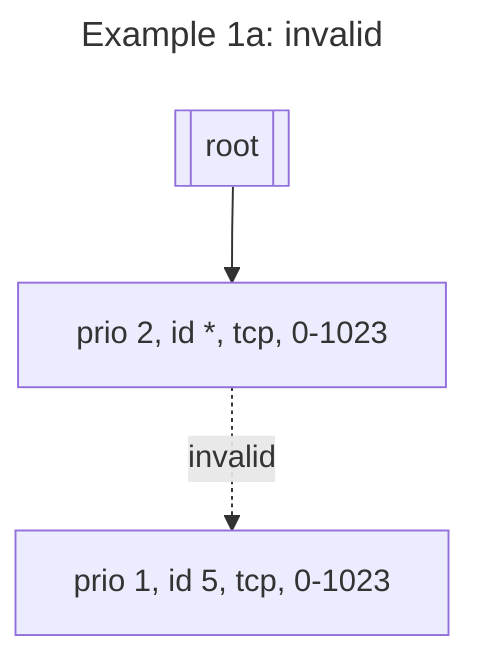
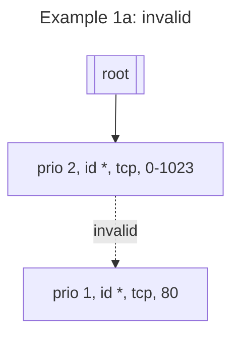
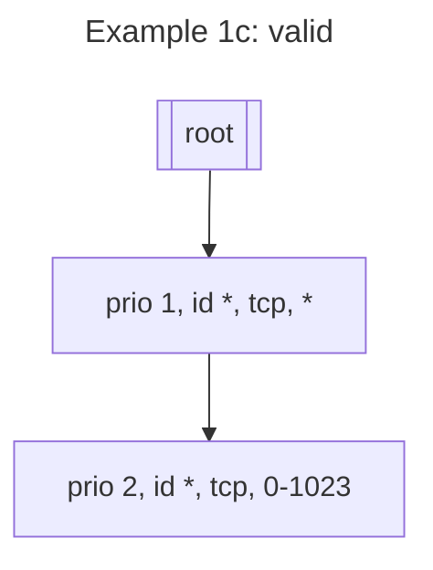
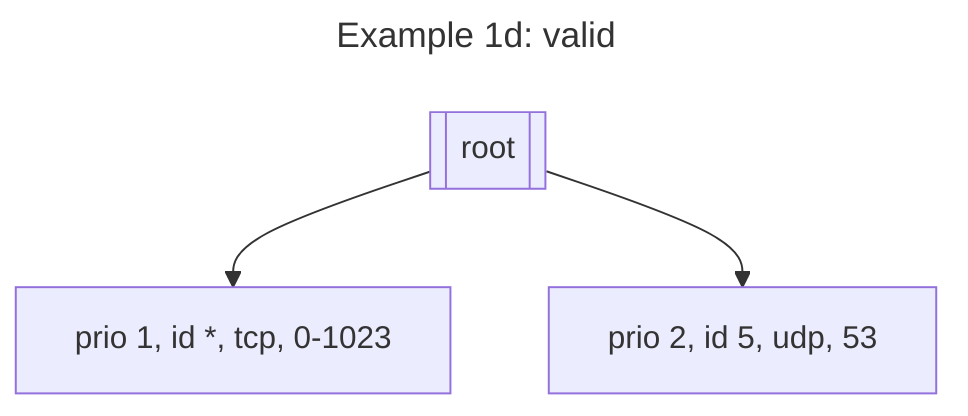
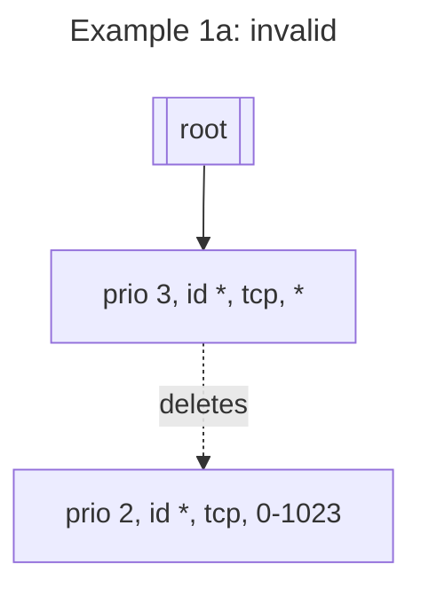
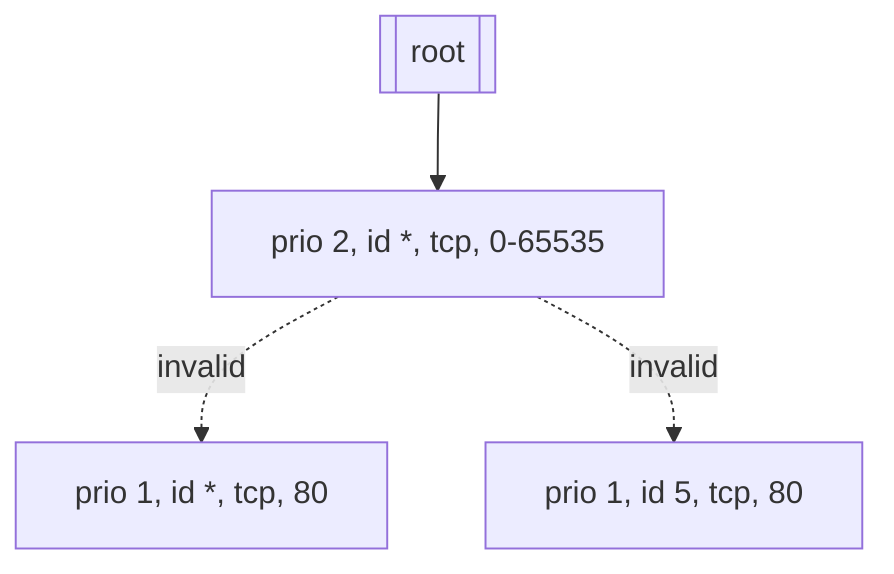
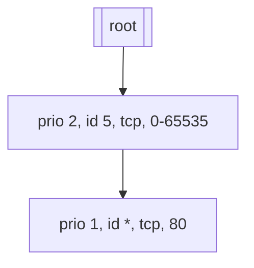

# CFP-23380: Ordered network policy

**SIG: sig-policy**

**Begin Design Discussion:** 2025-11-01

**Cilium Release:** 1.19

**Authors:** Casey Callendrello <cdc@isovalent.com>, Jarno Rajahlme <jarno@isovalent.com>

## Summary

Add explicit, user-supplied rule ordering to the policy engine.

## Motivation

Most firewall engines present an _iterative_ interface to their users. Users provide an _ordered_ list of rules. In comparison, Cilium policy is _commutative_, which is to say, the ordering of rules does not matter.

Iterative policy languages are more expressive. For example, consider the rules:

> 1. `env=qa, role=grafana`: allow access to `env=prod, role=artifacts`
> 2. `env=qa`: deny access to `env=prod`

These sorts of rules are awkward to express via the Cilium policy language, where Deny-based rules always take priority.

## Goals

* Provide a foundation for the ClusterNetworkPolicy effort
* Allow expressing L3/L4 rules with order
* Add an explicit priority field to policy Rules
* Keep the datapath O(1)

## Non-Goals

* Add an ordered engine to the datapath

## Existing mechanism

Before outlining the proposed changes, it is important to understand the current policy resolution mechanism in detail. The basic shape:

1. From API objects, policy is lightly translated to an `[]PolicyEntry`
2. These rules are converted to a `L4Policy`, which is a `map[(proto,ports)]L4Filter`. The `L4Filter` is a `map[selector]PerSelectorPolicy`. `L4Filter` contains some bookkeeping information. The "policy judgement" is the `PerSelectorPolicy`. Informally, this can be considered a `map[(proto, port(s), selector)]PerSelectorPolicy`.
3. The `L4Policy` is then converted to a `MapState`, which is (logically) a `map[port+proto]map[identity]MapStateEntry`. The `MapStateEntry` is the actual configuration for the datapath.


### Existing logic: PerSelectorPolicy generation

When there are no existing entries, the translation from a `PolicyEntry` to its `L4Policy` and `PerSelectorPolicy` is straightforward. Most of the logic is in how to merge two `PerSelectorPolicies`. The `PerSelectorPolicy` merge logic primarily evaluates per-field precedence. For example, deny overrides all, auth overrides no-auth, L7 overrides no L7. In the event of a conflict (e.g. different L7 parsers for the same port), policy resolution fails. L7 rules are the exception: they are vectors that support merging.

Envoy directly consumes the `L4Policy`, the distilled per-selector policy. However, the BPF policy engine expects a different structure: the PolicyMap.

### Existing logic: Generating the PolicyMap

The policy map as stored in BPF is a map from `(identity, proto, port) -> MapStateEntry`. Thus, the `L4Policy` must be partially inverted to a per-identity policy result. This translation is not purely mechanical; it must also be priority aware.

Why must PolicyMap generation be priority aware? After all, `PerSelectorPolicy` merging *should* have included all the precedence logic. However, disjoint selectors may select the same identity. Thus, when resolving the `MapStateEntry` for a `(id, proto, port)` key, it may be that a tiebreaker is needed between two `MapStateEntries`.

## Proposal

This proposal outlines a way to add explicit order-based precedence to L3/L4 policies.

There are two key sections for this proposal. The first is the technical implementation of policy ordering. The second is an outline of the algorithm for generating an endpoint-specific BPF PolicyMap from an ordered set of policies.

### Ordered PerSelectorPolicy resolution

Quick summary:
- Generate a partial order of PerSelectorPolicies, based on specified order and tie-breakers. Assign an integer priority.
- Merge PerSelectorPolicies with the same order number, using existing precedence logic.

The first step is to generate an ordered list of PerSecectorPolicies. This should be sorted according to explicit order, then tie-broken according to the existing priority logic. With this order, a priority is assigned.

Note that the end-user order need not be the internal priority referenced in this design. In fact, most APIs support non-integer orderings.

Then, PerSelectorPolicies with the same selector should be combined. This means there will be exactly one PerSelectorPolicy for the key `(proto, port, selector)`. The priority should be used to select the "winning" selector. If both have the same priority, the existing logic for merging selectors will be used. This prevents conflicts while determining L7 policies, and preserves existing behavior, where each policy can be considered to have priority 0.


### Generating the MapState

Quick summary: When inserting entries in to the MapState, any longer-match, lower-priority entries must be deleted.

Once the flattened set of PerSelectorPolicies has been created, it must be translated to the MapState. Recall that the MapState is almost equivalent to `map[proto + port]map[identity]MapStateEntry`, where `MapStateEntry` is

```go
ProxyPort uint16
Listener string
AuthType AuthType
IsDeny bool
Priority uint32
```

The MapState *isn't* a map, however. It is a longest-prefix-match trie, whose key is chosen to match the datapath. In other words, MapState's precedence matches the datapath's precedence. A longer-prefix MapState key will be preferred over a shorter prefix match

The sketch of the algorithim is:
- For every PerSelectorPolicy:
    - For every selected identity:
        - Insert in to the MapState if valid
        - Delete any now-invalid entries
        - Propagate authentication mode to descendants

The existing MapState already has a form of this algorithm, in the implicit priorities brought by deny and proxy policies. This CFP proposes eliminating the split logic for deny and proxy priorities, unifiying them in a single 32-bit Priority field that merges user order, proxy priority, and deny.

### MapState conflict resolution

The key observation is this: **we cannot insert a lower-priority, longer-match entry in to the MapState**. Since MapState match length mirrors that of the datapath, determining this is relatively straightforward: to insert a given key, we scan all ancestor keys, checking if the same identity is selected. If a shorter-match, higher-priority entry is found, we cannot insert the longer-match, lower-priority entry. Conversely, if any descendants of the newly proposed entry are longer-match and lower-priority, they must be deleted.

Note: As observed above, higher numerical priority overrides lower numerical priority.

#### Example

A MapState contains the entry `(prio 2, identity *, tcp, port 0-1023)`.

**Example 1a:** Can we insert `(prio 1, identity 5, tcp, port 0-1023)`? No, because this is a longer-match match with lower priority that would cover key with higher priority.


```mermaid
---
title: "Example 1a: invalid"
---
graph TD
    rule1[prio 2, id *, tcp, 0-1023]
    rule2[prio 1, id 5, tcp, 0-1023]
    root[[root]]
    
    root-->rule1
    rule1-. invalid .-> rule2
```

**Example 1b:** Can we insert `(priority 1, identity *, tcp, port 80)`?
    No, for the same reason
    

```mermaid
---
title: "Example 1a: invalid"
---
graph TD
    rule1[prio 2, id *, tcp, 0-1023]
    rule2[prio 1, id *, tcp, 80]
    root[[root]]
    
    root-->rule1
    rule1-. invalid .->rule2
```

**Example 1c:** Can we insert `(priority 1, identity 5, tcp, port *)`?
    Yes, because this lower-priority entry has a strictly shorter match, and thus the existing priority-2 entry remains.


```mermaid
---
title: "Example 1c: valid"
---
graph TD
    rule1[prio 2, id *, tcp, 0-1023]
    rule2[prio 1, id *, tcp, *]
    root[[root]]
    
    root-->rule2
    rule2-->rule1
```

**Example 1d:** Can we insert `(priority 1, identity 5, udp, port 53)`?
    Yes, because this does not cover a higher-priority entry.
    

```mermaid
---
title: "Example 1d: valid"
---
graph TD
    rule1[prio 1, id *, tcp, 0-1023]
    rule2[prio 2, id 5, udp, 53]
    root[[root]]
    
    root-->rule1
    root-->rule2
```

**Example 1e:** Can we insert `(priority 3, identity *, tcp, port *)`?
    Yes, and we must delete the lower-priority entry.


```mermaid
---
title: "Example 1a: invalid"
---
graph TD
    rule1[prio 2, id *, tcp, 0-1023]
    rule2[prio 3, id *, tcp, *]
    root[[root]]
    
    root-->rule2
    rule2-. deletes .-> rule1
```

#### Wildcard and non-wildcard interaction

Special care must be taken when wildcard and non-wildcard selectors have different priorities.

If a lower-priority non-wildcard PerSelectorPolicy would override an existing wildcard, higher-priority, shorter-match selector, adding it is blocked.

If a lower-priority, longer-match wildcard PerSelectorPolicy would override an existing non-wildcard, higher-priority, shorter-match selector, then it must be inserted, but this will have to be handled via the datapath at policy enforcement time. Specifically, the datapath must look up both wildcarded and non-wildcarded entries, and select the one with the highest priority, using precedence length as a tiebreaker.

The existing datapath logic already does this in a limited form, preferring deny entries even when they have a shorter-match. This logic will be generalized, using numeric priority rather than the presence of a deny verdict.

#### Example 2a: Ancestor wildcard

Three rules:

1. `(prio 2, id *, tcp, port *)`
2. `(prio 1, id *, tcp, port 80)`
3. `(prio 1, id 5, tcp, port 80)`

Rules 2 and 3 would cover higher-priority rule 1, so they may not be inserted.


```mermaid

graph TB
    rule1["prio 2, id *, tcp, 0-65535"]
    rule2["prio 1, id *, tcp, 80"]
    rule3["prio 1, id 5, tcp, 80"]
    root[[root]]
    
    root --> rule1
    rule1 -. invalid .-> rule2 & rule3
```

#### Example 2b: Descendant wildcard

Two rules:
1. `(priority 2, id 5, tcp, port *)`
2. `(priority 1, id * tcp, port 80)`

Rule 2 has a longer match. For ID 5, rule 2 overrides rule 1, which would violate the priority invariant. However, rule 2's wildcard selector selects more identities, so it cannot be elided. Rather, at policy enforcement time, the numeric priorities must be compared as a tiebreaker


```mermaid

graph TB
    rule1["prio 2, id 5, tcp, 0-65535"]
    rule2["prio 1, id *, tcp, 80"]
    root[[root]]
    
    root --> rule1
    rule1 --> rule2
```

#### Merging mutual authentication

Whether or not a connection requires mututal authentication is *also* managed by the network policy engine. However, authentication is not a "traffic verdict". (Traffic verdicts are `allow`, `deny`, and `proxy`). Rather, it is applied to all traffic, regardless of selectors.

When inserting a mapstate entry, the authentication option needs to be resolved:
- if no authentication is specified, inherit it from the closest ancestor of equal or higher priority
- if authentication is specified, "push" it to all descendants of equal or lower priority

### Processing incremental updates

An incremental update is when a complete policy newly selects, or no longer selects, one or more peer identities. These incremental updates must then be propagated down to the MapState and the BPF map updated accordingly.

Incremental updates are aggregated by selectors and then inserted in to the MapState. The MapState is responsible for deconflicting overlapping selectors. This remains the same in the ordered version.

It is safe to insert incremental updates in this manner because identities and selectors are immutable. As a direct consequence, two selectors S1 and S2 might overlap, a new identity I1 can never change state from non-overlapping to overlapping. The key observation is that if two distinct selectors S1 and S2 happen to select the same identity I1, both selectors will simultaneously select I1. We can then insert any MapState entries as usual, and the existing priority resolution logic will be effective.

As an implemetation matter, we will need to ensure that SelectorCache updates are processed in a transactional manner -- that is to say, an incremental update must be delivered to all affected selectors *before* distributing this to the MapState. Otherwise, we may distribute an intermediate state where an entry has not yet been removed by a higher-priority entry. But assuming a given incremental update has been seen by all selectors, the priority invariant will always hold, and incorrect intermediate states will never be available to the datapath.


## Impacts / Key Questions

### Impact: effect on L7 policies

TBD