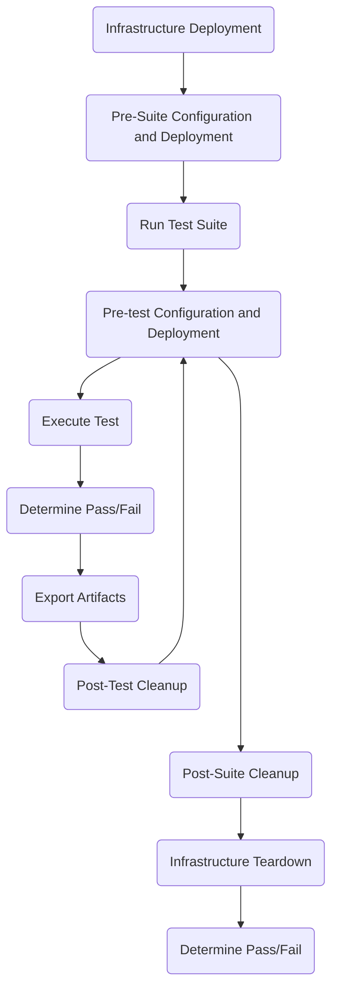

# CFP-27196: Perf & Scale Testing CI

**SIG: sig-scalability, sig-performance**

**Begin Design Discussion:** 2023-09-04

**Cilium Release:** 1.15

**Authors:** Ryan Drew <ryan.drew@isovalent.com>

**Reviewers:** Marcel Zieba <marcel.zieba@isovalent.com>

## Summary

The goal of this document is to describe the motivations for, and design of, a CI for performance and scale testing. Additionally, a timeline will be given describing how the CI will move forward in a “walk then run” fashion.

## Motivation

The value of a performance and scalability CI testing framework cannot be understated. Taking the time to implement this framework will provide the core benefit of enabling data-driven detection of changes in the performance and scalability of Cilium. Over time, the use cases for this CI will develop and change, but for right now, there are four use cases that this CFP seeks to define.

First, this CFP will describe how the framework will be implemented to enable recurring testing of Cilium over time. By storing the results of performance and scale tests over time, both improvements and regressions can be detected. Correlation with Cilium’s git history will allow for root-cause analysis. 

Second, this CFP will describe how the framework will be implemented to enable developers to invoke tests manually, allowing them to gather data that describes the impact of their code changes. Currently, developers rely on community and customer reports of regressions as they occur in their environments, meaning, by the time regressions are reported, it has already had a negative impact. With a CI framework that enables developers to observe how their changes impact Cilium’s ability to perform and scale, both with recurring and manual runs, regressions can be detected and fixed before they impact Cilium users.

Third, this CFP will describe how the framework can be expanded to add new tests. This will allow for the CI to adapt to changing priorities in Cilium’s development, as new features are added and old features become more important to test. This is key to the CI’s success, as, without the ability to adapt, it will lose its utility over time.

Fourth, this CFP will describe the implementation of the framework’s first test, the [ClusterLoader2](https://github.com/kubernetes/perf-tests/tree/master/clusterloader2) scale test. This test acts as a great starting point for the framework, as it provides valuable insights into how Cilium behaves and performs at scale. Additionally, the test will allow for Cilium’s core features to be tested, meaning performance insights can be gained for most of Cilium’s subsystems.

## Goals

* Create a framework that allows for running performance and scale tests in GitHub Actions.
* Implement the ClusterLoader2 scale test and document instructions for analyzing results to detect regressions.
* Document instructions for adding and running tests.

## Non-Goals

* Describe implementation details for future milestones.

## Proposal

### Overview

#### Test Pipeline Overview

This section describes the testing CI pipeline at a high level, essentially defining a Directed Acyclic Graph (DAG) that can be used to understand the flow of execution for the CI. Pipelines will be wrapped in GitHub Actions and executed on a manual or recurring basis.

These steps for a “hierarchy of specificness” that allows the pipeline to go from cluster-level operations down to test-level operations and back. Each step is described below:

* **Infrastructure Deployment:** Create infrastructure to hosts tests. An example here would be creating a new cluster in GKE.
  * **Pre-Suite Configuration and Deployment:** This can be thought of as day-two operations and may involve installing Cilium, setting sysctl parameters, or deploying monitoring resources.
  * **Run Test Suite**
    * **Pre-test Configuration and Deployment:** Test-specific deployments and configuration. One example here is installing Cilium with a specific version or configuration.
    * **Execute Test:** Actually run the target test or benchmark.
    * **Determine Pass/Fail:** Based on the recorded metrics during the test, determine if a regression occurred. This can be done by comparing the results from a pre-configured baseline, checking if they lie within a threshold of each other.
    * **Export Artifacts:** If any artifacts were exported from the executed test, and they should be saved, do it here. ClusterLoader2 as an example outputs a bunch of JSON files that can be saved in an S3 bucket.
    * **Post-Test Cleanup:** This step should involve resetting any state which could have been changed by the previous test, to help ensure test ordering does not play an impact on results. An example of this would be resetting the conntrack table in between netperf tests.
  * **Post-Suite Cleanup:** Any steps that need to be taken after the test suite has finished. This could involve exporting even more artifacts.
* **Infrastructure Teardown:** Cleanup test infrastructure.
* **Determine a Pass/Fail:** Propagate failures from individual tests to the entire pipeline.

#### Test Pipeline Implementation

A pipeline can be implemented by users in any way that they wish, and honestly, there aren’t any new implementation specifics that need to be accounted for, other than the best practices followed for normal software development anyways. That being said, there are three pillars that this CFP wishes to emphasize:

* **Modularity:** Keeping things modular and reusable helps with creating new pipelines and modifying existing pipelines. If a section of a pipeline can be packaged as a generic, reusable step, consider doing so.
* **Reliability:** Do everything in your power to reduce the flakiness of your pipeline right from the get-go. The best way to do this is to add error handling, retries, and assumption verification everywhere you can. 
* **Simplicity:** Keeping pipelines as simple as possible is the best way to reduce the need for documentation and to ease troubleshooting, but this shouldn’t get in the way of the previous two points.

### Recurring & Manual Testing

Certain tests in the CI should be run on a cadence on either the Cilium main branch or newly tagged releases. By monitoring results over time, regressions can be detected. By correlating when the regression occurred with the commits that were added to the tested tree around the same time, a root cause can be picked out.

Manual testing also has its place, as certain changes or features may benefit from performance and scale testing during development. These tests can be used by developers to understand the impact their changes may have. Taking special care to perform this testing before a PR is merged can allow for regressions to be found more quickly.

Adding automated performance and scale testing into PRs is discussed in the Future Milestones section.

### Adding Tests

The process for adding a new test to the performance and scale CI will be defined and discussed in the future after lessons are learned in implementing the ClusterLoader2 test. The general idea however is for something like the following to occur:

* Create and merge a PR in [cilium/scaffolding](github.com/cilium/scaffolding) with your new pipeline. This should include the following:
    * Documentation on what the pipeline tests, why this testing is important, and how the test results should be analyzed.
    * Code to actually run the pipeline from start to finish.
    * A Dockerfile that bundles all needed dependencies and code to run the pipeline.
    * A reusable GitHub workflow to run your pipeline as a GitHub action. 
    * Create a new GitHub action in [cilium/cilium](github.com/cilium/cilium) which runs your pipeline’s reusable workflow.
    * Follow-up work needs to be performed with cilium maintainers to understand the way this needs to be implemented in a safe way.

One foundational flaw with cilium/scaffolding is that all scenarios and shared code are hosted in the same repository, meaning, if a user or automation system wants to checkout and run a single scenario, they need to pull more data than they necessarily need. To address this problem, each tested version of cilium/cilium will have a branch named ‘cilium-ci-<version>’ in cilium/scaffolding containing its own scenarios. This separation will reduce the amount of data that must be pulled during CI runs, while having the added side-effect of stabilizing each version’s testing suite for reliable regression detection. New tests and changes to existing tests should initially end up in ‘cilium-ci-main’, and then be backported to other CI branches as needed.

 ### ClusterLoader2

This section describes specific implementation details in regard to the [ClusterLoader2](https://github.com/kubernetes/perf-tests/tree/master/clusterloader2) scale test, which will be run on a 100-node cluster.

#### Pipeline Implementation

The pipeline for running ClusterLoader2 will be hosted in [cilium/scaffolding](github.com/cilium/scaffolding) as a scenario. The pipeline will be implemented as a series of stand-alone bash scripts that are tied together using a main run script. This is a simple implementation that allows for reusability and creating a foundation that can be built upon later.

Please see the Adding Tests section above for more information on what this will look like.

#### Infrastructure Deployment, Upgrades, and Cleanup

Infrastructure management need to be performed by a tool that allows for the management of control plane nodes, as this will allow for control plane metrics to be scrapped. Using something like the Google Kubernetes Engine on its own is not desired, as it is very difficult to grab control plane metrics, such as etcd metrics, and adds an additional vector for flakes, since these platforms are continually developed upon and changed.

This task will be performed using [kops](https://kops.sigs.k8s.io/) for the ClusterLoader2 test, as it is simple to use and robust enough for this use case. The tool [cluster-api](https://cluster-api.sigs.k8s.io/) was also considered, however, it has the following disadvantages:

1. Requires a separate management cluster, which adds more potential points of failure and adds extra setup time.
2. Has a design centered around managing multiple clusters, whereas kops is designed for managing a single cluster.
3. Debugging requires checking controller logs.

Another large factor involved in choosing kops is the “validate” subcommand, which can be used to wait for a cluster to be in a ready state. This is important, as waiting for a cluster to be ready is a critical part of running a pipeline in order to reduce flakes.

Note that kops requires a state store for holding cluster configuration. This state store for the CI will be available through Google Cloud Storage and managed by sig-performance and sig-scalability.

More discussion needs to be done to determine how infrastructure should be versioned and upgraded over time. For instance, if a new version of Kubernetes is released, or a new kernel version is released, when should our CI make the upgrade? For now, we will start with the following:

* Kubernetes version 1.27
* Ubuntu 22.04
* Kernel 5.15

The pipeline should be responsible for creating and deleting a cluster to test on. In order to ensure that a cluster is removed, to save on costs, the following precautions should be taken:

1. The workflow should use the ‘always’ conditional on a cleanup step to ensure that it is always executed, even if the workflow fails or is canceled.
2. Follow-up work needs to be performed with cilium maintainers to determine what happens when cluster cleanup fails.

#### Artifact Storage & Cleanup

Artifacts from the ClusterLoader2 test involve the following types of documents:

JSON files containing summaries of recorded metrics during the test.
CPU and Memory profiles from the cilium-agent (WIP, see https://github.com/kubernetes/perf-tests/issues/2262)
Prometheus database dump containing all metrics recorded during the test.

These artifacts will be stored in one Google Cloud Storage bucket per tested version of Cilium, again managed by sig-performance and sig-scalability, to allow for long-term storage and for result visualization with [perfdash](https://github.com/kubernetes/perf-tests/tree/master/perfdash)

The organization of each bucket will be determined by perfdash’s expectations. Information on infrastructure, such as Kubernetes version, kernel version, OS version, needs to be included with results to help with analysis later on.
 
A lifecycle configuration should not be created to delete old test results, as the storage costs associated with a single test result are very low; a Google Storage Cloud bucket is priced at around [$2 per 100 GB per month](https://cloud.google.com/storage/pricing).

#### GitHub Actions Integration

The ClusterLoader2 pipeline will have a reusable workflow created for it, which allows for importing and running it easily inside other jobs. After this workflow is created and tested, slow integration into [cilium/cilium](github.com/cilium/cilium) can start with collaboration from maintainers.

#### Triggering Tests

The following trigger matrix will be configured using GitHub actions workflow triggers:

* On releases for 1.12+.
* Once a week on main.
* Manual testing through [`workflow_dispatch`](https://docs.github.com/en/actions/using-workflows/manually-running-a-workflow).

This allows for new minor versions to be tested over time to detect regressions in scale, as well as to catch scale regressions in the main tree or other working trees over time. Testing minor releases will allow for the detection of:

* Regressions in main that were backported to a minor release.
* Backports from main that caused regressions only in a minor release. See [cilium/cilium#27439](https://github.com/cilium/cilium/issues/27439) as an example.

One example where testing minor releases Note that it may be determined down the line that testing new minor releases may not be necessary, as most of these releases contain backports from main anyways.

#### Viewing and Monitoring Results

Scripts will be included, with documentation, in the pipeline implementation of the ClusterLoader2 test to:

* Create a local perfdash deployment that can pull data on its own for visualization of metrics
* Create a local Grafana and Prometheus deployment, importing the Prometheus database dump included in the ClusterLoader2 artifacts.

It is the responsibility of sig-scalability to monitor the results of the ClusterLoader2 test each week to look for regressions, pulling in other teams as necessary to perform root cause analysis.

Documentation should be created for the ClusterLoader2 pipeline which describes the key metrics which need to be tracked, and how to determine if a regression occurred in said metrics. As this documentation is formed, automated regression testing can be added into the pipeline by checking if results lie within an acceptable threshold of a pre-configured baseline.

## Future Milestones

### CL2 Expansion

After the initial implementation of the ClusterLoador2 test, it should be expanded to include extra resources in order to fully cover Cilium’s functionality, such as adding CiliumNetworkPolicys. This work will help to ensure that we are getting a full picture of Cilium, and not just testing a subset of its subsystem.

### Constant perfdash Deployment

After the initial implementation of the ClusterLoader2 test, work can be done to create a constantly running deployment of perfdash. This will prevent the need for a local perfdash deployment to be created every time results are to be viewed.

### Datapath Testing

After the initial implementation of the ClusterLoader2 test, datapath performance testing can be implemented to track regressions over time for network capabilities, such as throughput and latency. This can be especially useful for specific datapath features, such as IPSec or BPF Host-Routing.

### Testing in PRs

Running performance and scale tests in CI is doable, but requires more discussion around the following points:

* Should the action try to perform automated regression detection, and fail the run if one is detected?
* If automated regression testing is not performed, who is responsible for reviewing the data and determining if a regression occurred?
* When determining if there is a regression, automated or manually, how is a baseline determined?
* For scale tests, how should the monetary price of each run be dealt with? Should only certain PRs trigger a scale test? If so, how do you determine which PR requires one?

### Variance-Based Regression Testing

After an initial period of collecting and analyzing results from the ClusterLoader2 test, specific metrics can be targeted for variance-based regression testing. This involves tracking the selected metrics over time and flagging a regression if the value moves out of a certain threshold, relative to its historical value. This type of regression detection cannot be performed for all metrics, as some metrics have too many variables impacting their variance over time.

