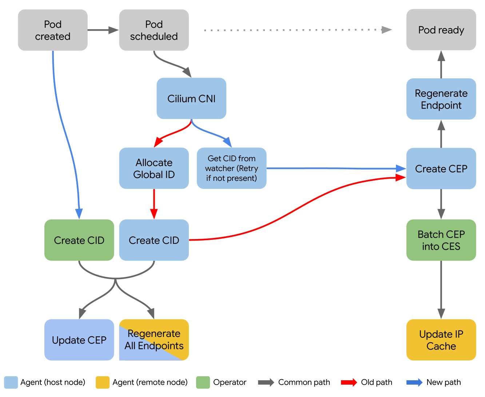

# CFP-27752: Operator Manages Cilium Identities

**Authors:** dordel@google.com

**Area:** SIG: SIG-POLICY, SIG-AGENT, SIG-K8S

**Target Cilium Release**: 1.18

**Status**: Implementable

**Sharing:** Public

**Updated:** 2024-09-13

**Reviewers:** [Antonio Ojea](https://github.com/aojea), [Joe Stringer](https://github.com/joestringer)

Github issue: [https://github.com/cilium/cilium/issues/27752](https://github.com/cilium/cilium/issues/27752)

Agent and Operator are short names used for cilium-agent and cilium-operator respectively.

Abbreviations for Cilium custom resources used in this document:

**CID  - [Cilium Identity](https://docs.cilium.io/en/stable/gettingstarted/terminology/#identity)**

**CEP - [Cilium Endpoint](https://docs.cilium.io/en/latest/network/kubernetes/ciliumendpoint/)**

**CES - [Cilium Endpoint Slice](https://docs.cilium.io/en/latest/network/kubernetes/ciliumendpointslice/)**

# Summary

Centralize CID management to a single pod (Operator), instead of distributed management, done by all Agents. The goal is to improve security, reliability, performance and scalability of CID, and enable more advanced optimizations.

# Background & Motivation

CID represents complete data of one security identity, consisting of a numeric identity and a list of labels. Each CEP has an assigned identity based on its pod and namespace labels. CIDs are used to group pod and namespace labels that are used to enforce network policies.

**CID duplication** is a flaw of the CID management system. It occurs whenever Agents create multiple CIDs for the same set of labels. The most common case is when pods of a new deployment (new unique label set) is scheduled onto multiple nodes. Although deployment creation causes CID duplication, it doesn’t happen often enough to produce many duplicate CIDs. However, namespace label changes, either on pods or namespaces, immediately trigger massive CID duplication, because all Agents react to the changes at the same time. A test with 5000 nodes shows that having 1 deployment with 5000 pods running 1 pod per node, can cause 4999 duplicate CIDs after changing the namespace labels.

CIDs are presenting issues with reliability and scalability, and are causing network policies to be in a broken state. Most notable cases:

* Reaching maximum number (65k) of CIDs in the cluster.
* eBPF policy maps overflowing with over 16k entries.

# Design

## Operator changes

Operator will start managing CIDs, and will become the only system pod that issues creation or deletion requests for CIDs to the kube-apiserver. A new controller (CID controller) will run inside Operator that will be responsible for managing (creating) CIDs.

1) Operator requires watching the following resources to allocate CIDs:

* Pods (Already watches) - To manage CIDs based on pod labels.
* Namespaces - to manage CIDs based on namespace labels changes.
* CIDs - to keep the desired state of CIDs. Required for:
    * Getting the initial state on start-up.
    * Being compatible with Agents managing CIDs simultaneously.
    * Handling unplanned CID changes (create, update, delete) by other sources -- not Operator or Agent.

2) Operator will modify the following resources:

* CIDs - Create and update. If namespace or pod labels are changed, new CIDs will be created for all unique label sets that don’t match any existing identity. Unused CIDs will be cleaned up by the CID GC. In case of an update to a CID, the CID controller will update the CID back to the correct state, effectively reverting the initial change.

3) CID GC:

* CID garbage collection continues to be the responsibility of the Operator. In the initial release, this will still rely on the legacy CID GC (the periodic GC) to deleted unused CIDs. The design of this can be evaluated after completing this CFP.

## Agent changes

Agents will stop creating CIDs. Agents will only generate local security identities. Agents will no longer perform following actions:

* Locally create and reserve security identities in the global range [256, 65536].
* Create CIDs.

Subsequent milestones will further remove the following from the Agents:
* Reporting heartbeat status annotation on CIDs.
* Permissions to modify CIDs.

Agents will wait for CIDs to be received through the watcher, and then assign them to local endpoints (pods) by retrieving the CIDs from the watcher's store based on pod and namespace labels.

**Namespace watch**

Agents need to know what are the namespace labels for each pod, to be able to match pod+namespace labels to a CID from CID watcher's cache. Agents will continue to watch namespaces in order to instantly update security identity labels in the local Endpoint manager’s cache, and start attempting to get CID from CID watcher store, to update the corresponding endpoint. More info below in Label changes: Namespace.

**Pod startup**

CNI will be blocked if CID doesn't exist in the CID watcher's store. After retries, CNI will fail and pod creation will fail. This is useful to quickly identify issues with CID controller or Operator.

## Pod creation process

This design does not prescribe that the Kubernetes control plane waits for Cilium operator to create a CID before scheduling Pods. Therefore when a Pod is created, the subsequent operations can be performed in one of two different orders:

1. Regular path: Pod created -> CID created (Operator) -> Pod scheduled -> Cilium CNI -> CID assigned
2. Missing global ID path: Pod created -> Pod scheduled -> Cilium CNI -> Fail to find CID in watcher Store -> Retry/Fail CNI -> Pod creation is retried by kubelet.

The diagram below covers high level actions that happen when a pod is created. From pod scheduled to pod ready, and to CEP and CID data being received by all nodes in the cluster. CEP batching into CES is included, but that’s an optional step based on configuration. Comparison before (red arrows) and after (blue arrows) changes.

CEP creation in parallel triggers its endpoint regeneration on the host node and CEP propagation to all other nodes.

Endpoint regeneration happens when:

* An endpoint is created and updated, including pod and namespace label changes (security identity change).
* CID is created or deleted - all Agents regenerate all of their endpoints.
* Network policies are changed.

IPCache is updated when remote CEPs/CESs are received.

## Label changes

### Pod

Pod/Deployment label changes result in pod recreation, which follows the same pod creation path previously described.

### Namespace

When namespace labels change, Operator and Agents get the update at the same time. Agents wait until Operator processes the namespace label change update and creates all the new CIDs. Agents keep retrying to match CIDs for all their local endpoints until they are received through the CID watcher.

## Simultaneous CID management compatibility

Prior to this feature, all agents managed CIDs and operators did not manage CIDs. When upgrading Cilium to enable this feature, during the transition both agents and operators will manage CIDs. As long as Agents are managing CIDs, the CID duplication issue may continue to occur. Once the upgrade is completed agents will no longer manage CIDs.

Simultaneous CID management is only expected to happen as a transitional state during upgrade from Agents managing CIDs to Operator managing CIDs.

## CID deduplication

Operator will not create duplicate CIDs, but it will allow for their existence. In case other sources, like Agents, are making duplicate CIDs, Operator will be compatible with tracking multiple CIDs. This is needed to make Operator compatible with Agents managing CIDs at the same time.

Completely deduplicating CIDs could be done with additional changes in Agent. One option is to have Agents always pick CIDs with the lowest integer value in the name, that matches the label set. This way all Agents would always pick the same CID for the same label set. However, this is only a suggestion, and a proper solution will be covered separately, outside this CFP.

## KVStore compatibility

**Important note: kvstore compatibility is a hard requirement for releasing the feature "operator manages CIDs".**

[KVStore](https://docs.cilium.io/en/stable/kvstore/) is a key-value store that is mostly used for sharing Cilium mappings between IPs, identities (IPCache) and labels, across the cluster ([what's inside Cilium’s KVStore](http://arthurchiao.art/blog/whats-inside-cilium-etcd/)).

Operator managing CIDs is intended to work with both `identity-allocation-mode=kvstore` and `identity-allocation-mode=crd`. CRD being the default, the initial implementation will use the CRD allocation mode, and later expanded to other allocation modes.

All features that rely on using kvstore will not work until CID controller is expanded to work with kvstore allocation mode. The work to enable kvstore compatibility is estimated to of medium size and it will be tracked in a separate GitHub issue (https://github.com/cilium/cilium/issues/34865).

# Enablement

The feature will be guarded by a flag `identity-management-mode`, that will be read by Agent and Operator from `cilium-config` ConfigMap. Available values will be `agent`, `operator` and `both`. The default value will be `agent`, meaning that Operator doesn’t manage CIDs, while Agents do. During transitional periods (upgrades/downgrades), the `both` value will be used to ensure there won't be network disruptions. Lastly, for new and upgraded clusters, the `operator` value will be used, meaning that Operator manages CIDs, while Agents don't.

# Migration

Any situation when neither Operator nor Agents are managing CIDs is effectively a downtime for assigning new Security Identities. Either of these components must be available and healthy in order to:
- Deploy workloads with a new set of identity-relevant labels
- Update existing workloads with different identity-relevant labels
- Modify the identity-relevant labels filter
- Modify namespace labels and enforce policies for the newly changed labels

## Upgrade

**From "Agents managing CIDs" to "Operator managing CIDs"**

Safe upgrade, requires simultaneous CID management compatibility. The CID controller in Operator is designed to support simultaneous CID management and won’t interfere with Agents.

Safe upgrade means that the system will not have disruptions to:
- Active connections
- Newly established connections
- Ability to scale up/down existing workloads
- Ability to create new workloads

When upgrading, users first need to update the `identity-management-mode` flag in `cilium-config` Configmap to `both`, and restart Operator. After Operator is running with the new configuration, users can complete the upgrade by setting the `identity-management-mode` flag to `operator`.

**From "Operator managing CIDs" to "Operator managing CIDs"**

No action is required from the user, because there won’t be a change in the CID management configuration.

## Downgrade

Downgrade without above mentioned disruptions is possible only if Agent daemonset is downgraded first -- restarted after the configuration change, or updated to an earlier version where Agent manages CIDs. Otherwise, if Operator is downgraded first, new pods with label sets for which CIDs don't already exist, will not be able to start, on all nodes where cilium-agent is still not downgraded to manage CIDs. This happens because if neither Operator or Agents are managing CIDs, pods with new labels will not have an existing matching CID, and neither Operator nor Agents will create them.

# Security

* Agents will no longer need to have the RBAC permission for modifying CIDs.

# Future enhancements

## CID lazy creation

Scalability and performance optimization

Create CIDs only for labels used in network policies to greatly reduce the number of CIDs. Only pod labels used in the peer pod label selector of network policies will be relevant for CID creation.

There are multiple levels of optimization and complexity this solution can go to. The proposal is to start with a basic implementation that will have effects like CID relevant labels, based on label keys from network policy selectors. Discussion of more advanced solutions is outside the scope of this document.

## Operator acts on Pod instead of CEP changes

Status: Included in the original proposal

Performance optimization

Operator doesn't watch for CEPs but watches for Pods instead. As soon as a pod is created (not started) Operator allocates a CID immediately. This way the new CID is getting created in parallel as the pod is getting scheduled.

Downside: This is a very minor downside and isn't expected to cause any problems. In case pods are unschedulable we will be allocating identities even though they might not be used at the end.

## Deprecate CEP

This topic entails the possibility of removing CEPs altogether, because we can just have CIDs and CESs. Agents don’t create CEPs anymore, just watch for CESs and CIDs. Operator creates both CIDs and CESs with all info gathered from pods.

## Loose and Strict modes for pod readiness

An option to make pods ready only when network policies are enforced. It is possible to use the [pod readiness gate](https://kubernetes.io/docs/concepts/workloads/pods/pod-lifecycle/#pod-readiness-gate) to control when pods are marked as ready.

With **Loose** mode, the default, pods will be ready immediately after endpoint regeneration, without waiting for policy enforcement -- CEPs (or CESs) to be propagated to remote nodes.

With **Strict** mode, all pods affected by network policies will become ready only after network policies are enforced on remote nodes. The indicator for that will be when CEPs (or CESs) are propagated back to the host nodes. This will allow users to have network policy enforcement consistency for new pods -- no denied traffic because policy enforcement-relevant data is not propagated yet.
