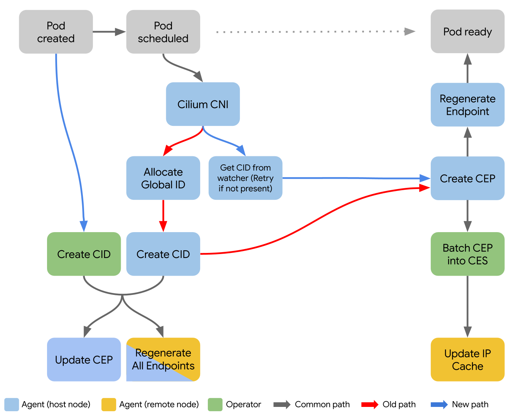

# CFP-27752: Operator Manages Cilium Identities

**Authors:** dordel@google.com

**Area:** SIG: SIG-POLICY, SIG-AGENT, SIG-K8S

**Target Cilium Release**: 1.17

**Status**: Implementable

**Sharing:** Public

**Updated:** 2024-09-13

**Reviewers:** [Antonio Ojea](https://github.com/aojea), [Joe Stringer](https://github.com/joestringer)

Github issue: [https://github.com/cilium/cilium/issues/27752](https://github.com/cilium/cilium/issues/27752)

Agent and Operator are short names used for cilium-agent and cilium-operator respectively.

Abbreviations for Cilium custom resources used in this document:

**CID  - [Cilium Identity](https://docs.cilium.io/en/stable/gettingstarted/terminology/#identity)**

**CEP - [Cilium Endpoint](https://docs.cilium.io/en/latest/network/kubernetes/ciliumendpoint/)**

**CES - [Cilium Endpoint Slice](https://docs.cilium.io/en/latest/network/kubernetes/ciliumendpointslice/)**

# Summary

Centralize CID management to a single pod (Operator), instead of distributed management, done by all Agents. The goal is to improve security, reliability, performance and scalability of CID, and enable more advanced optimizations.

# Background & Motivation

CID represents complete data of one security identity, consisting of a numeric identity and a list of labels. Each CEP has an assigned identity based on its pod and namespace labels. CIDs are used to group pod and namespace labels that are used to enforce network policies.

**CID duplication** is a flaw of the CID management system. It occurs whenever Agents create multiple CIDs for the same set of labels. The most common case is when pods of a new deployment (new unique label set) is scheduled onto multiple nodes. Although deployment creation causes CID duplication, it doesn’t happen often enough to produce many duplicate CIDs. However, namespace label changes, either on pods or namespaces, immediately trigger massive CID duplication, because all Agents react to the changes at the same time. A test with 5000 nodes shows that having 1 deployment with 5000 pods running 1 pod per node, can cause 4999 duplicate CIDs after changing the namespace labels.

CIDs are presenting issues with reliability and scalability, and are causing network policies to be in a broken state. Most notable cases:

* Reaching maximum number (65k) of CIDs in the cluster.
* eBPF policy maps overflowing with over 16k entries.
* CID garbage collection malfunction.
* Network policy incorrectly dropping connections on KCP upgrade, when cilium-agent restarts. Related to CID duplication
* Unhealthy cluster state that is difficult (or impossible) to recover from - related to numbers of IDs (and other Cilium custom resources) and CID duplication.

# Design

## Operator changes

Operator will start managing CIDs, and will become the only system pod that issues mutating requests for CIDs to the kube-apiserver. A new controller (CID controller) will run inside Operator that will be responsible for managing (creating) CIDs.

1) Operator requires watching the following resources to allocate CIDs:

* Pods (Already watches) - To manage CIDs based on pod labels.
* Namespaces - to manage CIDs based on namespace labels changes.
* CIDs - to keep the desired state of CIDs. Required for:
    * Getting the initial state on start-up.
    * Being compatible with Agents managing CIDs simultaneously.
    * Handling unplanned CID changes (create, update, delete) by other sources -- not Operator or Agent.

2) Operator will modify the following resources:

* CIDs - Create and update. If namespace or pod labels are changed, new CIDs will be created for all unique label sets that don’t match any existing identity. Unused CIDs will be cleaned up by the CID GC. In case of an update to a CID, the CID controller will update the CID back to the correct state, effectively reverting the initial change.

3) CID GC:

* In the initial release, CID controller will not delete CIDs. It will still rely on the legacy CID GC (the periodic GC) to deleted unused CIDs. The reason is to reduce the scope of the changes, and allow for simpler and smaller steps in the direction of CID controller fully managing CIDs.
* In the next phase, CID GC will be moved to CID controller. The benefit is that CID controller will already have information about which CIDs are used and which not, and will be able to delete CIDs in real time, without periodically running GC.

## Agent changes

Agents will stop creating CIDs. Agents will only generate local security identities. Agents will no longer perform following actions:

* Locally create and reserve security identities in the global range [256, 65536].
* Create CIDs.
* Remove heartbeat status annotation on CIDs (part of CID GC) - In the second phase when CID GC is moved to CID controller.
* Agents will no longer need the permission to modify CIDs - In the second phase when CID GC is moved to CID controller.

Agents will wait for CIDs to be received through the watcher, and then allocated them to local endpoints (pods) by retrieving the CIDs from the watcher's store based on pod and namespace labels.

**Namespace watch**

Agents will continue to watch namespaces in order to instantly update security identity labels in the local Endpoint manager’s cache. More info below in Label changes: Namespace.

**Pod startup**

CNI will be blocked if CID doesn't exist in the CID watcher's store. After retries, CNI will fail and pod creation will fail. This is useful to quickly identify issues with CID controller or Operator.

Pod startup latency will be reduced when a CID for pod’s labels doesn’t exist yet. CID creation is time consuming mainly because of waiting for kube-apiserver to create the CID resource in Etcd. With operator managing CIDs, CID creation will happen as soon as Pod object is created, before it's even scheduled. Therefore, Agents will always have CID in the watcher store at the time of pod startup.

## Pod creation process

CID assignment paths on pod creation:

1. Regular path: Pod created -> CID created (Operator) -> Pod scheduled -> Cilium CNI -> CID assigned
2. Missing global ID path: Pod created -> Pod scheduled -> Cilium CNI -> Fail to find CID in watcher Store -> Retry/Fail CNI -> Pod creation is retried by kubelet.

The diagram below covers high level actions that happen when a pod is created. From pod scheduled to pod ready, and to CEP and CID data being received by all nodes in the cluster. CEP batching into CES is included, but that’s an optional step based on configuration. Comparison before (red arrows) and after (blue arrows) changes.

CEP creation in parallel triggers its endpoint regeneration on the host node and CEP propagation to all other nodes.

Endpoint regeneration happens when:

* An endpoint is created and updated, including pod and namespace label changes (security identity change).
* CID is created or deleted - all Agents regenerate all of their endpoints.
* Network policies are changed.

IPCache is updated when remote CEPs/CESs are received.

## Label changes

### Pod

Pod/Deployment label changes result in pod recreation, which follows the same pod creation path previously described.

### Namespace

When namespace labels change, Operator and Agents get the update at the same time. Agents wait until Operator processes the namespace label change update and creates all the new CIDs. Agents keep retrying to match CIDs for all their local endpoints until they are received through the CID watcher.

## Simultaneous CID management compatibility

The only problem with simultaneous CID management (both Operator and Agents are managing CIDs) is when namespace labels are changed. The only bad thing that happens is that there is CID duplication. This is an existing problem already, that doesn't cause disruption.

Simultaneous CID management is only expected to happen during upgrade from Agents managing CIDs to Operator managing CIDs.

## CID deduplication

Operator will not create duplicate CIDs, but it will allow for their existence. In case other sources, like Agents, are making duplicate CIDs, Operator will be compatible with tracking multiple CIDs. This is needed to make Operator compatible with Agents managing CIDs at the same time.

## KVStore compatibility

[KVStore](https://docs.cilium.io/en/stable/kvstore/) is a key-value store that is mostly used for sharing Cilium mappings between IPs, identities (IPCache) and labels, across the cluster ([what's inside Cilium’s KVStore](http://arthurchiao.art/blog/whats-inside-cilium-etcd/)).

Operator managing CIDs is intended to work with both `identity-allocation-mode=kvstore` and `identity-allocation-mode=crd`. CRD being the default, the initial implementation will use the CRD allocation mode, and later expanded to other allocation modes.

All features that rely on using kvstore will not work until CID controller is expanded to work with kvstore allocation mode. The work to enable kvstore compatibility is estimated to of medium size and it will be tracked in a separate GitHub issue (https://github.com/cilium/cilium/issues/34865).

# Enablement

The feature will be guarded by a flag `operator-manages-identities`, that can be set in container arguments in Operator’s and Agent’s manifests. The default values for both will be `false`, meaning that Operator doesn’t manage CIDs, while Agents do.

## Long term plan

The long term plan is to make Operator managing CIDs the default, and deprecate the part of Agent that is currently used to manage CIDs.

# Migration

Any situation when neither Operator nor Agents are managing CIDs is effectively a downtime for pod creation. The control plane side of network policies and other features relying on CIDs will not carry out any required changes during this time, causing them to stop working.

## Upgrade

Safe upgrade, without downtime, requires simultaneous CID management compatibility.

If we upgrade the Operator from a version that is not managing CIDs to a version that is managing CIDs while Agents are also managing CIDs, there should be no negative impact on the system. Everything should work the same.

## Downgrade

Downgrade without downtime is possible only if Agent daemonset is downgraded first -- updated to an earlier version where Agent manages CIDs. Otherwise, if Operator is downgraded first, there will be a downtime lasting at least the amount of time needed for Agent daemonset to be downgraded after the Operator downgrade.

# Security

* Agents will no longer need to have the RBAC permission for modifying CIDs.

# Future enhancements

## CID lazy creation

Scalability and performance optimization

Create CIDs only for labels used in network policies to greatly reduce the number of CIDs. Only pod labels used in the peer pod label selector of network policies will be relevant for CID creation.

There are multiple levels of optimization and complexity this solution can go to. The proposal is to start with a basic implementation that will have effects like CID relevant labels, based on label keys from network policy selectors. Discussion of more advanced solutions is outside the scope of this document.

## Operator acts on Pod instead of CEP changes

Status: Included in the original proposal

Performance optimization

Operator doesn't watch for CEPs but watches for Pods instead. As soon as a pod is created (not started) Operator allocates a CID immediately. This way the new CID is getting created in parallel as the pod is getting scheduled.

Downside: In case pods are unschedulable we will be allocating identities even though they might not be used at the end.

## Deprecate CEP

This topic entails the possibility of removing CEPs altogether, because we can just have CIDs and CESs. Agents don’t create CEPs anymore, just watch for CESs and CIDs. Operator creates both CIDs and CESs with all info gathered from pods.

## Loose and Strict modes for pod readiness

An option to make pods ready only when network policies are enforced. It is possible to use the [pod readiness gate](https://kubernetes.io/docs/concepts/workloads/pods/pod-lifecycle/#pod-readiness-gate) to control when pods are marked as ready.

With **Loose** mode, the default, pods will be ready immediately after endpoint regeneration, without waiting for policy enforcement -- CEPs (or CESs) to be propagated to remote nodes.

With **Strict** mode, all pods affected by network policies will become ready only after network policies are enforced on remote nodes. The indicator for that will be when CEPs (or CESs) are propagated back to the host nodes. This will allow users to have network policy enforcement consistency for new pods -- no denied traffic because policy enforcement-relevant data is not propagated yet.
