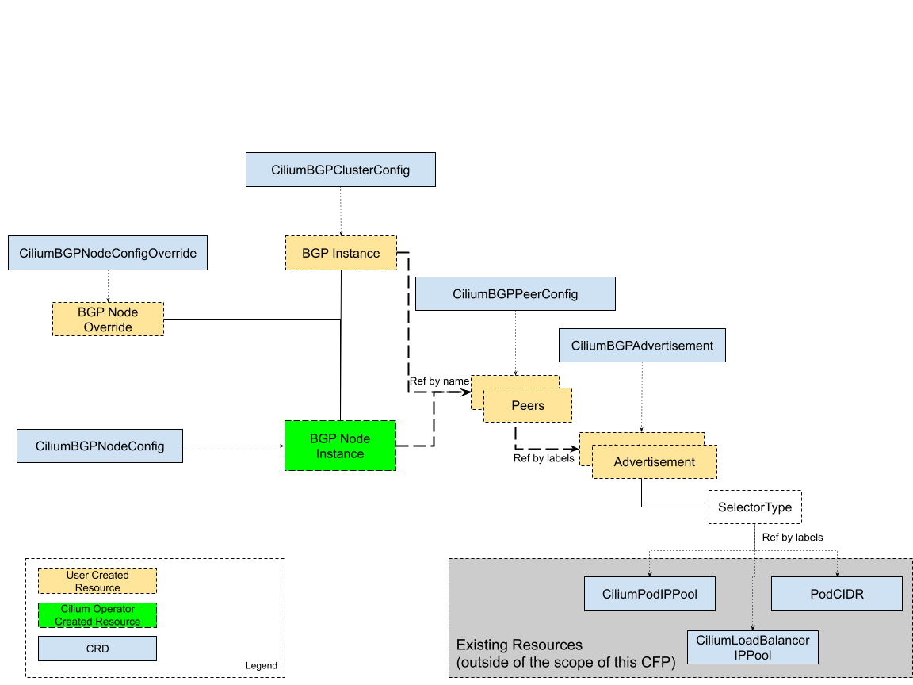
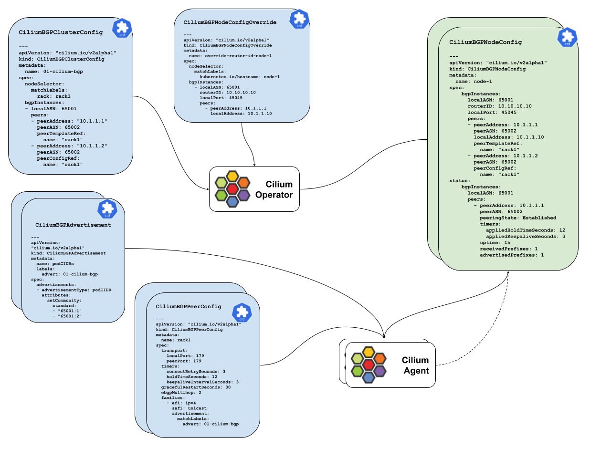
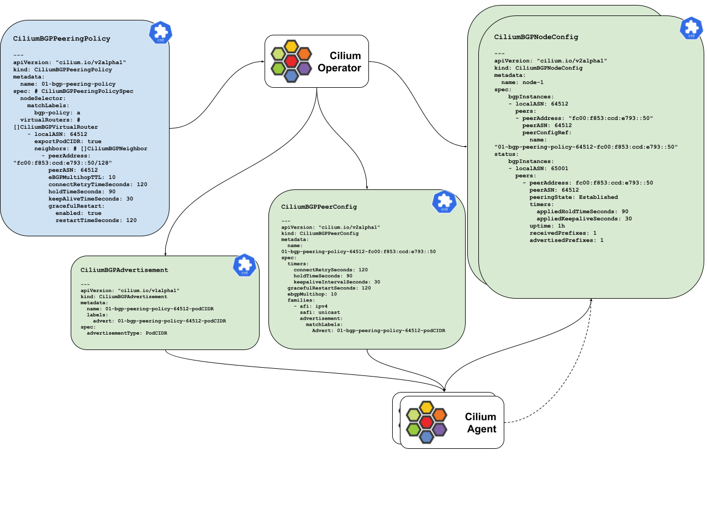

# CFP-28175: BGPv2 API changes


## Meta

**SIG: TRAFFIC-ENGINEERING**

**Sharing: Public**

**Begin Discussion:** Sept 18 2023

**Cilium Release:** v1.15

**Authors:** [@harsimran-pabla](https://github.com/harsimran-pabla), Michael Kashin

**Associated PR**: [PR-28175](https://github.com/cilium/cilium/pull/28175)


## Motivation

The existing CiliumBGPPeeringPolicy CRD serves as a single configuration resource for all things related to BGP. While this may work in simple topologies, it presents a few challenges when deployed in more complicated production deployments, for example:

* We need to explicitly enumerate per-neighbor settings, even when they match between multiple peers.
* The way we inject prefixes into BGP RIB is very inflexible. Currently these are main issues with the way we do advertisements
    * To add any new type of advertisement, need to modify CRD ( to add new field )
    * We cannot control per peer advertisement ( all peers get same advertisement )
* Per-node BGP state information can’t be exposed in the existing CRD due to the scalability concerns
    * BGPPeeringPolicy applies on multiple nodes, updating status on BGPPeeringPolicy will have multiple nodes modifying the status field of the CRD.

At the same time, most of the popular BGP daemons are managed using a very similar set of abstractions (e.g. peer-templates, route-maps etc.) and we want to provide a similar experience to make the Cilium BGP API more intuitive for experienced BGP users.


## Goals

* Provide a template-like mechanism to combine common per-peer attributes and settings, like address family, timers etc.
* Devise a better way to control which prefixes to advertise and how to assign attributes to these NLRIs
* Add a way to expose per-agent BGP state in a more scalable way
* Decide which **additional **BGP configuration settings to expose to provide enough settings for most common deployments
    * First iteration of this change will be to have feature parity with CiliumBGPPeeringPolicy
    * Subsequently, new features will be introduced.

## New BGP CRDs

**API version : cilium.io/v2alpha1**
New BGP CRDs are introduced in this proposal. These are
* CiliumBGPClusterConfig
* CiliumBGPAdvertisement
* CiliumBGPPeerConfig
* CiliumBGPNodeConfig
* CiliumBGPNodeConfigOverride

Below is the diagram showing the hierarchy and the relationship between the above CRDs. The relationship can be determined either by explicit references by name (and group,kind), or by combining a set of resources identified via label selectors.



Configuration is split into three parts.
* Cluster wide configuration ( CiliumBGPClusterConfig )
* Node specific configuration ( CiliumBGPNodeConfig, CiliumBGPNodeConfigOverride )
* Generic configuration which is referenced by node or cluster configurations ( CiliumBGPAdvertisement, CiliumBGPPeerConfig )

**Why is the configuration split this way?**

* Configuration flexibility: From configuration point of view, the benefit of this split is two fold, it avoids peer configuration repetition and  allows for better control over advertisements. Users are able to define common BGP peer settings with a peer configuration resource, which can be referenced in multiple peer configurations. It also allows users to have close control over how BGP advertisements are done per peer per address family.
* Observability and troubleshooting: Since cluster wide BGP configurations can potentially cover multiple BGP daemons running on different nodes, we need to find a way to expose a per-agent BGP state to be used for troubleshooting and observability purposes. This is the reason why we need to split the configuration into cluster wide and node specific configuration. Node specific resources will have a status field which will reflect local node BGP state. Having a BGP status field on cluster wide resources brings scalability concerns as BGP updates can cause resource contention on a single object.


## CiliumBGPClusterConfig

CiliumBGPClusterConfig is a cluster-wide resource that contains BGP configuration for the cluster. The CiliumBGPClusterConfig resource will contain the following fields

* Node selector: Nodes which match on node selector will get the associated CiliumBGPNodeConfig resource which is derived from CiliumBGPClusterConfig resource.
    * There can be many CiliumBGPClusterConfig resources in the cluster which are associated with certain nodes based on node selector labels.
        * If there are multiple policies matching the same node, the operator will pick only one (other policies will be ignored)
        * In the first iteration, the plan is not to have an error in the status field. But it can be added subsequently.
    * If the node selector is nil or empty, policy will be applied to all nodes in the cluster.
* BGP Instances: It is a list of BGP instances ( same as virtual routers in older CiliumBGPPeeringPolicy resource ). Each BGP instance has a local ASN, a list of peers and advertisement reference.
    * LocalASN: It is the local ASN for the BGP instance. This must be unique per BGP instance.
    * Peers: It is a list of BGP peers. Each peer has a peer address, peer ASN and a peer config reference. Peer-specific configuration is defined in the peer config resource.

**Relationship with other resources**

Refers:

* CiliumBGPPeerConfig: CiliumBGPClusterConfig can refer to a peer config resource in the peer configuration section of BGP instances. Multiple peers can have the same peer configuration.
    * This is an explicit reference by name, group and kind of a peer config resource.

Common use case is when defining BGP peering between bare-metal nodes and top of the rack switches. BGP peer configurations like Timers, Graceful restart etc are generally the same for both TOR switches ( potentially common across all TOR switches in the datacenter ). It makes it easier for users to define a peer configuration and reference it in the BGP instance configuration. Alternatively, if we don't have a peer config reference, users will have to define the same peer configuration for each peer in the BGP instance. This will lead to a lot of duplication of configuration.

**Consumer**

This resource will be consumed by the Cilium operator, which will use it to create per node BGP configuration.

**Status**

_(not planned)_

Configuration status:

* Error state: If there are multiple policies matching the same node, the operator will pick only one (other policies will be ignored)

```go
type CiliumBGPClusterConfigSpec struct {
	// NodeSelector selects a group of nodes where this BGP Peering
	// Policy applies.
	//
// If empty / nil this policy applies to all nodes.
	NodeSelector *slimv1.LabelSelector `json:"nodeSelector,omitempty"`

	// A list of CiliumBGPInstance(s) which instructs
	// the BGP control plane how to instantiate virtual BGP routers.
	BGPInstances []CiliumBGPInstance `json:"bgpInstances"`
}

type CiliumBGPInstance struct {
	// LocalASN is the LocalASN of this virtual router.
	// Supports extended 32bit ASNs
	LocalASN int64 `json:"localASN"`

	// Peers is a list of neighboring BGP peers for this virtual router
	Peers []CiliumBGPPeer `json:"peers"`
}

type CiliumBGPPeer struct {
	// PeerAddress is the IP address of the neighbor.
	// Supports IPv4 and IPv6 addresses.
	//
	// +kubebuilder:validation:Required
	// +kubebuilder:validation:Format=ip
	PeerAddress string `json:"peerAddress"`

	// PeerASN is the ASN of the peer BGP router.
	// Supports extended 32bit ASNs
	//
	// +kubebuilder:validation:Required
	// +kubebuilder:validation:Minimum=0
	// +kubebuilder:validation:Maximum=4294967295
	PeerASN int64 `json:"peerASN"`

	// PeerConfigRef is a reference to a peer configuration resource.
	//
	// +kubebuilder:validation:Optional
	PeerConfigRef *PeerConfigReference `json:"peerConfigRef,omitempty"`
}

// PeerConfigReference is a reference to a peer configuration resource.
type PeerConfigReference struct {
	// Group is the group of the peer config resource.
	//
	// +kubebuilder:validation:Required
	// +kubebuilder:default="cilium.io"
	Group string `json:"group"`

	// Kind is the kind of the peer config resource.
	//
	// +kubebuilder:validation:Required
	// +kubebuilder:default="CiliumBGPPeerConfig"
	Kind string `json:"kind"`

	// Name is the name of the peer config resource.
	// +kubebuilder:validation:Required
	Name string `json:"name"`
}

```


```yaml
---
apiVersion: "cilium.io/v2alpha1"
kind: CiliumBGPClusterConfig
metadata:
  name: 01-cilium-bgp-config
spec:
  nodeSelector:
    matchLabels:
      rack: rack1
  bgpInstances:
  - localASN: 65001
    peers:
    - peerAddress: "10.1.1.1"
      peerASN: 65002
      peerConfigRef:
        name: "rack1"
    - peerAddress: "10.1.1.2"
      peerASN: 65002
      peerConfigRef:
        name: "rack1"
```

## CiliumBGPAdvertisement

CiliumBGPAdvertisement is a resource that defines which routes to advertise to BGP peers. Multiple advertisements can be defined in the CiliumBGPAdvertisementSpec.  Same advertisement can also be referenced by multiple peer configuration resources.

Each advertisement will have the following fields:
* SelectorType: This field defines the selector type. Currently supported types are
    * PodCIDR
    * CiliumPodIPPool
    * CiliumLoadBalancerIPPool

    This field is not closed to change, consumers of CiliumBGPAdvertisement should handle unknown fields.

* Selector: This field defines the label selector for the resource type defined in the SelectorType field. **If nil or empty, all prefixes of selector type will be advertised.**
* Attributes: This defines the BGP attributes that are associated with this advertisement. These are standard BGP-specific attributes.

CiliumBGPAdvertisement can be referenced from peer address family configuration. BGP instances will advertise defined NLRI per peer per family.

**Relationship with other resources**

Referenced by
* CiliumBGPPeerConfig: CiliumBGPAdvertisement is referenced from the address family configuration of CiliumBGPPeerConfig.

Multiple peer configurations can refer to the same advertisement. This is useful when we want to advertise the same routes to multiple peers which may have different peer configurations.

**Caveats and future improvements**

The current design assumes that all prefixes of one type are advertised with the same set of attributes, even when they are advertised individually (as host routes). There may be a need to advertise subsets of these prefixes with different attributes, e.g. cluster with a single LBIPPool but with multiple tenants where each tenant needs to be identified with a unique set of attributes (e.g. BGP communities). Some of the potential solutions to this may be:

* Split LBIPPool into smaller non-overlapping ranges. This assumes that users (tenants) know and use the right pool
* Per-service selector in AdvertisementType, e.g.

```yaml
        advertisedPathAttributes:
         - selectorType: Service
           selector:
             matchLabels:
               environment: production
```

**Consumer**

This resource will be consumed by the BGP controller running inside the Cilium agent.

**Status**

No status field planned for this resource.

```go
// BGPAdvertisementType defines type of advertisement.
//
// Note list of supported advertisements is not exhaustive and can be extended in the future.
// Consumer of this API should be able to handle unknown values.
//
// +kubebuilder:validation:Enum=PodCIDR;CiliumPodIPPool;CiliumLoadBalancerIP
type BGPAdvertisementType string

const (
	// PodCIDRAdvert when configured, Cilium will advertise pod CIDRs to BGP peers.
	PodCIDRAdvert BGPAdvertisementType = "PodCIDR"

	// CiliumPodIPPoolAdvert when configured, Cilium will advertise prefixes from CiliumPodIPPools to BGP peers.
	CiliumPodIPPoolAdvert BGPAdvertisementType = "CiliumPodIPPool"

	// CiliumLoadBalancerIPAdvert when configured, Cilium will advertise load balancer services IPs to BGP peers.
	// The loadBalancerClass for a service must be nil or specify a class supported by Cilium,
	// e.g. "io.cilium/bgp-control-plane".
	//
	// Refer to the following document for additional details regarding load balancer
	// classes: https://kubernetes.io/docs/concepts/services-networking/service/#load-balancer-class
	CiliumLoadBalancerIPAdvert BGPAdvertisementType = "CiliumLoadBalancerIP"
)

type CiliumBGPAdvertisementSpec struct {
	// Advertisements is a list of BGP advertisements.
	//
	// +kubebuilder:validation:Required
	// +kubebuilder:validation:MinItems=1
	Advertisements []Advertisement `json:"advertisements"`
}

// Advertisement defines which routes Cilium should advertise to BGP peers. Optionally, additional attributes can be
// set to the advertised routes.
type Advertisement struct {
	// AdvertisementType defines type of advertisement which has to be advertised.
	//
	// +kubebuilder:validation:Required
	AdvertisementType BGPAdvertisementType `json:"advertisementType"`

	// Selector is a label selector to select objects of the type specified by AdvertisementType.
// If nil or empty, all objects of the type specified by AdvertisementType are selected for advertisement.
	//
	// +kubebuilder:validation:Optional
	Selector *slimv1.LabelSelector `json:"selector,omitempty"`

	// Attributes defines additional attributes to set to the advertised routes.
	//
	// +kubebuilder:validation:Optional
	Attributes *CiliumBGPAttributes `json:"attributes,omitempty"`
}

// CiliumBGPAttributes defines additional attributes to set to the advertised NLRIs.
type CiliumBGPAttributes struct {
	// Community sets the community attribute in the route.
	//
	// +kubebuilder:validation:Optional
	Community *BGPCommunities `json:"community,omitempty"`

	// LocalPreference sets the local preference attribute in the route.
	//
	// +kubebuilder:validation:Optional
	LocalPreference *int64 `json:"localPreference,omitempty"`
}
```

```yaml
---
apiVersion: "cilium.io/v2alpha1"
kind: CiliumBGPAdvertisement
metadata:
  name: podCIDRs
  labels:
    advert: 01-bgp
spec:
  advertisements:
  - advertisementType: PodCIDR
    attributes:
      community:
        standard:
          - "65001:1"
          - "65001:2"
      localPreference: 100
  - advertisementType: CiliumLoadBalancerIPPool
    selector:
      matchLabels:
        service: lb-1
    attributes:
      community:
        standard:
          - "65001:100"
```

## CiliumBGPPeerConfig

CiliumBGPPeerConfig is a resource which defines a common set of BGP configurations for a peer. This is defined independent of CiliumBGPClusterConfig so that multiple peers can use the common peer configuration.

Peer configuration will follow this pattern

* Cluster config defines which peers to configure ( key for the peer is address and peer ASN )
* Peer config resource defines what peer configuration should look like ( timers, GR, advertisements etc ). This is common peer configuration, which multiple peers can use.

This is the trade-off, having everything in cluster config suits users who have different peer configurations per node versus users having common peer configurations across multiple nodes.  For complete flexibility, we are starting off by separating peer configuration from cluster configuration.

Advertisements are part of peer address family configuration. So, CiliumBGPPeerConfig **must be** defined and referenced in peer configuration for Cilium to advertise any routes to peers.

**Relationship with other resource**

Referenced by
* CiliumBGPClusterConfig: Peer config resource is referenced from BGP instance peer definition in CiliumBGPClusterConfig. There can be multiple peers within the same or different CiliumBGPClusterConfig which can reference the same peer config resource.
* CiliumBGPNodeConfig: CiliumBGPNodeConfig is the resource created by the operator for each node. Peer configuration resources will be referenced from CiliumBGPNodeConfig peer configuration.

Refers
* CiliumBGPAdvertisement: Label selector in address family section of BGP peer config defines which advertisements are to be advertised to the peer. Multiple advertisement resources can be selected by the label selector.
    * This is an indirect reference via label selector.

**Consumer**

This resource will be consumed by the BGP controller running inside the Cilium agent.

**Status**
No status field planned for this resource.
```go
type CiliumBGPPeerConfig struct {
	// +deepequal-gen=false
	metav1.TypeMeta `json:",inline"`
	// +deepequal-gen=false
	metav1.ObjectMeta `json:"metadata"`

	Spec CiliumBGPPeerConfigSpec `json:"spec,omitempty"`
}

type CiliumBGPPeerConfigSpec struct {
	// Transport defines the BGP transport parameters for the peer.
	// +kubebuilder:validation:Optional
	Transport *CiliumBGPTransport `json:"transport,omitempty"`

	// Timers defines the BGP timers for the peer.
	// +kubebuilder:validation:Optional
	Timers *CiliumBGPTimers `json:"timers,omitempty"`

	// GracefulRestart defines graceful restart parameters which are negotiated
	// with this peer. If empty / nil, the graceful restart capability is disabled.
	//
	// +kubebuilder:validation:Optional
	GracefulRestart *CiliumBGPNeighborGracefulRestart `json:"gracefulRestart,omitempty"`

	// EBGPMultihopTTL controls the multi-hop feature for eBGP peers.
	// Its value defines the Time To Live (TTL) value used in BGP
	// packets sent to the peer.
	// The value 1 implies that eBGP multi-hop feature is disabled
	// (only a single hop is allowed).
	//
	// This field is ignored for iBGP peers.
	//
	// +kubebuilder:validation:Optional
	// +kubebuilder:validation:Minimum=1
	// +kubebuilder:validation:Maximum=255
	// +kubebuilder:default=1
	EBGPMultihop *int32 `json:"ebgpMultihop,omitempty"`

	// Families, if provided, defines a set of AFI/SAFIs the speaker will
	// negotiate with it's peer.
	//
	// If this slice is not provided the default families of IPv6 and IPv4
	// will be provided.
	//
	// +kubebuilder:validation:Optional
	Families []CiliumBGPFamily `json:"families,omitempty"`
}

// CiliumBGPFamily represents a AFI/SAFI address family pair.
type CiliumBGPFamily struct {
	// +kubebuilder:validation:Enum=ipv4;ipv6
	// +kubebuilder:validation:Required
	Afi string `json:"afi,omitempty"`

	// +kubebuilder:validation:Enum=unicast
	// +kubebuilder:validation:Required
	Safi string `json:"safi,omitempty"`

	// Advertisements selects group of BGP Advertisement(s) to advertise for this family.
//
// +kubebuilder:validation:Optional
Advertisements *slimv1.LabelSelector `json:"advertisements,omitempty"`

}

type CiliumBGPTransport struct {
	// LocalPort is the local port to be used for the BGP session.
	// +kubebuilder:validation:Optional
	// +kubebuilder:validation:Minimum=1
	// +kubebuilder:validation:Maximum=65535
	// +kubebuilder:default=179
	LocalPort *int32 `json:"localPort,omitempty"`

	// PeerPort is the peer port to be used for the BGP session.
	// +kubebuilder:validation:Optional
	// +kubebuilder:validation:Minimum=1
	// +kubebuilder:validation:Maximum=65535
	// +kubebuilder:default=179
	PeerPort *int32 `json:"peerPort,omitempty"`
}

type CiliumBGPTimers struct {
	// ConnectRetryTimeSeconds defines the initial value for the BGP ConnectRetryTimer (RFC 4271, Section 8).
	//
	// +kubebuilder:validation:Optional
	// +kubebuilder:validation:Minimum=1
	// +kubebuilder:validation:Maximum=2147483647
	// +kubebuilder:default=120
	ConnectRetryTimeSeconds *int32 `json:"connectRetryTimeSeconds,omitempty"`

	// HoldTimeSeconds defines the initial value for the BGP HoldTimer (RFC 4271, Section 4.2).
	// Updating this value will cause a session reset.
	//
	// +kubebuilder:validation:Optional
	// +kubebuilder:validation:Minimum=3
	// +kubebuilder:validation:Maximum=65535
	// +kubebuilder:default=90
	HoldTimeSeconds *int32 `json:"holdTimeSeconds,omitempty"`

	// KeepaliveTimeSeconds defines the initial value for the BGP KeepaliveTimer (RFC 4271, Section 8).
	// It can not be larger than HoldTimeSeconds. Updating this value will cause a session reset.
	//
	// +kubebuilder:validation:Optional
	// +kubebuilder:validation:Minimum=1
	// +kubebuilder:validation:Maximum=65535
	// +kubebuilder:default=30
	KeepAliveTimeSeconds *int32 `json:"keepAliveTimeSeconds,omitempty"`
}
```

```yaml
---
apiVersion: "cilium.io/v2alpha1"
kind: CiliumBGPPeerConfig
metadata:
  name: rack1
spec:
  transport:
    localPort: 179
    peerPort: 179
  timers:
    connectRetrySeconds: 3
    holdTimeSeconds: 12
    keepaliveIntervalSeconds: 3
  gracefulRestartSeconds: 30
  ebgpMultihop: 2
  families:
    - afi: ipv4
      safi: unicast
      advertisement:
        matchLabels:
          advert: 01-bgp
    - afi: ipv6
      safi: unicast
      advertisement:
        matchLabels:
          advert: 01-bgp
```


## CiliumBGPNodeConfig ( Generated )

CiliumBGPNodeConfig is a node specific resource which contains BGP configuration for the node. This resource is created by the operator for each node in the cluster - it is not a user created resource. It is derived from the CiliumBGPClusterConfig and CiliumBGPNodeConfigOverride resources.

Name of this resource is the same as the node name.

**Relationship with other resources**

Refers:
* CiliumBGPPeerConfig: Peer config resource is referenced from peer configuration of BGP instance in CiliumBGPNodePeer.
    * This is an explicit reference  by name of a peer config resource.
* CiliumBGPAdvertisement: Indirect reference to advertisement resource from peer config resource. Advertisement resource is referenced from address family configuration.
    * This is an indirect reference via label selector.

**Consumer**
This resource will be consumed by the BGP controller running inside the Cilium agent.

**Status Field**
Configuration status _(not planned)_


* Status of configuration, i.e. if the configuration is accepted by the controller.
* Not planned for the first iteration, can be added later.

```go
// CiliumBGPNodeConfig is node local configuration for BGP agent. Name of the object should be node name.
type CiliumBGPNodeConfig struct {
	// +deepequal-gen=false
	metav1.TypeMeta `json:",inline"`
	// +deepequal-gen=false
	metav1.ObjectMeta `json:"metadata"`

	Spec CiliumBGPNodeConfigSpec `json:"spec"`

	Status CiliumBGPNodeConfigStatus `json:"status"`
}

// +k8s:deepcopy-gen:interfaces=k8s.io/apimachinery/pkg/runtime.Object
// +k8s:openapi-gen=false
// +deepequal-gen=false

// CiliumBGPNodeConfigList is a list of CiliumBGPClusterConfig objects.
type CiliumBGPNodeConfigList struct {
	metav1.TypeMeta `json:",inline"`
	metav1.ListMeta `json:"metadata"`

	// Items is a list of CiliumBGPNodeConfig.
	Items []CiliumBGPNodeConfig `json:"items"`
}

type CiliumBGPNodeConfigSpec struct {
	// BGPInstances is a list of BGP router instances on the node.
	//
	// +kubebuilder:validation:Required
	// +kubebuilder:validation:MinItems=1
	// +listType=map
	// +listMapKey=localASN
	BGPInstances []CiliumBGPNodeInstance `json:"bgpInstances"`
}

type CiliumBGPNodeInstance struct {
	// LocalASN is the LocalASN of this virtual router.
	// Supports extended 32bit ASNs
	//
	// +kubebuilder:validation:Required
	// +kubebuilder:validation:Minimum=0
	// +kubebuilder:validation:Maximum=4294967295
	LocalASN int64 `json:"localASN"`

// RouterID is BGP router id used by this instance
// It is configured via CiliumBGPNodeConfigOverride resource
// +kubebuilder:validation:Optional
RouterID string `json:"routerID,omitempty"`

// Local Port is port on which BGP will listen.
// It is configured via CiliumBGPNodeConfigOverride resource
//
// +kubebuilder:validation:Minimum=1
	// +kubebuilder:validation:Maximum=65535
// +kubebuilder:validation:Optional
LocalPort *int32 `json:"localPort,omitempty"`

	// Peers is a list of neighboring BGP peers for this virtual router
	//
	// +kubebuilder:validation:Required
	// +kubebuilder:validation:MinItems=1
	Peers []CiliumBGPNodePeer `json:"peers"`
}

type CiliumBGPNodePeer struct {
	// PeerAddress is the IP address of the neighbor.
	// Supports IPv4 and IPv6 addresses.
	// +kubebuilder:validation:Required
	// +kubebuilder:validation:Format=ip
	PeerAddress string `json:"peerAddress"`

// PeerASN is the ASN of the peer BGP router.
	// Supports extended 32bit ASNs
	//
	// +kubebuilder:validation:Required
	// +kubebuilder:validation:Minimum=0
	// +kubebuilder:validation:Maximum=4294967295
	PeerASN int64 `json:"peerASN"`

	// LocalAddress is local IP address which will be used for establishing peering relation.
// It is configured via CiliumBGPNodeConfigOverride resource
// +kubebuilder:validation:Format=ip
// +kubebuilder:validation:Optional
LocalAddress string `json:"localAddress,omitempty"`

	// PeerConfigRef is a reference to a peer configuration resource.
	//
	// +kubebuilder:validation:Optional
	PeerConfigRef *PeerConfigReference `json:"peerConfigRef,omitempty"`
}

type CiliumBGPNodeConfigStatus struct {
	// +listType=map
	// +listMapKey=localASN
	BGPInstances []CiliumBGPNodeConfigInstanceStatus `json:"bgpInstances"`
}

type CiliumBGPNodeConfigInstanceStatus struct {
	LocalASN uint32 `json:"localASN"`
	// +listType=map
	// +listMapKey=peerAddress
	Peers []CiliumBGPNodeConfigPeerStatus `json:"peers"`
}

type CiliumBGPNodeConfigPeerStatus struct {
	PeerAddress      	string               			`json:"peerAddress"`
	PeerASN          		int32               			`json:"peerASN,omitempty"`
	PeeringState     	string               			`json:"peeringState,omitempty"`
	Timers           		CiliumBGPTimersState 	`json:"timers,omitempty"`
	Uptime           		string               			`json:"uptime,omitempty"`
	RoutesReceived   	int32               			`json:"routesReceived,omitempty"`
	RoutesAdvertised 	int32               			`json:"routesAdvertised,omitempty"`
}

type CiliumBGPTimersState struct {
	AppliedHoldTimeSeconds  	int32 `json:"appliedHoldTimeSeconds,omitempty"`
	AppliedKeepaliveSeconds 	int32 `json:"appliedKeepaliveSeconds,omitempty"`
}
```

Peering status
* Status of BGP peering.
* Planned for the first iteration.


```yaml
---
apiVersion: "cilium.io/v2alpha1"
kind: CiliumBGPNodeConfig
metadata:
  name: node-1
spec:
    bgpInstances:
    - localASN: 65001
      routerID: 10.10.10.10
      localPort: 45045
      peers:
      - peerAddress: "10.1.1.1"
        peerASN: 65002
        localAddress: "10.1.1.10"
        peerConfigRef:
          name: "rack1"
      - peerAddress: "10.1.1.2"
        peerASN: 65002
        peerConfigRef:
          name: "rack1"
status:
    bgpInstances:
    - localASN: 65001
      peers:
        - peerAddress: 10.1.1.1
          peerASN: 65002
          peeringState: Established
          timers:
            appliedHoldTimeSeconds: 12
            appliedKeepaliveSeconds: 3
          uptime: 1h
          receivedPrefixes: 1
          advertisedPrefixes: 1
        - peerAddress: 10.1.1.2
          peerASN: 65002
          peeringState: Active
```


## Configuration Overrides

In most cases, Cilium BGP agent will auto generate node local configuration settings like router-id or local address to be used to set up peering. However, users have an option to override cilium agent auto generated settings by specifying them in the CiliumBGPNodeConfigOverride resource.

Configuration overrides are used to explicitly set node level BGP configuration. The following node local configurations can not be expressed by global configurations:
* Router-ID must be unique per BGP instance. We cannot set it via CiliumBGPClusterConfig as it is a cluster-wide configuration.
    * Today we detect local IP and configure it. But this is error prone as multiple BGP instances will pick the same router-id.
    * Operators may want to set router-id explicitly.
* Local-Address used in peering configuration is also node-specific configuration. In multihoming scenarios, we may want to force peering over specific interfaces.

The following configuration options should be supported per ASN:
* Router ID
* Global local port to be configured
* Local Address to be used for given neighbor
* Local Port to be used for given neighbor


## Configuration override via CRD CiliumBGPNodeConfigOverride

We can specify node-specific configuration via CiliumBGPNodeConfigOverride. The operator will consume this resource and update the CiliumBGPNodeConfig resource.

```go
// CiliumBGPNodeConfigOverride is used to overrides some of the BGP configurations which are node local.
type CiliumBGPNodeConfigOverride struct {
	// +deepequal-gen=false
	metav1.TypeMeta `json:",inline"`
	// +deepequal-gen=false
	metav1.ObjectMeta `json:"metadata"`

	Spec CiliumBGPNodeConfigOverrideSpec `json:"spec"`
}

type CiliumBGPNodeConfigOverrideSpec struct {
	// NodeRef is the name of the node for which the BGP configuration is overridden.
	//
	// +kubebuilder:validation:Required
	NodeRef string `json:"nodeRef"`

	// +listType=map
	// +listMapKey=localASN
	BGPInstances []CiliumBGPNodeConfigInstanceOverride `json:"bgpInstances"`
}

type CiliumBGPNodeConfigInstanceOverride struct {
	// LocalASN is used to identify the BGP instance to override.
	// +kubebuilder:validation:Required
	LocalASN uint32 `json:"localASN"`

	// RouterID is BGP router id to use for this instance. It must be unique across all BGP instances.
	// If not specified, the node's IP address is used.
	//
	// +kubebuilder:validation:Optional
	// +kubebuilder:validation:Format=ipv4
	RouterID string `json:"routerID,omitempty"`

	// LocalPort is port to use for this instance.
	// +kubebuilder:validation:Optional
	LocalPort int32 `json:"localPort,omitempty"`

	// +kubebuilder:validation:Optional
	Peers []CiliumBGPNodeConfigPeerOverride `json:"peers,omitempty"`
}

type CiliumBGPNodeConfigPeerOverride struct {
	// PeerAddress is used to identify the peer to override.
	//
	// +kubebuilder:validation:Required
	// +kubebuilder:validation:Format=ip
	PeerAddress string `json:"peerAddress"`

	// LocalAddress is the IP address to use for this peer.
	// +kubebuilder:validation:Optional
	LocalAddress string `json:"localAddress,omitempty"`

	// LocalPort is port to use for this peer.
	// +kubebuilder:validation:Optional
	LocalPort int32 `json:"localPort,omitempty"`
}
```

## Backward Compatibility

To provide backwards compatibility with CiliumBGPPeeringPolicy, the operator will create equivalent BGPv2 resources. CiliumBGPAdvertisement and CiliumBGPPeerConfig resources can be created from CiliumBGPPeeringPolicy resources.

For example, following CiliumBGPPeeringPolicy resource will be translated to BGPv2 configurations

```yaml
---
apiVersion: "cilium.io/v2alpha1"
kind: CiliumBGPPeeringPolicy
metadata:
  name: 01-bgp-peering-policy
spec: # CiliumBGPPeeringPolicySpec
  nodeSelector:
    matchLabels:
      bgp-policy: a
  virtualRouters: # []CiliumBGPVirtualRouter
    - localASN: 64512
      exportPodCIDR: true
      neighbors: # []CiliumBGPNeighbor
        - peerAddress: "fc00:f853:ccd:e793::50/128"
          peerASN: 64512
          eBGPMultihopTTL: 10
          connectRetryTimeSeconds: 120
          holdTimeSeconds: 90
          keepAliveTimeSeconds: 30
          gracefulRestart:
            enabled: true
            restartTimeSeconds: 120
```

Equivalent BGPv2 resources will be created as below

**CiliumBGPAdvertisement** resource will be created per virtual router per CiliumBGPPeeringPolicy resource.

Name of the policy will be of this format : bgpp-&lt;bgpp-name>-&lt;asn>

```yaml
---
apiVersion: "cilium.io/v1alpha1"
kind: CiliumBGPAdvertisement
metadata:
  name: bgpp-01-bgp-peering-policy-64512
  labels:
    advert: bgpp-01-bgp-peering-policy-64512
spec:
  advertisementType: PodCIDR
```

**CiliumBGPPeerConfig** resource will be created per neighbor per virtual router per CiliumBGPPeeringPolicy resource.

Name of the policy will be of this format : `bgpp-&lt;bgpp-name>-&lt;asn>-&lt;neigh_addr>`

```yaml
---
apiVersion: "cilium.io/v2alpha1"
kind: CiliumBGPPeerConfig
metadata:
  name: bgpp-01-bgp-peering-policy-64512-fc00:f853:ccd:e793::50
spec:
  timers:
    connectRetrySeconds: 120
    holdTimeSeconds: 90
    keepaliveIntervalSeconds: 30
  gracefulRestartSeconds: 120
  ebgpMultihop: 10
  families:
  - afi: ipv4
    safi: unicast
    advertisement:
      matchLabels:
        advert: 01-bgp-peering-policy-64512-podCIDR
  - afi: ipv6
    safi: unicast
    advertisement:
      matchLabels:
        advert: 01-bgp-peering-policy-64512-podCIDR
```

Node level **CiliumBGPNodeConfig** resource will be created based on the node selector of CiliumBGPPeeringPolicy resource.

```yaml
---
apiVersion: "cilium.io/v2alpha1"
kind: CiliumBGPNodeConfig
metadata:
  name: node-1
spec:
    bgpInstances:
    - localASN: 64512
      peers:
      - peerAddress: "fc00:f853:ccd:e793::50"
        peerASN: 64512
        peerConfigRef:
          name: "01-bgp-peering-policy-64512-fc00:f853:ccd:e793::50"
status:
    bgpInstances:
    - localASN: 65001
      peers:
        - peerAddress: fc00:f853:ccd:e793::50
          peerASN: 64512
          peeringState: Established
          timers:
            appliedHoldTimeSeconds: 90
            appliedKeepaliveSeconds: 30
          uptime: 1h
          receivedPrefixes: 1
          advertisedPrefixes: 1
```


# **Summary of CRDs**
Users will create BGP peer config and BGP advertisement options via CiliumBGPPeerConfig and CiliumBGPAdvertisement respectively. These CRDs are then referenced in CiliumBGPClusterConfig, which is consumed by the operator and it creates per node CiliumBGPNodeConfig CRD. Any node configuration overrides will also be consumed by the operator and it will update CiliumBGPNodeConfig accordingly.

The BGP sub-system running on Cilium Agent will consume CiliumBGPNodeConfig, CiliumBGPAdvertisement and CiliumBGPPeerConfig resources to set up local BGP configuration. It will also update local BGP status in CiliumBGPNodeConfig CRD.



For backwards Compatibility, the operator will consume CiliumBGPPeeringPolicy and create CiliumBGPAdvertisement, CiliumBGPPeerConfig and CiliumBGPNodeConfig resources.


