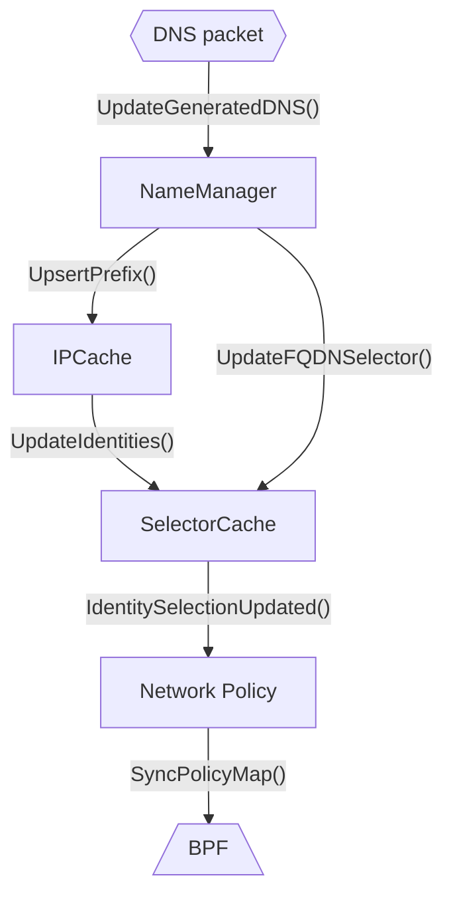

# CFP-28427: ToFQDN policy performance improvements

**SIG: SIG-Policy**

**Begin Design Discussion:** 2024-02-12

**Cilium Release:** 1.16

**Authors:** Casey Callendrello <cdc@isovalent.com>, Sebastian Wicki <sebastian@isovalent.com>

## Summary

Improve FQDN-based policy performance by changing how identities and labels are managed. Rather than propagating FQDN -> IP mappings to selectors, label IPs by the FQDN selector(s) that return them.

e.g. `18.192.231.252 -> (dns:*.cilium.io)`

## Motivation

ToFQDN scaling limitations are a source of pain for many, many Cilium end users. When a domain name returns a large and constantly varying set of IPs (e.g. S3), this causes significant identity churn and increased memory usage.

At the time of writing, Cilium allocates a unique security identity for each IP address, even if all of those addresses are selected by a single selector. All these identities then need to be pushed in to every relevant PolicyMap as well as Envoy -- all before returning the DNS response to the waiting endpoint.

## Goals

- Reduce resource consumption by large ToFQDN policies
- Improve response latency for proxied DNS requests

----


## Background

First, let us understand the existing components at work for ToFQDN policies.

### Lexicon

**Label:** A key-value pair, optionally tagged with a source. For example, `k8s:app:database` is equivalent to the Pod label `app=database`
**Identity:** A unique set of labels. Every identity has a numeric identifier.
**Selector:** A policy entity that selects identities. 
**Label Selector:** A selector that references by label key and/or value.
**CIDR Selector:** A selector that references by CIDR. CIDR selectors are converted to a special form of label selectors.
**ToFQDN Selector:** A selector that dynamically selects based on the result of intercepted DNS requests and responses.

### CIDR labels

The BPF policy engine relies on identities -- it does not understand CIDRs or IPs directly. So, special CIDR labels are used, and special _local identities_ are allocated on-demand to represent these external IP blocks.

The IPCache aggregates multiple sources of labels for external CIDRs. As necessary, it will generate the complete set of labels and allocate a numerical identity.

Consider a ToCIDR block that selects `192.0.2.0/24`. The policy subsystem will upsert the prefix-label mapping `192.0.2.0/24 (cidr:192.0.2.0/24)`. The IPCache will allocate a local identity (e.g. 16777216) for this set labels. It will also convert the ToCIDR selector to a label selector, selecting the identical CIDR label. The SelectorCache will then select this numeric identity when generating the policy maps.

If another ToCIDR block selects `192.0.2.128/25`, a similar preifx-label mapping will be created `192.0.2.128/25 -> (cidr:192.0.2.128/25)`. Likewise, a new identity will be allocated for this unique set of labels. The SelectorCache will be updated, and the label selector `cidr:192.0.2.0/24` will **now match two identities**.

### Components & Flow



#### The SelectorCache

The SelectorCache maintains a list of all "active" selectors for policies. If, for example, there is a network policy that grants access to label `team: database`, this selector will "live" in the SelectorCache. The policy will ask the SelectorCache for all identities that match this selector. Furthermore, the policy will "register" for incremental updates to this selector.

#### NameManager

The NameManager maintains two key lists:
1. The mapping from DNS names to IPs
2. The set of active FQDN selectors

As DNS responses come in, the NameManager determines if the name is selected by any ToFQDN policies. If so, it inserts the IP in to the ipcache (if needed) and updates the relevant ToFQDN selectors.

#### IPCache

The IPCache stores the mapping from prefix to labels. It also allocates identities for labels, and manages the mapping from prefix -> numeric identity.

### Incremental updates

   1. An identity is allocated for the IP:
      1. `ipc.UpsertPrefixes()` is called, associating the complete set of CIDR labels with this IP address.
      2. The IPCache determines the IP's full set of labels, allocates an identity, and informs the SelectorCache of this new IP
   2. The selector is updated:
      1. The NameManager calls `sc.UpdateFQDNSelector()`, updating the set of selected IPs for this given FQDNSelector
      2. The SelectorCache determines the complete set of identities selected
      3. Any differences are pushed to network policies
   3. Endpoints are updated
      1. Any pending incremental updates are batched up and applied to the endpoints' BPF PolicyMap. If needed, Envoy is also updated
 
Only at this point can the DNS packet be returned to the waiting endpoint.

## Performance bottlenecks

### Many identities

Some DNS names (e.g S3) will return many different IP addresses. S3 even has a TTL of 5 seconds, so the set of IPs will quickly be very broad. This causes a large number of identities to be allocated -- one per IP. These identities then need to plumbed through to all endpoints.

### Envoy updates

Adding a new indentity to a selector requires an xDS roundrip to Envoy. This has a high tail latency, and in practice can take up to 100ms. This may have to happen multiple times for a single proxied FQDN request.

----

## Proposal

This CFP proposes 3 key changes. Together, they preserve correctness while radically restructuring how prefixes are selected.

1. Labels on prefixes propagate downwards. That is to say, if prefix `192.0.0.0/22` has label `foo:bar`, then prefix `192.0.2.0/24` also has label `foo:bar`, unless overridden. The IPCache aggregates labels accordingly.
2. Only selected CIDR labels are inserted in to the ipcache. If a selector references CIDR `192.0.2.0/24`, only the prefix -> label mapping `192.0.2.0/24 -> cidr:192.0.2.0/24` is added to the IPCache.
3. When the NameManager learns about a new relevant `name -> IP` pair, it upserts the label `IP -> (dns:selector)` It **does not** create any CIDR labels.


### 1: CIDR Label down-propagation

Currently, prefixes in the ipcache are independent. Instead, labels should flow downwards from prefixes. For example, consider an IPCache with two prefixes: 

```
192.0.2.0/24 -> reserved:world, k8s:foo:bar, cidr:192.0.2.0/24
192.0.2.2/32 -> reserved:world, cidr:192.0.2.2/32, reserved:kube-apiserver
```

Then, the complete set of labels for `192.0.2.2/32` would be `reserved:world, k8s:foo:bar, cidr:192.0.2.2/32, reserved:kube-apiserver`. As a special case, shorter CIDR labels can be omitted from descendant prefixes, as the selector logic will match longer prefixes correctly.

This is a cornerstone for implementing another feature, non-k8s label sources. It is also required for correctness within the context of this proposal, especially when ToFQDN and CIDR selectors overlap.

#### Lifecycle

With label down-propagation, it is important that updates are propagated accordingly. When a prefix P is updated or deleted, then updates must be also triggered for all prefixes contained in P.

This update may be calculated if we use a bitwise LPM trie. Alternatively, scanning the entire ipcache to determine affected prefixes may be more efficient.


### 2: Only generate terminal CIDR labels

The label selector logic is already cidr-aware, and does not require cidr label expansion for shorter-prefixes to correctly match descendant prefixes.

So, if selector A selects `cidr:192.168.0.0/24`, there will be a single identity, `id1 -> (cidr:192.168.0.0/24)`. If selector B selects `cidr:192.168.0.0/25`, then there will be two identities: `id1-> (cidr:192.168.0.0/24)` and `id2 -> (cidr:192.168.0.0/25)`. The label matching logic ensures that selector A will now select _id1_ and _id2_, and selector B will select just _id2_.

Thus, when generating the set of labels for a prefix, we should discard any intermediate CIDR labels, keeping only the longest prefix.

### 3: FQDN selector labels

Currently, FQDN selectors (as stored in the SelectorCache) understand the set of IPs that they select. They determine the relevant set of identities by generating the equivalent `cidr:x.x.x.x/32` labels and looking for matching identities.

Presently, when a new `(name: IP)` mapping is learned, the NameManager inserts that IP in the IPCache and updates the selectors' set of desired labels to include that IP's CIDR label.

Instead, the NameManager should label IPs with the selector(s) that match that name. So, if a DNS answer `www.cilium.io: 52.58.254.253, 18.192.231.252` is seen, and there is a ToFQDN policy that allows `*.cilium.io`, two new entries are inserted in to the IPCache metadata layer:

```
18.192.231.252/32 -> (dns:*.cilium.io)
52.58.254.253/32 -> (dns:*.cilium.io)
```

If no identity exists for the label set `(dns:*.cilium.io)`, it would be allocated and the selector would be updated. Then, the updated mapping from prefix to identity would be inserted for both IPs in the IPCache.

This optimizes a common case in the FQDN response path: learning a new IP. If the new IP does not require an identity allocation, then a only a single BPF write to the IP -> identity cache is needed -- neither the PolicyMaps nor Envoy need to be updated.

#### FQDN identity pre-allocation

We would like to optimize the dynamic path, so that learning a new IP generally does not require an identity allocation or policy update. One way to do this is to pre-allocate an identity for FQDN selectors, even if there are no corresponding IPs.

This has advantages and disadvantages. It could cause unnecessary BPF PolicyMap entries, but reduces the critical-path latency. It also reduces the chance that packets are dropped on agent restart. We plan to enable pre-allocation.

## Impacts / Key Questions

### Question: Are overlapping FQDN selectors handled correctly?

Consider two selectors: one selects `*.cilium.io`, another selects `www.cilium.io`. Imagine DNS responses have been seen for `www.cilium.io: IP1, IP2` and `dev.cilium.io: IP2, IP3`.

The IPCache label map would have:

```
IP1: (dns:*.cilium.io, dns:www.cilium.io)
IP2: (dns:*.cilium.io, dns:www.cilium.io)
IP3: (dns:*.cilium.io)
```

There would, then, be two identities allocated:
```
ID1: (dns:*.cilium.io, dns:www.cilium.io)
ID2: (dns:*.cilium.io)
```

and the IP -> ID mapping would be
```
IP1: ID1
IP2: ID1
IP3: ID2
```

The selector `*.cilium.io` selects `ID1, ID2`, and `www.cilium.io` selects `ID1`. Every selector derives to the correct set of IPs, thus overlapping selectors are handled correctly.


### Question: Are overlapping IPs handled correctly?

It is possible for the same IP to map to multiple names. Consider two names, `foo.com: IP1, IP2` and `bar.com: IP2, IP3`. If selector A selects `foo.com`, and selector B selects `bar.com`, the state of the IPCache should be

```
IP1: (dns:foo.com)
IP2: (dns:foo.com, dns:bar.com)
IP3: (dns:bar.com)
```

There would be 3 identities allocated for the 3 unique sets of labels, and the selectors would select these identities accordingly.

So, overlapping IPs are handled correctly.

### Question: Are overlapping ToFQDN and CIDR selectors handed correctly?

Consider a selector, `*.cilium.io`, which currently selects one IP address, `52.58.254.253`. If, separately, a ToCIDR selector selects `52.58.254.0/24`, the state of the IPCache will be

```
52.58.254.0/24: (cidr:52.58.254.0/24)
52.58.254.253/32: (dns:*.cilium.io) 
```

However, when the IP -> Identity mapping is calculated, because of label propagation, the complete set of labels for `52.58.254.253/32` is `(cidr:52.58.254.0/24, dns:*.cilium.io)`. So, the selector for `52.58.254.0/24` correctly selects both identities. Therefore, overlapping ToFQDN and CIDR selectors are handled correctly.


### Impact: Identity churn

While this proposal reduces operations for the common case (adding a new IP to an existing selector), it can increase identity churn for other cases. Identity churn is the allocation of a new identity for an existing prefix.

- IPs that are selected by multiple ToFQDN selectors will churn identities unless the set of selectors is quiescent. Frequent garbage collection will also exacerbate churn.
- Adding broad-based ToFQDN selectors may cause a large number of reallocations

Identity churn is not a correctness issue, as policy updates are carefully sequenced so to not drop traffic. It is, however, a general load on the system.

In general, this proposal should be a significant performance improvement. CIDR selectors are relatively static, whereas FQDN updates are highly dynamic (and have latency guarantees). But, it is a tradeoff. A cluster with dynamic, overlapping CIDR selectors may find the identity churn to be more costly than expected.

To limit the impact of a large number of reallocations, the IPCache apply controller can be updated to "chunk" updates. This prevents the worst-case scenario -- a complete reallocation of every known prefix -- from temporarily doubling the set of in-use identites.

### Key question: Should all labels propagate downwards?

Currently, the only set of labels that apply to a CIDR are the `cidr:` labels, which clearly propagate downwards. There are no other label sources for non-leaf CIDRs. Were this to change, we may need to re-evaluate this decision.


### Key question: IP Labels Lifecycle - Interaction between NameManager GC and IPCache

As described on Components & Flow, the name manager maintains a mapping from each DNS name to all associated IPs (and vice-versa). It is responsible for adding IPs observed during DNS lookups to IPCache.

The name manager learns of new `IP<->Name` mappings whenever there is a intercepted DNS lookup and adds those to it's internal DNS cache. IPs need to be evicted from that cache once their TTL expired and they are not still in use by an active connection.[^2]

The name cache can be essentially viewed as a mapping from a DNS name to a list of IPs associated with that DNS name. Note that an IP might be associated with multiple names (e.g. IP `104.198.14.52` may be found both in the `cilium.io` entry, as well as the `ebpf.io` entry).

The relevant questions around name cache GC which this CFP needs to answer is how the name manager reacts to changes in the name manager DNS cache, i.e. what and when IPCache updates need to be issued when a entry is added or evicted from the DNS name cache.

With CIDR-based identities (status quo), the lifecycle of an DNS IP in IPCache is rather simple: IPs are upserted as CIDR-prefixes into IPCache when they are observed as part of a DNS lookup and there is a matching selector for it. When the last reference of an IP in the name manager cache is garbage collected, we remove the prefix form IPCache (more details on this can be found in the appendix).

#### Proposal

With `fqdn`-label-based identities, we need to track what labels an IP needs to be associated with. An IP can be part of multiple DNS lookups, and thus be selected by different selectors. IPCache updates issued by the name manager (which add or remove labels from IPs) are all associated with the the DNS name that maps to the IP.

As an example, let us assume we have two `ToFQDN` selectors, `matchName: *.com` and `matchName: *.io`.
Let's assume we have two lookups, one for `ebpf.com` and one for `cilium.io` each, both mapping to the same IP (`1.2.3.4`),.

Then the IPCache metadata cache will store the following labels, with the domain name as the associated name owner:

  - prefix: `1.2.3.4`, owner: `daemon/fqdn-name-manager/ebpf.com`, labels: `fqdn:*.com`
  - prefix: `1.2.3.4`, owner: `daemon/fqdn-name-manager/cilium.io`, labels: `fqdn:*.io`

When IPCache then resolves the identity of the prefix `1.2.3.4`, it merges the two label sets into the final identity label set `fqdn:*.com,fqdn:*.io`.

Note that the two metadata entries are independently managed. If all selectors matching `cilium.io` are removed, we issue an IPCache update removing all labels for the resource owner `daemon/fqdn-name-manager/cilium.io`. However, because the IP is still matched by the `fqdn:*.com` selector via the `ebpf.com` unaffected by the change, the IP itself remains in IPCache, but with an updated identity.

Labels are added or removed from IPCache under the following conditions:

   1. When a DNS lookup is performed, and 
          a. the DNS name matches an existing selector, and
          b. the lookup contains new `(name, IP)` pair not yet in the name cache,
      we upsert a label for each matching selector with the qname of the DNS lookup
      as the IPCache resource owner.
   2. When a `ToFQDN` selector is added or removed from the selector cache, we
      we determine the set of affected `(name, IP)` pairs from the name cache,
      and recompute the _new_ set of selector labels for the affected DNS name.
      The new labels associated with the `IP` for the given resource owner `name`
      are then updated in IPCache. If the name is no longer selected by any
      selector, all labels for the resource owner `name` are removed from IPCache.
      (note that there can still be other resource owners (aka DNS names) keeping
      the IP alive in IPCache)
   3. When name manager GC occurs. We take a snapshot of all `(name, IP)` pairs
      found in the name manager cache before GC starts, then perform
      the actual GC, and then remove all labels (for resource owner `name`)
      from IPCache for each `(name, IP)` pair no longer present in the
      name manager cache after GC.

### Key question: identity restoration on restart

#### Background

Cilium allocates security identities locally for certain types of destinations. Remote IPs discovered by ToFQDN policies are one source of local identities. In order to prevent traffic drops on restart, Cilium **attempts to maintain a stable mapping between IP and numeric identity between restarts**.

The system as of v1.15 reads the "outgoing" BPF IPCache, which provides Prefix :: Numeric identity mappings. It then uses heuristics to reconstruct the likely set of labels for that prefix, and attempts to ensure the same prefix gets the same numeric identity. One all sources of metadata have synchronized, the IPCache proceeds with determining labels and generating the new BPF map.

Since, in v1.15 and before, the only possible labels are the CIDR labels themselves and the `reserved:kube-apiserver` label, the simple 1:1 mapping between identity and prefix is simple to recreate.

#### Proposal

As always, the numeric identity for a given prefix should, as much as possible, be stable. The reconstruction heuristics will need to change, as a single ID can correspond to multiple prefixes. We can no longer use a simple heuristic to re-create identities.

However, all hope is not lost. The state of the FQDN policy engine is also checkpointed to disk, so we can mostly recreate the set of labels that apply to a given IP. Additionally, we will **checkpoint the local allocator state to disk**, so that the same set of labels receives the same identity.

Checkpointing the local allocator is required so that policy maps (which contain only numeric IDs) remain stable across restarts.

The full procedure is as follows:

1. Read the most recent allocator state. This maps Labels -> Numeric Identity (NID). Insert this in the allocator.
2. Read the IPCache state. This maps Prefix -> Numeric Identity
3. For any NIDs in the IPCache and not in the allocator, use the "withold + request" mechanism to request the same NID again
4. Wait the synchronization grace period (10 minutes)
5. Release all restored references (identity allocations, placeholder ipcache metadata)

In this proposal, the Label -> NID mapping is now fixed. Thus, for prefixes to have stable NIDs across restarts, they must have the same labels. The agent waits for its data sources to synchronize before computing labels, so this should primarily be the case.

#### Example

The IPCache has three prefixes, each with a corresponding identity.

- `192.168.0.0/24` -> `(cidr:192.168.0.0/24)`
- `1.1.1.1/32` -> `(fqdn:*, fqdn:one.one.one.one)`
- `2.2.2.2/32` -> `(fqdn:*)`

If, on agent restart, all prefixes have the same set of labels, then the identity mapping is stable. If, however, the FQDN checkpointing is not exact (which does happen when an IP is near expiration), then `1.1.1.1/32` may change labels to `(fqdn:*)`. However, since the identity for `fqdn:*` is already allowed by policy maps, no traffic to `fqdn:*` is dropped.

Thus, transitioning to label-based, rather than prefix-based allocation should preserve policy stability on restarts.

### Key question: Circuit breakers?

There is currently a circuit-breaker, `--tofqdns-endpoint-max-ip-per-hostname`, which is intended to prevent names such as S3 causing identity churn. In this proposal, large names such as S3 should not allocate more than one or two identities, making this less critical.

However, this is still a security-sensitive area, since we are allocating resources based on external, untrusted packets. We will need a sane circuit-breaker to ensure we do not allocate a large number of identities based on malicious input.

The maximum number of identities allocated by ToFQDN selectors is the number of unique selector combinations seen for given IPs. The theoretical maximum is, therefore, $2^N-1$[^1]. 10 distinct selectors would be OK (1024). More than 16 selectors could *theoretically* exceed identity space.

One circuit breaker would be to limit the number of identities that may have a `fqdn:` label. End users concerned with potential abuse of the ToFQDN system could enable this limit, preventing resource exhaustion. This should not be enabled by default, however, since it is very difficult in practice to abuse the FQDN system in this manner, and it would be much more likely to affect legitimate traffic.

### Key question: upgrades & downgrades?

#### Background:
It is desired that the (ip -> nid) and (selector -> nid) mappings remain stable across restarts. This is because policy updates are not completely atomic, so identity stablity is required to prevent spurious drops during the regeneration process. The window for drops widens when Envoy is also in use. This mechanism is best-effort but generally quite reliable.

#### Upgrade:

On restart, there will be no local allocator checkpoint, so no local identities will exist. The restoration will dump the list of (prefix -> nid) pairs, then insert a `(cidr:xxx/32)` label in to the ipcache and reserve the nid for that prefix as a "fallback"

The FQDN state will be restored, loading (domain -> ip) pairs. The the (selector -> ip) mapping will be recreated, and `(fqdn:selectorXXX)` labels will be inserted in to the ipcache for relevant prefixes. Restoration of selector requires users to run a version of Cilium v1.15 which writes those selectors to disk.

After reading all k8s objects, the ipcache will proceed with injection. Every restored prefix will have the labels `(cidr:xxx/32, fqdn:selectorXXX, fqdn:selectorYYY)`. An identity will be allocated for every IP, and thanks to the reservation mechanism, the numeric ID will be stable. Thus, the selector->nids and ip->nid mappings will remain stable on upgrade, and no traffic will be dropped.

#### Upgrades from v1.16 to a future version:

This relies on IPs having the same set of labels before and after restart, which is not guaranteed. Logic changes may cause label sets to shift. We may need to have an "upgrade" mechanism that modifies
existing labels based on certain upgrade heuristics.


#### Downgrade:

The constraints for downgrades are somewhat reduced; it is acceptable for brief policy drops while the agent finishes converging.

On downgrade to v1.15, the restoration logic will, again, upsert (cidr:xxx/32) labels and reserved numeric identities in to the ipcache. However, for v1.16 more than one IP may share the same local identity. Thus, one IP will "capture" the numeric ID, while the others will change. Connections to those IPs may be briefly interrupted only during endpoint regeneration. Once regeneration is complete, there should be no further disruption.

## Appendix

#### Appendix: How IPCache updates work with CIDR-identities-based ToFQDN (status quo) 

This section describes how IPs were added and removed from IPCache by the name manager before this proposal. All prefixes were added with the same metadata resource owner, `daemon/fqdn-name-manager`.

Prefixes were upserted into IPCache:

   1. When a DNS lookup is performed, and 
        a) the DNS name matches an existing selector, and
        b) the lookup contains new `(name, IP)` pair not yet in the name cache,
      we [insert new prefixes into IPCache](https://github.com/cilium/cilium/blob/115104c93d46aa26bfd3cc2bade9c908709e085d/pkg/fqdn/name_manager.go#L360).
   2. When a new ToFQDN selector is added, we determine the set of entries
      in the name cache whose DNS name match the new selector. All those
      newly matched IPs are then [added to IPCache](https://github.com/cilium/cilium/blob/115104c93d46aa26bfd3cc2bade9c908709e085d/pkg/fqdn/name_manager.go#L212).
   3. When the DNS cache is restored from disk upon agent restart, we add all
      [restored IPs to IPCache](https://github.com/cilium/cilium/blob/115104c93d46aa26bfd3cc2bade9c908709e085d/pkg/fqdn/name_manager_gc.go#L250)

Prefixes were removed from IPCache:

   1. When name manager GC occurs. [We take a snapshot](https://github.com/cilium/cilium/blob/115104c93d46aa26bfd3cc2bade9c908709e085d/pkg/fqdn/name_manager_gc.go#L60)
      of all IPs found in the name manager cache before GC starts, then perform
      the actual GC, and then remove any prefixes from IPCache which are no longer
      associated with any domain in the name manager cache.
   2. When a [DNS entries are manually purged](https://github.com/cilium/cilium/blob/115104c93d46aa26bfd3cc2bade9c908709e085d/pkg/fqdn/name_manager_gc.go#L161), 
      we purge all unused IPs associated with the DNS name from the cache. Using
      the same approach as above, we take a snapshot before purging and then
      remove all prefixes from IPCache that are no longer found in the name manager cache.

[^1]: I somehow didn't believe this and actually calcuated $\sum_{i=0}^N {N \choose i}$ which is [very silly indeed](https://www.wolframalpha.com/input?i2d=true&i=Sum%5BX+choose+n%2C%7Bn%2C1%2CX%7D%5D).

[^2]: This is an oversimplification. In reality, the GC mechanism is rather complex and there are per-endpoint and a global cache. However, as the exact caching and GC mechanism itself is not subject to change for this CFP, thus we omit going into details on how it works and we assume a simplified view.