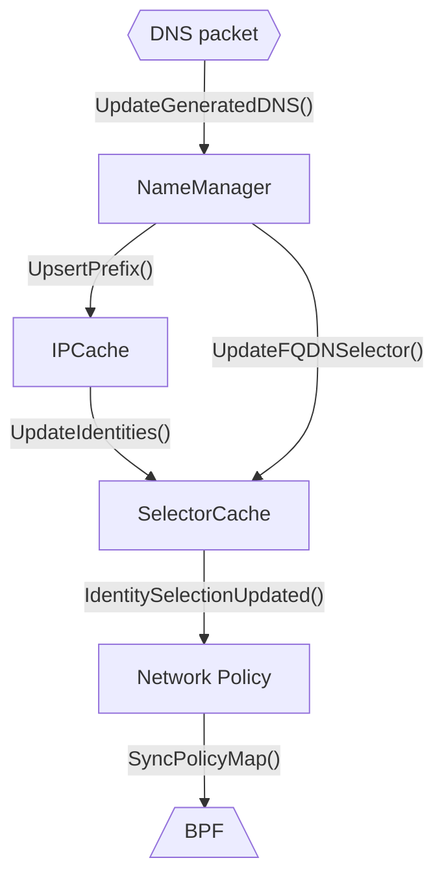

# CFP-28427: ToFQDN policy performance improvements

**SIG: SIG-Policy**

**Begin Design Discussion:** 2024-02-12

**Cilium Release:** 1.16

**Authors:** Casey Callendrello <cdc@isovalent.com>

## Summary

Improve FQDN-based policy performance by changing how identities and labels are managed. Rather than propagating FQDN -> IP mappings to selectors, label IPs by the FQDN selector(s) that return them.

e.g. `18.192.231.252 -> (dns:*.cilium.io)`

## Motivation

ToFQDN scaling limitations are a source of pain for many, many Cilium end users. When a domain name returns a large and constantly varying set of IPs (e.g. S3), this causes significant identity churn and increased memory usage.

At the time of writing, Cilium allocates a unique security identity for each IP address, even if all of those addresses are selected by a single selector. All these identities then need to be pushed in to every relevant PolicyMap as well as Envoy -- all before returning the DNS response to the waiting endpoint.

## Goals

- Reduce resource consumption by large ToFQDN policies
- Improve response latency for proxied DNS requests

----


## Background

First, let us understand the existing components at work for ToFQDN policies.

### Lexicon

**Label:** A key-value pair, optionally tagged with a source. For example, `k8s:app:database` is equivalent to the Pod label `app=database`
**Identity:** A unique set of labels. Every identity has a numeric identifier.
**Selector:** A policy entity that selects identities. 
**Label Selector:** A selector that references by label key and/or value.
**CIDR Selector:** A selector that references by CIDR. CIDR selectors are converted to a special form of label selectors.
**ToFQDN Selector:** A selector that dynamically selects based on the result of intercepted DNS requests and responses.

### CIDR labels

The BPF policy engine relies on identities -- it does not understand CIDRs or IPs directly. So, special CIDR labels are used, and special _local identities_ are allocated on-demand to represent these external IP blocks.

The IPCache aggregates multiple sources of labels for external CIDRs. As necessary, it will generate the complete set of labels and allocate a numerical identity.

Consider a ToCIDR block that selects `192.0.2.0/24`. The policy subsystem will upsert the prefix-label mapping `192.0.2.0/24 (cidr:192.0.2.0/24, cidr:192.0.2.0/23, cidr:192.0.0.0/22, ..., cidr:0.0.0.0/0)`. The IPCache will allocate a local identity (e.g. 16777216) for this set labels. It will also convert the ToCIDR selector to a label selector, selecting the identical CIDR label. The SelectorCache will then select this numeric identity when generating the policy maps.

If another ToCIDR block selects `192.0.2.128/25`, a similar preifx-label mapping will be created `192.0.2.128/25 -> cidr:192.0.2.128/25, cidr:192.0.2.0/24, ...`. Likewise, a new identity will be allocated for this unique set of labels. The SelectorCache will be updated, and the label `cidr:192.0.2.0/24` will **now match two identities**.

### Components & Flow


```mermaid
graph TD;
sc[SelectorCache]
pol[Network Policy]
bpf[/BPF\]
ipc[IPCache]
nm[NameManager]
dnsp{{DNS packet}}

dnsp-- UpdateGeneratedDNS() -->nm
sc-- IdentitySelectionUpdated() -->pol
nm-- UpsertPrefix() -->ipc
ipc-- UpdateIdentities() -->sc
nm-- UpdateFQDNSelector() -->sc
pol-- SyncPolicyMap() -->bpf
```

#### The SelectorCache

The SelectorCache maintains a list of all "active" selectors for policies. If, for example, there is a network policy that grants access to label `team: database`, this selector will "live" in the SelectorCache. The policy will ask the SelectorCache for all identities that match this selector. Furthermore, the policy will "register" for incremental updates to this selector.

#### NameManager

The NameManager maintains two key lists:
1. The mapping from DNS names to IPs
2. The set of active FQDN selectors

As DNS responses come in, the NameManager determines if the name is selected by any ToFQDN policies. If so, it inserts the IP in to the ipcache (if needed) and updates the relevant ToFQDN selectors.

#### IPCache

The IPCache stores the mapping from prefix to labels. It also allocates identities for labels, and manages the mapping from prefix -> numeric identity.

### Incremental updates

1. An identity is allocated for the IP:
  a. `ipc.UpsertPrefixes()` is called, associating the complete set of CIDR labels with this IP address.
  b. The IPCache determines the IP's full set of labels, allocates an identity, and informs the SelectorCache of this new IP
2. The selector is updated:
  a. The NameManager calls `sc.UpdateFQDNSelector()`, updating the set of selected IPs for this given FQDNSelector
  b. The SelectorCache determines the complete set of identities selected
  c. Any differences are pushed to network policies
3. Endpoints are updated
  Any pending incremental updates are batched up and applied to the endpoints' BPF PolicyMap. If needed, Envoy is also updated
 
Only at this point can the DNS packet be returned to the waiting endpoint.

## Performance bottlenecks

### Many identities

Some DNS names (e.g S3) will return many different IP addresses. S3 even has a TTL of 5 seconds, so the set of IPs will quickly be very broad. This causes a large number of identities to be allocated -- one per IP. These identities then need to plumbed through to all endpoints.

### Label sizes

CIDR labels, especially IPv6 labels, are large. For example, the full set of labels for the CIDR `2001:db8:cafe::cab:4:b0b:0/112` is 2KiB. Every extra-cluster identity always has the full set of CIDR identities calculated for it.

----

## Proposal

This CFP proposes 3 key changes. Together, they preserve correctness while radically restructuring how prefixes are selected.

1: Labels on prefixes propagate downwards. That is to say, if prefix `192.0.0.0/22` has label `foo:bar`, then prefix `192.0.2.0/24` also has label `foo:bar`, unless overridden. The IPCache aggregates labels accordingly.
2: Only selected CIDR labels are inserted in to the ipcache. If a selector references CIDR `192.0.2.0/24`, only the prefix -> label mapping `192.0.2.0/24 -> cidr:192.0.2.0/24` is added to the IPCache.
3: When the NameManager learns about a new relevant `name -> IP` pair, it upserts the label `IP -> (dns:selector)` It **does not** create any CIDR labels.


### 1: CIDR Label down-propagation

Currently, prefixes in the ipcache are independent. Instead, labels should flow downwards from prefixes. For example, consider an IPCache with two prefixes: 

```
192.0.2.0/24 -> k8s:foo:bar, cidr:192.0.2.0/24
192.0.2.2/32 -> cidr:192.0.2.2/32, reserved:kube-apiserver
```

Then, the complete set of labels for `192.0.2.2/32` would be `k8s:foo:bar, cidr:192.0.2.0/24, cidr:192.0.2.2/32, reserved:kube-apiserver`.

This is a cornerstone for implementing another feature, non-k8s label sources. It is also required for correctness within the context of this proposal, especially when ToFQDN and CIDR selectors overlap.

#### Lifecycle

With label down-propagation, it is important that updates are propagated accordingly. When a prefix P is updated or deleted, then updates must be also triggered for all prefixes contained in P.

This update may be calculated if we use a bitwise LPM trie. Alternatively, scanning the entire ipcache to determine affected prefixes may be more efficient.


### 2: Only generate selected CIDR labels

Currently, every selected prefix gets the full set of CIDR labels. In other words, the prefix `192.168.0.42/32` will have 32 labels generated. However, this is not truly necessary. The key insight is that the ipcache already knows about all selected CIDRs, since selectors are required to upsert relevant CIDRs with the IPCache before referencing them.

So, if selector A selects `cidr:192.168.0.0/24`, there will be a single identity, `id1 -> (cidr:192.168.0.0/24)`. If selector B selects `cidr:192.168.0.0/25`, then there will be two identities: `id1-> (cidr:192.168.0.0/24)` and `id2 -> (cidr:192.168.0.0/25, cidr:192.168.0.0/24)`. Selector A will now select _id1_ and _id2_, and selector B will select just _id2_.

By allocating CIDR labels on-demand, this significantly reduces the memory cost per prefix in the IPCache. However, this requires label down-propagation to preserve correctness in the case of overlapping selectors.

### 3: FQDN selector labels

Currently, FQDN selectors (as stored in the SelectorCache) understand the set of IPs that they select. They determine the relevant set of identities by generating the equivalent `cidr:x.x.x.x/32` labels and looking for matching identities.

Presently, when a new `(name: IP)` mapping is learned, the NameManager inserts that IP in the IPCache and updates the selectors' set of desired labels to include that IP's CIDR label.

Instead, the NameManager should label IPs with the selector(s) that match that name. So, if a DNS answer `www.cilium.io: 52.58.254.253, 18.192.231.252` is seen, and there is a ToFQDN policy that allows `*.cilium.io`, two new entries are inserted in to the IPCache metadata layer:

```
18.192.231.252/32 -> (dns:*.cilium.io)
52.58.254.253/32 -> (dns:*.cilium.io)
```

If no identity exists for the label set `(dns:*.cilium.io)`, it would be allocated and the selector would be updated. Then, the updated mapping from prefix to identity would be inserted for both IPs in the IPCache.

This optimizes a common case in the FQDN response path: learning a new IP. If the new IP does not require an identity allocation, then a only a single BPF write to the IP -> identity cache is needed -- neither the PolicyMaps nor Envoy need to be updated.

## Impacts / Key Questions

### Question: Are overlapping FQDN selectors handled correctly?

Consider two selectors: one selects `*.cilium.io`, another selects `www.cilium.io`. Imagine DNS responses have been seen for `www.cilium.io: IP1, IP2` and `dev.cilium.io: IP2, IP3`.

The IPCache label map would have:

```
IP1: (dns:*.cilium.io, dns:www.cilium.io)
IP2: (dns:*.cilium.io, dns:www.cilium.io)
IP3: (dns:*.cilium.io)
```

There would, then, be two identities allocated:
```
ID1: (dns:*.cilium.io, dns:www.cilium.io)
ID2: (dns:*.cilium.io)
```

and the IP -> ID mapping would be
```
IP1: ID1
IP2: ID1
IP3: ID2
```

The selector `*.cilium.io` selects `ID1, ID2`, and `www.cilium.io` selects `ID1`. Every selector derives to the correct set of IPs, thus overlapping selectors are handled correctly.


### Question: Are overlapping IPs handled correctly?

It is possible for the same IP to map to multiple names. Consider two names, `foo.com: IP1, IP2` and `bar.com: IP2, IP3`. If selector A selects `foo.com`, and selector B selects `bar.com`, the state of the IPCache should be

```
IP1: (dns:foo.com)
IP2: (dns:foo.com, dns:bar.com)
IP3: (dns:bar.com)
```

There would be 3 identities allocated for the 3 unique sets of labels, and the selectors would select these identities accordingly.

So, overlapping IPs are handled correctly.

### Question: Are overlapping ToFQDN and CIDR selectors handed correctly?

Consider a selector, `*.cilium.io`, which currently selects one IP address, `52.58.254.253`. If, separately, a ToCIDR selector selects `52.58.254.0/24`, the state of the IPCache will be

```
52.58.254.0/24: (cidr:52.58.254.0/24)
52.58.254.253/32: (dns:*.cilium.io) 
```

However, when the IP -> Identity mapping is calculated, because of label propagation, the complete set of labels for `52.58.254.253/32` is `(cidr:52.58.254.0/24, dns:*.cilium.io)`. So, the selector for `52.58.254.0/24` correctly selects both identities. Therefore, overlapping ToFQDN and CIDR selectors are handled correctly.


### Impact: Identity churn

While this proposal reduces operations for the common case (adding a new IP to an existing selector), it can increase identity churn for other cases. Identity churn is the allocation of a new identity for an existing prefix.

- Adding or deleting a selector for `0.0.0.0/0` will cause **every single prefix** to change identities.
- IPs that are selected by multiple ToFQDN selectors will churn identities unless the set of selectors is quiescent. Frequent garbage collection will also exacerbate churn.

Identity churn is not a correctness issue, as policy updates are carefully sequenced so to not drop traffic. It is, however, a general load on the system.

In general, this proposal should be a significant performance improvement. CIDR selectors are relatively static, whereas FQDN updates are highly dynamic (and have latency guarantees). But, it is a tradeoff. A cluster with dynamic, overlapping CIDR selectors may find the identity churn to be more costly than expected.

### Key question: Should all labels propagate downwards?

Currently, the only set of labels that apply to a CIDR are the `cidr:` labels, which clearly propagate downwards. There are no other label sources for non-leaf CIDRs. Were this to change, we may need to re-evaluate this decision.


### Key question: Garbage collection

TODO.

Describe
- what the name cache is
- What is stored per endpoint
- when we garbage collect
- what we garbage collect

### Key question: identity restoration on restart

Upon startup, the agent dumps the existing IP -> Identity mapping and inserts those prefixes, along with their previous identities, back in to the IPCache. The IPCache then waits for all k8s resources to sync, then performs label aggregation, identity allocation, and policy updates.

The goal is that the identity for a given IP does not change. Before this proposal, that guarantee was easy to make; since the only source of CIDR labels are the CIDR labels themselves and the `reserved:kube-apiserver` label, the simple 1:1 mapping between identity and prefix is trivial to restore.

This will not be the case once multiple IPs can map to the same identity. However, all hope is not lost. Because the state of the FQDN policy engine is also checkpointed, we should be able to reconstruct enough state so that identities are mostly stable.

The IPCache lets us request a numeric identity when upserting an IP. Since we wait for FQDN checkpoint restoration before allocating identities, the FQDN :: IP mappings should also be consistent across restarts.

### Key question: Circuit breakers?

There is currently a circuit-breaker, `--tofqdns-endpoint-max-ip-per-hostname`, which is intended to prevent names such as S3 causing identity churn. In this proposal, large names such as S3 should not allocate more than one or two identities, making this less critical.

However, this is still a security-sensitive area, since we are allocating resources based on external, untrusted packets. We will need a sane circuit-breaker to ensure we do not allocate a large number of identities based on malicious input.

The maximum number of identities allocated by ToFQDN selectors is the number of unique selector combinations seen for given IPs. The theoretical maximum is, therefore, $2^N-1$[^1]. 10 distinct selectors would be OK (1024). More than 16 selectors could *theoretically* exceed identity space.

We need a good circuit breaker for this that does not break the S3 case. 


## Future Milestones

TODO


[^1]: I somehow didn't believe this and actually calcuated $\sum_{i=0}^N {N \choose i}$ which is [very silly indeed](https://www.wolframalpha.com/input?i2d=true&i=Sum%5BX+choose+n%2C%7Bn%2C1%2CX%7D%5D).