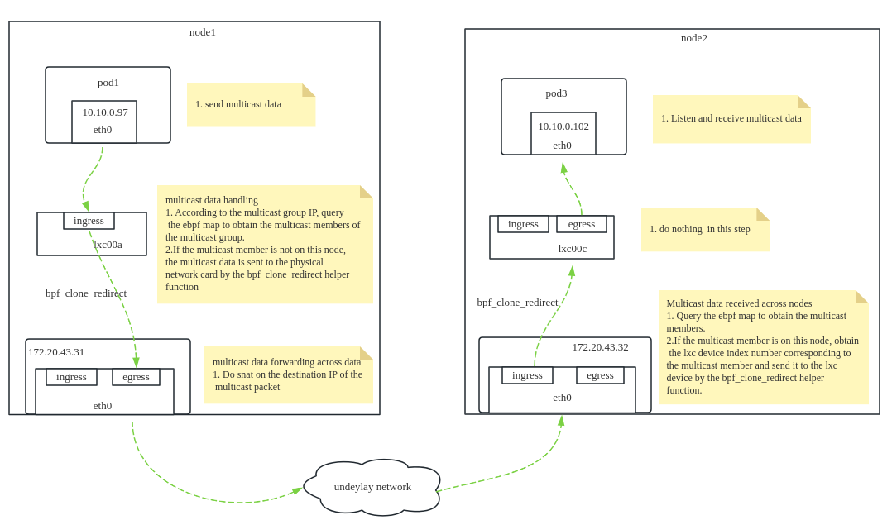
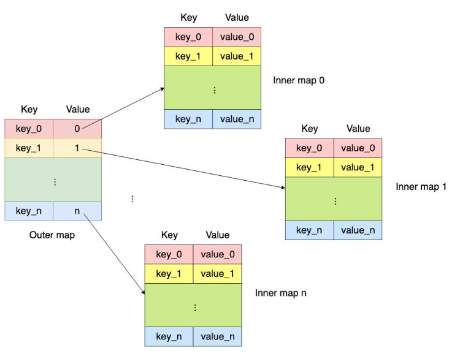

# CFP-28750: multicast support in cilium


# Meta

**SIG: SIG-Datapath**

**Sharing: Public**

**Begin Design Discussion:**

**End Design Discussion:**

**Cilium Release:** 1.16 or later

**Authors:**


# Summary

_multicast support in Cilium_


# **Motivation**

_Our use case involves distributing  data feeds to multiple consumers running in the k8s cluster, This case requires multicast support_


# **Goals**

* _Multicast function configurable_
* _Realize full-scenario forwarding of multicast data from container to container, container to host, and host to container_


# **Proposal**


## Overview

_With the development of business containerization, the technical need to provide multicast transmission in container networks has become increasingly urgent. The current mainstream container network plug-ins (such as Calico and Cilium) do not natively support multicast. Additional data transmission channels or multicast agents need to be added for forwarding, which increases maintenance complexity._

_The container network multicast transmission technology based on eBPF focuses on solving the problem of efficient multicast transmission in the container network and provides support for multiple multicast protocols. The technical solution involves using eBPF map to maintain the pod list for multicast communication, customizing the eBPF program to complete the addition and deletion of multicast members, and using eBPF auxiliary functions to implement directional data transmission and network forwarding._

_Figure 1 shows the transmission of multicast data across nodes_




_Figure 2 shows single-node multicast data transmission._


## Maintain the relationship between multicast groups and multicast members and monitor multicast events

_(1) When the multicast function is started, an eBPF map is created. An eBPF map is maintained on each k8s cluster node to maintain the relationship between the multicast group and multicast members on the k8s cluster node; at the same time, an eBPF map is created. The eBPF queue, referred to as the multicast_ops queue, is used to access events of container instances joining or leaving multicast groups on the k8s cluster node._

_(2) Listen to the eBPF queue, that is, listen to the multicast_ops queue and obtain multicast events from the queue._

_(3) If the event obtained from the multicast_ops queue is a change event for joining a multicast group, obtain the multicast group IP and multicast member IP, and determine whether the multicast group IP already exists in the map. If not, add the multicast group and multicast members. If so, just add multicast members under the corresponding multicast group. At the same time, the physical network card of the k8s cluster node is added to the corresponding multicast group in order to solve the problem that the cross-node transmission of multicast data between container instances needs to go through the node's physical network card. If the physical network card on the node that receives the multicast data sent to a certain multicast group does not join the multicast group, the multicast data will be discarded, causing multicast communication abnormalities._

_(4)If the event obtained in the multicast_ops queue is a leaving multicast group event, obtain the multicast group IP and multicast member IP, and delete the relationship between the multicast member corresponding to the map and the multicast group._


## Join and leave multicast group

_(1) When a container instance joins a multicast group, it will send a join multicast group message. At this time, the eBPF program mounted on the container virtual network card receives the multicast data from the container instance. Then write the multicast group IP, container instance IP, and multicast join event into the multicast_ops queue._

_(2) When the container instance leaves the multicast group, it will send a leaving multicast group message. At this time, the eBPF program mounted on the container virtual network card receives the multicast data from the container instance. Then write the multicast group IP, container instance IP, and multicast leave event into the multicast_ops queue._


## Multicast data transmission from container to container and container to host

_(1) The container instance serves as a multicast source to send multicast data_

_(2) After receiving the multicast data, the eBPF program mounted on the container virtual network card parses the multicast data and obtains the multicast group IP_

_(3) Query the eBPF map through the multicast group IP to determine whether the member information of the multicast group exists in the eBPF map._

_(4) If the member information of the multicast group does not exist in the eBPF map, it means that there are no multicast members joining the multicast group on the current k8s cluster node.Then the eBPF program will change the source IP of these multicast data to the IP of the node and forward it to the physical network card of the current k8s cluster node. The physical network card will forward it, and the network between k8s cluster nodes will be responsible for transmitting these multicast data._

_(5) If the member information of the multicast group exists in the eBPF map, it means that there are multicast members of the multicast group on the current k8s cluster node.Then find the multicast members under the multicast group, obtain the container virtual network cards of these multicast members, and then forward the multicast data directly to these container virtual network cards. This enables multicast data transmission from container to container on the same node._


## Multicast data transmission from host to container

_(1) The physical network card of a certain k8s cluster node receives multicast data from the outside_

_(2) After receiving the multicast data, the eBPF program mounted on the physical network card parses the multicast data and obtains the multicast group IP_

_(3) Query the eBPF map through the multicast group IP to determine whether the member information of the multicast group exists in the eBPF map._

_(4) If the member information of the multicast group does not exist in the eBPF map, it means that there are no multicast members joining the multicast group on the current k8s cluster node, and the eBPF program will not process it._

_(5) If the member information of the multicast group exists in the eBPF map, it means that there are multicast members of the multicast group on the current k8s cluster node.Then find the multicast members under the multicast group, obtain the container virtual network cards of these multicast members, and then forward the multicast data directly to these container virtual network cards.This achieves forwarding of multicast data from the k8s cluster node physical network card to the container virtual network card._

## Implementation details


### ebpf map structure design

_The key of the outer map is the multicast group IP, and the value is the fd of the inner map._

_The key and value of the inner map are both the lxc device index number of the multicast member pod._



```c
_Outer map structure: _

_struct {_

_       __uint(type, BPF_MAP_TYPE_HASH_OF_MAPS);_

_       __type(key, __u32);_

_       __type(value, int);_

_       __uint(pinning, LIBBPF_PIN_BY_NAME);_

_       __uint(max_entries, MULTICAST_MAP_MAX_SIZE);_

_       __uint(map_flags, CONDITIONAL_PREALLOC);_

_} MULTICAST_MAP __section_maps_btf;_

_Inner map structure: _

_struct {_

_       __uint(type, BPF_MAP_TYPE_HASH);_

_       __type(key, __u32);_

_       __type(value, __u32);_

_       __uint(pinning, LIBBPF_PIN_BY_NAME);_

_       __uint(max_entries, MULTICAST_INNER_MAP_MAX_SIZE);_

_       __uint(map_flags, CONDITIONAL_PREALLOC);_

_} MULTICAST_INNER_MAP __section_maps_btf;_
```

**ebpf queue structure design**

```c
_struct {_

_       __uint(type, BPF_MAP_TYPE_QUEUE);_

_       __type(value, struct multicast_ops);_

_       __uint(pinning, LIBBPF_PIN_BY_NAME);_

_       __uint(max_entries, MULTICAST_OPS_MAP_MAX_SIZE);_

_       __uint(map_flags, 0);_

_} MULTICAST_OPS_MAP __section_maps_btf;_

_struct multicast_ops {_

_    __u32 multicast_address;_

_    __u32 pod_ifindex;_

_    __u8 flags;_

_};_
```
