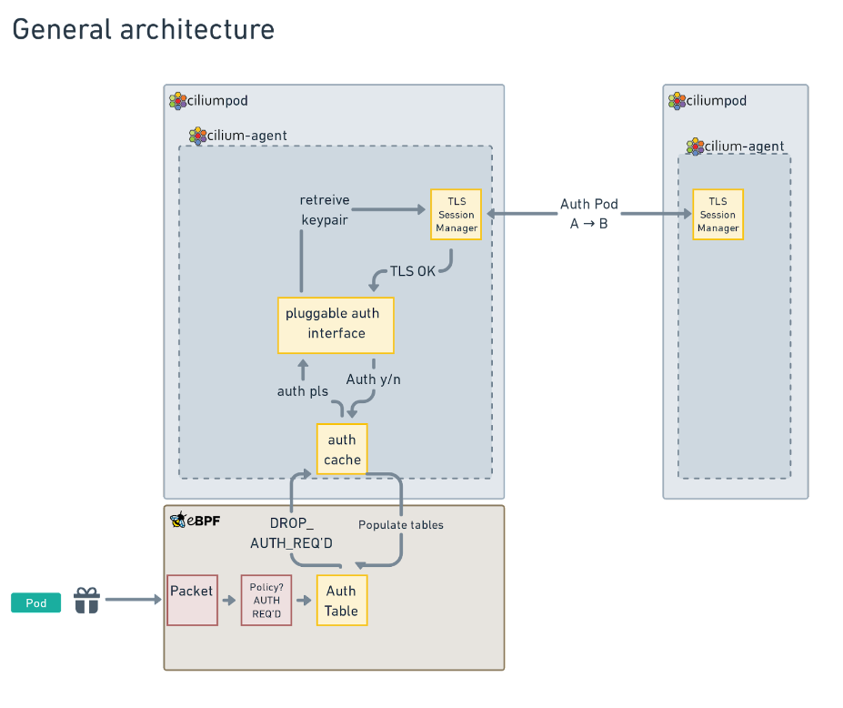
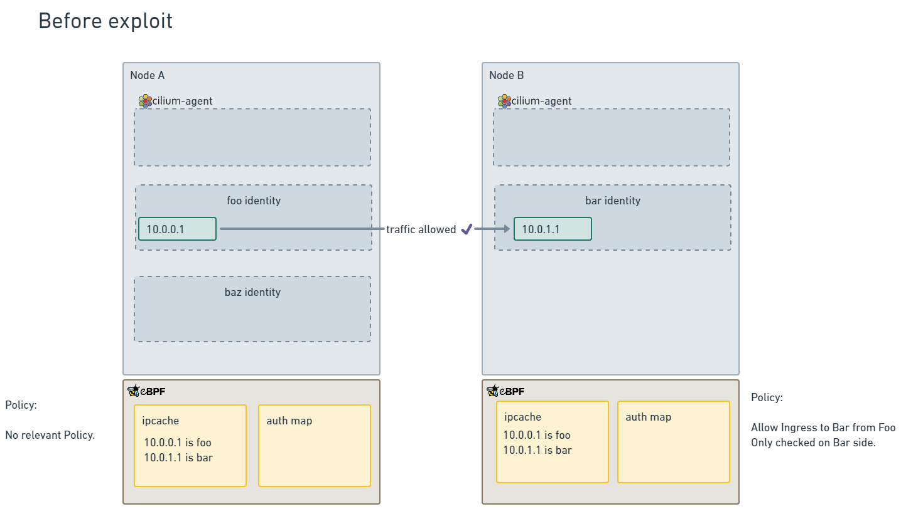
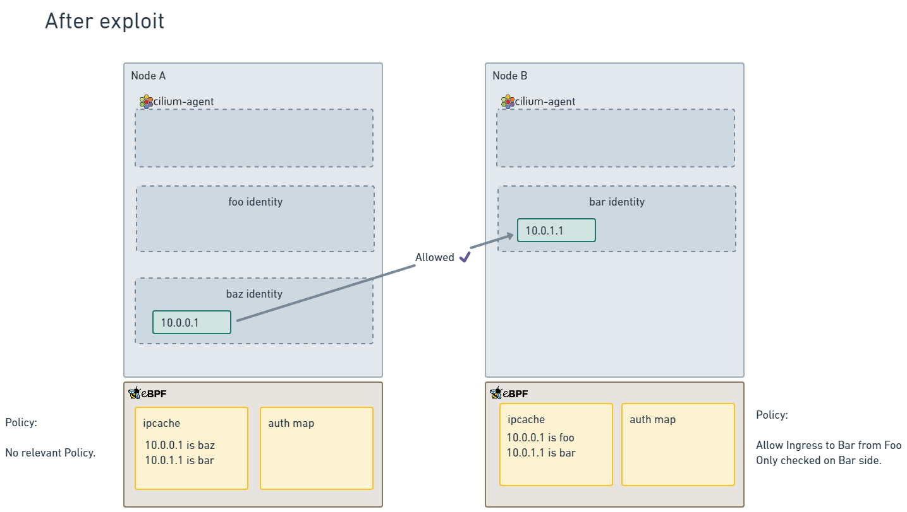
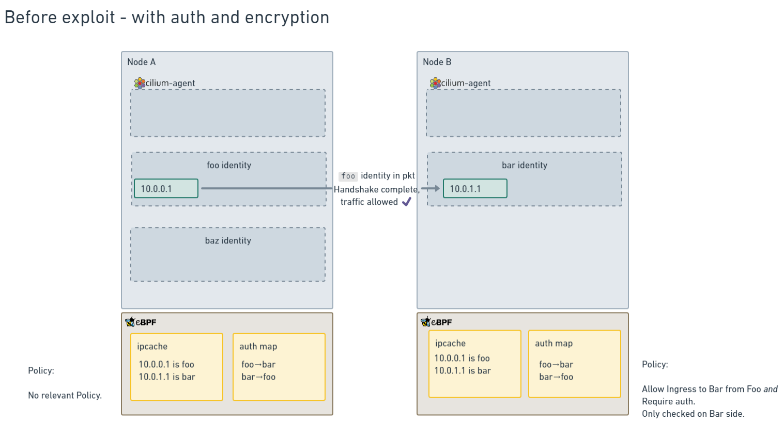
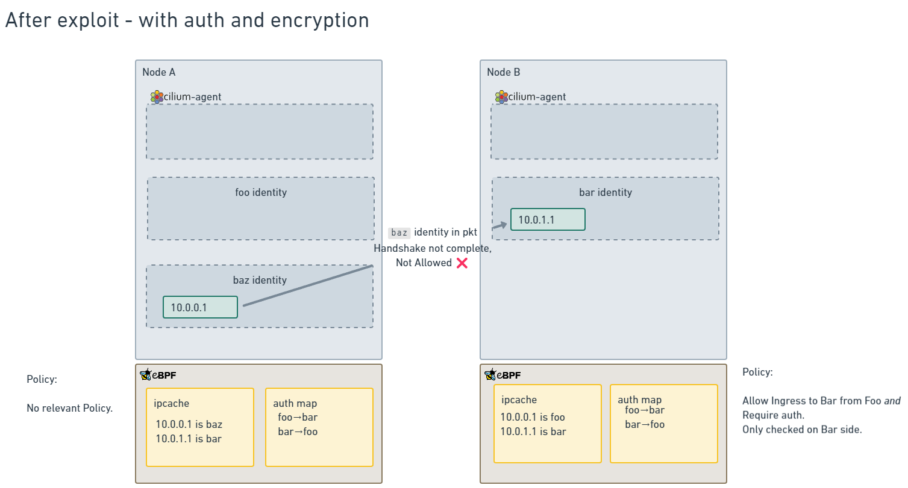
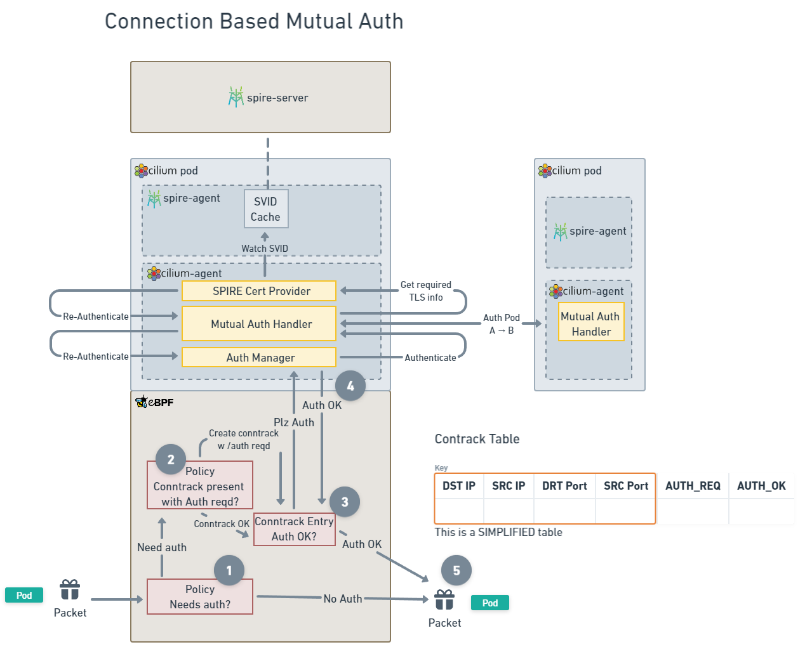

# CFP-28986: Mutual Authentication Updates: IP Cache checksums and Connection-based Mutual Authentication

**SIG: SIG-ServiceMesh**

**Begin Design Discussion:** 2024-02-07

**Cilium Release:** Targeted for v1.16

**Authors:** Nick Young <nick@isovalent.com>, Maartje Eyskens <maartje@isovalent.com>

## Summary

Update Mutual Auth to include the requirement for some form of encapsulation, with Wireguard encryption strongly recommended as the most secure option.

Add a new mutual authentication mode to Cilium that performs mutual authentication on a per-connection basis rather than the existing per-identity basis.

## Background

Cilium's current mutual authentication support is designed with the goal of being faster and more flexible than other implementations.

It does this by splitting mutual authentication and encryption (the two fundamentals of mutual TLS) into two separate channels.

From the CFP(link):
> Firstly, a control plane connection between cilium-agent instances on each node provides authentication of connections between pods on the nodes.
> Secondly, the existing Cilium encryption support using WireGuard or IPsec provides an encrypted dataplane for the connections.

### General architecture
The following is a diagram of the general architecture of the current solution, that uses an auth table to cache the results of mutual authentication handshakes.

The most important thing to call out for this document is in the eBPF section, where the state of authentication is stored in the Auth Table for use by the eBPF code.

This table is used by eBPF code but maintained by both the eBPF code paths and the userspace code paths.

The flow for a packet is that, when the packet passes through Cilium's policy engine, if it matches a NetworkPolicy that requests authentication, and no authentication is stored in the table, then a TLS connection between agents using delegated SPIFFE identities is triggered (this is the `TLS Session Manager` box in the diagram).

Once this handshake succeeds, the userspace cilium-agent adds the details into the Auth Table, and any future packets will be allowed to proceed.

### Cilium Identities

To understand the details of how the Auth table stores authentication information, it's important to understand how Cilium's Policy engine assigns identity to network traffic.

Each Pod has a CiliumEndpoint, but also each set of labels on a Pod is associated with a CiliumIdentity, which marries the pods together into a workload. This identity maps a set of labels to a integer identifier.

When Cilium makes Policy decisions, it does this by assigning an identity to the source and destination IP addresses, then using the identity to make policy decisions.

This identity can be determined in a couple of ways for each packet:
- either included in every packet when there is encapsulation (like VXLAN) or encryption (like Wireguard), which is preferred, or
- imputed using a cache of IP (the "ipcache") to identity mappings that's held on each agent, and kept up to date by watching the Kubernetes apiserver.

Many Cilium installs use either VXLAN (it's the default networking mode), or Wireguard, which ensure that the Cilium identity is present in every packet.

However, for many different reasons, other Cilium installs need not to use any encapsulation. This is called Direct Routing or Native Routing in Cilium's documentation, and when it's involved, the ipcache is used as the main method of imputing identity to network traffic. This will be important later.

### Auth table and its implications

The Auth table stores the following details:
- The source identity
- The destination identity
- The destination node (so the agent knows where to do an authentication to)
- An expiry time (when the auth table entry will be considered expired and a new authentication triggered. This is set to the closest expiry time for any of the certificates involved in a particular authentication handshake).

Doing things in this way allows some big advantages:
- because the enforcement is done per-identity, which is associated with IP addresses rather than higher-layer protocols, _all IP traffic_ can be protected with mutual auth, including UDP traffic, which is much harder to do with traditional mutual auth methods.
- Similarly, because the mutual auth is performed per identity, only one TLS handshake is required for each identity-identity-node tuple. So a pod can open as many TCP connections as it likes without having to pay a TLS handshake overhead for each one. This can result in a significant amount of time saved, and speed up connections by a large amount for workloads that don't make good use of shared connection mechanisms like HTTP/2.
- Because the auth mechanism is handled out-of-band of the actual traffic, then key rotations can be performed by the userspace agent before the old keypair expires, and update the auth table with the new expiry time. This means that _key rotation is completely invisible_, connections are _not_ interrupted by the key rotation process.
- Lastly, if users wish to, they can use mutual auth in the absence of encryption, and avoid paying the latency cost of encrypting every packet. Obviously, this has a significant security tradeoff in that traffic is then sent in clear text, but for very latency-sensitive workloads, it _may_ be used.

## Motivation

All of the above advantages are why the mutual authentication feature was built this way to begin with, but it's become apparent that there are a set of circumstances where the current design will fail when attacked.

Those circumstances are:
- The cluster must be using native routing or some other method that does not encapsulate the packets (where the encapsulation carries the CiliumIdentity, as in VXLAN and Wireguard)
- _Some_ nodes in the cluster must lose connection to the apiserver somehow. In one demonstration, this was performed using iptables rules on a host, which would require elevated privileges, but it's also possible, if unlikely, that this situation would arise in some other network failure scenarios.
- An attacker must be able to launch new pods on one of the nodes while the above two conditions hold.

Then, as Thomas Graf laid out [in the Cilium Slack](https://cilium.slack.com/archives/C02QKQDTVDX/p1701466203218329?thread_ts=1701466174.930209&cid=C02QKQDTVDX)

* Attacker has to identify a source / destination pod pair
* Attacker has to cut apiserver access of the destination node or otherwise delay any updates from the apiserver to that node for a prolonged time while the source node remains connected to the apiserver. The entire apiserver not being available is not enough as no pods could be deleted or scheduled (next step)
* Attacker has to be able to delete the source pod so it releases it’s IP. Otherwise attacker has to wait for the pods to scale down by the autoscaler or some other reason and has to identify IPs which have been released. All of this has to happen while the destination node remains detached from the apiserver.
* Attacker must have access to the IPAM pool (when in use) of the original source pod
* Attacker has to be able to schedule enough pods to re-use the released pod IP before anyone else does. If any pods get scheduled by other users in parallel, any other new pod may pick up the IP. All of this needs to happen while the destination node continues to remain without access to the apiserver.
* In non trivial clusters using per node PodCIDRs, attacker typically needs to be able to use a nodeSelector to avoid spreading pods on arbitrary nodes with different PodCIDRs.
* No egress policies deny policies affecting the scheduled source pod may exist
* As soon as the destination node regains apiserver access, any ongoing, incorrectly allowed packet flow gets dropped even for established connections.

However, if _all_ of those steps happen, then the cache manipulation involved will render it possible to spoof the mutual authentication process and allow unauthenticated pods to send traffic that the system will treat as though it's authenticated.

Let's walk through some diagrams of this attack.

Here we have two nodes of a Cilium cluster, meeting the above requirements.

The ipcaches are synced between the two nodes, so all the identities are correct.

Both nodes `A` and `B` agree on the IP addresses associated with the identites `foo` and `bar`.

Once the exploit has been performed, the nodes look more like this:

On Node `B`, the connection to the apiserver has been interrupted in some way, so the Cilium agent is no longer receiving updates to Cilium Endpoints, meaning that the ipcache will become out of sync.

On node `A`, enough pods have been scheduled in a new identity (the `baz` identity), to have the IP address that was previously associated with `foo` be now associated with `baz`.

However, on Node `B`, because the ipcache is out of sync, the ingress policy will allow traffic from the pod that's actually a `baz` pod, because it has incorrect information about the IP to identity mapping. This is the reason why the exploit only works in direct routing mode - because in encapsulated modes, the identity is passed in any packet and used directly, rather than relying on the ipcache.

This CFP lays out a proposal to mitigate this risk in two ways:
* Require the use of either encryption (recommended because it prevents man-in-the-middle attacks) or encapsulation (which prevents cache manipulation but not MITM). In both of these cases, the Cilium identity is included in every packet, and so the ipcache is not used to impute identity to packets.
* Add an additional mutual authentication mode that will use the connection tracking ("conntrack") table in the conntrack BPF map to store information about what _connections_ need authentication, instead of what _identity-identity-node pairings_ need authentication.

The first idea makes cache manipulation irrelevant, because the inbound packets include the security identity in a header.

However, in the existing mode, mutual authentication handshakes are only initiated when there is a change in either endpoint state (that is, a new node to node connection from a new pod), or when a certificate is rotated. So, in the event that an attacker _did_ manage to compromise mutual authentication mechanisms somehow, the window is, at maximum, the certificate rotation period, which defaults to 30 minutes.

Adding a connection-based mutual authentication mode significantly reduces the timescale that an attack is exploitable for - since the mutual auth handshake is performed on each new connection, and connections _generally_ last much less that 30 minutes.

It also makes performing the exploit harder, since the full 5-tuple (source IP, source port, destination IP, destination port, protocol) must match, rather than just source and destination IP, _and_ must also migrate the actual connection from one application to another. Still possible, but orders of magnitude harder.

## Goals

* Document and enforce the new requirement to have some form of encapsulation (either encryption, VXLAN, or similar) enabled when mutual auth is enabled.
* Add support for mutual authentication on a per-connection basis in addition to the existing per-identity-pair mutual authentication.

## Non-Goals

* A mutual authentication design that works with Cilium Cluster Mesh. This is left for future work.

## Proposal

### Overview

This CFP proposes two changes: enforcing every packet contains an identity using either encryption or encapsulation and adding a per-connection mutual auth mode. These changes are relatively orthogonal and could be implemented as two separate changes.

#### Requiring encryption or encapsulation resolves cache manipulation

This assertion depends on two things that may not be clear:

- Wireguard encryption now (as of Cilium 1.15) also encapsulates packets into VXLAN as they transit the tunnel, adding a Cilium identity into the header (as in unencrypted VXLAN)
- When the datapath can determine the remote security identity from packets directly, the ipcache is _not_ used.

As part of actions taken to mitigate this attack, we added VXLAN encapsulation to Wireguard during development of Cilium 1.15.

But Cilium's eBPF code has _always_ preferenced identity information it decodes from encapsulation, and in the case that it's present, the ipcache is not used for policy decisions.

This is why the original attack required the use of direct routing - when encapsulation is in use, the attack never worked.

The more recent change to ensure that Wireguard encryption also includes encapsulation just means that when you're ensuring your traffic's wire security, you're also making the identity not spoofable by cache manipulation.

#### Diagrams of the new workflow

After adding this change, let's look at diagrams of before and after the exploit is attempted:

Before, things work as anticipated.

However, it's after that there is a difference:

Even though the ipcache entries don't match on both nodes, the identity being included in the packets means that the datapath relies on that instead of the ipcache, so any cache manipulation is irrelevant.

### Connection-based mutual authentication method

The connection-based mutual authentication method will:
* Be selectable as an entirely new authentication method (called `connection-spiffe` or similar)
* Use the conntrack table to keep track of connections
* Add two bits of marking into conntrack table entries, "Auth required", and "Auth completed"
* Use the existing TLS handshake code, but call it on a different event (new connection instead of new identity-identity-node tuple).

The existing conntrack table performs standard connection tracking functions, tracking connections based on the 5-tuple of source IP, source port, destination IP, destination port, and protocol. TCP is handled using its connection mechanisms, and UDP is handled using the same time-based pseudo connection that is standard across most networking gear.

What this change does is add two additional bits to the conntrack table:
- Auth required: This connection requires mutual authentication before proceeding. The datapath will drop all packets until the mutual auth has been completed.
- Auth completed: This connection has had a mutual authentication handshake completed. The userspace agent will perform the handshake and update the connection table entry once it is finished.

The updated mutual auth architecture diagram from above then looks like this:

The steps are:

1. Packet arrives and the policy engine determines a policy requires it to have mutual auth
2. Kernel checks if there is a conntrack entry already, and creates one if not, with the Datapath code setting the Auth Required bit to true if the new entry was created
3. If the conntrack entry has "Auth Required" but no "Auth completed", drop packet and send a signal to the userspace asking it to complete the auth handshake
4. Cilium Agent performs a mutual auth handshake between the source and destination nodes, sending the checksum as part of the handshake. When this succeeds, it updates the conntrack entry to have "Auth completed".
5. The next packet sent after the conntrack table update will be passed.

#### Advantages

* Every new connection requires a mutual auth handshake, so this has more familiar security properties to traditional mutual TLS
* Connection based nature makes it much harder to spoof traffic so that it matches an already-authenticated connection, whether by manipulating the cache or some other spoofing method.
* Can handle both TCP and UDP traffic (the latter using the standard pseudoconnection model)

#### Disadvantages

* Compared to the accelerated mode, connection-based mode introduces a per-connection handshake overhead
* The initial implementation will need to drop packets until the mutual handshake is complete, rather than holding packets

#### Detailed Design

An additional mode option will be added to Cilium, Connection-based Mutual Auth. (The existing implementation will now be referred to as "Identity-based" to ensure there's no confusion).

In this mode, rather than the status of mutual authentication being stored in a dedicated mutual auth table, the status will be tracked per-connection and stored in the (already existing) connection tracking ("conntrack") table, used by the eBPF datapath for tracking connections (both TCP connections and UDP pseudo-connections).

As outlined above, when a new connection is created, and that connection's identities are subject to a policy that requires mutual auth, the datapath will signal user space to being the mutual auth process (using the same handshake code as is used in identity-based mutual auth), and mark that conntrack entry as "requires auth" (setting the "requires auth" bit in the table to true).

The existing auth table will be used to store the same details as in identity-based mutual auth, along with the expiry time, to assist with tracking certificate expiry and which identities are relevant for mutual authentication.

Once the mutual auth handshake completes successfully, the userspace Cilium agent will update the conntrack entry to set the "auth completed" bit to true.

Until the mutual auth handshake completes, any packets that match the connection will be dropped by the eBPF datapath code.

##### Certificate rotation

When SPIRE notifies the Cilium agent that a workload's certificate has been rotated, the Cilium agent will perform a pre-emptive mutual auth handshake with all remote nodes associated with that workload certificate, and _clear_ the "auth completed" bit for associated connections if the re-auth fails.

Notably, this means that, as in identity-based mutual auth, certificate rotation is handled out of band and will not interrupt existing connections if successful.

##### Certificate expiry

Similarly to the existing approach, the datapath code will check the auth table for flows that have "authentication required" and drop packets if the expiry time has passed. This ensures that, in the event a certificate is not automatically renewed by SPIRE, the window of possible use is only the lifetime of that certificate.

##### Garbage collection for connections

Connections are already automatically garbage-collected by the datapath when they are closed, reset, or otherwise finish.

However, the connection-based mutual auth mode will also perform checks that all "authentication required" connections are still required when the agent observes the following events:

* Node and deletion
* Identity and deletion
* Pod deletion
    * Special case: if a pod deletion request on the _local_ node removes the last pod of a relevant identity, all mutual auth related information related to that identity will be removed (including connections and mutual auth table entries)

##### Re-opening partially-closed connections

There is another special case for connections in the conntrack table: it's possible for connections to end up in a half-closed state when part of the orderly connection close handshake is lost. In this case, it's also possible that a new connection that matches the existing half-closed one will be started.

The datapath already handles this case by resetting the existing connection. This resetting process will be updated to ensure that the "auth completed" bit is also reset.

### Future work

#### Reduce packet drops for initial mutual auth handshake per-connection

In the initial implementation, the initial start of a connection will be blocked by dropping packets until mutual auth is complete. Dropping the SYN packet like this is generally handled by TCP stacks with an exponential backoff, which ensures that a handshake will eventually complete once the mutual auth is finished.

A future work item is to investigate ways to minimize or remove these packet drops.
