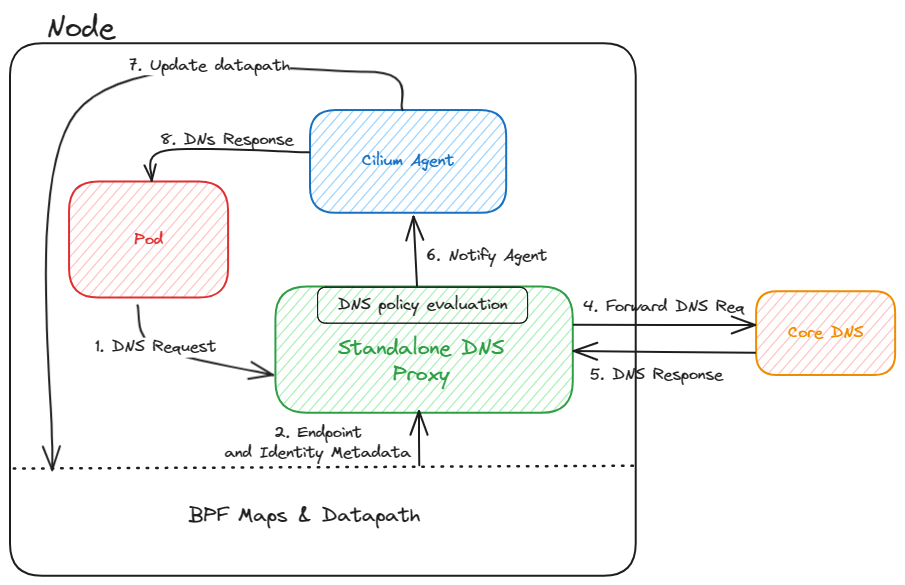

# CFP-30984: toFQDN DNS proxy HA

**SIG: SIG-POLICY**

**Begin Design Discussion:** 2024-04-08

**Cilium Release:** 1.17

**Authors:** Hemanth Malla <hemanth.malla@datadoghq.com>, Vipul Singh <singhvipul@microsoft.com>

## Summary

Cilium agent uses a proxy to intercept all DNS queries and obtain necessary information for enforcing toFQDN network policies. However, the lifecycle of this proxy is coupled with cilium agent. When an endpoint has a toFQDN network policy in place, cilium installs a redirect to capture all DNS traffic. So, when the agent is unavailable all DNS requests time out, including when DNS name to IP address mappings are already in place for this name.DNS policy unload on shutdown can be enabled on agent, but it works only when L7 policy is set to * and agent is shutdown gracefully.

This CFP introduces a standalone DNS proxy that can be run alongside cilium agent which should eliminate hard dependency for names that already have policy map entries in place.

## Motivation

Users rely on toFQDN policies to enforce network policies against traffic to remote destinations outside the cluster, typically to blob storage / other services on the internet. Rolling out cilium agent should not result in traffic being dropped. Introducing a high availablility (HA) mode will allow for adoption of toFQDN network policies in critical environments.

## Goals

* Introduce a streaming gRPC API for exchanging FQDN policy related information.
* Introduce standalone DNS proxy (SDP) that binds on the same port as built-in proxy with SO_REUSEPORT and uses the above mentioned API to notify agent of new DNS resolutions.
* Leverage the bpf maps to resolve IP address to endpoint ID and identity ID for enforcing L7 DNS policy.

## Non-Goals

* Updating new DNS <> IP mappings when agent is down is out of scope

## Proposal

### Overview



There are two parts to enforcing toFQDN network policy. L4 policy enforcement against IP adresses resolved from a FQDN and policy enforcement on DNS requests (L7 DNS policy). In order to enforce L4 policy, per endpoint policy bpf maps need to be updated. We'd like to avoid multiple processes writing entries to policy maps, so the standalone DNS proxy (SDP) needs a mechansim to notify agent of newly resolved FQDN <> IP address mappings. This CFP proposes exposing a new gRPC streaming API from cilium agent to do this. Since the connection is bi-directional, cilium agent can re-use the same connection to notify the SDP of L7 DNS policy changes.
Additionally SDP also needs to translate IP address to endpoint ID and identity ID in order to enforce policy. In this CFP, we discuss multiple options SDP could use to obtain these mappings.

### RPC Methods

Method : UpdateMappings

Request : 
```
message FQDNMapping {
    string FQDN = 1;
    repeated bytes IPS = 2;
    int32 TTL = 3;
    bytes client_ip = 4;
}
```
Response : 
```
message Result {
    bool success = 1;
}
```

Method : UpdatesDNSRules

_rpc UpdatesDNSRules(stream DNSPolicyRules) returns (Result){}_

Request : 
```
message FQDNSelector {
  string match_name = 1;
  string match_pattern = 2;
}

message DNSPolicyRule {
  uint32 port = 1;
  string selector_string = 2;
  repeated FQDNSelector port_rules= 3;
  repeated string match_labels = 4;
}

message DNSPolicyRules {
  uint64 endpoint_id = 1;
  repeated DNSPolicyRule rules = 2;
}
```
Response : 
```
message Result {
    bool success = 1;
}
```

### Tracking policy updates to SDP instances

Since SDP can be deployed out of band and users can choose to completely disable built-in proxy to run multiple instances of SDP, agent should be prepared to handle multiple instances. In order to ensure all instances  have upto date policy revisions, agent will maintain a mapping of ACKed policy revision numbers against stream ID.
Since policy revision numbers are reset when agent restarts, we need to unconditionally send policy updates to SDP on agent restart.

## Impacts / Key Questions


### Discovering endpoint metadata from SDP

In order to enforce L7 DNS policy, SDP needs to translate IP address to endpoint ID and identity ID. The simplest option is to reuse the same gRPC stream and implement another method to get the mappings from cilium agent. However, the actual source of truth are the bpf maps and SDP is expected to resolve the DNS queries even when agent is down, so we could read the information directly from the bpf maps. We prefer the bpf option since it does not rely on agent availability.

#### Option 1a: gRPC method

Get the endpoint ID and identity for a given IP address by making a gRPC call to cilium agent.

##### Pros

* Avoid interacting with low-level details. Simpler to maintain and stay upto date with any datapath changes.
* All data can be cached in-memory, in an event of agent being unavailable, SDP can lookup from in-memory cache

##### Cons

* Reliance on gRPC call in the hot-path
* Does not cache the data for endpoints that never made a DNS query.
* In an event where SDP restarts when agent's gRPC service is unavailable, all cached state is lost and SDP cannot translate IP to endpoint ID or identity.

#### Option 1b: Listen to ipcache updates via grpc

Similar to envoy, SDP can listen to ipcache updates and maintain a local cache of IP to endpoint ID mappings via grpc. This changes the way DNS proxy currently behaves i.e pull based model to push based model.

##### Pros

* Simpler to maintain and stay upto date with any new ip<>identity changes.
* All data can be cached in-memory, in an event of agent being unavailable, SDP can lookup from in-memory cache

##### Cons

* Need a mechanism for reconciling the cache in case of SDP restarts.
* SDP will be aware of all the endpoints data, which might not be needed for DNS proxy.

#### Option 2: Read from bpf maps

Read mappings from bpf maps `cilium_lxc` for endpoint ID and `cilium_ipcache` for identity.

##### Pros

* Reduced resource utilization in agent since agent doesn't need to process rpc calls in hotpath
* IP to endpoint ID or identity translation does not rely on agent availability.
* DNS can be resolved even when agent is down.

##### Cons

* Low level interactions from components external to cilium agent.

### Flag to disable built-in proxy

Adding a flag in cilium agent to disable built-in dns proxy allows for de-coupling of SDP's lifecycle from agent. The current implementation of cilium agent depends on the built-in dns proxy for restoring the endpoint for DNS rules. With the flag enabled we will need to refactor to remove that dependency. Cilium agent can retrieve the DNS rules from in memory policy representation (agent already parses this information from ep_config.json on startup).

#### Pros

* Allows for de-coupling upgrade cycles of SDP and cilium agent.
* Allows any delegated DNS proxy to be plugged in.
* Reduces the resource utilization in cilium agent.

#### Cons

* Higher latency in DNS resolution as the DNS queries are always handled by a separate process.

### Q: Restoring L7 DNS policy when agent is unavailable

In an event where SDP restarts when agent's gRPC service is unavailable, SDP can read state from `ep_config.json` and restore policy.

### Scenarios and Expected Behaviour

In an ideal scenario, both cilium agent and SDP should be interacting with each other through a biredirectional grpc stream. However, in an event where either of them restarts/upgrade/downgrade, what should be the expected behavior ?

#### Cilium Agent is down, SDP is running

* SDP should be able to proxy requests and enfore L7 DNS policy based on the existing bpf maps and in memory DNS rules. The datapath of already configured policies will work. Any new mappings will not be updated until cilium agent is back up.
* In case SDP restarts while cilium agent is down, the SDP should be able to read the rules from the filesystem and restore them. Since Cilium agent writes the rules to the filesystem lazily, SDP might be reading an outdated DNS rules. This is a limitation of the current implementation and can be improved in future.
 
#### Cilium Agent is running, SDP is down/restarting

* In case Cilium Agent has the DNS proxy running as well, then DNS queries will be served. If built-in proxy is disabled, SDP can also be configured to run with multiple replicas.
* Once SDP is starts up, it will connect to the agent and get the latest policy updates.

#### SDP Upgrade(Given Cilium Agent is Running)

* Cilium agent can keep serving the DNS queries through in built DNS proxy. In case, the inbult dns proxy is disabled, the SDP needs an upgrade path. This can be achieved using the `maxsurge` upgrade.

| Agent | Builtin DNS Proxy | SDP | Datapath | DNS |
|-------|-------------------|-----|----------|-----|
| Running | Disabled | Running | Works | Works |
| Running | Running | Down | Works  | Works |
| Running | Running | Running | Works  | Works |
| Running | Down | Down | Works | Does not works |
| Down | Down | Running | Datapath should work too if already configured. | Works for already configured policy |

### Permissions to access the BPF maps

Since SDP needs to read from the bpf maps, it needs to have the necessary permissions to access the bpf maps. Permissions needed are `CAP_SYS_ADMIN` and `CAP_BPF`. [Need to verify if the permissions are dependent on linux distribution.]

## Future Milestones

* Plumb toFQDN policy for new names when agent is unavailable
* The upgrade scenario of SDP.
