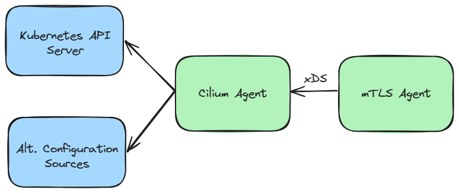

# CFP-32759: Cilium mTLS via mTLS Agent

**SIG: `@cilium/sig-agent`**

**Begin Design Discussion:** 2024-06-03

**Cilium Release:** 1.17

**Authors:** Jackie Elliott (`@jaellio`), Shreya Jayaraman (`@jshr-w`), Michael Zappa (`@MikeZappa87`)

## Summary

Provide mTLS authentication to OSS Cilium with a pluggable mTLS agent by leveraging BPF redirection and transparent proxying. The mTLS agent manages and obtains workload identity and secures cross-node traffic in an individually scalable agent from the Cilium agent.

## Motivation

Cilium currently supports its own [mTLS-based mutual authentication](https://github.com/cilium/design-cfps/blob/main/cilium/CFP-22215-mutual-auth-for-service-mesh.md) model. In this current model, [authentication happens separately from encryption](https://isovalent.com/blog/post/2022-05-03-servicemesh-security/#h-separating-authentication-handshake-and-payload). For in-band mTLS encryption, it is expected that the session keys negotiated during authentication are utilized for encryption. This proposed solution will provide in-band mTLS encryption for customers seeking secure cross node traffic. The cross-node mTLS encryption occurs transparently to the workloads enabled for encryption.  

Additionally, this behavior can be achieved without the maintenance and complexity overhead of a full-fledged service mesh. Many users consider mTLS to be one of the most fundamental features of a service mesh and would benefit from an mTLS solution that is incorporated into their existing CNI. This solution does not require users to manage a service mesh, accept the overhead of per-pod sidecar proxies, gain extensive domain knowledge of supported service mesh features, or require workload aware encryption. Instead, users can enable mTLS encryption with the help of Cilium and a per-node mTLS agent.

## Goals

* Leverage existing Cilium capabilities to provide a deeper mTLS integration into existing Kubernetes systems built on Cilium
* Define a pluggable mTLS agent model based on workload specific identities
* Provide an mTLS-based tunneling mechanism that does not conflict with existing [IPsec](https://docs.cilium.io/en/stable/security/network/encryption-ipsec/#encryption-ipsec) and [WireGuard](https://docs.cilium.io/en/stable/security/network/encryption-wireguard/) support
* Define policy enforcement API (See [Policy Enforcement](#policy-enforcement-in-cilium-mtls) in Open Questions)

## Non-Goals

* Be a service mesh or a CNI replacement
* Support mTLS agent features beyond mTLS (i.e. routing)

## Proposal

### Overview

An in band-mTLS solution with Cilium would consist of the following components:
* A user-space mTLS agent, responsible for managing certificates, establishing secure connections, and transparently proxying traffic
* An eBPF component that transparently redirects relevant traffic to the mTLS agent
* The existing Cilium agent, which provides configuration to the mTLS agent and shares relevant workload information with the eBPF component required for redirection
* Support for network policy enforcement. See [Policy Enforcement](#policy-enforcement-in-cilium-mtls) in Open Questions

The following diagram highlights the key components in the mTLS tunneling workflow


### Components

#### mTLS Agent

The mTLS agent facilitates workload identity based mTLS connections between node agents that are transparent to the workloads making and receiving requests. It runs separately from the Cilium agent as a part of its own daemonset. Whether or not the mTLS agent will be running its own separate network namespace or the root network namespace is an open question. See Should the mTLS Agent be in the root network namespace or a separate network namespace? for more discussion on the implications of the mTLS agents placement. The Datapath example assumes the mTLS agent is in its own network namespace.

To support the pluggable and interoperable mTLS agent model, the proxying node agent must adhere to the following specifications:
* Support receiving and requesting configuration via the xDS protocol. Not required to implement the entire [xds API](https://github.com/cncf/xds)
* Support transparent proxying (i.e., forwards the request without the original client or server knowing)
* Mutually validate workload identity using mTLS 
* Ability to request workload certificates
* Support identity-based policy enforcement using the certificates used for mTLS encryption
* Support the HTTP Connect protocol with specific port and header conventions for agent to agent communication (see [Protocol](#protocol) for information about HTTP Connect tunneling)

One potential implementation of the mTLS agent is the [ztunnel](https://github.com/istio/ztunnel) L4 node proxy. Ztunnel as the mTLS agent would be deployed in its own network namespace and would require the eBPF component implement an L2 redirection mechanism.

#### eBPF Component

The exact function of the transparent redirection provided by the eBPF component is dependent on the networking namespace of the mTLS agent (own network namespace or root network namespace). If mTLS agent is its own network namespace, the eBPF component will redirect relevant packets from workloads and mTLS agents via L2, MAC address and interface rewrites to the node’s mTLS agent. The kernel programs could utilize a BPF map populated by the Cilium agent to determine what traffic should be redirected and to which interface.

```c
struct local_redirect_key {
	__u64	id; // Pod IP for workloads and special well-known key value for mTLS agent
};

struct local_redirect_info {
	__u16	ifindex; // Interface index of workload or mTLS agent
	__u8	ifmac[6]; // MAC address of workload or mTLS agent
};
```

Map entries for each mTLS-enabled workload would be created for each map on their respective nodes. A map entry would also be created for the mTLS agent present in that node.

If the mTLS agent is in the root network namespace, TPROXY rules could be added directly to the root network namespace by the eBPF component. Existing transparent redirection mechanisms within Cilium (envoy and DNS transparent proxying) could be generalized to support this feature.

#### Cilium Agent

The Cilium agent is responsible for populating the local redirect BPF map with entries for enabled workloads and the mTLS agents on their respective nodes. The agent also functions as an xDS gRPC server and provides protobuf-via-xDS [Workload Configuration](#workload-configuration) to the mTLS agent. **The Cilium agent does not need to be aware of all Envoy supported protobuf definitions**.

Other controllers or control planes could be responsible for providing configuration to the mTLS agent. However, utilizing the existing Cilium agent for configuration minimizes the addition of new components and simplifies design. The Cilium agent has an existing xDS server for providing configuration to Envoy which could be generalized to support xDS requests from the mTLS agent. Alternatively, a new xDS server implementation specialized for this feature could be added.

### Datapath 

We describe an example of the datapath involved in this feature proposal. **The mTLS agent is in its own network namespace and the eBPF component is performing L2 redirection**. For brevity, we will trace a single packet on a typical cross-node communication pathway. Consider the following cluster:
* There are two nodes, Node A and Node B.
* Pod A, mTLS Agent A and Cilium Agent A are on Node A.
* Pod B, mTLS Agent B and Cilium Agent B are on Node B.

The packet is being sent from Pod A to Pod B, both of which are mTLS-enabled.


#### Step 1: From Pod A to mTLS Agent A

A request leaves Pod A, the mTLS-enabled client, going from its eth0 interface to the node network namespace via the veth device. At this veth, the egress from-container BPF program will be invoked, which will result in a tail call to a function for packet processing.

When the packet is processed, the BPF program will check the node-local BPF map for redirection. Recall, this map’s entries are of the form {podIP : (interface index, interface MAC addr)} and will contain a map entry for every mTLS-enabled pod on the node. Since Pod A is mTLS-enabled, its IP will be present as a key. This indicates that we should look up the mTLS Agent in the map using its special well-known key. Indexing via a well-known key allows the BPF program to be unaware of the IP address of the mTLS Agent. The packet’s destination MAC address is then rewritten to mTLS Agent A’s MAC address, and the packet is redirected to the appropriate network interface.


The packet will reach the mTLS agent’s pod network namespace via a veth pair.. In the mTLS agent’s network namespace of this POC, iptables TPROXY rules have been added to the mangle table’s PREROUTING chain. A [TPROXY](https://www.kernel.org/doc/html/latest/networking/tproxy.html) rule here will deliver the packet to the destination address 127.0.0.1:15001 and mark the packet. The marked packet will use a special routing table, which contains a rule that will route it to the local loopback device. The packet will thereby reach the process listening on the mTLS agent at port 15001. 

The socket listening on the mTLS agent has the IP_TRANSPARENT option set, which allows it to bind to a non-local IP address. Note, importantly, that the use of TPROXY rules and IP transparent socket ensures that the destination IP and port are preserved and can be recovered by use of the SO_ORIGINAL_DST option.


#### Step 2: From mTLS Agent A to mTLS Agent B

mTLS Agent A rewrites the destination port of the packet to the well-known port 15008 on the destination mTLS Agent B. The original destination port will be preserved in the request’s header. mTLS Agent A will establish a connection via an [HTTP CONNECT](https://httpwg.org/specs/rfc7540.html#CONNECT) tunnel over mTLS with the mTLS Agent on the same node as the destination pod after establishing a TCP connection with pod A. The packet received is then sent, through the HTTP tunnel, to the host networking stack. From here, the tunneled packet will be routed through node A’s eth0 towards node B. At node B’s eth0, an ingress-to-node BPF program will be invoked, which eventually tail calls the function that implements ingress network policies. All packets with a destination port of 15008 will be considered for redirection.

When such a packet is seen, we check node B’s BPF map for the destination pod’s IP. As Pod B is mTLS-enabled, its IP will be a key in the map. We then look up mTLS Agent B by the well-known key, and again, rewrite the packet’s destination MAC address to that of mTLS Agent B and redirect it to the appropriate network interface.

When the packet reaches mTLS Agent B’s pod network namespace, TPROXY rules in the mTLS agent network namespace will match the packet based on its destination port 15008 and redirect it to 127.0.0.1:15008 via the local loopback device. The packet will reach the process listening on the mTLS Agent at port 15008.


#### Step 3: From mTLS Agent B to Pod B

When the packet reaches mTLS Agent B, we are able to read the request’s header and get the original destination port. If not already established, a new TCP session is established with Pod B at the original destination port. The packet is then routed from mTLS Agent B to Pod B using the standard routing rules of the cluster.


## Requirements

The targeted Cilium release for an MVP of mTLS via transparent proxying is v1.17. 

#### MVP Components
1. Transparent Redirection
1. Cilium xDS Server 
1. mTLS via Transparent Proxy

### MVP Scope

Users can enable Cilium mTLS per workload. All traffic leaving a node from an mTLS-enabled source destined for an mTLS-enabled destination on a different node will be sent over mTLS.

This proposal is scoped to the following traffic configurations:
* Traffic between workloads on the same node will not be proxied (and therefore not be encrypted)
* Cross-node traffic on a single cluster is tunneled over mTLS
* Node egress traffic to non-mTLS-enabled destinations is not proxied

Out of scope configurations (design should be extensible to support these configuration, but they are out of scope for this proposal):
* Multi-cluster traffic

### Enablement API

For an MVP, the mTLS agent functionality will be enabled in Cilium via an environment variable in the cilium configuration - _mtlsAgent: enable_. The Cilium agent will identify the mTLS agent via a pod label - _cilium.io/redir-type=proxy_. Workloads are enabled for redirection and identified by the Cilium agent with the following label - _cilium.io/redir-type=workload_. For the MVP, the user will apply the labels per workload. A future goal is to support enabling workloads by namespace with support for exclusions. The Cilium agent will use these labels to identify which pods should be added to the BPF redirection map and to validate requests for workload configuration.

### Installation

The mTLS agent will be installed and managed separately from Cilium. The order of installation for the mTLS agent and Cilium is not significant. Cilium must be installed or configured with the mTLS agent functionality enabled. The mTLS agent will be deployed separately. Once the mTLS agent and cilium are configured for cilium mTLS, all existing workloads with existing _cilium.io/redir-type=workload_ labels will be enabled for redirection.

### Workload Configuration

The mTLS agent requires enabled workload identity configuration to obtain workload certificates and provide a mapping of identity to certificate for lookup when establishing mTLS. The Cilium Agent is responsible for obtaining and providing the  workload configuration to the mTLS agent via proto-over-xds transport. 

To support this functionality, the Cilium agent only needs to implement a minimal part of the xDS API. Instead of building on top of existing xDS APIs, a custom API could be implemented on top of the xDS protocol. This could follow the pattern that Istio's ztunnel project uses for the custom [Workload Discovery Service](https://github.com/istio/ztunnel/blob/db0a74212c42c66b611a71a9613afb501074e257/proto/workload.proto). Supporting a custom API or utilizing Istio’s existing custom WDS would provide Cilium with a simpler and more flexible API compared with standard xDS API. An example configuration could look like the following:

```markdown
address: 1.2.3.4
identity: spiffe://some/identity
protocol: HTTP_TUNNEL
```

Alternatively, leveraging the standard set of xDS APIs would make this component usable by a larger set of control planes. 

The means by which the Cilium Agent obtains the workload information is irrelevant from the perspective of the mTLS agent.



To handle performance concerns related to configuration updates, an implementation similar to [Delta xDS](https://www.youtube.com/embed/LOm1ptEWx_Y?autoplay=1&enablejsapi=1&origin=https://www.bing.com&rel=0&mute=0) could be supported by the Cilium Agent. With Delta xDS, the mTLS agent would receive only the updated configuration when requesting configuration rather than receive configuration for all workloads. Similarly, the Cilium agent could primarily provide configuration to the mTLS agents via a push-based mechanism in response to enabled pod updates. 

### Protocol

Regardless of implementation, all mTLS agents will present certificates based on the workload identities involved in the request. See [Cilium mTLS vs IP Sec vs Wireguard](#cilium-mtls-vs-ipsec-vs-wireguard) for more details on the significance of this functionality. Additionally, all mTLS agents must support [HTTP Connect](https://httpwg.org/specs/rfc7540.html#CONNECT) tunneling over mTLS with a well defined port (15008). The target destination address (the original destination IP and port) are preserved in the well known :authority header.

For simplicity and compatibility reasons, the initial versions of ztunnel as the mTLS agent will exclusively use HTTP/1.1 and HTTP 2 CONNECT, carrying only TCP traffic. A subset of the following protocols are under consideration for future support:

* Tunnel TCP over HTTP/1.1, HTTP 2, and HTTP 3 CONNECT
    * Protocol version can be determined based on performance measurements and compatibility
* Tunnel UDP over HTTP 3 [CONNECT-UDP](https://datatracker.ietf.org/doc/html/rfc9298)
    * Note: this retains the unreliable transport via QUIC DATAGRAM
* Tunnel IP over HTTP 3 [CONNECT-IP](https://datatracker.ietf.org/doc/rfc9484/)
    * This is intended for IP traffic that isn’t TCP or UDP, such as ICMP or SCTP
    * Note: this retains the unreliable transport via QUIC DATAGRAM
* TLS over TCP, without a tunnel
    * This would be used only for compatibility with external endpoints that do not support CONNECT

### Identity 

An mTLS agent should implement a generic interface for certificate provisioning, and start with two integration APIs:
* The [SPIFFE DelegateIdentity API](https://spiffe.io/docs/latest/deploying/spire_agent/#delegated-identity-api), used by SPIRE, and the current approach for [Cilium Mutual Auth](https://docs.cilium.io/en/latest/network/servicemesh/mutual-authentication/mutual-authentication/)
* The Kubernetes [CSR](https://kubernetes.io/docs/reference/access-authn-authz/certificate-signing-requests/) API

An mTLS agent should support the following Identity schema 
* `spiffe://DOMAIN/identity/IDENTITY`, following the [Cilium identity scheme](https://docs.cilium.io/en/latest/network/servicemesh/mutual-authentication/mutual-authentication-example/#verify-spiffe-identities)
* `spiffe://DOMAIN/ns/NAMESPACE/sa/SERVICEACCOUNT`, following the Istio identity scheme

### Certificate Management

The mTLS agent will require a certificate per workload identity to establish mTLS and provide identity-based policy enforcement. The exact mechanism by which the mTLS agent obtains and manages certificates is implementation specific. However, there are several shared components and considerations that will be common amongst all interfaces. The mTLS agent will manage the workload certificates, provide the trust bundles, and implement a mechanism to validate peer certificates.

The current proof of concept relies on a pod IP to workload identity mapping for certificate lookup.

## Background

### Cilium Mutual Authentication Efforts

Cilium Mutual Authentication is a beta Cilium feature that provides workload authentication via an authentication table in BPF. Authentication requirements are configurable via the CiliumNetworkPolicy custom resource.

* [Mutual Authentication (Beta) — Cilium 1.16.0-dev documentation](https://docs.cilium.io/en/latest/network/servicemesh/mutual-authentication/mutual-authentication/)
* [design-cfps/cilium/CFP-22215-mutual-auth-for-service-mesh.md at main · cilium/design-cfps (github.com)](https://github.com/cilium/design-cfps/blob/main/cilium/CFP-22215-mutual-auth-for-service-mesh.md)
* [Next-Generation Mutual Authentication (mTLS) with Cilium Service Mesh - Isovalent](https://isovalent.com/blog/post/2022-05-03-servicemesh-security/)

### Cilium xDS Efforts

There are currently open CFPs shared with the Cilium community to add xDS as an adaptor. These proposals discuss topics relevant to this CFP, namely the benefit of supporting the xDS transport protocol. However, these proposals largely focus on the broader implications of allowing Cilium configuration via xDS. This proposal focuses on adding an xDS grpc server implementation or modifying the existing implementation that provides configuration details to the mTLS agent. This proposal does not pertain to expanding the configurability of cilium via xDS as a client. 

* [Adding xDS Adapter CFP by robscott · Pull Request #14 · cilium/design-cfps (github.com)](https://github.com/cilium/design-cfps/pull/14)
* [[Cilium OSS] xDS Adapter for Cilium - Google Docs](https://docs.google.com/document/d/1U4pO_dTaHERKOtrneNA8njW19HSVbq3sBM3x8an4878/edit#heading=h.13c9b9gop8y7)
* [CFP: Consider using xDS for state synchronization in Cilium · Issue #30283 · cilium/cilium (github.com)](https://github.com/cilium/cilium/issues/30283)

## Impacts / Key Questions

### Why use xDS API for providing workload configuration?

The Cilium already implements an xDS server to provide configuration to an Envoy proxy for HTTP and other L7 policy enforcement. This functionality could be generalized or replicated for an xDS server for the mTLS agent. Additionally, the xDS protocol is well established, dynamic, and standardized. There is ongoing work noted above to expand Cilium and xDS integration for Cilium configurability.

### Cilium mTLS vs IPSec vs WireGuard

Currently, Cilium’s IPSec Transparent Encryption [does not work when kube-proxy replacement is enabled, and is therefore mutually exclusive with features that require kube-proxy replacement](https://docs.cilium.io/en/latest/security/network/encryption-ipsec/). The Cilium mTLS POC works with kube-proxy replacement enabled and therefore is not subject to this limitation. Additionally, WireGuard is not FIPs compliant.

### Policy Enforcement in Cilium mTLS

* What policy enforcement APIs should be supported?
* Should policy for Cilium mTLS be configurable with the CiliumNetworkPolicy? 
* Is policy enforcement executed by the bpf code or the mTLS agent? What are the pros and cons to each? 
* Will this be an extension to the eBPF Network Policies component to support policies using the exchanged certificates?

### Should the mTLS Agent be in the root network namespace or a separate network namespace?

The mTLS agent could operate in the root network namespace or in its own network namespace as explored in the datapath section. The location of the mTLS agent impacts the redirection mechanism to be implemented by the Cilium bpf programs.

If the mTLS agent resided in the root networking namespace, TPROXY rules for transparent redirection would be added to the root network namespace. This functionality is similar to Cilium’s existing transparent redirection mechanisms for its DNS proxy and Envoy proxy which require the proxy to be in the root network namespace. When filtering traffic for redirection to the DNS proxy, Cilium inspects the protocol type and redirects if the protocol is DNS. For Envoy proxy redirection, Cilium bpf programs configure TPROXY rules that correspond to the Envoy filters created in response to a CiliumNetworkPolicy. We could refactor the existing redirection functionality and generalize it for all use cases. Individual mechanisms for specifying which traffic should be filtered would need to be supported. The downsides of having the mTLS agent in the root network namespace are the potential for unintended TPROXY and existing IP table rule conflicts, the additional work required to support transparent redirection to generic proxy, and the proxy refactoring required to support redirection in the root network namespace.

If the mTLS agent resided in a separate network namespace, TPROXY rules would be added to that namespace and redirection via the BPF would be configured with MAC and interface index rewrites. Having the mTLS agent in its own namespace would avoid any potential IP table conflict and crowding in the root network namespace and a mTLS agent proxy implementation already exists that supports the required functionality. However, as a result of not being in the root namespace, this implementation couldn’t leverage the existing Cilium transparent redirection mechanisms and would have to utilize new L2 redirection. 

### Service VIP Visibility

In the current design, the client mTLS agent sees only the pod IP for the destination service and not the original Kubernetes Service VIP. Preserving the Service VIP could be helpful for a variety of reasons:

* Scalability and Security - If the service VIP was accessible to the mTLS agent, the agent could utilize a service to workload mapping to verify if a workload specified in the provided certificate is authorized to represent that service. 
* Flexibility - The mTLS agent could enforce network policies that are dependent on destination service VIP.

A generic mechanism could be added to this design which allows for passing arbitrary fixed size metadata (such as the Service VIP) between the kernel and user-space enabling the mTLS agent to provide service based capabilities in addition to mTLS.
