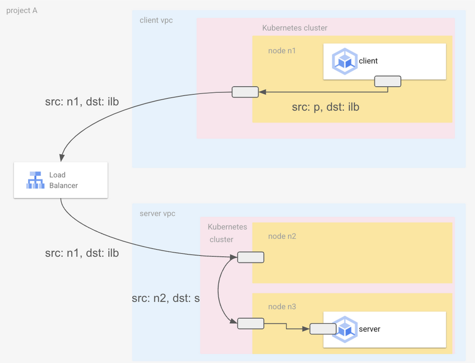
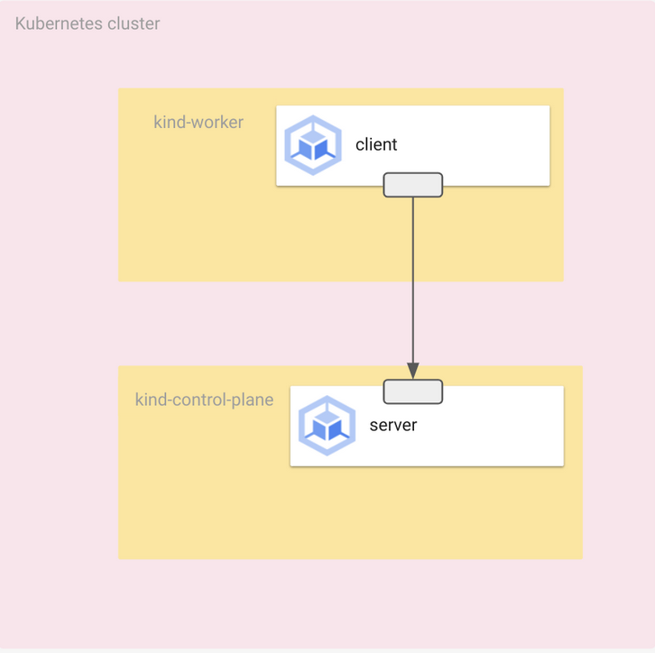

# CFP-2024-06-12: Packet Tracing

## Meta
**SIG:** SIG-Hubble, SIG-Datapath  
**Sharing:** Public  
**Begin Design Discussion:** Jun 12, 2024  
**End Design Discussion:** Aug 16, 2024
**Cilium Release:** 1.17
**Authors:** Ben Bigdelle <bigdelle@google.com>, Mark St. John <markstjohn@google.com> based on the work of Nathan Perkins <nathanperkins@google.com>  
**Reviewers:** joestringer, pchaigno, sypakine  
**Status:** Implementable


## Summary
We aim to enhance cross-cluster and multi-system observability for flows that contain an `ip_trace_id` saved into a defined IP Option (referred to as a tagged flow), thus supporting tracing across networks. These tagged flows will trigger adding the ID value to Flow events messages and client (Hubble / Cilium Monitor) representation. This allows correlating flow events across systems which integrate with the span observability.

Additionally, within Cilium, these flows will generate datapath debugging events regardless of the global debug-verbose setting. This will improve debuggability of production systems.

## Motivation
There are currently limitations for gathering and correlating flow events:
- NAT transformations and DSR can all change the 4-tuple, so that a single Hubble or tcpdump filter cannot be used to trace the packet along the entire path – even when using a system such as Hubble Relay.
- Enabling verbose datapath debugging is not possible in production environments due to traffic volume which leads to dropping flows.

## Goals
- Enable dataplane to watch for IP option tagged packets with `ip_trace_id` and emit flow events for tagged packets.
- `ip_trace_id` can be used without enabling debug-verbose in the datapath.
- Support both IPv4 and IPv6.
- Add hubble filter for trace ID.
- Allow users to define which flow IDs they want to monitor for events.

## Non-goals
- Automatically apply IP option to packets (see Future Milestones).

## User Stories
- As a platform administrator managing multiple clusters, users are reporting connection timeouts reaching destinations in remote clusters. Platform admin generates traffic with trace ID IP option along the problematic path to identify all flow events associated with that packet at both the source and destination.



- As a production cluster administrator, particular flows from a client are experiencing connection timeouts (e.g. [issue #32472](https://github.com/cilium/cilium/issues/32472)). Enabling datapath debugging for all flows leads to event loss and low SNR. To extract dataplane information to root cause the issue, generate traffic with trace ID IP option to emit datapath debug information specific to this flow.

## Proposal

### Overview
Offer support for packets containing a user-defined IP option field. For tagged incoming flows, handle events for this flow specially; emit datapath debugging events for these packets, include the ID in the event message, and implement hubble filtering by the ID.

### Section 1: Feature Enablement

When this feature is enabled, the datapath forwards packets to a parsing program on ingress.

```go
EnableIPOptionTracing = "enable-ip-option-tracing"
```

```go
if option.Config.EnableIPOptionTracing > 0 {
    cDefinesMap["ENABLE_PACKET_IP_TRACING"] = 
    strconv.Itoa(option.Config.EnableIPOptionTracing)
}
```

#### 1.1 Configuration in Cilium-Agent
Enable IP option tracing for specific agents by configuring the option on individual agents:
- `--enable-ip-option-tracing=<type>` where `<type>` corresponds to the IP option value.
- Default value: `<type>=0` (Feature is disabled).
- This allows targeted enablement of the feature only on selected agents, offering flexibility in mixed environments.

Example Agent configuration:
```yaml
args:
  - --enable-ip-option-tracing=136
````

### Section 2: Parsing

Parsing at the ingress point of the TC hook allows for early detection and tracing of a flow.

```c
#ifdef ENABLE_PACKET_IP_TRACING
    // Do parsing and storing of ip_trace_id
    check_and_store_ip_trace_id(ctx, ENABLE_PACKET_IP_TRACING);
#endif
```
```c
// Function to parse trace ID and store it if valid
static __always_inline void check_and_store_ip_trace_id(struct __ctx_buff *ctx, __u8 ip_opt_type_value) {
    __s64 trace_id;
    trace_id = trace_id_from_ctx(ctx, ip_opt_type_value); // do parsing

    // check if the trace ID is valid
    if (trace_id > 0) {
        bpf_trace_id_set(trace_id);
    } else {
        bpf_trace_id_set(0);
    }
}
```
At ingress, the function `trace_id_from_ctx` is called to parse the IP options from incoming packets. If the packet is valid, it proceeds to parse the IP options to extract the trace ID.

We loop over the IP options to extract the trace ID. This loop is unrolled to a maximum of three iterations to minimize performance impact and meet BPF requirements. The maximum of three iterations accounts for any combination of trace ID, user-provided options, and either egress NAT or DSR options. If we read an IP option from the trace type which we configured (see Section 2), then this is stored as the `ip_trace_id`.

Several edge cases are considered during parsing:
- **No IP Options:** If the packet header indicates there are no options, parsing stops early, avoiding unnecessary processing.
- **Invalid `ip_trace_id`:** invalid IDs are handled by setting the trace ID to 0.

### Section 3: `ip_trace_id` state

Creating a per-CPU array-map allows for storage of each packet’s `ip_trace_id` as it is processed. When the feature gate is disabled (see Section 2: Feature enablement), the map is not rendered, avoiding space inefficiencies.

```c
#ifdef ENABLE_PACKET_IP_TRACING 
struct {
    __uint(type, BPF_MAP_TYPE_PERCPU_ARRAY);
    __uint(max_entries, 1);
    __type(key, __u32); // only one key
    __type(value, __u64); // ip_trace_id type
    __uint(pinning, LIBBPF_PIN_BY_NAME);
} ip_trace_id_map __section_maps_btf;
...
// remaining declarations 
#endif
```

**Pros**
- Non-competitive storage; packet tracing ID is stored outside of the skb struct which has limited room for custom attributes.

**Considerations**
- Must ensure that data is zero'ed correctly.
- This is universal storage and not specifically stored in the SKB struct, so it must be zero'ed when a new packet is processed.
- At an ingress point, if there is no trace ID stored in a packet, the stored `ip_trace_id` is zero'ed from the array-map.

### Section 4: Event integration

Include ID as event field for trace and drop structs and the flow message (for Hubble integration):

```c
struct trace_notify {
    // Existing struct members
    ...
    __u64      ip_trace_id; // new trace ID field
    // Remaining struct members
    ...
};
```
```c
struct drop_notify {
    // Existing struct members
    ...
    __u64      ip_trace_id; // new trace ID field
    // Remaining struct members
    ...
};
```

```go
type Flow struct {
    // Existing struct members
    ...
    IpTraceID IpTraceID 
    `protobuf:"varint,38,opt,name=ip_trace_id,json=ipTraceId,proto3" json:"ip_trace_id,omitempty"` // new trace ID field
    // Remaining struct members
    ...
}

type IpTraceID struct {
    TraceID      uint64 `protobuf:"varint,1,opt,name=trace_id,json=traceId,proto3" json:"trace_id,omitempty"`
    IpOptionType uint8  `protobuf:"varint,2,opt,name=ip_option_type,json=ipOptionType,proto3" json:"ip_option_type,omitempty"`
}
```

#### Tagged-flow ring buffer

For tagged flows, there is a separate ring buffer to ensure that the processing of these events does not interfere with other events generated by Cilium. This separation helps maintain the performance of the system and mitigate concerns for tagged flows overflowing the event ring buffer, especially in high-traffic environments.

UNRESOLVED: How does the agent choose when to use this new ringbuffer or not? How does this integrate with Monitor Aggregation?

This approach incurs additional memory overhead due to the allocation of a dedicated ring buffer for these trace events. Each CPU has a dedicated one-element array-map which stores the trace ID of the currently-processed packet. Therefore, the ring buffer should have one entry for each CPU. We will initialize this buffer:

```c
struct {
	__uint(type, BPF_MAP_TYPE_PERF_EVENT_ARRAY);
	__uint(key_size, sizeof(__u32));
	__uint(value_size, sizeof(__u32));
	__uint(max_entries, __NR_CPUS__);
} EVENTS_MAP __section_maps_btf;
```

## Security Considerations

### Section 1: Flow handling

Packets with trace identifiers are processed in the datapath by Cilium in the exact same way as non-tagged traffic. The only difference is that the event message includes the ip_trace_id identifier for tagged traffic (which we load via a constant-time check). This approach ensures there is no additional threat of denial of service or system flooding with these tagged packets.

Key points:
- **Disabled by default**: the tracing feature is disabled by default. When disabled, tagged packets are not parsed, and processed identically to all traffic.
- **No special handling**: tagged packets are not treated differently in the network stack, there is no preferential processing that could be exploited. This ensures that tagged packets do not create any special conditions that could be manipulated by malicious actors.
- **Denial of service**: there is no increased risk of denial of service attacks as the system processes tagged and non-tagged packets identically.

Therefore, typical network security is maintained while providing IP Packet Tracing visibility.

### Section 2: Non-automated tagging

This feature does not implement the packet tagging (see Deferred Milestone 1: Tag Packets). Instead, it is the client's responsibility to tag packets via IP option embedding. Therefore, the key assumption for this feature is that tagged packets arrive at ingress points with an `ip_trace_id` already embedded in the IP options.

#### Reasons for Not Implementing Automatic Packet Tagging:

1. **Avoid MTU Concerns:**
   - Automatically tagging packets can cause them to exceed the MTU, leading to fragmentation and performance issues.
   
2. **Prevent Performance Loss from GRO:**
   - GRO engine does not support packets with IP options.

3. **Avoid Packet Loss:**
   - Some network devices and paths may not support IP options, causing tagged packets in the path to be dropped.
   - Targets that don't support IP Options:
      - L4 ELB
        - External load balancer support for tracing may vary depending on the specific implementation. Some load balancers may remove IP options when forwarding traffic.
   - Targets that support IP Options:
      - L4 ILB
      - Services
      - Pod-to-pod (including across VPC)

4. **IP Checksum Recalculation:**
   - When IP options are added or modified, the IP checksum must be recalculated, adding additional processing overhead and complexity.

Mitigation: This feature is a manually enabled debug option, giving users full control over performance overhead of IP option tagged packets. Users can manage overhead and performance concerns related to MTU, GRO compatibility, packet loss, and IP checksum recalculation. By making packet tagging the client's responsibility, Cilium remains unaffected by these concerns, allowing clients to incorporate these considerations into their use of the feature and determine the best way to utilize it according to their specific needs.

## Benchmark Testing

### Critical User Journeys (CUJs) and Performance Metrics

#### Objective:
These benchmark tests evaluate the performance impact of the new packet tracing feature. The tests focus on measuring packet latency and throughput with and without the tracing feature and custom IP options enabled.

#### Key Metrics:

1. **Packet Latency Under High Load**
   a. **Objective:** Validate that packet latency remains within acceptable limits even under high load conditions.
   b. **Metric:** Measure the round-trip time (RTT) for packets and ensure it does not exceed a specified threshold (e.g., 1ms average RTT).
   c. **Scenarios:**
      i. Baseline (tracing feature disabled, without IP Options)
      ii. Test (tracing feature disabled, with IP Options)
      iii. Baseline (tracing feature enabled, without IP Options)
      iv. Test (tracing feature enabled, with IP Options)

2. **Packet Throughput**
   a. **Objective:** Assess the maximum throughput the system can handle without degradation in performance.
   b. **Metric:** Determine the packet sending rate (packets per second, pps) when the rate is set (1000 pps).

3. **Resource Usage**
   a. **Objective:** Monitor resource usage (CPU, memory) of the control plane with and without the tracing feature under different loads.
   b. **Metric:** CPU and memory usage.

### Setup

We set up our cluster with control-plane and worker nodes hosting a server and client pod, respectively. From the client pod, we ping the server pod IP address.



#### Cluster setup

**Provision a Kind cluster:**
```sh
make kind && make kind-image
```
### Install Cilium

```sh
helm upgrade -i cilium ./install/kubernetes/cilium \
  --wait \
  --namespace kube-system \
  --set image.override="localhost:5000/cilium/cilium-dev:local" \
  --set image.pullPolicy=Never \
  --set operator.image.override="localhost:5000/cilium/operator-generic:local" \
  --set operator.image.pullPolicy=Never
```

#### Client pod YAML

```yaml
apiVersion: v1
kind: Pod
metadata:
  name: client
  labels:
    app: client
spec:
  containers:
  - name: client
    image: busybox
    command:
    - sleep
    args:
    - "999999"
```

#### Server pod YAML

```yaml
apiVersion: apps/v1
kind: Deployment
metadata:
  name: server
  labels:
    app: server
spec:
  replicas: 2
  selector:
    matchLabels:
      app: server
  template:
    metadata:
      labels:
        app: server
    spec:
      affinity:
        podAntiAffinity:
          requiredDuringSchedulingIgnoredDuringExecution:
          - labelSelector:
              matchLabels:
                app: client
            topologyKey: kubernetes.io/hostname
      containers:
      - name: server
        image: nginx
        ports:
        - containerPort: 80
```

### Test #1 - Load Tests

We find which node the client pod belongs to:
```sh
# kubectl get pods -o wide | grep "client"
NAME     READY   STATUS    RESTARTS   AGE    IP           NODE
client   1/1     Running   0          127m   10.244.1.97  kind-worker2
```

To find the target IP, find the IP address of the server pod:
```sh
# kubectl get pods -o wide | grep "server"
NAME                      READY   STATUS    RESTARTS   AGE    IP
server-69cdf4d5cd-mkklc   1/1     Running   0          127m   10.244.0.221
```
Now, we SSH into the worker node where the client pod is:
```sh
docker exec -it kind-worker2 bash
```
From within the worker node, we enter the client pod namespace. Then, we use the tool `nping` to generate TCP traffic, sending 1000 packets to the target IP with and without custom IP options. Use the following bash script within the node to enter the client namespace and generate traffic (with and without IP options) by pinging the server pod:

```bash
#!/bin/bash

# Usage: ./benchmark_packet_tracing.sh <target_ip> <num_with_options> <num_without_options>
# Example: sudo ./benchmark_packet_tracing.sh 192.168.1.1 100 100

TARGET_IP=$1
NUM_WITH_OPTIONS=$2
NUM_WITHOUT_OPTIONS=$3

# Validate input
if [ -z "$TARGET_IP" ] || [ -z "$NUM_WITH_OPTIONS" ] || [ -z "$NUM_WITHOUT_OPTIONS" ]; then
  echo "Usage: $0 <target_ip> <num_with_options> <num_without_options>"
  exit 1
fi

# Get container and pid
container=$(crictl ps | grep "$(crictl pods | grep client | awk '{ print $1 }')" | awk '{ print $1 }')
pid=$(crictl inspect "${container}" | grep pid | head -1 | grep -Eo "[0-9]+")

if [ -z "$pid" ]; then
  echo "Failed to get the PID of the container."
  exit 1
fi

echo "Switching to the network namespace of the container with PID ${pid}"

# Run the rest of the script in the container's network namespace
nsenter -t "${pid}" -n /bin/bash << EOF

# Function to send packets with IP options
send_packets_with_options() {
  echo "[$(date +'%Y-%m-%d %H:%M:%S')] Sending $NUM_WITH_OPTIONS packets WITH IP options trace_id"
  nping --tcp -p 80 --ip-options='\x88\x04\x34\x21' -c "$NUM_WITH_OPTIONS" --rate 1000 --debug "$TARGET_IP" >> nping_output_with_options.log 2>&1
}

# Function to send packets without IP options
send_packets_without_options() {
  echo "[$(date +'%Y-%m-%d %H:%M:%S')] Sending $NUM_WITHOUT_OPTIONS packets WITHOUT IP options trace_id"
  nping --tcp -p 80 -c "$NUM_WITHOUT_OPTIONS" --rate 1000 --debug "$TARGET_IP" >> nping_output_without_options.log 2>&1
}

# Start traffic generation
echo "[$(date +'%Y-%m-%d %H:%M:%S')] Starting traffic generation to $TARGET_IP"
send_packets_with_options
send_packets_without_options

echo "[$(date +'%Y-%m-%d %H:%M:%S')] Traffic generation completed."
EOF
```

In our `nping` command, `--rate 1000` sets the packet sending rate to 1000 packets per second, and `--debug` enables detailed logging. By default, Nmap uses parallelism parameters (see [here](https://nmap.org/book/man-performance.html)) determined by its own adaptive algorithms, and we do not modify those settings.

### Results #1

The `nping` output shows the time taken to generate, send, and wait for responses of 1000 packets under four different scenarios:
1. Baseline (with tracing feature disabled, without IP Options)
2. Test (with tracing feature disabled, with IP Options)
3. Baseline (with tracing feature enabled, without IP Options)
4. Test (with tracing feature enabled, with IP Options)

The output is logged, showing the time taken to generate, send, and wait for responses of 1000 packets.

#### Baseline (with tracing feature disabled):

```sh
Baseline (without IP Options):
- Max rtt: 0.726ms | Min rtt: 0.046ms | Avg rtt: 0.046ms
- Raw packets sent: 1000 (40.000KB) | Rcvd: 1000 (44.000KB) | Lost: 0 (0.00%)
- Tx time: 1.34090s | Tx bytes/s: 29830.69 | Tx pkts/s: 745.77
- Rx time: 1.34096s | Rx bytes/s: 32812.26 | Rx pkts/s: 745.73
- Nping done: 1 IP address pinged in 1.45 seconds

Test (with IP Options):
- Max rtt: 0.236ms | Min rtt: 0.046ms | Avg rtt: 0.046ms
- Raw packets sent: 1000 (44.000KB) | Rcvd: 1000 (44.000KB) | Lost: 0 (0.00%)
- Tx time: 1.34734s | Tx bytes/s: 32657.01 | Tx pkts/s: 742.20
- Rx time: 1.34779s | Rx bytes/s: 32646.04 | Rx pkts/s: 741.96
- Nping done: 1 IP address pinged in 1.45 seconds
```

#### With tracing feature enabled:

```sh
Baseline (without IP Options):
- Max rtt: 0.872ms | Min rtt: 0.046ms | Avg rtt: 0.046ms
- Raw packets sent: 1000 (40.000KB) | Rcvd: 1000 (44.000KB) | Lost: 0 (0.00%)
- Tx time: 1.33641s | Tx bytes/s: 29931.00 | Tx pkts/s: 748.28
- Rx time: 1.33649s | Rx bytes/s: 32922.03 | Rx pkts/s: 748.23
- Nping done: 1 IP address pinged in 1.45 seconds

Test (with IP Options):
- Max rtt: 0.719ms | Min rtt: 0.048ms | Avg rtt: 0.048ms
- Raw packets sent: 1000 (44.000KB) | Rcvd: 1000 (44.000KB) | Lost: 0 (0.00%)
- Tx time: 1.34727s | Tx bytes/s: 32658.61 | Tx pkts/s: 742.24
- Rx time: 1.34733s | Rx bytes/s: 32657.11 | Rx pkts/s: 742.21
- Nping done: 1 IP address pinged in 1.46 seconds
```
The additional delay introduced by enabling the tracing feature is relatively small. When the feature is disabled, the average RTT (round-trip time) remains the same (0.046ms);. 

When the tracing feature is enabled, the average RTT increases by 0.002ms when IP Options are used (0.046ms vs 0.048ms). Overall, enabling the tracing feature (and using IP Options) introduces 4.3% overhead, making it a feasible solution for environments requiring detailed packet tracing without significant degradation in network performance. Moreover, as this is a debugging feature, in environments where this feature is disabled, there is no performance loss. 

### Test #2

We monitor the CPU and memory usage with a high load (10000 packets at a rate of 1000 packets/s).

#### With IP options:
```sh
nping --tcp -p 80 --ip-options='\x88\x04\x34\x21' -c 100000 --rate 1000 --debug "$TARGET_IP"
```

#### Without IP options:
```sh
nping --tcp -p 80 -c 100000 --rate 1000 --debug "$TARGET_IP"
```

We monitor with pidstat:
```sh
pidstat -u -r 1
```
This is used to monitor CPU and memory usage of running processes, with updates every second. 

### Results #2

We monitor CPU and memory usage during packet transmission using `pidstat -u -r 1`. The following metrics are captured every second:
- **%usr**: Percentage of CPU utilization that occurred while executing at the user level (application).
- **%system**: Percentage of CPU utilization that occurred while executing at the system level.
- **%guest**: Percentage of CPU utilization that occurred while executing at the guest level.
- **%wait**: Percentage of time the CPU was idle and waiting for I/O operations to complete.
- **%CPU**: Total CPU usage as a sum of user, system, and guest CPU times.
- **CPU**: Processor number on which the process is running.
- **Command**: The name of the command/process.

Below are consolidated logs showing the CPU usage for `nping` processes with and without IP options.

#### Baseline (with tracing feature disabled):
```sh
Baseline (without IP Options): 
Time          UID       PID    %usr %system  %guest   %wait    %CPU   CPU  Command
17:49:18        0      6128   12.00   84.00    0.00    0.00   96.00    23  nping
17:49:19        0      6128   15.00   85.00    0.00    0.00  100.00    10  nping
17:49:20        0      6128   17.00   83.00    0.00    0.00  100.00    16  nping
17:49:21        0      6128   14.00   86.00    0.00    0.00  100.00    16  nping
17:49:22        0      6128   14.00   87.00    0.00    0.00  101.00     4  nping
17:49:23        0      6128   18.00   82.00    0.00    0.00  100.00     4  nping
17:49:24        0      6128   17.00   82.00    0.00    0.00   99.00    16  nping
17:49:25        0      6128   18.00   82.00    0.00    0.00  100.00    18  nping
17:49:26        0      6128   15.00   84.00    0.00    0.00   99.00    18  nping
17:49:27        0      6128   16.00   84.00    0.00    0.00  100.00    18  nping
17:49:28        0      6128   12.00   88.00    0.00    0.00  100.00    18  nping
17:49:29        0      6128   11.00   89.00    0.00    1.00  100.00     6  nping
17:49:30        0      6128   15.00   85.00    0.00    0.00  100.00    18  nping

Test (with IP Options): 
Time          UID       PID    %usr %system  %guest   %wait    %CPU   CPU  Command
17:49:04        0      6123   17.00   81.00    0.00    0.00   98.00    18  nping
17:49:05        0      6123   13.00   87.00    0.00    0.00  100.00    18  nping
17:49:06        0      6123   12.00   88.00    0.00    0.00  100.00    18  nping
17:49:07        0      6123   17.00   83.00    0.00    0.00  100.00    18  nping
17:49:08        0      6123   17.00   83.00    0.00    0.00  100.00    18  nping
17:49:09        0      6123   13.00   87.00    0.00    0.00  100.00    18  nping
17:49:10        0      6123   12.00   87.00    0.00    0.00   99.00    18  nping
17:49:11        0      6123   15.00   85.00    0.00    0.00  100.00    18  nping
17:49:12        0      6123   20.00   80.00    0.00    0.00  100.00    18  nping
17:49:13        0      6123   18.00   82.00    0.00    0.00  100.00     6  nping
17:49:14        0      6123   15.00   84.00    0.00    0.00   99.00     5  nping
17:49:15        0      6123   16.00   85.00    0.00    0.00  101.00     5  nping
17:49:16        0      6123   13.00   86.00    0.00    0.00   99.00     5  nping
```
#### Test (with tracing feature enabled):
```sh
Baseline (without IP Options): 
Time          UID       PID    %usr %system  %guest   %wait    %CPU   CPU  Command
17:30:16        0      4636   14.85   80.20    0.00    0.00   95.05     1  nping
17:30:17        0      4636   19.00   81.00    0.00    0.00  100.00    13  nping
17:30:18        0      4636   17.00   84.00    0.00    0.00  101.00     1  nping
17:30:19        0      4636   12.00   88.00    0.00    0.00  100.00     1  nping
17:30:20        0      4636   13.00   86.00    0.00    0.00   99.00     3  nping
17:30:21        0      4636   14.00   86.00    0.00    1.00  100.00    11  nping
17:30:22        0      4636   13.00   87.00    0.00    0.00  100.00    11  nping
17:30:23        0      4636   19.00   80.00    0.00    0.00   99.00    23  nping
17:30:24        0      4636   19.00   82.00    0.00    0.00  101.00    23  nping
17:30:25        0      4636   17.00   82.00    0.00    0.00   99.00    23  nping
17:30:26        0      4636   12.00   88.00    0.00    0.00  100.00    13  nping
17:30:27        0      4636   11.00   88.00    0.00    0.00   99.00    13  nping
17:30:28        0      4636   20.00   81.00    0.00    1.00  101.00    17  nping
17:30:29        0      4636   13.00   86.00    0.00    0.00   99.00    17  nping

Test (with IP Options): 
Time          UID       PID    %usr %system  %guest   %wait    %CPU   CPU  Command
17:30:01        0      4631   13.86   81.19    0.00    0.99   95.05     3  nping
17:30:02        0      4631   16.00   83.00    0.00    1.00   99.00    14  nping
17:30:03        0      4631   16.00   84.00    0.00    1.00  100.00    14  nping
17:30:04        0      4631   14.00   84.00    0.00    1.00   98.00    15  nping
17:30:05        0      4631   14.00   86.00    0.00    0.00  100.00     3  nping
17:30:06        0      4631   12.00   88.00    0.00    0.00  100.00     3  nping
17:30:07        0      4631   16.00   83.00    0.00    1.00   99.00     0  nping
17:30:08        0      4631   20.00   80.00    0.00    0.00  100.00     0  nping
17:30:09        0      4631   17.00   82.00    0.00    1.00   99.00     1  nping
17:30:10        0      4631   18.00   81.00    0.00    0.00   99.00     2  nping
17:30:11        0      4631   18.00   82.00    0.00    1.00  100.00     1  nping
17:30:12        0      4631   15.00   84.00    0.00    0.00   99.00     9  nping
17:30:13        0      4631   17.00   82.00    0.00    1.00   99.00    21  nping
17:30:14        0      4631   17.00   83.00    0.00    0.00  100.00    11  nping
```
These results indicate there is a negligible difference in CPU and memory usage when comparing with and without IP options. Both scenarios indicate similar CPU utilization, indicating that the addition of this feature and IP options has a minimal impact on system performance.


## Compatibility with Other Cilium Features
L7 Policies/Envoy - Status: in investigation
The packet tracing feature is for network-layer tracing. Its compatibility with L7 policies and Envoy has not been fully tested. We expect that tracing will not capture the full context of L7-managed traffic, as the tracing occurs at a different layer. Explicit support for L7 policies and Envoy is not provided at this stage.

Egress Gateway - Status: in investigation
We expect that packet tracing should work with the egress gateway, as the tagging occurs at the network layer before routing decisions are made. However, additional testing is required to confirm that tagged packets maintain their traceability through the egress gateway.

IPSec/Wireguard - Status: in investigation
We expect packet tracing to be compatible with IPSec and Wireguard. These protocols encrypt packets between known 
nodes in a cluster, but each node also has its own encryption key-pair to encrypt/decrypt traffic to and from. As
the ip_trace_id is a series of bytes, in the packet, we expect this to be compatible with IPSec/Wireguard.

## Future Milestones

### Deferred Milestone 1: Use conntrack to restore trace ID for reply packets
- When a packet includes a trace ID, the conntrack entry should record the ID along with the connection information.
- For subsequent packets – if a trace ID is not present in the IP Options – use the track ID from conntrack to restore the internal state.
- Note this will not modify the IP option header.

### Deferred Milestone 2: Tag packets
- **Audience:** Proficient Cilium user with knowledge of cilium-dbg / pwru tools.
- Provide a `cilium-dbg` subcommand for a user to define what traffic should be traced.
- Prepend tag program to container lxc interface.
- **Optional:** Provide a flag to optionally remove the tag before egressing Node NIC, addressing targets that do not support IP options.
- **Challenge:** This affects the available MTU.
  - [Preferred] Only apply to packets that have the length available (e.g., packets with no data; SYN w/o fast open, RST, etc.).
  - Modify the MTU/route MTU of the container (i.e., subtracting the IP option + trace ID lengths).

### Deferred Milestone 3: Tag packets via CR
- **Audience:** Network specialist with knowledge of network topology.
- Develop a K8s API where the user specifies traffic to tag using common selectors: 4-tuple, pod identity, etc.

## Appendix

### Parsing attempted approaches

#### [Nonviable] Option 2: Parse at XDP hook
**Pros:**
- Earliest detection of trace IDs.
- Immediate handling of packets with trace IDs.

**Considerations:**
- XDP programs don’t support the SKB struct.
- Must ensure that TC hook is able to parse from the xdp_md struct created in the XDP hook, leading to increased complexity.

### Trace ID storage attempted approaches

#### [Nonviable] Option 2: Use sk_buff extensions
**Pros:**
- Can extend the sk_buff structure without modifying the core structure.
- Data freed when skb is freed.

**Considerations:**
- Compatible with kernel versions post-v5.0-rc1.

#### [Nonviable] Option 3.1: Use skb->mark or skb->CB field
**Pros:**
- The “mark” field is a generic packet mark for sk_buff and suitable for such purposes as adding a trace ID.

**Considerations:**
- Potential conflicts with other parts of the network that use this field.
