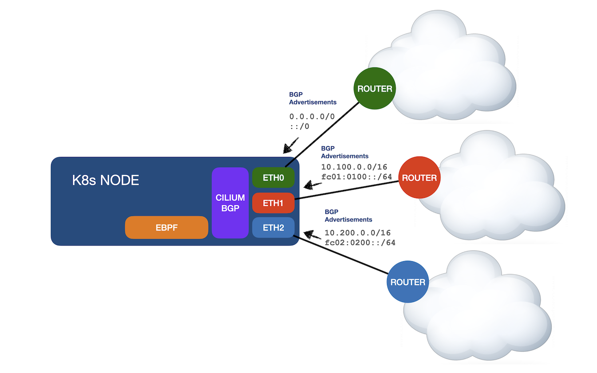

# CFP-34841: BGP Route Learning

**SIG: SIG-BGP, SIG-Datapath**

**Begin Design Discussion:** 2024-09-11

**Cilium Release:** X.XX

**Authors:** David Swafford <dswafford@coreweave.com>

## Summary

Cilium's Border Gateway Protocol implementation is one-directional today.  Its intended use is for the advertisement of pod and service IP addresses/prefixes to the network.  The network however is unable to influence Cilium's routing decisions using BGP or by any other means.  Cilium at present expects a simple network design at the node level where all routing needs can be satisfied using a default route.  The upstream router is assumed capable of making all routing decisions and to have connectivity to all necessary routing domains.

In advanced network designs, the administrator may desire to establish connectivity between Cilium and several isolated routing domains.  For example, one routing domain may provide connectivity to all other Kubernetes nodes, another routing domain may provide connectivity only to the Internet, while a third may provide connectivity only to storage resources.  On the network upstream of Cilium, these domains may be isolated using various techniques such as Virtual Routing and Forwarding (VRF) instances, and even physical isolation with dedicated physical network interface cards (NICs).

When configured for [Native-Routing](https://docs.cilium.io/en/stable/network/concepts/routing/#native-routing) mode, it appears possible to support the advanced network design described above.  However, doing so in large environments would require complex management and automation for Linux routing tables.

Proposed here is a change to support route learning via BGP.

## Motivation

### User Stories

*As a cluster administrator, I wish to deploy Cilium on a node which connects to two or more routing domains.  The deployment is considered a success when Cilium is capable of learning non-overlapping routes using BGP from peers across each routing domain, and when Cilium is able to route outbound traffic to the correct routing domain.*

https://github.com/cilium/cilium/pull/33035/

## Goals

* When Cilium is configured to use the Border Gateway Protocol (BGP) with one or more peers, routes advertised by those peers to Cilium are accepted, evaluated through BGP's Best Path Selection algorithm, and the resulting Best Path(s) installed into the node's dataplane.  The net result is that Cilium makes Internet Protocol (IP) routing decisions for Pod/Service sourced traffic based on routes learned via BGP.

## Non-Goals

* Making Cilium's BGP implementation Virtual Routing and Forwarding (VRF) instance aware.

## Proposal

### Overview

### Route Programming

Cilium supports two modes of routing -- [Encapsulation](https://docs.cilium.io/en/stable/network/concepts/routing/#encapsulation) and [Native](https://docs.cilium.io/en/stable/network/concepts/routing/#native-routing).

#### Native Routing Mode

When operating in Native Routing mode, the implementation appears straightforward.  A mechanism is required to synchronize routes learned from BGP, specifically Cilium's in-memory instance of GoBGP, to the Linux routing table.  For context, GoBGP may be deployed as a standalone daemon or instantiated directly through its Golang package.  Cilium instantiates directly.

GoBGP on it's own is unable to install routes into the Linux routing table directly.  GoBGP's documentation [suggests](https://github.com/osrg/gobgp/blob/master/docs/sources/zebra.md) running an additional BGP daemon such as Quagga or FRR and establishing communication between the two.

As the number of routes received, and rate of change may vary dramatically from one environment to another, it is the author's recommendation that one of the existing GoBGP supported-daemons be selected.  Under this model, an additional daemon will be deployed within Cilium's BGP-speaking pods.  For a Kubernetes-based deployment, these are the pods named `cilium-<hash>`.

For Kubernetes deployments, where Cilium runs within a container, the mechanism to synchronize routes to the Linux routing table needs synchronize NOT to the container's routing table but rather the underlying node's routing table.  The author seeks guidance from the community on how to best approach this.

#### Encapsulation Mode

The author requests guidance from the community to support this feature in Encapsulation mode.

### BGP Import Policy
Under [this PR](https://github.com/cilium/cilium/pull/33035), I modified Cilium to reject all BGP paths advertised toward it.  This proposal will revert the majority of those changes.

### Custom Resource Definition Modifications

To mitigate the risk associated with route leaks, a new configuration option named `prefixLimit` will be added to `CiliumBGPPeeringPolicy` and `CiliumBGPPeerConfig`.  Exceeding the configured prefix limit will result in the the BGP speaker being torn down.  Under the covers, GoBGP supports additional configuration for this option as seen in [link](https://pkg.go.dev/github.com/osrg/gobgp/internal/pkg/config#PrefixLimitConfig).  It may be desirable to expose an equivalent CRD configuration option for GoBGP's `RestartTimer`.

## Impacts / Key Questions

_List crucial impacts and key questions. They likely require discussion and are required to understand the trade-offs of the CFP. During the lifecycle of a CFP, discussion on design aspects can be moved into this section. After reading through this section, it should be possible to understand any potentially negative or controversial impact of this CFP. It should also be possible to derive the key design questions: X vs Y._

### Impact: Cilium complexity

Implementation of this feature introduces a fair amount of complexity to Cilium.  Complex systems are harder to reason about.  Complexity introduced includes a second BGP daemon, manipulation of the node's Linux routing table, and additional configuration options.

Further, to support this feature in Encapsulation routing mode may require extensive changes outside of BGP-related source code.

### Key Question: Should the feature be limited to Native-Routing mode?

When in Native-Routing mode, the scope of changes proposed are limited to the BGP-related source code and the introduction of a second BGP daemon.

### Key Question: Does the introduction of the feature REQUIRE the administrator to advertise a default route via BGP?

With the existing behavior relying on a default route, one not learned via BGP, does the introduction of the feature remove the ability to use a default route?  Does it require the adminstrator to announce a default route via BGP instead?

### Option 1:  Implement the Proposed Feature

#### Pros

* Unlocks new use-cases for Cilium with advanced network designs.

#### Cons

* Introduces additional complexity for both maintainers and administrators.  Additional complexity for administrators resides in the fact that the underlying Linux routing table may change without notice in response to BGP routing changes.

### Option 2: Do Nothing

#### Pros

* Cilium remains simple to reason about.

#### Cons

* Cilium cannot be used in advanced network designs, potentially limiting Cilium adoption.

## Future Milestones

_List things that this CFP will enable but that are out of scope for now. This can help understand the greater impact of a proposal without requiring to extend the scope of a CFP unnecessarily._

### Deferred Milestone 1

Unknown at this time.