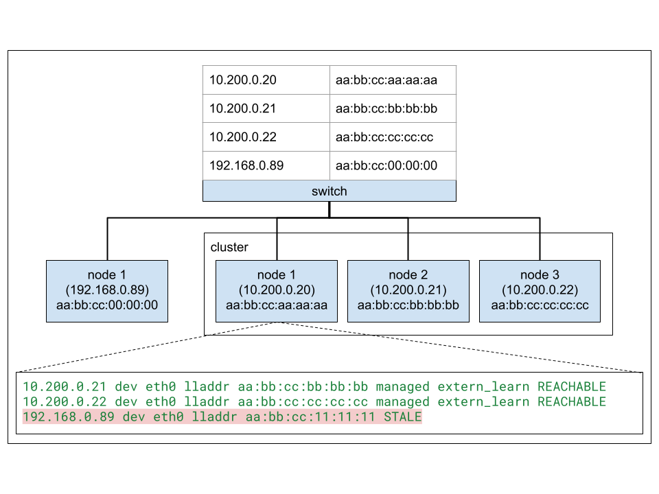

# CFP-36372: Neighbor Entry Refresh For Non-Cluster IPs

**SIG: SIG-DATAPATH**

**Begin Design Discussion:** 2024-12-04

**Authors:** Jordan Rife <jrife@google.com>

**Context:**: https://github.com/cilium/cilium/issues/34503

## Summary

Neighbor entries for non-cluster IPs can remain stale forever breaking
connectivity in some cases (e.g. node port traffic). Cilium should provide
*some* mechanism to ensure that neighbor entries on cluster nodes for
non-cluster IPs remain up-to-date when using BPF host routing.

This CFP is a response to [GH-34503](https://github.com/cilium/cilium/issues/34503)
which is an issue we (Google) encountered.

## Motivation

Cilium sets the `managed` and `extern_learn` flags for neighbor entries mapped
to cluster node IPs. This keeps the entries for cluster node IPs in a reachable
state regardless of whether or not traffic is sent to these nodes, as the kernel
[actively](https://github.com/torvalds/linux/blob/9f8e716d46c68112484a23d1742d9ec725e082fc/net/core/neighbour.c#L1617)
sends out ARP requests as and when these entries become stale. The same is not
true for non-cluster IPs in the same L2 domain.

Normally, stale neighbor entries are refreshed by the kernel on demand as traffic
is sent to these addresses when [`neigh_resolve_output()`](https://github.com/torvalds/linux/blob/906bd684e4b1e517dd424a354744c5b0aebef8af/net/core/neighbour.c#L1545) triggers
[`neigh_event_send_probe()`](https://github.com/torvalds/linux/blob/906bd684e4b1e517dd424a354744c5b0aebef8af/include/net/neighbour.h#L457),
but with BPF host routing this is never triggered leaving entries for
non-cluster IPs in a stale state indefinitely. In particular for node port
traffic, Cilium calls `bpf_fib_lookup()` which returns a valid neighbor entry
even if it is stale (returning `BPF_FIB_LKUP_RET_SUCCESS`), populates the source
and destination MAC addresses from the fib lookup result, then
[calls `bpf_redirect()`](https://github.com/cilium/cilium/blob/a184399ad122b293f531e56293e5cd67eca4622a/bpf/lib/fib.h#L171)
sending the packet to interface returned by `bpf_fib_lookup()`. `bpf_redirect()`
does not trigger `neigh_event_send_probe()` as the kernel stack or
`bpf_redirect_neigh()` would. Cilium only opts for `bpf_redirect_neigh()` in
cases where the preceding `bpf_fib_lookup()` returns `BPF_FIB_LKUP_NO_NEIGH`
which is not the case for stale entries.

The net result is that stale neighbor entries for non-cluster IPs remain stale
unless it is deleted/GCed, an ARP request is sent from the neighbor in question,
or the entry is updated externally. This becomes problematic when an IP address
is reassigned and mapped to a new MAC address, a common scenario in virtualized
environments with frequent node churn, as traffic will never be able to make its
way from cluster nodes to the new owner of that IP. Stale entries may never be
garbage collected depending on the number of entries in the neighbor table and
the [configured GC thresholds](https://man7.org/linux/man-pages/man7/arp.7.html)
(`gc_thresh1`, `gc_thresh2`, `gc_thresh3`). In environments where ARP
suppression is enabled, common with vxlan setups, the switch responds directly
to ARP requests and can suppress gratuitous ARPs broadcast by the neighbor that
would otherwise inform cluster nodes of the IP reassignment. As of today, Cilium
does not have a mechanism in place to keep neighbor entries fresh in such
scenarios with BPF host routing.

## Goals

* Ensure that neighbor entries remain up-to-date for non-cluster IPs when using
  BPF host routing.

## Non-Goals
* __

## Proposal

### Overview
This proposal compares three alternative solutions one of which involves a
kernel change.

### Option 1: `managed` entries for custom custom IPs
Create `managed` neighbor entries for a static set of custom IP addresses
provided to Cilium by some flag (e.g. `--managed-l2-neighbors=192.168.1.88,...`).
If the set of non-cluster IPs is small and known up front this is a simple
extension to Cilium's existing logic which creates such entries for node IPs.
Actively monitoring and removing stale entries for these addresses also achieves
the same goal.

#### Pros
* Requires no changes to the kernel.
* Easy to implement

#### Cons
* Not very flexible and harder to manage. The feedback from our team internally
  was that in their situation it is hard to know ahead of time which IPs will be
  used.

### Option 2: Always use `bpf_redirect_neigh()`
Always use `bpf_redirect_neigh()` even if `bpf_fib_lookup()` returns
`BPF_FIB_LKUP_RET_SUCCESS` just in case the neighbor entry is stale.

#### Pros
* Requires no changes to the kernel.
* Easy to implement
* No extra configuration needed.

#### Cons
* Possible performance impact: duplication of work already done by
  `bpf_fib_lookup()`. The extent of this impact is unclear, but the fact that
  `bpf_redirect()` is generally preferred today if the FIB lookup is successful
  lead us to believe there is some reason why `bpf_redirect_neigh()` is avoided
  in the general case.

### Option 3: Make `bpf_fib_lookup()` return neighbor entry state
Extend `bpf_fib_lookup()` to return the state of the neighbor entry. If the
neighbor entry is stale, use `bpf_redirect_neigh()` to trigger neighbor refresh.
In contrast to option 2, this basically lets us use `bpf_redirect_neigh()` in a
more targeted way.

#### Pros
* `bpf_redirect()` is still preferred in most cases when `bpf_fib_lookup()`
  returns `BPF_FIB_LKUP_RET_SUCCESS`, but in scenarios like the one described
  above `bpf_redirect_neigh()` will be used once the entry goes stale. Again,
  this is assuming that `bpf_redirect()` should be preferred when possible based
  on the current behavior. 
* No extra configuration needed.

#### Cons
* Requires extension to `bpf_fib_lookup()` in the kernel.

## Impacts / Key Questions

### Impact: Performance

Mostly in response to option 2, we are unsure if there are any performance
implications of using `bpf_redirect_neigh()` even when not strictly necessary.
It seems like it is used sparingly today with `fib_do_redirect()` only invoking
`bpf_redirect_neigh()` if the preceding `bpf_fib_lookup()` returns
`BPF_FIB_LKUP_RET_NO_NEIGH`. We are hoping to gain more clarity on why
`fib_do_redirect()` works this way through this discussion to better inform the
direction.
