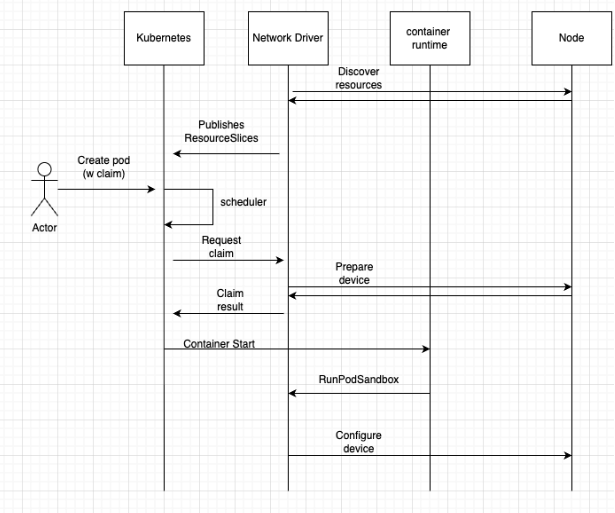

# CFP-43295: Cilium Network (DRA) Driver

**SIG: SIG-Agent, SIG-Datapath**

**Begin Design Discussion:** 2025-10-17

**Cilium Release:** TBD

**Authors:** bernardo <bersoare@isovalent.com>, Fabio <fabio.falzoi@isovalent.com>

**Status:** Draft

## Summary

This CFP proposes extending cilium to support allocating dedicated (NIC)
and shared (SRIOV) network devices to workloads - leveraging the Kubernetes DRA 
framework. 

References:

[Dynamic Resource Allocation](https://kubernetes.io/docs/concepts/scheduling-eviction/dynamic-resource-allocation/)

[DRA Plugin Interface definition](https://github.com/kubernetes/kubernetes/blob/d777de7741d36d1cc465162d94f39200e299070b/staging/src/k8s.io/dynamic-resource-allocation/kubeletplugin/draplugin.go#L53-L144)

## Motivation

Abstractions do not come for free. The traditional Kubernetes networking 
model relies on a set of abstractions with the purpose of simplifying 
connectivity between applications and the rest of the world (including other workloads).
Under the hood, Cilium CNI attaches a pod to a logical fabric over which workloads
can benefit from secure network access to other workloads, services and clients. 
These attachments take the form of virtual devices (veth/netkit) that hand packets to
a custom forwarding plane (ebpf) that magically achieves connectivity between the 
endpoints. Most of this magic happens in software with varying levels of involvement
of the kernel. 
This is suitable for the vast majority of the use cases, but performance/latency sensitive 
workloads could benefit even further from having access to some underlying network hardware
(a NIC, so to speak) and shorten even further the path a packet takes between the application
and the network device itself. In such scenarios, performance (HW access) is more important 
than sophisticated connectivity and feature set. Some use cases that come to mind are network 
function (CNF/VNF) workloads, low latency data ingestion, and dpdk based applications combined with SR-IOV.

## Goals

- Cilium to be able to recognize and publish network devices through
    the Kubernetes DRA plugin API, in a way that Pods that require a given network 
    device can get scheduled on an appropriate node.
- Cilium to be able to preconfigure such devices
- Support SR-IOV VF assignment

## Non-Goals

- Integrate network device (allocated to pods) connectivity with the cilium fabric. 
    It is assumed that these devices will be treated as “secondary” 
    networks and no bpf processing occurs on them.

## Proposal

### Overview

Extends the agent to register itself with the Kubernetes API as a 
DRA plugin (for publishing resources), and also with the container runtime (for configuring devices).
The Cilium Network Driver publishes, for each node, the local resources (ex: network devices) 
that match a given set of filters grouped in resource pools, allowing workloads to claim such resources. 

Upon receiving a claim request, Cilium Network Driver performs any preparation needed for the allocated device(s).
When the Pod finally starts, Cilium Network Driver performs any final configuration before assigning
the device to the Pod sandbox.

A simplified workflow can be seen below:



### Solution

The Network Driver functionality in the Cilium agent is an opt-in feature. 
Enabling it can be done per-node (explicitly referencing a node name or through node labels). 
Upon detecting a valid configuration, the Network Driver is initialized. 
Only the nodes eligible to run the Network Driver should receive a valid configuration, 
allowing the Driver to be initialized. To run the Network Driver, a CRD of the kind 
CiliumNetworkDriverConfig must be present, as it is where the agent finds the Network Driver configuration. 
The example below shows how a valid configuration looks like:

```
---
apiVersion: cilium.io/v1
kind: CiliumNetworkDriverConfig
metadata:
  name: cilium-network-driver-config
spec:
  selectors:
    labels: 
       - cilium.io/network-driver
  driverName: "sriov.cilium.k8s.io"
  deviceManagerConfigs:
      sriov:
        enabled: true
        ifaces:
          - ifName: enp2s0f0np0
            vfCount: 6
          - ifName: enp2s0f1np1
            vfCount: 6
```

Under the deviceManagerConfigs section, an operator is able to control how a specific device manager is set up. 
In this context, the device manager is an abstraction of a certain type of resource. In the example below, 
you can see that we’re working with the `sriov` devicemanager - implying that we must account for extending 
the feature set by introducing device managers.

Updating the configuration at runtime is out of scope for now, and we can revisit it if there’s a sensible use case for doing so.

The resource pools to be advertised by the DRA component on the driver are explicitly set by configuration. 
The Network Driver receives a structured configuration that contains parameters to match devices and group them together or apart
in ResourceSlice pools. This gives flexibility to the operator in respect to how the nodes expose their resources.
An example configuration structure with pools defined can be seen below:

```
---
apiVersion: cilium.io/v1
kind: CiliumNetworkDriverConfig
metadata:
  name: cilium-network-driver-config
spec:
  selectors:
    labels: 
       - cilium.io/network-driver
  driverName: "sriov.cilium.k8s.io"
  deviceManagerConfigs:
      sriov:
        enabled: true
        ifaces:
          - ifName: enp2s0f0np0
            vfCount: 6
          - ifName: enp2s0f1np1
            vfCount: 6
  pools:
    - name: a-side
      filter:
        pfNames:
          - enp2s0f0np0
    - name: b-side
      filter:
        pfNames:
          - enp2s0f1np1
```

With these filters, all the SR-IOV VFs whose PF kernel ifname matches `enp2s0f0np0` will be assigned
to `a-side` pool, whereas all the VFs under the PF named `enp2s0f1np1` are advertised as part of `b-side` pool.

The Agent’s Network Driver then publishes a ResourceSlice pool named after Name, containing all the local 
devices that fulfill all the Filter conditions. Multiple pools can be defined.
Here is an example of a device member of resource pool of name `a-side` advertised as a ResourceSlice:

```
devices:
- attributes:
    deviceID:
      string: "0x1016"
    driver:
      string: mlx5_core
    ifName:
      string: enp2s0f0v0
    pfName:
      string: enp2s0f0np0
    pool:
      string: a-side
    vendor:
      string: "0x15b3"
  name: enp2s0f0v0
driver: sriov.cilium.k8s.io
nodeName: c3-small-x86-01-bernardo
pool:
  generation: 1
  name: a-side
  resourceSliceCount: 1
```

Devices can be assigned to Pods by creating pods with a ResourceClaim statement in the pod manifest.
The ResourceClaim object can be seen as the set of resources a Pod needs - influencing the Kubernetes 
scheduler decision on which node to place the pod. Only nodes that fulfill the claim requirements are eligible for scheduling.
A ResourceClaim references a DeviceClass which does the actual device matching and filtering based 
on the device attributes (advertised in the ResourceSlice) - and an operator can request multiple resources in a single 
claim by referencing multiple DeviceClass objects. The example below show how we can have device classes matching on 
certain attributes we published with our devices:

```
---
apiVersion: resource.k8s.io/v1
kind: DeviceClass
metadata:
  name: a-side.sriov.cilium.k8s.io
  namespace: kube-system
spec:
  selectors:
  - cel:
      expression: device.driver == "sriov.cilium.k8s.io" && device.attributes["sriov.cilium.k8s.io"].pool == "a-side"

---
apiVersion: resource.k8s.io/v1
kind: DeviceClass
metadata:
  name: b-side.sriov.cilium.k8s.io
  namespace: kube-system
spec:
  selectors:
  - cel:
      expression: device.driver == "sriov.cilium.k8s.io" && device.attributes["sriov.cilium.k8s.io"].pool == "b-side"
```

A ResourceClaimTemplate can be used in case several pods are expected to request similar assignments. 
The benefit here is to avoid duplicating similar requests across many Pod manifests.
An example template can be seen below - requests a pair of devices on two different pools 
(published as an attribute by the Cilium Network Driver DRA plugin, using the DeviceClass from the example above):

```
---
apiVersion: resource.k8s.io/v1
kind: ResourceClaimTemplate
metadata:
  name: sriov
spec:
  spec:
    devices:
      requests:
      - name: a-side
        exactly:
          deviceClassName: a-side.sriov.cilium.k8s.io
      - name: b-side
        exactly:
          deviceClassName: b-side.sriov.cilium.k8s.io
```

Once a device is assigned, the Pod might require specific configuration in it. In the case of network devices, 
this configuration usually contains IP (v4/v6) addresses, routes and VLANs. These parameters are passed by the 
ResourceClaimTemplate definition as opaque configs for the request.
Here is a modified version the claim above to pass additional parameters to the Network Driver in the claim request:

```
---
apiVersion: resource.k8s.io/v1
kind: ResourceClaimTemplate
metadata:
  name: sriov
spec:
  spec:
    devices:
      config:
        - requests:
            - a-side
          opaque:
            driver: sriov.cilium.k8s.io
            parameters:
              vlan: 123
	            ipam_pools:
                - pool-a
        - requests:
            - b-side
          opaque:
            driver: sriov.cilium.k8s.io
            parameters:
              vlan: 321
              ipam_pools:
                - pool-b
      requests:
      - name: a-side
        exactly:
          deviceClassName: a-side.sriov.cilium.k8s.io
      - name: b-side
        exactly:
          deviceClassName: b-side.sriov.cilium.k8s.io
```

When processing a PrepareResourceClaim request, the agent performs all the necessary operations on
the device and stores any information that will be needed when the pod finally starts and the device is ready 
to be configured in the pod sandbox.

Preparation steps may include contacting an IPAM to request addresses, reconfigure the interface mac address,
associate a SR-IOV device with a VLAN, among others. When the pod finally starts, the container runtime hook is called and it 
executes the last steps in the configuration within the pod namespace: configures the addresses on the interface,
 bring it up, add routes to the routing table, for example.

### Resources IP address management

To manage the IP addresses for DRA resources a dedicated IPAM mode is added to the agent: Multi Pool Resource IPAM.
This mode works the same way as the [Multi pool IPAM](https://docs.cilium.io/en/v1.18/network/concepts/ipam/multi-pool/) for pods,
but it manages IP pools reserved for DRA resources.
Similarly to CiliumPodIPPool, the CiliumResourceIPPool contains cluster-wide IP pools reserved for DRA resources addresses
allocations. CIDRs from those pools are allocated by the operator to the agents on a per-need basis: whenever a resource needs an
IP address from a pool, the agent requests additional CIDRs in the CiliumNode `spec.ipam.resourcepools.requested` field and the operator
writes the allocated CIDRs in the CiliumNode `spec.ipam.resourcepools.allocated` field.

This mode allows for great flexibility in defining multiple IP pools for different DRA resource types and it allows the reuse of most of
the implementation for the Multi Pool Pod IPAM. Using separate k8s resources to define IP pools ensures there is no interference between
the DRA Resources and Pod IPAM.

### Restrictions 
Requires Kubernetes v1.34

