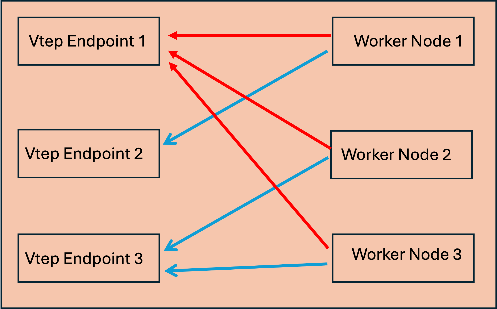

# CFP-44188: CiliumVTEPConfig CRD for Dynamic VTEP Management

**SIG:** SIG-Datapath ([View all current SIGs](https://docs.cilium.io/en/stable/community/community/#all-sigs))

**Begin Design Discussion:** 2026-04-07

**Cilium Release:** 1.20

**Authors:** Murat Parlakisik <parlakisik@gmail.com>

**Status:** Draft

## Summary

Replace the static CLI flag-based VTEP configuration with a cluster-scoped
`CiliumVTEPConfig` CRD that supports dynamic updates, per-node assignment via
`nodeSelector`, and per-endpoint status reporting. This enables production use
cases where operators need simple overlay
connectivity to external gateways without requiring BGP or L2 announcements.

## Motivation

The VTEP integration has been in beta since its introduction in
[PR #17370](https://github.com/cilium/cilium/pull/17370) (Cilium 1.12). The
original design uses static CLI flags (`--vtep-endpoint`, `--vtep-cidr`,
`--vtep-mac`, `--vtep-mask`) baked into the Cilium ConfigMap at install time.
This has several operational problems:

1. **Agent restarts required for any change.** Adding, removing, or modifying a
   VTEP endpoint requires updating the ConfigMap and restarting every Cilium
   agent in the cluster, causing datapath disruption.

2. **Single mask for all CIDRs.** The `--vtep-mask` flag applies one prefix
   length to every VTEP CIDR, preventing mixed prefix lengths (e.g., `/24` and
   `/16` in the same cluster).

3. **No per-node differentiation.** Every node gets the same VTEP
   configuration. In multi-zone or multi-site deployments, different nodes
   need to reach the same external CIDR via different VTEP gateways.

4. **No operational visibility.** There is no way to determine whether a VTEP
   endpoint is successfully programmed in the BPF map or if configuration
   errors exist.

5. **No CI/CD integration**. The feature is still in beta stage due to support and e2e test cases .

These limitations block adoption in environments where VTEP integration would
otherwise be the simplest and most natural connectivity solution.

### The Case for Overlay-to-Gateway Simplicity

If user doesnt want to manage BGP or L2 annoutment to send traffic to some network via  external gateway.
The VTEP approach offers a fundamentally simpler model:

Pods send traffic via the existing VXLAN overlay directly to an external
vtep endpoint. No BGP sessions to configure and maintain. No L2 announcement
policies. No route redistribution. The Cilium agent simply encapsulates
traffic destined for external CIDRs and sends it to a known VTEP endpoint.


## Goals

* Replace static CLI flags with a `CiliumVTEPConfig` CRD for VTEP
  configuration
* Support dynamic add/update/remove of VTEP endpoints without agent restarts
* Enable per-node VTEP assignment via `nodeSelector` for multi-zone deployments
* Provide per-endpoint status reporting (synced, errors, last sync time)
* Support variable prefix lengths per VTEP CIDR (via BPF LPM Trie)
* Enable simple overlay-to-gateway connectivity without requiring BGP or L2
  announcement infrastructure

## Non-Goals

* Multi-VNI support — the existing VNI=2 / world-identity model is preserved
* IPv6 VTEP endpoints — IPv4 only, consistent with current VTEP support
* Changes to the VXLAN encapsulation format or behavior


## Proposal

### Overview



Worker nodes can be independently
assigned to different VTEP endpoints using `nodeSelector`. The red and blue arrows represent traffic
from different `CiliumVTEPConfig` objects — each config targets a subset of
nodes via label selectors and directs their VXLAN-encapsulated traffic to
the appropriate external VTEP endpoint. This per-node assignment is what
enables multi-zone and multi-site deployments where each group of nodes has
its own local gateway.

The design introduces three components:

1. **CiliumVTEPConfig CRD** — a cluster-scoped custom resource that declares
   VTEP endpoints with optional node targeting
2. **VTEPReconciler** — an agent-side controller that watches CRD events,
   evaluates `nodeSelector`, and reconciles the BPF map
3. **BPF LPM Trie map** — replaces the existing Hash map to support
   variable-length prefix matching

### CRD API

```yaml
apiVersion: cilium.io/v2
kind: CiliumVTEPConfig
metadata:
  name: zone-a
spec:
  nodeSelector:                              # optional
    matchLabels:
      topology.kubernetes.io/zone: "zone-a"
  endpoints:
  - name: dc1-router
    cidr: "10.1.1.0/24"
    tunnelEndpoint: "10.169.72.236"
    mac: "82:36:4c:98:2e:56"
  - name: dc1-lb
    cidr: "10.2.0.0/16"
    tunnelEndpoint: "10.169.72.237"
    mac: "aa:bb:cc:dd:ee:01"
```

**Key design decisions:**

| Decision | Rationale |
|---|---|
| Cluster-scoped (not namespaced) | VTEP config is infrastructure-level, managed by platform teams |
| `nodeSelector` on the config, not per-endpoint | Matches the physical topology model: a set of endpoints belongs to a site/zone |
| Max 8 endpoints per config | BPF map size constraint; multiple configs can target different node groups |
| `shortName: cvtep` | Quick operational access: `kubectl get cvtep` |
| Per-endpoint named entries with `+listType=map` | Enables strategic merge patch for individual endpoint updates |

**Validation:**

All fields use kubebuilder validation markers:
- `tunnelEndpoint`: IPv4 address regex
- `cidr`: IPv4 CIDR notation regex (e.g., `10.1.1.0/24`)
- `mac`: MAC address regex (colon-separated hex)
- `name`: DNS label format (lowercase alphanumeric, hyphens, 1-63 chars)
- `endpoints`: MinItems=1, MaxItems=8

### VTEPReconciler

The reconciler runs as a Hive cell in each Cilium agent


**Reconciliation flow:**

1. On startup, the reconciler receives all `CiliumVTEPConfig` objects via
   `resource.Resource[*CiliumVTEPConfig]`.

2. For each event (upsert or delete), it re-evaluates which configs match the
   local node's labels using `nodeSelector`.

3. It computes the **desired state** — a map of normalized CIDR → endpoint
   from all matching configs.

4. It detects **CIDR conflicts** — if the same CIDR appears in multiple
   matching configs, neither is applied and both configs receive an error
   status.

5. It diffs desired state against **last-applied state** and performs
   incremental BPF map updates:
   - New CIDRs → `UpdateEntry()`
   - Changed endpoints → `UpdateEntry()` (overwrite)
   - Removed CIDRs → `DeleteByCIDR()`

6. It updates Linux routing table entries for VTEP CIDRs.

7. It writes per-endpoint status back to the CRD's `.status` subresource.

**Node label change handling:** The reconciler watches the local node's labels. When labels change, it re-evaluates all
`nodeSelector` predicates and reconciles the BPF map accordingly.

**Benefits:**
- Each endpoint can use a different prefix length (`/16`, `/24`, `/25`, etc.)
- The BPF LPM trie performs longest-prefix-match automatically in the datapath
- Removes the `--vtep-mask` global setting entirely

### Status Reporting

Each `CiliumVTEPConfig` object reports status via the `.status` subresource:

```yaml
status:
  endpointCount: 2
  conditions:
  - type: Ready
    status: "True"
    lastTransitionTime: "2026-04-07T10:00:00Z"
    reason: AllEndpointsSynced
    message: "All 2 endpoints synced to BPF map"
  endpointStatuses:
  - name: dc1-router
    synced: true
    lastSyncTime: "2026-04-07T10:00:00Z"
  - name: dc1-lb
    synced: true
    lastSyncTime: "2026-04-07T10:00:00Z"
```

Operators can monitor VTEP health at a glance:

```shell
$ kubectl get cvtep
NAME      ENDPOINTS   READY   AGE
zone-a    2           True    1h
zone-b    2           True    1h
```

### Helm Integration

VTEP is enabled via Helm with a single toggle:

```shell
helm upgrade cilium cilium/cilium \
    --namespace kube-system \
    --reuse-values \
    --set vtep.enabled=true
```

This registers the `CiliumVTEPConfig` CRD. VTEP endpoints are then configured
by applying CRD objects.

### Per-Zone VTEP Endpoints: Worked Example

Two zones with different VTEP gateways for the same destination CIDR:

```yaml
# Zone-A nodes route 10.200.0.0/16 via VTEP gateway 10.100.1.1
apiVersion: cilium.io/v2
kind: CiliumVTEPConfig
metadata:
  name: zone-a
spec:
  nodeSelector:
    matchLabels:
      topology.kubernetes.io/zone: "zone-a"
  endpoints:
  - name: gw-a
    cidr: "10.200.0.0/16"
    tunnelEndpoint: "10.100.1.1"
    mac: "aa:bb:cc:00:01:01"
---
# Zone-B nodes route 10.200.0.0/16 via VTEP gateway 10.100.2.1
apiVersion: cilium.io/v2
kind: CiliumVTEPConfig
metadata:
  name: zone-b
spec:
  nodeSelector:
    matchLabels:
      topology.kubernetes.io/zone: "zone-b"
  endpoints:
  - name: gw-b
    cidr: "10.200.0.0/16"
    tunnelEndpoint: "10.100.2.1"
    mac: "aa:bb:cc:00:02:01"
```

Both zones route traffic to `10.200.0.0/16` but via their local VTEP gateway.
When a new zone comes online, the
operator applies a new `CiliumVTEPConfig`

## Impacts / Key Questions

### Impact: Existing VTEP Users

The CLI flags (`--vtep-endpoint`, `--vtep-cidr`, `--vtep-mac`, `--vtep-mask`,
`--vtep-sync-interval`) have been removed. Users must migrate to the CRD.
The migration is straightforward: each set of CLI flag values maps to one
`CiliumVTEPConfig` object with a single endpoint.

### Impact: BPF Map Type Change

Changing from Hash to LPM Trie alters the map's behavior:

| Property | Hash | LPM Trie |
|---|---|---|
| Lookup semantics | Exact match | Longest prefix match |
| Key size | 4 bytes | 8 bytes (4 prefix + 4 IP) |
| Preallocation | Supported | Not supported (`BPF_F_NO_PREALLOC` required) |
| Max entries | 8 | 8 |

The LPM Trie is strictly more capable. Existing configurations with uniform
prefix lengths produce identical routing behavior.

## Future Milestones

### Graduating VTEP to GA

With CRD-based management, status reporting, and CI conformance tests, the
VTEP feature has a clearer path to GA status. The CRD API provides the
validation, observability, and operational tooling expected of a GA feature.
