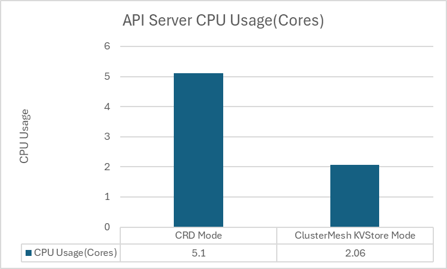
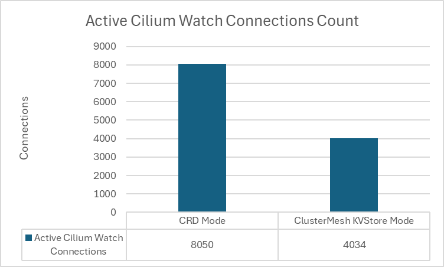
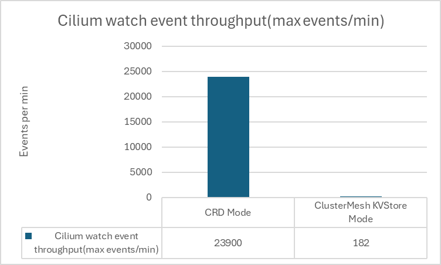
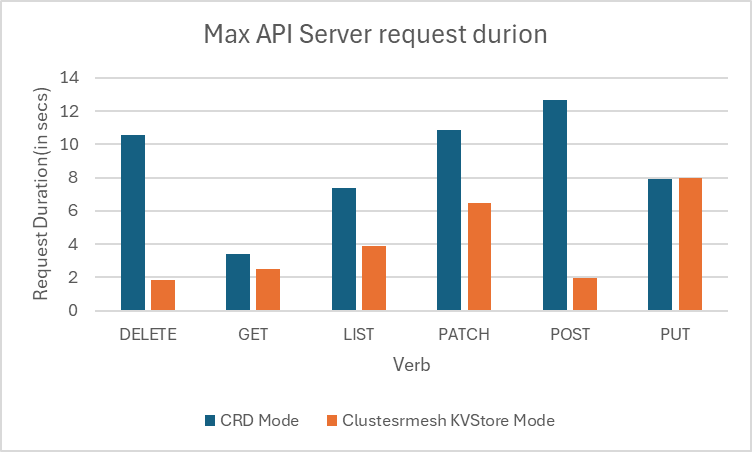
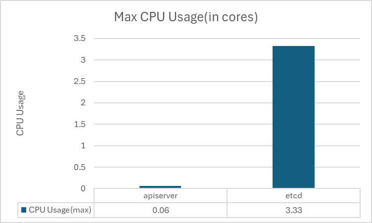
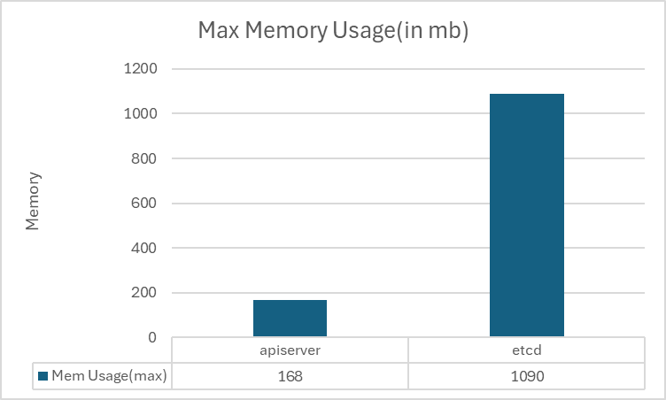
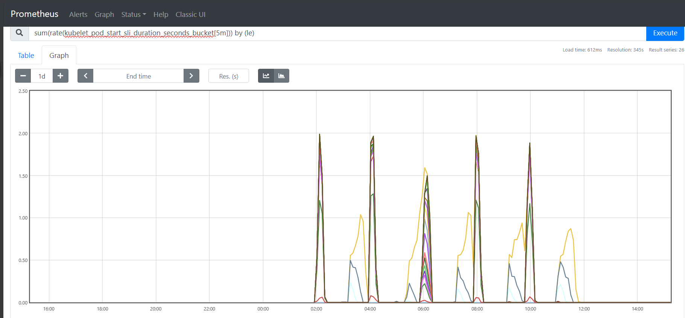
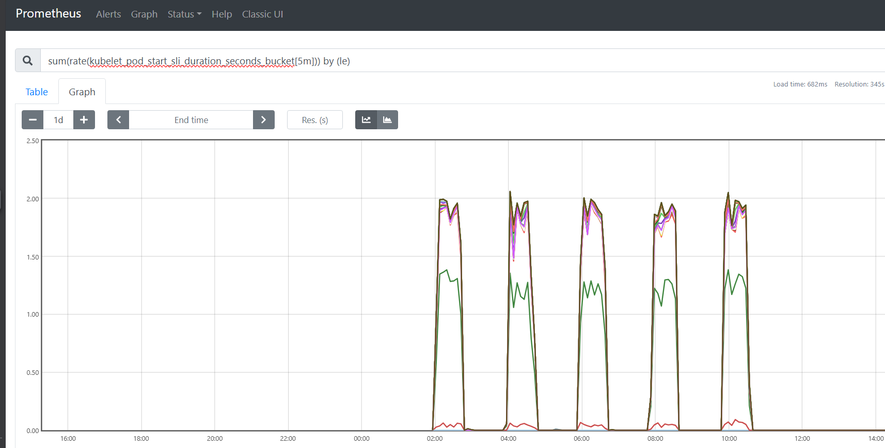

# CFP-44774: Cilium Control Plane at Scale

**SIG: SIG Scalability, SIG-ClusterMesh**

**Begin Design Discussion:** 2026-03-03

**Cilium Release:** 1.20

**Authors:** Sarath Sanam <sarathsa@microsoft.com>, Tamilmani Manoharan <tamanoha@microsoft.com>, Vipul Singh <singhvipul@microsoft.com>

**Status:** Implementable

## Summary

This CFP proposes reusing the existing ClusterMesh etcd as a non-persistent,
cache-backed data distribution layer to reduce Kubernetes API server load in
large-scale Cilium deployments. Agents read control plane state from ClusterMesh etcd
instead of opening per-agent CRD watches against the API server. Since the
ClusterMesh API Server already supports horizontal scaling, multiple replicas
can distribute the fan-out load. All authoritative state remains in Kubernetes
CRDs; the etcd acts as an ephemeral cache that reconciles automatically on
restart.

## Motivation

In large-scale Kubernetes clusters the Cilium control plane places significant
pressure on the Kubernetes API server. Each Cilium agent maintains multiple
watch streams for custom resources: CiliumIdentity, CiliumEndpointSlice,
CiliumNode, and others leading to high watch event throughput. As the number of
nodes grows, the watch stream count scales linearly (CRD types × agents), and
the API server bears the full fan-out cost: because resources like
CiliumIdentity and CiliumEndpointSlice are cluster-scoped (or relevant to
every node), each agent watches the same set of CRDs, so every update must be
independently serialized and transmitted to every watcher. This drives up API
server CPU consumption and can result in throttling or control plane
instability, especially in environments where scaling API server resources is
constrained or not feasible.

An external KVStore can offload identity watches but still requires a
separately provisioned and managed etcd cluster, and it only partially reduces
API server pressure because endpoint slices and node objects continue to be
served through CRD watches. A solution that offloads all agent CRD watches
while reusing infrastructure that already ships with Cilium would provide a
broader reduction in API server load with minimal operational overhead.

## Goals

* Reduce Kubernetes API server CPU utilization by reducing the watch
  connections and event throughput, improving cluster scalability with
  limited API server resources.
* Utilize ClusterMesh etcd as an alternative datastore, avoiding the need to
  provision and maintain a separate external KVStore.
* Enable ClusterMesh etcd to work with a single cluster as a database
  provider, without forcing users into multi-cluster meshing.

## Non-Goals

* Implementing dedicated centralized control plane activities (network policy
  calculations, ipcache) in the ClusterMesh API Server.

## Proposal

### Overview

To reduce Kubernetes API server load, we propose utilizing the existing
ClusterMesh etcd as a non-persistent, cache-backed datastore for agent
reads. Because the ClusterMesh API Server and its etcd are already part of
the Cilium deployment model, this approach adds no additional operational
burden. On restart, the ClusterMesh API Server re-synchronizes the full
state from the API server into etcd, making the etcd instance ephemeral
and operationally simpler. Since the ClusterMesh API Server already
supports horizontal scaling, multiple replicas can distribute the fan-out
load across agents.

**Scope of offloading:** This proposal offloads agent *reads* of Cilium CRDs
(CiliumIdentity, CiliumEndpoint, CiliumEndpointSlice and CiliumNode) from
the API server.
Agents and the operator continue to *write* CRDs to the Kubernetes API server
as they do today. Additionally, Kubernetes-native resources such as Services,
Endpoints, Pods, and Nodes are not covered by this proposal, agents continue
to watch these directly from the API server.

**KVStoreMesh container:** In single-cluster mode the KVStoreMesh container
within the ClusterMesh API Server pod can be disabled, since its primary
function is to copy remote cluster state into the local etcd and there are no
remote clusters to sync from in this mode.

**Horizontal scaling (existing ClusterMesh capability):** Each ClusterMesh API
Server replica runs its own independent etcd instance. There is no
cross-replica consistency or replication between these etcd instances. Each
replica independently watches the API server and populates its own etcd. Agents connect to one replica via sticky connections and stay connected to that replica
for the duration of the connection. If a replica goes down, the agent
reconnects to another replica and performs a full re-sync from scratch.

**Bootstrap and connectivity:** Deploying the ClusterMesh API Server inside
the same cluster whose agents depend on it creates a bootstrap problem:
agents need ClusterMesh etcd for control plane state, but the ClusterMesh
API Server itself may need functioning agents for pod networking or Service
IP routing. To address this, we propose two options:

1. **Pod networking mode (recommended)**: The ClusterMesh API Server runs as
   a regular pod (no host networking) and is exposed via a Kubernetes
   Service. Agents attempt to connect to ClusterMesh etcd at startup; if the
   connection fails or is not yet available, agents fall back to reading
   CRDs directly from the Kubernetes API server. Once the ClusterMesh API
   Server becomes reachable, agents switch over to reading from ClusterMesh
   etcd. This mode requires no special scheduling or networking
   configuration and is operationally identical to a standard Cilium
   deployment.

2. **Host networking mode**: The ClusterMesh API Server runs with
   `hostNetwork: true`, bypassing the need for CNI-provided pod networking.
   Agents discover the ClusterMesh API Server by watching its Pod resource
   from the Kubernetes API server to obtain the host IPs, then connect
   directly to those IPs. This avoids depending on Service IP datapath
   programming (which Cilium would need to provide) but
   introduces host port conflicts and requires agents to maintain a
   lightweight watch on the ClusterMesh API Server pods for IP discovery
   and failover when pods reschedule to different nodes.

The initial POC focuses on quick tweaks to the cilium-agent and
ClusterMesh API Server to utilize the ClusterMesh etcd as the Cilium
datastore and compare the resulting improvements in K8s API server resource
utilization.

### Non-Persistent etcd and Reconciliation

The ClusterMesh etcd is already non-persistent in existing multi-cluster
deployments. It operates as an ephemeral cache rebuilt from the
source-of-truth on every restart, with agents reconciling their local state
after reconnecting. This proposal simply applies the same proven model to
single-cluster control plane distribution. No durable storage is required, and
operational failures (pod eviction, node drains, OOM kills) are handled
gracefully through ClusterMesh's existing reconciliation mechanisms.

#### Trade-offs

* **Duplication overhead**: Cilium CRDs are written to the API server by the
  operator/agents and then mirrored into ClusterMesh etcd by the API Server
  component. Until direct etcd writes are implemented,
  every state change traverses both paths.
* **New dependency for single-cluster deployments**: Clusters that do not
  otherwise use ClusterMesh now depend on the ClusterMesh API Server and its
  etcd for core control plane functionality.
* **Reconciliation storm after restart**: When the ClusterMesh API Server or
  its etcd restarts, a full re-list of all Cilium CRDs is performed against
  the Kubernetes API server. In very large clusters this burst of API server
  reads can cause a transient load spike, partially offsetting the steady-state
  savings.
* **Stale data window**: During a ClusterMesh API Server or etcd restart,
  agents operate on cached (potentially stale) state. New pods scheduled
  during this window may not receive identity or endpoint information until
  reconciliation completes, delaying their network readiness.
* **Additional resource consumption**: The ClusterMesh API Server replicas
  and their etcd instances consume cluster CPU and memory. For smaller
  clusters where API server pressure is not a bottleneck, this overhead may
  not be justified.

### Reconciliation and Restart Test Scenarios

In addition to steady-state performance comparisons, the following scenarios
validate the correctness and resilience of the ClusterMesh KVStore Mode under
failure and restart conditions:

| Scenario | Description | Expected Outcome |
| --- | --- | --- |
| **ClusterMesh API Server restart** | Kill and restart the ClusterMesh API Server pod during active workload churn. | API Server re-lists all Cilium CRDs and re-populates etcd. Agents reconnect and converge to correct state. No datapath disruption. |
| **ClusterMesh etcd restart** | Delete the etcd pod (non-persistent storage) while agents are actively watching. | etcd restarts with empty state; ClusterMesh API Server performs full reconciliation. Agents re-list from etcd after reconnect. |
| **Cilium agent restart** | Restart a subset of cilium-agent pods while the ClusterMesh etcd is serving state. | Restarted agents reconnect to etcd, perform a full re-list, and reconcile local state. Datapath is restored without re-watching the API server. |
| **Rolling upgrade of ClusterMesh API Server** | Perform a rolling restart of ClusterMesh API Server replicas under load. | At least one replica remains available at all times (when running multiple replicas). Agents failover to healthy replicas. Full state consistency after rollout completes. |
| **Scale-up of ClusterMesh API Server replicas** | Increase the replica count while agents are connected. | New replicas independently sync from the API server. Existing agent connections remain sticky to their current replica; only new or reconnecting agents may land on the new replicas. Load distribution improves gradually over time. |

### Modes Under Test

#### CRD Mode (Baseline)

The standard Cilium configuration. All Cilium state - identities, endpoints,
endpoint slices, and node objects is maintained as Kubernetes Custom
Resources and managed via the K8s API server.

* Operator-managed identity enabled
* CiliumEndpointSlice with Slim enabled (creation of CES from K8s Pods)

#### ClusterMesh KVStore Mode

ClusterMesh KVStore Mode uses the ClusterMesh etcd as an alternative data
distribution layer instead of having all agents depend directly on the
Kubernetes API server.

The ClusterMesh API Server watches Cilium CRDs from the Kubernetes API
server and synchronizes them into its embedded etcd instance. Agents
consume control plane state from etcd instead of maintaining direct CRD
watches against the API server.

* Operator-managed identity enabled
* CiliumEndpointSlice with Slim enabled (creation of CES from K8s Pods)
* ClusterMesh API Server watches all Cilium CRDs (Identity, CES, CEP,
  CiliumNode) and syncs to clustermesh-embedded etcd
* `read-ces-from-clustermesh` (custom flag; name reflects initial CES focus
  but applies to all offloaded CRDs) enables agents to read Cilium resources
  from ClusterMesh etcd instead of the API server

### Metrics Measured

| Metric | Prometheus Metric |
| --- | --- |
| **API Server CPU** | `process_cpu_seconds_total` |
| **Watch Event Throughput** | `apiserver_watch_events_total` |
| **API Server Request/Response Latency** | `apiserver_request_duration_seconds_bucket` |
| **ClusterMesh API Server CPU** | `container_cpu_usage_seconds_total` |
| **ClusterMesh API Server Memory** | `container_memory_usage_bytes` |
| **Pod Startup Latency** | `kubelet_pod_start_sli_duration_seconds_bucket` |

### Test Setup

| Parameter | Value |
| --- | --- |
| **K8s API Server** | 8 vCPU / 32 GB |
| **Nodes** | 1,000 worker nodes per cluster (4 vCPU / 16 GB) |
| **Control Plane** | 1 control-plane node (8 vCPU / 32 GB) |
| **Kubernetes** | v1.31 (kubeadm) |
| **Cilium Chart** | v1.19.0-dev |
| **Load Generator** | ClusterLoader2 |
| **Namespaces** | 1,000 |
| **Pods** | 40,000 |
| **Deployments** | 4,000 |
| **Pod Deployment Rate** | 100 pods/sec |

**Workload churn methodology:** Pods are deployed, then deleted. The system
waits 15 minutes for the operator to clean up Cilium identities before
repeating the load churn. Each mode completes **3 churn cycles** under
identical conditions.

Each mode is deployed on its own independent cluster so results are not
cross-contaminated.

### Test Results

#### API Server CPU Utilization

API server CPU utilization dropped by over 50% in ClusterMesh KVStore mode compared to CRD Mode.

#### Watch Connections and Watch Event Throughput

Watch connections dropped by **50%** in ClusterMesh KVStore mode compared to
CRD Mode.

Watch events per minute dropped by **more than 95%** in ClusterMesh KVStore
mode compared to CRD Mode.

#### API Server Request/Response Latency

Request latency performs better in ClusterMesh KVStore mode, with a significant reduction in latency(data is for 99th percentile latency).

#### ClusterMesh API Server CPU and Memory Usage

Clustermesh API server containers(i.e apiserver and etcd) CPU and memory usage remained stable during the test, with no significant spikes during workload churn.

#### API Server Pod Startup Latency

Nomesh - Pod startup latency

Mesh - Pod startup latency

There is not a significant difference in pod startup latency between the two modes, indicating that the additional layer of indirection through ClusterMesh etcd does not introduce noticeable delays in pod readiness.

#### Observations

* **K8sAPI server memory usage (RSS)** remained the same across both modes as the data is still stored in the API server.
* **Cilium Agent CPU and memory usage** remained stable across both modes.

## Impacts / Key Questions

* **Bootstrap deployment mode and host networking feasibility**: Two modes
  are proposed (pod networking with API server fallback, and host networking
  with direct IP discovery). Validate that the recommended pod networking
  mode with fallback handles all edge cases correctly: agent startup
  ordering, switchover from API server to ClusterMesh etcd mid-stream, and
  behavior when the ClusterMesh API Server is permanently unavailable. For
  the host networking mode, validate whether `hostNetwork: true` is
  acceptable from a security and port-conflict perspective, and whether the
  agent-side Pod watch for IP discovery adds meaningful API server load.
* **Reconciliation storm impact**: Measure the transient API server load
  spike caused by a full CRD re-list when the ClusterMesh API Server or its
  etcd restarts in large clusters.

## Future Milestones

* **Direct writes to ClusterMesh etcd**: Eliminate the duplication overhead
  where every CRD mutation traverses both the Kubernetes API server and
  ClusterMesh etcd. Agents and the operator would write Cilium state directly
  to the ClusterMesh etcd, removing the extra API server round-trip and
  reducing end-to-end propagation latency. (Currently a non-goal for this
  CFP, but can be an evolution of this work.)
* **Centralized control plane operations**: Move compute-intensive control
  plane activities such as network policy calculation and ipcache computation
  into the ClusterMesh API Server, reducing per-agent CPU overhead and
  enabling consistent, cluster-wide policy evaluation. (Currently a non-goal
  for this CFP, but can be a natural evolution of the architecture.)
* **Multi-cluster integration**: Ensure the single-cluster KVStore mode
  composes cleanly with existing multi-cluster ClusterMesh deployments,
  allowing clusters that use this optimization to also participate in
  cross-cluster service discovery and identity sharing.
