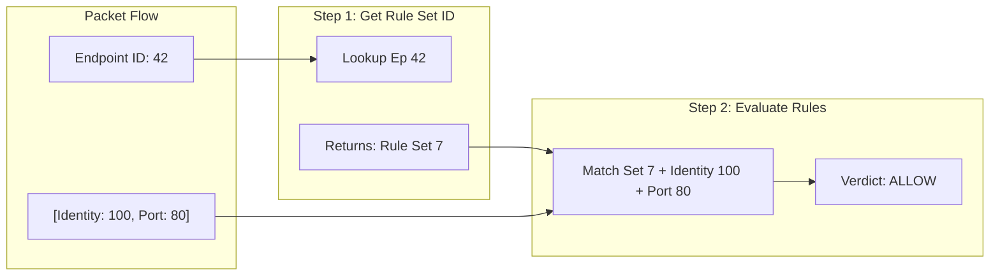

# CFP-45118: Shared Policy LPM

**SIG: SIG-Policy, SIG-Datapath, SIG-Scalability** 

**Begin Design Discussion:** 2026-04-01

**Cilium Release:** 1.20+

**Authors:** Tsotne Chakhvadze <tsotne@google.com>

**Status:** Proposal

# Sharing Policy Maps to Save Memory (Without BPF Arena)

## Summary

This proposal introduces a **Shared LPM Trie architecture** to deduplicate network policy rules across endpoints on a single node. 

Currently, Cilium creates a per-endpoint policy map. If multiple pods run the same application profile (e.g. 1000 replicas of a microservice), Cilium creates replicate rules for each endpoint. This architecture proposes a single, node-wide Shared LPM Trie map where endpoints share a single set of rules, reducing control-plane memory usage significantly.

This is a practical, immediate alternative to **BPF Arena**, as it works on older kernels and avoids complex pointer management.

## Motivation

As Kubernetes clusters scale to thousands of nodes and tens of thousands of pods, Cilium's per-endpoint policy architecture faces critical scaling bottlenecks:

1.  **Per-Endpoint Map Exhaustion**: Each endpoint has a fixed-size policy map (typically 16,384 entries). Complex environments with fine-grained segmentations can exceed this limit, causing policy drops or failures to attach.
2.  **Node Memory Pressure**: Replicating the same rule set across thousands of pods consumes gigabytes of memory per node. This reduces the memory available for user applications and increases infrastructure costs.
3.  **Bpf Arena Blockers**: While BPF Arena can solve this, it requires very new kernels (Linux 6.9+) and introduces native pointer complexities that slow down adoption.

Most memory savings (estimated ~99%) come from **Rule Set Sharing** (Level 1 Deduplication). We can achieve this blocking requirement immediately using standard, broadly supported BPF primitives (`BPF_MAP_TYPE_LPM_TRIE`) that work on older kernels. This allows us to scale to massive clusters without hitting map limits or wasting node RAM.

## Goals

*   **Memory Efficiency**: Reduce node memory footprint by sharing rule sets across identical endpoints.
*   **Kernel Compatibility**: Support older kernels without requiring Arena.
*   **Safety**: Change rules without dropping packets or accidentally mixing up different apps

## Non-Goals

*   Per-rule fine-grained pointer sharing (Level 2 Deduplication), which remains the domain of future BPF Arena enhancements.

## Proposal

### Overview

The design replaces the private per-endpoint policy map with a two-stage lookup mechanism using two BPF maps:

1.  **Overlay Map** (Hash): Maps an `Endpoint ID` to a `Rule Set ID`.
2.  **Shared LPM Trie Map** (Global): Maps `Rule Set ID` + packet details to a verdict.



### 1. BPF Maps Structure

#### The Overlay Map (Endpoint → Rule Set ID)

```c
struct {
    __uint(type, BPF_MAP_TYPE_HASH);
    __type(key, __u16); // Endpoint ID
    __type(value, __u32); // Rule Set ID
    __uint(max_entries, 65535); // Example size
} cilium_policy_overlay SEC(".maps");
```

#### The Shared Rules Map (LPM Trie)

The key combines the `rule_set_id` with protocol selectors.

```c
struct shared_policy_key {
    __u32 prefixlen;      // LPM prefix length
    __u32 rule_set_id;    // Scopes the rules to a set
    __u32 sec_label;      // Destination Security Identity
    __u8 egress;          // Direction
    __u8 protocol;        // L4 Proto
    __u16 dport;          // Dest Port
} __attribute__((packed));

struct policy_entry {
    __be16 proxy_port; 
    __u8 deny;        
    __u8 wildcard_protocol;
    __u8 wildcard_dport;
    __u16 auth_type;
    __u8 pad;
    __u8 pad2;
};

struct {
    __uint(type, BPF_MAP_TYPE_LPM_TRIE);
    __type(key, struct shared_policy_key);
    __type(value, struct policy_entry);
    __uint(max_entries, 1000000); // Configurable example
    __uint(map_flags, BPF_F_NO_PREALLOC);
} cilium_policy_shared SEC(".maps");
```

### 2. Userspace Manager (Go)

The Go agent manages the rules and tells BPF what to do.

*   **Finding if a Rule Set already exists (Zero Collisions)**: 
    Go takes a "fingerprint" (hash) of the rules. If another app has the exact same fingerprint, Go double-checks them line-by-line to be 100% sure they are identical. If they match, they share the same rules. If they don't, Go gives them a new ID. This guarantees no two different configs accidentally mix.
*   **Updating rules without dropping packets**: 
    If a rule changes for a group of endpoints, Go does not edit the live rules directly (which could cause temporary packet drops or security holes while editing). Instead, Go:
    1.  Creates a **brand new copy** of the new rules in the Shared Map with a new ID.
    2.  Instantly flips the switch in the Overlay Map to point the endpoints to the new ID. Packets flow without problem.
    3.  **Cleans up** (deletes) the old rules once no endpoints are using them anymore to free up memory.

## Impacts / Key Questions

### Impact: Memory Scale

Calculated based on 500 rules per application profile across 1000 pods (10 application types total).

| Feature Type | Total Graph Rules | Est. Node Memory |
| :--- | :--- | :--- |
| **Legacy (Individual maps)** | $500,000\text{ items}$ | $\approx 50\text{ MB}$ |
| **Proposed (Shared LPM)** | $5,000\text{ items}$ | $\approx \text{Less than } 1\text{ MB}$ |

### Key Question: Map Limitations
The `BPF_F_NO_PREALLOC` flag is vital here so memory is only committed on demand, preserving metrics if max_entries is set high (e.g., millions).

## Future Milestones

### BPF Arena Consolidation
In the future we can transition to Level 2 Deduplication via BPF Arena without breaking the API surface between Go and BPF.