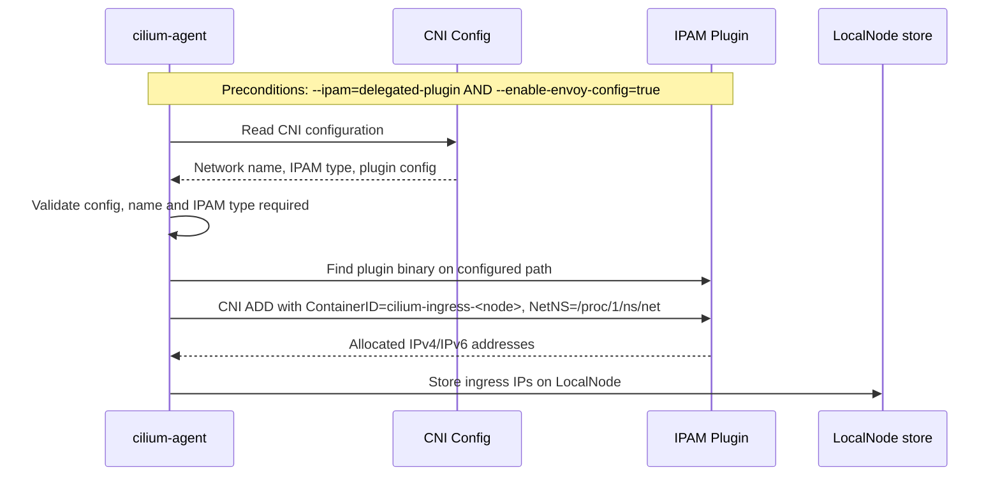
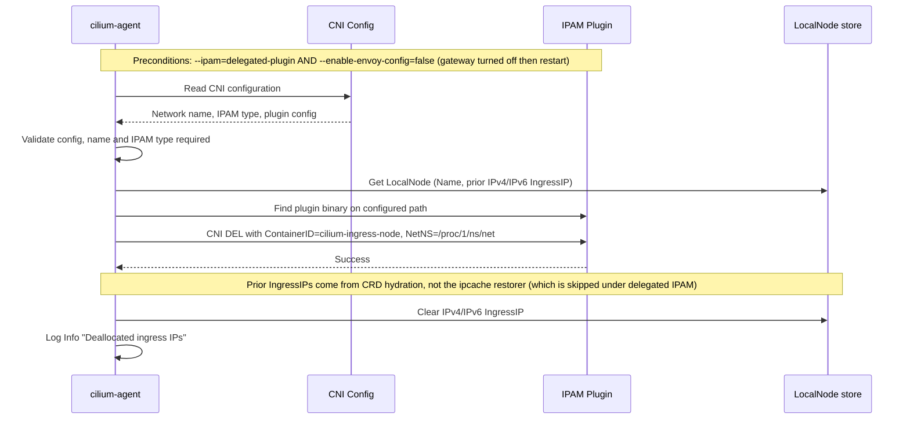

# Delegated IPAM for Gateway API Ingress IPs

**SIG: sig-agent**

**Begin Design Discussion:** 2026-04-21

**Cilium Release:** 1.20

**Authors:** Apurup Chevuru <achevuru@microsoft.com>, Mathew Merrick <matmerr@microsoft.com>

**Status:** Implementable

**Related CFP:** [Delegated IPAM Cilium IPs][cfp-delegated-ipam]


## Summary

Enable Gateway API / Ingress Controller (`--enable-envoy-config`) when Cilium is running with `--ipam=delegated-plugin`, by having cilium-agent invoke the delegated IPAM plugin directly to allocate and release ingress IPs.


## Motivation

Cilium's delegated IPAM mode hands off all IP address management to an external CNI IPAM plugin. For ingress IP allocation to work, we need to allocate IPs outside the pod lifecycle for the node ingress IP.

The allocation is currently [blocked at startup][cilium-ipam-block], since there's no flow to allocate this IP from the delegated IPAM.

```bash
--enable-envoy-config must be disabled with --ipam=delegated-plugin
```

## Goals

* Support Gateway API / Ingress Controller with delegated IPAM by allocating ingress IPs via the external IPAM plugin.
* Avoid IP leaks across agent restarts
* Compatible with any delegated IPAM CNI plugin
* Keep the existing non-delegated IPAM code path unchanged


## Non-Goals

* This does not extend to endpoint health checking IPs like the previously mentioned CFP.
* This does not propose changes to other IPAM modes.

## Proposal

### Overview

- When Gateway API is enabled (`--enable-envoy-config=true`) and IPAM is set to `delegated-plugin` (`--ipam=delegated-plugin`), cilium-agent invokes the delegated IPAM plugin directly to allocate an ingress IP at startup. 
- When Gateway API is later disabled (`--enable-envoy-config=false`) while `--ipam=delegated-plugin` is still set, the next agent startup invokes the plugin to release the prior IP. 
- ADD requires `--enable-envoy-config=true AND --ipam=delegated-plugin`.
- DEL requires `--enable-envoy-config=false AND --ipam=delegated-plugin`.
- The two paths are mutually exclusive: every startup runs at most one of them.

This builds on the approach proposed in the [original CFP][cfp-delegated-ipam], but scoped to ingress IPs.


### Stable container ID

For ingress IPs we use `cilium-ingress-<node-name>` we use as `CNI_CONTAINERID` for a determinstic node-scoped reproducable key, which is appropriate for a single ingress IP.

* Is stable across agent restarts on the same node, so IPAM plugins that key allocations by container ID return the same IP and avoid IP churn.
* Is unique per node, avoiding collisions in delegated IPAM plugins backed by a cluster-wide store (where `CNI_CONTAINERID` may be a global key).

The other CNI parameters have defaults in the CNI call since we're only doing IPAM, not actual network plumbing:

* `CNI_NETNS` = `/proc/1/ns/net` (host network namespace)
* `CNI_IFNAME` = `eth0` (must match between ADD and DEL, since many IPAM plugins key bookkeeping on container ID + ifname)
* `K8S_POD_NAME` = `cilium-ingress-<node-name>`
* `K8S_POD_NAMESPACE` = `kube-system`

We also append [`CNI_NETNS_OVERRIDE=1`][cni-netns-override] to the environment, to avoid CNI spec validation around actual netns creation.


### Plugin binary path and volume mounts

Since the agent is now responsible for calling IPAM binaries directly, as opposed to kubelet/runtime on the host, this scenario requires exposing CNI bin folder and conflist folder to the agent. 

The agent locates the IPAM plugin binary using a configurable path, `--delegated-ipam-cni-bin-path` (default `/host/opt/cni/bin`). 

* The default assumes the standard cilium DaemonSet host mount of `/opt/cni/bin` to `/host/opt/cni/bin`.
* On distributions that place CNI plugins elsewhere (or in environments that mount the host bin directory at a different path), the flag must be set to the in-container path of the plugin binary.


## Allocation

During daemon startup, if Gateway API is enabled and IPAM is delegated, cilium-agent allocates ingress IPs through the external IPAM plugin:




### Allocation notes

* `LocalNode.IPv4/IPv6IngressIP` is hydrated at startup from the CiliumNode CRD `Spec.IngressAddressing` and Kubernetes Node annotations before allocation runs (see [Extra clarification for CiliumNode resources](#extra-clarification-for-ciliumnode-resources)). The hydrated value is overwritten by whatever the plugin returns, it is not used to gate the call.
* ADD always runs when `--enable-envoy-config=true && --ipam=delegated-plugin`, including on every restart where a prior lease may already exist. The external IPAM plugin is the source of truth for ingress IP ownership, so the agent re-asserts its claim on every startup rather than trusting locally cached state. This is symmetric with the DEL-on-startup path (see [Deallocation](#deallocation)) and with the [ipcache restorer skip](#skipping-ingress-prefix-restoration-in-the-ipcache).
* Repeat ADDs are safe because the call is keyed by `(CNI_CONTAINERID=cilium-ingress-<node>, CNI_IFNAME=eth0)`, both of which are deterministic per node (see [Stable container ID](#stable-container-id)). Well-behaved IPAM plugins detect the existing binding and return the same IP. A plugin that allocated fresh on every ADD would already be incompatible with normal pod lifecycle (where the kubelet retries ADDs after sandbox restarts), so the leak hazard is not specific to ingress.

## Deallocation

Deallocation issues a CNI DEL with the proposed fixed container ID, ifname, and netns used for ADD.

DEL is invoked at the start of the next agent run, gated on `--enable-envoy-config=false && --ipam=delegated-plugin`, rather than on shutdown. The agent has no reliable shutdown hook (SIGKILL, OOM, node reboot, or a config flip while the agent is down all bypass shutdown handlers), so the next startup is the only point where we can deterministically guarantee the prior lease is released.



The diagram shows the happy success path (DEL ran, lease released, LocalNode cleared), other outcomes below in [deallocation states](#deallocation-states).

### Deallocation states 
### For each state assume `ipam=delegated-plugin`:

* **`--enable-envoy-config=true` -> `--enable-envoy-config=false`, agent restart:**
  * Prior ADD allocated an ingress IP.
  * On restart the DEL gating (`!EnableEnvoyConfig && IPAM == DelegatedPlugin`) is satisfied, so cilium-agent invokes the IPAM plugin with `CNI_COMMAND=DEL` and the deterministic ContainerID/ifname.
  * The prior lease is released, LocalNode is cleared, and the external pool reclaims the IP.
* **`--enable-envoy-config=false` -> `--enable-envoy-config=false`, agent restart (or first-ever startup with `--enable-envoy-config=false`):**
  * No prior ADD has been issued from this node.
  * DEL still runs. Per the [CNI spec][cni-spec-lifecycle], repeated or unmatched DELs must be accepted, so the call is a safe no-op when no prior lease exists.
* **`--enable-envoy-config=true` -> `--enable-envoy-config=false`, agent restart, plugin returns error during DEL** (binary missing, plugin returns non-zero, CNI conf unreadable):
  * The error is logged as a warning.
  * LocalNode IPs are deliberately retained, so the next agent startup retries the DEL until it succeeds.
* **`--enable-envoy-config=true` -> `--enable-envoy-config=true`, agent restart:**
  * DEL gating is not satisfied, no DEL is issued.
  * ADD runs again on startup (see [Allocation](#allocation)). The plugin re-asserts the existing `(ContainerID, ifname)` binding and returns the same IP, which is then re-stored on LocalNode.

## Additional Notes

### Comparison with pod IP lifecycle under delegated IPAM

Pod IPs follow a different lifecycle than ingress IPs and continue to be restored across agent restarts:

* **If the pod is still alive:** its external lease persists, cilium-agent re-adopts the existing IP from endpoint state on restart. Liveness is reconciled in [`validateEndpoint`][endpoint-restore-l299] for each endpoint loaded from on-disk state: the agent looks the pod up in the [Kubernetes pod cache][endpoint-restore-l351] (must exist and have `Spec.NodeName == this node`) and verifies the endpoint's datapath devices are still present via [`ValidateConnectorPlumbing`][endpoint-restore-l338]. Endpoints that fail either check are queued for cleanup and their IPs released.
* **If the pod was deleted while the agent was down:** cilium-cni issues `DelegateDel` itself (independent of cilium-agent) and persists the corresponding endpoint deletion to a [disk-backed deletion queue][deletion-queue] that the agent drains before downstream consumers run.

Every restored pod IP therefore corresponds to a live external lease, so no separate startup-time DEL flow is required for pods. The ingress IP needs the dedicated DEL path described above precisely because there is no per-pod CNI invocation that would otherwise trigger it.

### Skipping ingress prefix restoration in the ipcache

Additionally, it should be the case that when `--ipam=delegated-plugin`, the ipcache restorer skips the ingress branch (no metadata re-insert, no `LocalNode.IPv4/IPv6IngressIP` write) for every prior `reserved:ingress` prefix, via an early `continue` in [`restoreIPCache`][local-identity-restorer-l189].

```go
if d.params.DaemonConfig.IPAM == ipamOption.IPAMDelegatedPlugin {
    d.params.Logger.Info("Skipping ingress IP restoration with delegated IPAM", logfields.Ingress, prefix)
    continue
}
```

- **Why skip:** during agent startup [`AllocateIPs`][daemon-l217] already issues an ADD (`--enable-envoy-config=true`) or DEL (`--enable-envoy-config=false`) and should be the source of truth. Letting the restorer run first would plant a `reserved:ingress` binding that neither path cleans up: the ADD path only overwrites `LocalNode.IPv4/IPv6IngressIP` with the new address and never touches the prior prefix in the ipcache, and the DEL path does not walk the ipcache to remove the prior binding either, leaving a stale ingress label on a prefix the plugin can later hand to a pod.
- **Why pods aren't affected:** see [Comparison with pod IP lifecycle under delegated IPAM](#comparison-with-pod-ip-lifecycle-under-delegated-ipam) above. Pod restoration tracks live external leases, so no skip is needed, whereas the ingress IPs lease is strictly tied to the lifecycle of the agent pod.

### Extra clarification for CiliumNode resources

The CiliumNode CRD `Spec.IngressAddressing` is the cluster-visible record of the per-node ingress IP. The agent both **reads from** it on startup and **writes to** it on every LocalNode change.

**Hydration on startup (read).** Even with the ipcache restorer skipped, `LocalNode.IPv4/IPv6IngressIP` is repopulated from the [CiliumNode CRD `Spec.IngressAddressing`][node-l96] and the [Kubernetes Node ingress annotations][node-l275]. This happens via [`LocalNodeStore.WaitForNodeInformation`][daemon-l158] before [`AllocateIPs`][daemon-l217] runs. The hydrated value is informational only, allocation always re-issues ADD and overwrites it with whatever the plugin returns.

**Propagating DEL to the CRD (write).** The DEL clears `LocalNode.IPv4/IPv6IngressIP` in memory, and [`mutateNodeResource`][nodediscovery-l376] then propagates that to the CRD on the next sync, assigning `""` when `LocalNode.IngressIP` is nil. This happens in [`daemon.go`][daemon-l217-2]:

1. [`AllocateIPs(ctx)`][daemon-l217] executes first, the DEL cleanup completes before it returns.
2. [`NodeDiscovery.StartDiscovery(ctx)`][daemon-l223] runs next, and its [first LocalNode update is processed synchronously][nodediscovery-l112] before the function returns, writing `IngressAddressing.IPV4/IPV6 = ""` to the CRD.

The early [`UpdateCiliumNodeResource()`][daemon-l151] is gated to ClusterPool/MultiPool IPAM, so for `delegated-plugin` it does not run, there is no premature CRD write that could republish the prior IP between hydration and DEL.

<!-- Reference links -->


[cfp-delegated-ipam]: https://github.com/cilium/design-cfps/blob/main/cilium/CFP-TODO-delegated-ipam-cilium-ips.md
[cilium-ipam-block]: https://github.com/cilium/cilium/blob/70ae8d0ef536de807aab849291e5a68758cb8d4d/pkg/option/config.go#L3803
[cni-netns-override]: https://github.com/containernetworking/cni/pull/890
[cni-spec-lifecycle]: https://github.com/containernetworking/cni/blob/main/SPEC.md#lifecycle--ordering
[daemon-l151]: https://github.com/cilium/cilium/blob/a1afcb4b88db6d3160b4c315ad8796748b30fbe8/daemon/cmd/daemon.go#L151-L156
[daemon-l158]: https://github.com/cilium/cilium/blob/a1afcb4b88db6d3160b4c315ad8796748b30fbe8/daemon/cmd/daemon.go#L158
[daemon-l217-2]: https://github.com/cilium/cilium/blob/a1afcb4b88db6d3160b4c315ad8796748b30fbe8/daemon/cmd/daemon.go#L217-L224
[daemon-l217]: https://github.com/cilium/cilium/blob/a1afcb4b88db6d3160b4c315ad8796748b30fbe8/daemon/cmd/daemon.go#L217
[daemon-l223]: https://github.com/cilium/cilium/blob/a1afcb4b88db6d3160b4c315ad8796748b30fbe8/daemon/cmd/daemon.go#L223
[endpoint-restore-l299]: https://github.com/cilium/cilium/blob/a1afcb4b88db6d3160b4c315ad8796748b30fbe8/daemon/cmd/endpoint_restore.go#L299-L350
[endpoint-restore-l338]: https://github.com/cilium/cilium/blob/a1afcb4b88db6d3160b4c315ad8796748b30fbe8/daemon/cmd/endpoint_restore.go#L338
[endpoint-restore-l351]: https://github.com/cilium/cilium/blob/a1afcb4b88db6d3160b4c315ad8796748b30fbe8/daemon/cmd/endpoint_restore.go#L351-L366
[deletion-queue]: https://github.com/cilium/cilium/blob/main/plugins/cilium-cni/lib/deletion_queue.go#L259-L271
[local-identity-restorer-l189]: https://github.com/cilium/cilium/blob/a1afcb4b88db6d3160b4c315ad8796748b30fbe8/pkg/ipcache/restore/local_identity_restorer.go#L189
[node-l275]: https://github.com/cilium/cilium/blob/a1afcb4b88db6d3160b4c315ad8796748b30fbe8/pkg/k8s/node.go#L275-L303
[node-l96]: https://github.com/cilium/cilium/blob/a1afcb4b88db6d3160b4c315ad8796748b30fbe8/pkg/node/types/node.go#L96-L97
[nodediscovery-l112]: https://github.com/cilium/cilium/blob/a1afcb4b88db6d3160b4c315ad8796748b30fbe8/pkg/nodediscovery/nodediscovery.go#L112-L149
[nodediscovery-l376]: https://github.com/cilium/cilium/blob/a1afcb4b88db6d3160b4c315ad8796748b30fbe8/pkg/nodediscovery/nodediscovery.go#L376-L384
