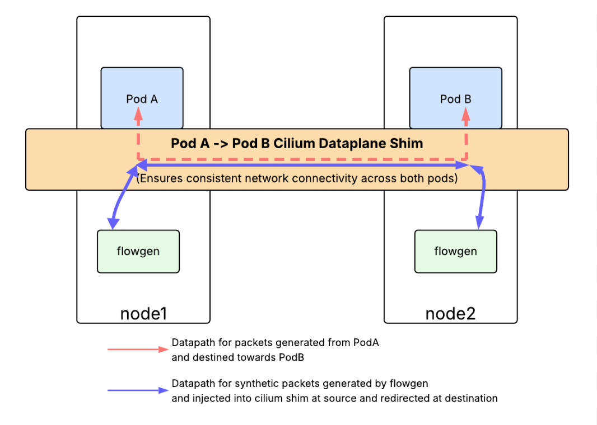
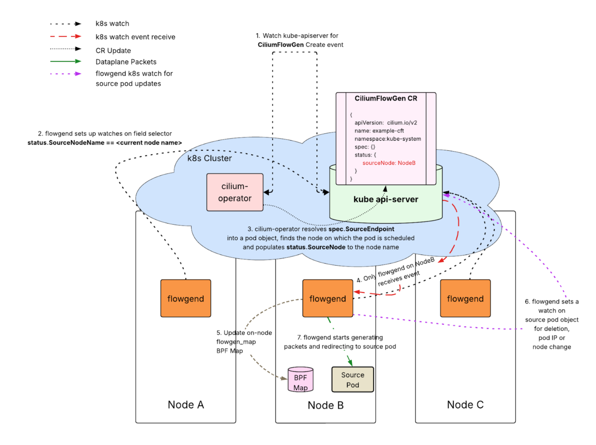
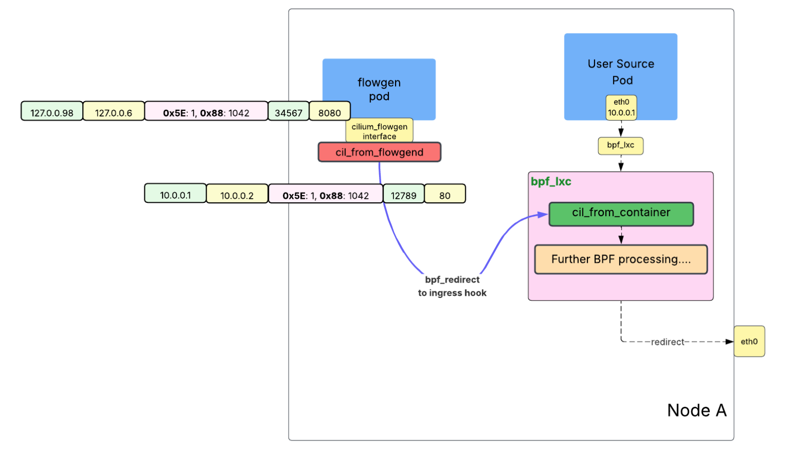
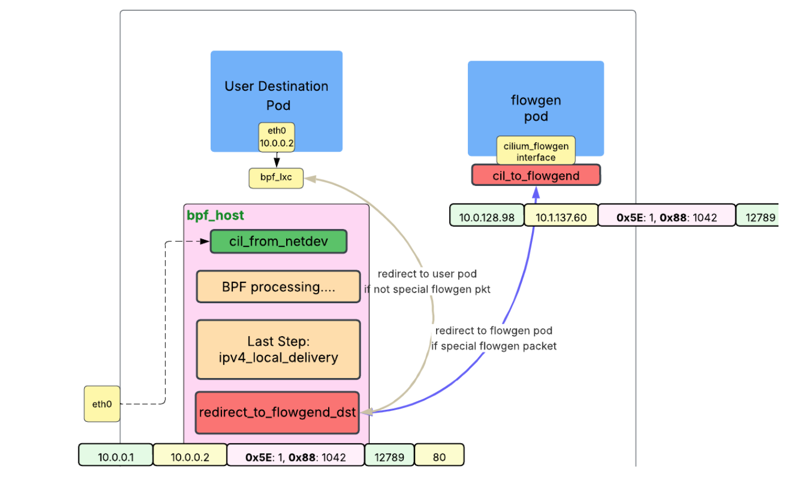
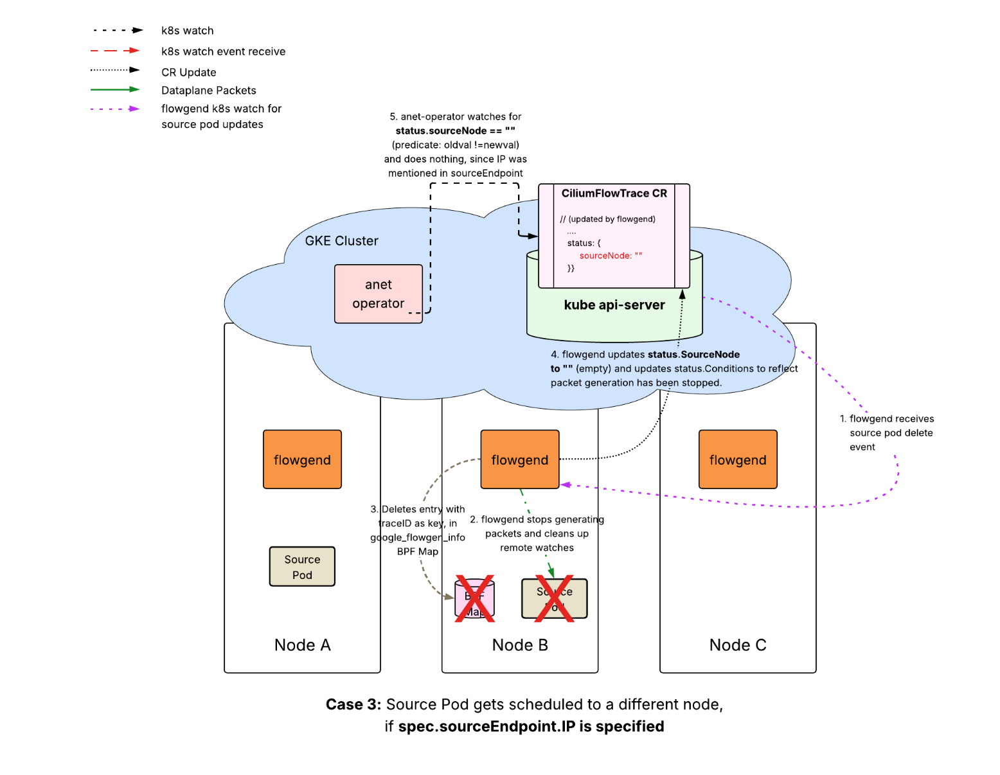
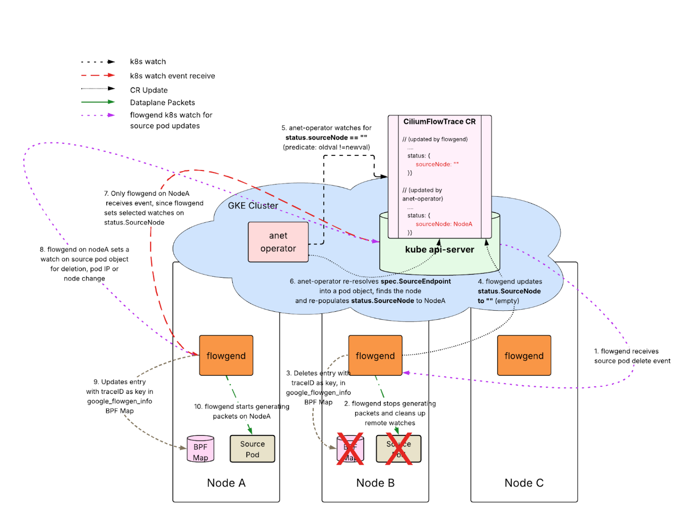

# CFP-46532: FlowGen: Synthetic Flow Generation For Connectivity Testing

# Meta

* **SIG:** SIG-Observability, SIG-Hubble  
* **Sharing:** Public  
* **Begin Design Discussion:** Jun 14, 2026  
* **End Design Discussion:**
* **Cilium Release:** 1.20  
* **Authors:** [Arighna Chakrabarty](mailto:arighnac@google.com)  
* **Status:** Under Review

# Summary

This proposal introduces a dynamic **synthetic flow generation** subsystem (**`FlowGen`**) designed to enhance cross-cluster observability **on demand**. Centered on a robust flow generator system, the architecture enables users to define network traffic and endpoints through the `CiliumFlowGen` API.  It relies on a specialized control plane to schedule synthetic traffic across active workloads, and an eBPF-powered dataplane that modifies the synthetic packets on the fly to make it look like actual user flows. It also provides a way to trace these synthetic flows via Hubble. Crucially, the subsystem preserves workload isolation by ensuring synthetic packets never enter the user pod namespace, while still validating the end-to-end dataplane trajectory that an actual packet travels through.



# Motivation

Such a system is highly useful in the following cases:

* **On-Demand Connectivity Validation**: Allow developers and operators to quickly generate network flows across multiple endpoints via an API. This enables users to perform "on-demand" connectivity status checks between any two workloads with less friction. This also enables users to perform network validations before productionalizing workloads on k8s clusters.  
    
* **Troubleshooting in the Absence of Live Traffic**: A challenge in resolving network connectivity failures for users is the indeterminate volume of traffic at the time of reproduction. By generating synthetic flows, engineers can proactively induce and diagnose issues without waiting for user traffic, expediting root cause analysis.

* **Extract Important Debugging State out of the Dataplane:** Synthetic probes can act as a great interface to generate fine-grained debugging state out of Cilium, given that the generation of such packets would be controlled by the API.

# User Stories

* **As a platform administrator** managing multiple clusters in a managed environment, users are reporting connection timeouts reaching destinations in remote clusters. I do not have access to exec into the source pods to start generating traffic. I can immediately use the FlowGen API to start generating synthetic packets between the given source and destination endpoints, and can use Hubble to trace these synthetic flows.

* **As an application owner** who has recently deployed a new application on a k8s cluster, I want to validate the network connectivity between the application endpoints and the external dependencies it relies on before productionalizing the application. I can use the FlowGen API to generate synthetic flows between the application endpoints and the external dependencies it relies on. I can use Hubble to trace these synthetic flows to ensure that the traffic is flowing as expected.

# Goals

* Allow an user to generate synthetic unidirectional flows between two endpoints (pods and service), cluster-internal or external, using a CRD-driven API. TCP, UDP, SCTP and ICMP packet flows are allowed.  
* Isolate synthetic traffic and prevent conflicts with legitimate user flows, while traversing the same dataplane trajectory.  
* Provide the capability to trace these synthetic flows via Hubble.

# Non-goals

* Allow an user to generate bidirectional synthetic flows (a full TCP stream for an example).  
  * Check [Deferred Milestone 2](#deferred-milestone-2).  
* Allow an user to generate synthetic flows across pod groups, or multiple source and destination endpoints.  
  * API is meant for deep, narrowly focused troubleshooting, not for high performance/stress testing.  
* Allow an user to generate synthetic flows for non-IP traffic (e.g., L2 frames).

# Proposal

## Section 1: CiliumFlowGen API

The `CiliumFlowGen` Custom Resource Definition (CRD) serves as the API for synthetic traffic generation. The user can use this API to define the source and destination endpoint for flow generation, the trace ID they want to tag the packets with, and the kind of traffic they want to be generated.

```go
// +genclient
// +genclient:nonNamespaced
// +k8s:deepcopy-gen:interfaces=k8s.io/apimachinery/pkg/runtime.Object
// +kubebuilder:object:root=true
// +kubebuilder:storageversion
// +kubebuilder:resource:path=ciliumFlowGens,scope=Cluster,singular=ciliumFlowGen
// +kubebuilder:subresource:status
// CiliumFlowGen is the Schema for the CiliumFlowGen API
// It defines a set of synthetic flows to be generated between two endpoints, along with an optional trace ID that the synthetic flows would be tagged with.
type CiliumFlowGen struct {
    // +deepequal-gen=false
    metav1.TypeMeta `json:",inline"`
    // +deepequal-gen=false
    metav1.ObjectMeta `json:"metadata,omitempty"`

    // Spec defines the desired state of the CiliumFlowGen resource.
    // It includes all parameters for defining the synthetic flow's 5-tuple, optional trace ID, and flow profile.
    Spec CiliumFlowGenSpec `json:"spec,omitempty"`

    // Status represents the observed state of the CiliumFlowGen resource, detailing
    // its current conditions, the associated generator entity, and any error states.
    Status CiliumFlowGenStatus `json:"status,omitempty"`
}

// CiliumFlowGenSpec defines the desired or expected state of the CiliumFlowGen resource.
//
// Rule 1: The XValidation rule ensures that the SourceEndpoint and DestinationEndpoint are not the same.
// +kubebuilder:validation:XValidation:rule="self.sourceEndpoint != self.destinationEndpoint", message="sourceEndpoint and destinationEndpoint must be different for synthetic flow generation."
//
// Rule 2: Immutability (from previous step).
// +kubebuilder:validation:XValidation:rule="self == oldSelf",message="CiliumFlowGen specification is immutable and cannot be changed after creation."
type CiliumFlowGenSpec struct {
    // SourceEndpoint denotes the source endpoint from where the synthetic flows would be generated.
    // +kubebuilder:validation:Required
    SourceEndpoint FlowEndpoint `json:"sourceEndpoint"`

    // DestinationEndpoint denotes the destination endpoint that would receive the synthetic network flows.
    // +kubebuilder:validation:Required
    DestinationEndpoint FlowEndpoint `json:"destinationEndpoint"`

    // TraceID uniquely distinguishes flows generated from a particular CiliumFlowGen CR.
    // TraceID is injected into the packet into an IPv4 Option Header, and can be used to trace generated flows.
    // TraceID is optional, and is generated automatically if not specified.
    // +kubebuilder:validation:Optional
    TraceID uint64 `json:"traceID"`

    // FlowProfile defines the nature and the configuration of the traffic flows to be generated
    // across the source and destination endpoint (e.g., protocol, packet size, rate).
    // +kubebuilder:validation:Required
    FlowProfile FlowProfile `json:"flowProfile"`
}

// FlowEndpoint identifies a network flow source or destination.
// It can be identified either by a static IP address or by a reference to a Kubernetes Pod.
// +kubebuilder:validation:XValidation:rule="has(self.ip) != has(self.k8sPodKey)",message="Exactly one of 'ip' or 'k8sPodKey' must be specified."
type FlowEndpoint struct {
    // IP is the static IP address of the endpoint.
    // This field could be used for external endpoints or unmanaged entities.
    // +kubebuilder:validation:Optional
    IP string `json:"ip"`

    // Resource is a reference to a Kubernetes Resource in the cluster.
    // +kubebuilder:validation:Optional
    Resource ResourceReference `json:"resource"`
}

// ResourceReference contains a reference to a k8s resource, either a pod or a service.
// +kubebuilder:validation:XValidation:rule="!has(self.apiGroup) || self.apiGroup == ''", message="API Group must be empty ('') for core resources like Pods, Nodes or Services."
type ResourceReference struct {
    // Kind is the type of resource being referenced.
    // +kubebuilder:validation:Enum=Pod;Service,Node
    Kind string `json:"kind"`
   
    // APIGroup holds the API group of the referenced subject (e.g., "" for Pod or Service).
    // +optional
    APIGroup string `json:"apiGroup,omitempty"`
 
    // Name of the object being referenced.
    Name string `json:"name"`
    
    // Namespace of the referenced object.
    // +optional
    Namespace string `json:"namespace,omitempty"`
} 

// Protocol defines the network protocol for the flow.
// +kubebuilder:validation:Enum=TCP;UDP;ICMP;SCTP
type Protocol string
const (
    // ProtocolTCP defines the TCP protocol.
    ProtocolTCP Protocol = "TCP"

    // ProtocolUDP defines the UDP protocol.
    ProtocolUDP Protocol = "UDP"

    // ProtocolICMP defines the ICMP protocol.
    ProtocolICMP Protocol = "ICMP"

    // ProtocolSCTP defines the SCTP protocol.
    ProtocolSCTP Protocol = "SCTP"
)

// FlowProfile defines the characteristics of the network flow.
type FlowProfile struct {
    // ProtocolConfig specifies the network protocol and protocol-specific configurations pertaining to the flow.
    // +kubebuilder:validation:Required
    ProtocolConfig ProtocolConfiguration `json:"protocolConfig,omitempty"`

    // FlowConfig holds general flow properties, such as total duration, interval between flows, and total flow count.
    // If empty, default values are applied.
    // +optional
    FlowConfig *FlowConfiguration `json:"flowConfig,omitempty"`
}

// ProtocolConfiguration specifies the protocol and protocol-specific settings for the flow.
// Only one protocol (TCP, UDP, ICMP, SCTP) can be configured at a time.
// +kubebuilder:validation:XValidation:rule="(has(self.tcp) ? 1 : 0) + (has(self.udp) ? 1 : 0) + (has(self.icmp) ? 1 : 0) == 1",message="Exactly one protocol configuration (tcp, udp, or icmp) must be specified."
type ProtocolConfiguration struct {
    // TCPConfiguration defines configuration for TCP synthetic traffic flows.
    // +optional
    TCP TCPConfiguration `json:"tcp,omitempty"`

    // UDPConfiguration defines configuration for UDP synthetic traffic flows.
    // +optional
    UDP UDPConfiguration `json:"udp,omitempty"`

    // ICMPConfiguration defines configuration for ICMP synthetic traffic flows.
    // +optional
    ICMP ICMPConfiguration `json:"icmp,omitempty"`

    // SCTPConfiguration defines configuration for SCTP synthetic traffic flows.
    // +optional
    SCTP SCTPConfiguration `json:"sctp,omitempty"`
}

// TCPConfiguration defines configuration for TCP traffic flows.
type TCPConfiguration struct {
    // SourcePort defines the source port for generating synthetic TCP flows.
    // Must be between 1 and 65535, inclusive.
    // +kubebuilder:validation:Minimum=1
    // +kubebuilder:validation:Maximum=65535
    // +optional
    SourcePort *uint16 `json:"sourcePort,omitempty"`

    // DestinationPort defines the destination port for receiving synthetic TCP flows.
    // Must be between 1 and 65535, inclusive.
    // If empty, defaults to 80.
    // +kubebuilder:validation:Minimum=1
    // +kubebuilder:validation:Maximum=65535
    // +optional
    DestinationPort *uint16 `json:"destinationPort,omitempty"`
}

// UDPConfiguration defines configuration for UDP traffic flows.
type UDPConfiguration struct {
    // SourcePort defines the source port for generating synthetic UDP flows.
    // Must be between 1 and 65535, inclusive.
    // +kubebuilder:validation:Minimum=1
    // +kubebuilder:validation:Maximum=65535
    // +optional
    SourcePort *uint16 `json:"sourcePort,omitempty"`

    // DestinationPort defines the destination port for receiving synthetic UDP flows.
    // Must be between 1 and 65535, inclusive.
    // If empty, defaults to 53.
    // +kubebuilder:validation:Minimum=1
    // +kubebuilder:validation:Maximum=65535
    // +optional
    DestinationPort *uint16 `json:"destinationPort,omitempty"`
}

// SCTPConfiguration defines configuration for SCTP traffic flows.
type SCTPConfiguration struct {
    // SourcePort defines the source port for generating synthetic SCTP flows.
    // Must be between 1 and 65535, inclusive.
    // +kubebuilder:validation:Minimum=1
    // +kubebuilder:validation:Maximum=65535
    // +optional
    SourcePort *uint16 `json:"sourcePort,omitempty"`

    // DestinationPort defines the destination port for receiving synthetic SCTP flows.
    // Must be between 1 and 65535, inclusive.
    // If empty, defaults to 53.
    // +kubebuilder:validation:Minimum=1
    // +kubebuilder:validation:Maximum=65535
    // +optional
    DestinationPort *uint16 `json:"destinationPort,omitempty"`
}

// ICMPConfiguration defines configuration for ICMP traffic flows.
type ICMPConfiguration struct {
    // Type specifies the ICMP type.
    // Defaults to 8 (Echo Request) if unset.
    // +kubebuilder:validation:Minimum=0
    // +kubebuilder:validation:Maximum=255
    // +optional
    Type *uint8 `json:"type,omitempty"`

    // Code specifies the ICMP code.
    // Defaults to 0 if unset.
    // +kubebuilder:validation:Minimum=0
    // +kubebuilder:validation:Maximum=255
    // +optional
    Code *uint8 `json:"code,omitempty"`
}

// FlowConfiguration holds general parameters for generating network flows.
// +kubebuilder:validation:XValidation:rule="!(has(self.duration) && has(self.flowCount))", message="duration and flowCount are mutually exclusive; only one can be specified."
type FlowConfiguration struct {
    // Interval (in seconds) between two subsequent flows being generated, in seconds.
    // Defaults to 1 second.
    // +kubebuilder:validation:Minimum=1
    // +optional
    Interval Duration `json:"interval,omitempty"`

    // Total duration (in seconds) for which flows should be generated.
    // Cannot be specified if FlowCount is specified.
    // Defaults to 60 seconds (1 minute) if FlowCount is also unset.
    // +kubebuilder:validation:Minimum=1
    // +kubebuilder:validation:Maximum=60
    // +optional
    Duration Duration `json:"duration,omitempty"`
 
    // Number of sequential flows to be initiated by the generator.
    // Cannot be specified if Duration is specified.
    // Defaults to 1 if Duration is also unset.
    // +kubebuilder:validation:Minimum=1
    // +kubebuilder:validation:Maximum=60
    // +optional
    FlowCount uint32 `json:"flowCount,omitempty"`
}

// CiliumFlowGenStatus defines the observed state of CiliumFlowGen CRs
type CiliumFlowGenStatus struct {
    // ObservedGeneration is the latest generation observed by the controller.
    // It is used to reconcile state and determine if the CR has been processed since the last update.
    // +optional
    ObservedGeneration int64 `json:"observedGeneration,omitempty"`

    // SourceNode denotes the node hosting the source endpoint.
    // This is the location from which traffic flows are generated.
    // 
    // Note: If spec.flowGeneratorNode is specified, this field is synchronized to match it.
    // This is a selectable field, and will be available for selection via fieldSelectors.
    // +kubebuilder:selectable
    // +kubebuilder:validation:Optional
    SourceNode string `json:"sourceNode,omitempty"`

    // Conditions represent the latest available observations of the FlowTraceStatus’s state.
    // FlowTrace lifecycle supports the following state machine:
    //
    // State: Created (Start of FlowTrace lifecycle)
    //   type: Ready  => state: false, reason: Unvalidated
    //   type: Active => state: false, reason: Unvalidated, message: Finding source endpoint of flowtrace
    //
    // State: Running (Active Synthetic Flow)
    //   type: Ready  => state: false, reason: Unvalidated
    //   type: Active => state: true,  reason: Running traffic, message: Active traffic is running waiting for flow profile to finish
    //
    // State: Paused (Flowgen client failed or Source Pod rescheduled)
    //   type: Ready  => state: true,  reason: Validated
    //   type: Active => state: false, reason: ClientFailure or SourcePodRescheduled, message: Waiting for FlowgenClient to start / Source pod deleted waiting for rescheduling
    //
    // State: Finished (Flow trace completed)
    //   type: Ready  => state: true,  reason: Complete
    //   type: Active => state: false, reason: Duration exceeded, message: Flow has completed due to duration
    //
    // State: Deleting (Trace teardown)
    //   type: Ready  => state: true,  reason: Deleting
    //   type: Active => state: false, reason: Deleting, message: FlowTrace is in deleting state
    //
    // +kubebuilder:validation:Optional
    // +patchStrategy=merge
    // +patchMergeKey=type
    // +listType=map
    // +listMapKey=type
    // +deepequal-gen=false
    Conditions []metav1.Condition `json:"conditions,omitempty" patchStrategy:"merge" patchMergeKey:"type"`

}
```

### CiliumFlowGen CR Example:

```yaml
apiVersion: cilium.io/v2
kind: CiliumFlowGen
metadata:
    name: specific-tcp-test-flow
    namespace: flow-testing
spec:
    # 5-Tuple Definition
    sourceEndpoint:
        resource:
            name: “myapp”
            namespace: “ns1”
    destinationEndpoint:
        ip: "10.200.1.10"
    traceID: 42
    flowProfile:
        protocolConfig:
          tcp:
            sourcePort: 8089
            destinationPort: 80
        flowConfig:
            interval: 1 # Start a new flow every 1 second
            duration: 60 # Run the test for a total of 60 seconds

# Status block (as observed by the controller)
status:
    observedGeneration: 1
    sourceNode: nodeA
    conditions:
        - type: Running
          status: "True"
          lastTransitionTime: "2025-11-17T12:30:05Z"
          reason: "TrafficActive"
          message: "Flow generation is currently active."
```

### CiliumFlowGen CRD properties

* `spec.SourceEndpoint` can only either be a pod, node or an IP. If the IP resolves to a service, the control plane would throw an error.
* `spec.DestinationEndpoint` can be a pod, service or an IP.  
* Both `spec.SourceEndpoint` and `spec.DestinationEndpoint` are mandatory fields.  
* `TraceID` is an optional field, and can range between `0` to `2^64 \-1`.  
* Specifying the Protocol inside `spec.FlowProfile.ProtocolConfiguration` is mandatory.  
* Specifying the ports corresponding to every protocol type is optional, with assigned defaults.  
* Users can specify the number and duration of synthetic flows via `spec.FlowProfile.FlowConfiguration`.  
* Status contains a `SourceNode` field, which is a [SelectableField](https://kubernetes.io/docs/concepts/overview/working-with-objects/field-selectors/), and is used in control-plane orchestration.

## Section 2: Feature Enablement

* The feature is gated by the `enable-flowgen` flag. When set to `true`, CiliumFlowGen CRD is registered, along with the necessary control and data plane setup.

* The feature will only be enabled if the following conditions are met:  
  * `--enable-host-legacy-routing` is set to `false` (only enabled with BPF host routing).  
  * `--datapath-mode` is set to `veth`.

* Flowgen uses a **special IPv4 Option Header** to distinguish synthetic flows with real user flows. Operators can customize this IP Option Type via `--flowgen-ip-option-type` (default `0x5E`) to avoid conflicts with other network overlays.

## Section 3: Scheduling Packet Generation

Synthetic flows are generated from a flowgen pod that is co-located (on the same node) as that of the source endpoint. The system needs to identify the node on which the source endpoint is located, and the corresponding flowgen pod from which to generate these packets. This process is handled by a cooperative control plane involving the central `cilium-operator` pod and the per-node `flowgen` pod.

### cilium-operator

`cilium-operator` acts as the scheduler. FlowGen Reconciler in `cilium-operator` pods sets up watches for `CiliumFlowGen` CR in the cluster kube API-server. Its primary responsibility is to find the node on which to schedule flow generation.

* The reconciler **locates** the source endpoint:  
  * If `spec.SourceEndpoint.IP` is specified, the reconciler resolves the IP to either a pod or a cluster node. It throws an error and updates the status to reflect if resolution fails.  
  * If `spec.SourceEndpoint.K8sPodKey` is specified, the reconciler retrieves the pod object. If no pod object is found, it throws an error and updates the status.

* The reconciler **updates** `status.SourceNode` to the node hosting the source endpoint.

* `status.SourceNode` is a [selectable field](https://kubernetes.io/docs/concepts/overview/working-with-objects/field-selectors/). cilium-operator also establishes filtered watches on the kube API server for any event that updates the field selector `status.SourceNode` to empty value. It also sets a client predicate to ensure that the older value and the new empty value are different.

### flowgen Daemonset

The `FlowGen` subsystem relies on a lightweight, node-local agent to initiate synthetic traffic generation. This is implemented as a **DaemonSet** named `flowgend`, which runs on every node in the cluster.



Each of the `flowgend` pods have a controller component: `flowgen-agent` , which establishes filtered watches on the kube API server for any event that updates the field selector `CiliumFlowGen.status.SourceNode` to the node name hosting the flowgend pod. Only one node (`status.SourceNode`) receives a `CreateEvent` from the kubeAPIserver. `flowgen-agent` controller is also responsible for setting up the on-node state required for packet generation and overall reliability of the system.

* The agent resolves `spec.sourceEndpoint.k8sPod` into a pod IP to retrieve the source IP.  
* The agent forms the correct parameters needed to initiate packet generation. These include:  
  * Source IP, SourcePort, DestinationIP, DestinationPort  
  * Necessary parameters from FlowProfile in the spec.  
  * Trace ID.

* The agent adds an entry into the BPF map `flowgen_map`. This map is consulted by the dataplane layer while modifying and redirecting packets.  
  * Map key: TraceID (uint64).  
  * Map Value: `flowgen_user_info`

BPF Map `flowgen_map`:

```c
BPF_MAP_DEF(flowgen_map) = { 
      .type = BPF_MAP_TYPE_HASH,
      .key_size = sizeof(__u32),
      .value_size = sizeof(struct flowgen_user_info),
      .max_entries = 65536,
};

```

`flowgen_user_info` struct details:

```c
/** 
* @struct flowgen_user_info 
* Holds all necessary information for a synthetic flow, populated from a CiliumFlowGen CR. 
*
* This struct is stored as the value in the 'flowgen_map' BPF map, with the trace_id acting as the key. The cilium-operator populates this struct based on the CiliumFlowGen Custom Resource, providing the BPF datapath with the required parameters to construct and redirect the synthetic network packet. 
*/
struct flowgen_user_info {
        // The user-specified source IP address for the synthetic flow. Populated from CiliumFlowGen.Spec.SourceIP
        __be32 user_saddr;

        // The user-specified destination IP address for the synthetic flow. Populated from CiliumFlowGen.Spec.DestinationIP
        __be32 user_daddr;

        // The user-specified source port. Populated from the port specified in CiliumFlowGen.Spec.FlowProfile
        __be16 user_sport;

        // The user-specified destination port. Populated from the port specified in CiliumFlowGen.Spec.FlowProfile
        __be16 user_dport;

        // The unique identifier for the flow. Used to tag packets and look up flow information in BPF maps. Populated from CiliumFlowGen.Spec.TraceID.
        __u64 trace_id;
}

```

* The agent sets a watch on the kube API-server for any Delete event of the source pod. This step is to ensure that the `flowgen` sub-system is able to follow pod reschedules/restarts. Pod delete is the only way for a pod’s IP or host node to be updated.

## Section 4: Initiating Synthetic Flow Generation

#### How are synthetic flows distinguished from real flows?

<a id="synthetic-flow-identifier"></a>Synthetic flows generated by the flowgen pods contains **two additional IPv4 Options Headers**:

* **Type**:  `enable-flowgen-ip-option-type` (default: `0x5E / 94`) \- This is reserved for **RFC3692**\-style experiments.  
  * Presence of the IP option type indicates that the packet is a flowgen-generated synthetic packet.
  * **Length**: 1 byte (1 bit) \+ 1 byte for Type and 1 byte for Length  
  * **Value**:	Flowgen-client generates packets with 0x5E IP option value set to `0`. The value can potentially be overloaded when the `FlowGen` subsystem also supports bidirectional flows.
        
* **Type**: `bpf.MonitorTraceIPOption`- This is a trace ID that can be used to uniquely identify and observe the synthetic packets. The trace ID is supplied to the `flowgen-client` by the control plane. More on packet tracing using IP options is mentioned in [Cilium CFP.](https://github.com/cilium/design-cfps/blob/main/cilium/CFP-33716-packet-tracing.md)  
  * **Length**: 8 byte (64 bits) \+ 1 byte for Type and 1 byte for Length  
  * **Value**: Trace ID (Supplied by the control plane)

#### How are synthetic flows generated by the flowgend pod?

Every `flowgen` daemonset pod encapsulates a `flowgen-client` component along with the controller. The `flowgen-client` is responsible for initiating generation of synthetic flows. Once the `flowgen-agent` in the source flowgen pod receives the event and updates the BPF map, it shares the parameters with the `flowgen-client` component, which in turn starts generating packets.

To generate synthetic packets, the `flowgen-client` goroutine (running with `hostNetwork: true`) utilizes standard Linux sockets. Because the agent is written in Go, it can leverage `net.Dialer.Control` to access the raw file descriptor after socket creation but before the `connect()` or `bind()` syscalls are invoked. The `flowgen-client` uses `setsockopt(fd, IPPROTO_IP, IP_OPTIONS, ...)` to inject the custom IPv4 Option Headers.

The `flowgen-client` would be architected in such a way that it doesn’t expect return packets for any protocol (since it can only generate unidirectional synthetic probes). For example,

* **TCP**: The client creates a `SOCK_STREAM` socket, and attempts to establish a TCP handshake. SYN retries are set to 1, to ensure no retries because packets would be dropped at the server end.

* **UDP**: The client creates a `SOCK_DGRAM` socket. Since UDP is connectionless, the client simply invokes `sendto()`. The kernel prepends the configured IPv4 options to the IP header of every outgoing datagram.

## Section 5: Synthetic Probing: Dataplane

### Section 5.1: Dataplane Init Steps

When the flowgen daemonset pod starts on a node, cilium-agent performs several init steps to setup the state:

* Creates a dummy interface named `cilium_flowgen`. This is the interface through which all flows initiated by the `flowgend` pod are routed.  
  * Assigns a static IP (e.g., 127.0.0.98) to this interface.  
* Loads FlowGen BPF programs: 
  * Loads `cil_from_flowgen` onto the egress hook of `cilium_flowgen` ([more details](#cil-from-flowgen)).  
  * Loads `cil_to_flowgen` onto the ingress hook of `cilium_flowgen`  ([more details](#cil-to-flowgen)).  

* Adds the requisite on-node kernel routes needed to route the packet from the application to the `cilium_flowgen` interface ([more details](#packet-routing)).

### Section 5.2: Packet Routing from flowgen application to `cilium_flowgen` interface

<a id="packet-routing"></a>

Because the client operates in the host network namespace, we must strictly control the packet's routing. We need the packet to egress through the dummy `cilium_flowgen` interface for the [synthetic packet modification and redirection](#packet-modification-and-redirection) to work.

To force the socket's traffic through the `cilium_flowgen` interface, there are two primary techniques:

* **Policy-Based Routing (PBR) via Socket Marks (`SO_MARK`):** The client connects directly to the user-specified destination IP (or Service VIP). Before connecting, it applies a specific mark to the socket using `setsockopt(fd, SOL_SOCKET, SO_MARK, FLOWGEN_MARK`). The host is configured with a `PBR` rule (`ip rule add fwmark FLOWGEN_MARK lookup flowgen_table`) that directs the marked packets to a custom routing table containing a default route out of `cilium_flowgen`. While effective, this approach requires careful bitmask management to avoid clashing with Cilium's extensive internal use of `skb->mark` (e.g., for security identities and Envoy proxy redirection).

* **Socket Binding via SO\_BINDTODEVICE (Preferred):** The client connects directly to the destination IP, but explicitly restricts its socket to the target interface using `setsockopt(fd, SOL_SOCKET, SO_BINDTODEVICE, "cilium_flowgen", ...)`. Because the Linux kernel still requires a valid route out of the bound interface to reach the destination IP, this is paired with a `PBR` rule that matches the outbound interface instead of a mark (`ip rule add oif cilium_flowgen lookup flowgen_table`). This guarantees the packet egresses through `cilium_flowgen` without altering the packet's `skb->mark` at all, making it highly resilient and perfectly compatible with Cilium's datapath state.

### Section 5.3: Life of a Packet Pod->Pod: Packet Modification and Redirection Hook At FlowGen Source



<a id="packet-modification-and-redirection"></a>

Packets that egress the flowgen pod would be intercepted by the `cil_from_flowgen` BPF program attached to the egress hook of the `cilium_flowgen` interface qdisc. The primary job of `cil_from_flowgen` is to modify the packet headers (based on BPF map state), fetch the interface to which the packet needs to be redirected to, and redirect the packets to the retrieved interface.

<a id="cil-from-flowgen"></a>`cil_from_flowgen` will, in order:

* **Lookup** [IPv4 Option Type](#synthetic-flow-identifier) `enable-flowgen-ip-option-type` in pkt IPv4 headers. If present, it is an indication that this is a flowgen-generated packet.  
* **Lookup** [IPv4 Option Type](#synthetic-flow-identifier) `bpf.MonitorTraceIPOption` in pkt IPv4 headers.  
  * If not present, drop the packet. Packets have to mandatorily contain the `bpf.MonitorTraceIPOption` IP option.  
  * Validate and Store the value as `flowgen_trace_id`.

* Retrieve the user-specified 4-tuple (`user_saddr`, `user_daddr`, `user_sport`, `user_dport) from the `flowgen_map` BPF map, using `flowgen_trace_id` as the key.

* Retrieve source endpoint info from `ENDPOINTS_MAP` BPF Map, using `__lookup_ip4_endpoint(ip)`. Lets call the source endpoint as `sep`.  
* Update source and destination MAC of the packet to `sep->mac` and `sep->node_mac` respectively. This step updates the MAC headers to the user source endpoint and makes it look like the packet came from the user source pod network namespace.   
* Modify the packet source and destination IP’s and ports to the user 4-tuple, using `ctx_store_bytes`.

* BPF-Redirect the packet to the ingress hook of the user source pod lxc interface.  
  * `ctx_redirect(ctx, sep->ifindex, BPF_F_INGRESS)`

* Packet hits the `cil_from_container` eBPF prgoram attached to the lxc interface of the user source pod.

The packet looks exactly as if it originated from within the source pod network namespace. From hereon, the packet traverses the usual cilium dataplane shim like any other normal packet.

### Section 5.4: Life of a Packet Pod-\>Pod: Connection Tracking For Synthetic Flows

<a id="connection-tracking-for-synthetic-packets"></a>

Connection tracking entries need to be aware of flowgen-tagged vs flowgen-untagged flows. Since flowgen generates synthetic packets with a user-defined 4-tuple, it can potentially conflict with already established real in-flight flows with the same 4-tuple. Race conditions in connection tracking creation, updation, deletion and lookups can occur due to this, and can lead to dataplane drops, incorrect policy checks, NAT’ing issues, etc.

We propose the connection tracking entry key to contain an indicator for flowgen tagged flows. Connection Tracking BPF Map (`CT_MAP`) key is of type `ipv4_ct_tuple`, which has a field `flags`, an 8 bit identifier, wherein every bit indicates some distinct property about the ensuing tuple. **The MSB (Most Significant Bit) will be reserved for Flowgen-tagged packets**.

```c
#define TUPLE_F_IN                      1       /* Incoming flow */
#define TUPLE_F_RELATED                 2       /* Flow represents related packets */
#define TUPLE_F_SERVICE                 4       /* Flow represents packets to service */

#define TUPLE_F_FLOWGEN                 128     /* NEW RESERVED BIT: Flow represents special flowgen-tagged packets*/
                                                /* Claim MSB since it gives higher leeway and less potential for future conflict */

```

* **Extend the Tuple Key**: We'll define a new flag, `TUPLE_F_FLOWGEN`, and set it on the connection tracking tuple if the [flowgen IP option](#synthetic-flow-identifier) is present in the packet.  
* **Detect the IP Option**: When a new flow starts, the packet's IP header will be parsed to check for the IP option and set the new flag accordingly. Note that this will only be done when we intend to perform a `CT_MAP` lookup with the connection tracking key. This ensures that flows with the option are stored under a different key.

### Section 5.5: Life of a Packet Pod->Pod: Packet Redirection Hook At User Destination with bpfHostRouting enabled



<a id="packet-redirection-at-destination"></a>

In the usual Cilium path, a packet hits the physical interface (e.g., `bond0`), where `cil_from_netdev` gets invoked. The packet goes through a series of datapath processing blocks (geneve decap, host firewall checks, etc.), at the end of which `ipv4_local_delivery` is called to handle routing to the local pod.

With eBPF Host Routing enabled, the packet bypasses the Linux networking stack entirely. Within `ipv4_local_delivery`, the datapath tail-calls the destination pod's policy program (`tail_call_policy`) to evaluate the pod's ingress network policy directly at the source interface. If the policy checks satisfy, the packet is forwarded to the destination endpoint using the highly efficient `bpf_redirect_peer()` helper. This helper injects the packet directly into the pod's network namespace, completely skipping the host-side `lxc` interface. (Note: If specific per-endpoint egress programs are required, the packet may instead be redirected to the egress hook of the host-side `lxc` interface, invoking `cil_to_container`).

After all processing is complete and just before the packet is meant to be delivered to the endpoint, `redirect_to_flowgend_dst` is invoked. `redirect_to_flowgend_dst` will:

* **Lookup** [IPv4 Option Type](#synthetic-flow-identifier) `enable-flowgen-ip-option-type` in pkt IPv4 headers.  
* If found, it redirects the packet onto the ingress hook of the interface to which the `flowgen-server` process is bound. This will be a macro value (`FLOWGEN_IFINDEX`) populated by the Cilium datapath loader when it creates the interface and loads the BPF programs on the interface.

### Section 5.6: Life of a Packet Pod->Pod: Packet Drop At FlowGen Destination

Packets that ingress the flowgen pod would be intercepted by the `cil_to_flowgen` BPF program attached to the ingress hook of the `cilium_flowgen` interface.

`cil_to_flowgen` will:

* **Lookup** [IPv4 Option Type](#synthetic-flow-identifier) `enable-flowgen-ip-option-type` in pkt IPv4 headers.  
* **Lookup** [IPv4 Option Type](#synthetic-flow-identifier) `bpf.MonitorTraceIPOption` in pkt IPv4 headers.  
* Log necessary trace events.  
* Drop the packet by returning `CTX_ACT_DROP`.

## Section 6: Synthetic probing for external flows

To test the ingress load-balancing datapath without relying on an external traffic generator, FlowGen can simulate external traffic entering the cluster and targeting a Service VIP. It does this by **randomly** choosing one node to act as the first node hop for the external traffic to land on.

#### Control Plane

When a CiliumFlowGen is created with a `spec.DestinationEndpoint.IP` corresponding to a LoadBalancer VIP (and the user wants to simulate external ingress), the central controller needs an execution origin.

* The controller lists all healthy worker nodes in the cluster.  
* It **randomly** selects one node (e.g., `nodeA`) to act as the "external" gateway for this test.  
* It updates `status.SourceNode` to `nodeA` assigning the task.

#### Data Plane`

* The flowgen-client on `nodeA` initiates a packet destined for the ELB VIP. It generates the packet with the correct IPv4 option headers.  
* The `cil_from_flowgen` BPF program intercepts the packet. It rewrites the packet to mimic traffic originating from outside the cluster, based on the fields of the `CiliumFlowGen` CR.  
* The packet is then redirected into the ingress hook of the netdev interface using `ctx_redirect(ctx, if_index, BPF_F_INGRESS`)  
* The packet travels across the network to the node on which the backend pod resides.  
* On the destination node, the packet goes through the same flow mentioned [here](#packet-redirection-at-destination).

Similarly for packets egressing the cluster, they could be dropped just before they are about to egress out to the external world.

## Key Questions

### Key Question: Synthetic Probe Generation Mechanism

> Why do we need to generate synthetic probes from the host namespace? Is it not possible to generate the synthetic probes from a socket within the customer pod network namespace itself, in a privileged mode?

Here are some alternate approaches for in-band traffic generation that we had considered, and the cons of

#### Alternate Approach 1: In-Band Generation via Privileged Pods

Design: Flowgen daemonset pods would have to run with `hostPID: true` and `securityContext: privileged: true`. The `flowgend` pod would fetch the PID of the target customer pod and use Linux namespace entering capabilities (similar to the `nsenter` command) to bind the client/server sockets directly inside the network stack of the customer's pod namespace.

**Cons with this approach**:

* Binding sockets and generating traffic directly within the user's network namespace hinders the capability to send synthetic flows with the same 5-tuple as an active user flow. For example, we won’t be able to bind a socket on the same port that the server is listening on. This would massively hinder the design for bidirectional synthetic flow generation.

* Binding sockets and generating traffic directly within the user's network namespace risks interfering with their live traffic. It consumes their local ephemeral ports and pollutes their local socket and connection tracking tables.
    
* Would lead to resource exhaustion within the network stack of the endpoint pod in the worst-case, including buffer overflow, port exhaustion, etc. This can lead to the kernel dropping connections destined towards actual workloads running in the pod.

* Running flowgend pods with hostPID: true and privileged: true drastically expands the attack surface and violates the principle of least privilege. In heavily locked-down managed environments, deploying highly privileged daemonsets is considered a major security risk.

#### Alternate Approach 2: In-Band Generation via Ephemeral Containers 

This approach involves dynamically injecting ephemeral flowgend containers directly into the user's source and destination pods by appending to the `EphemeralContainers` field in the pod spec.

**Cons with this approach**:

* Running processes in ephemeral container context could potentially end up consuming the entirety of the pod resource allocation budget, critically impacting the existing user container workloads on the same pod.  
    
* Ephemeral containers, once injected, can’t be deleted. They are meant for basic, user-initiated debugging. They have strict validations, and many fields required for robust client/server applications are incompatible or disallowed compared to regular container specs.  
    
* Injecting containers into customer workloads mutates the customer's intended pod specification. This violates strict tenant isolation rules, potentially breaks compliance postures, and alters the state of the user's workload.

#### Conclusion

Generating synthetic probes from the host namespace (and relying on eBPF to redirect and mutate the packets) is strongly preferred over generating them directly within the customer's pod network namespace.

* Synthetic packets never enter the customer pod's network namespace. The flowgen-client and flowgen-server processes are completely decoupled from the user's environment, ensuring zero risk of port collision or namespace contamination.  
* By leveraging eBPF to rewrite the packet headers (MACs, IPs, ports) to exactly match the user endpoint and injecting it at the very first hop (the ingress hook of the `lxc` interface), the synthetic packet perfectly mimics a packet emitted by the user pod. It traverses the exact same Cilium dataplane trajectory without compromising the customer pods.  
* It avoids the necessity of invasive workload privileges like `hostPID` or `nsenter`, relying purely on standard eBPF datapath hooks that Cilium already securely manages.

### Key Question: Pod Reschedules

> What happens if the source or destination pods get rescheduled? Would the flowgen-agent controller dynamically re-resolve and pick up the new endpoints?

#### Option 1: Avoid following pods if user has specified pod resource reference as source / destination



The `flowgen-agent` reconciler sets a watch for `Delete` events on the source or the destination pod endpoint. For an example, if the source pod gets deleted, the `flowgen-agent` controller will:

* Communicate with the `flowgen-client` system (goroutine) to stop generation of packets for the specific traceID.  
* Delete the entry in the BPF map `flowgen_user_info` keyed by `traceID`.  
* Set `status.sourceNode` to an empty value.  
* This signals `cilium-operator` to update the status of the CR to `Finished`, and clean up the watches for this specific CR.

#### Option 2: Make flowgen subsystem resilient to source / destination pod restarts



As mentioned during the create event, the flowgen-agent reconciler sets a watch for Delete events on the source pod endpoint. If the source pod gets deleted, the `flowgen-agent` controller will:

* Communicate with the `flowgen-client` system (goroutine) to stop generation of packets for the specific `traceID`.  
* Delete the entry in the BPF map `flowgen_user_info` keyed by traceID.  
* Set `status.sourceNode` to an empty value. This serves as a signal to `cilium-operator` to further re-resolve the pods in case the same pod has been rescheduled on a different node.

Since `cilium-operator` sets up filtered watches to get notified in case the `status.SourceNode` turns empty, it receives an event:

* If the user has specified `spec.SourceEndpoint.Resource`, it signifies that the system needs to retrieve if the same pod has been restarted on some different node. `cilium-operator` tries to re-resolve the endpoint into an IP, with an exponential backoff retry mechanism (k8s default). This operation will be performed only till the duration of flow generation.

Once `cilium-operator` is able to retrieve the pod endpoint into an IP, the `cilium-operator` and `flowgen-agent` controller performs the same steps as the setup steps during the `CiliumFlowGen` CR creation event. 

### Key Question: flowgend crash / restart

> What happens to active synthetic probing sessions if the flowgend pod restarts / crashes in between?

#### Approach 1: Probing stops once the `flowgend` pod gets restarted

When the `flowgend` pod starts (or restarts following a crash), the `flowgen-agent` reconciler inside the pod lists all `CiliumFlowGen` CRs where `Status.SourceNode` equals its host node and the state is currently `Running`. Because the in-memory client processes, sockets, and timers died with the pod, the agent assumes the session is irrevocably interrupted. It patches the status of these CRs to a terminal state (e.g., condition `Active: False, reason: AgentRestarted`).

**Pros:**

* Simple and robust to implement.  
* Ensures test accuracy. If a probing session is interrupted by a crash, the metrics for that time window are already skewed. Masking the failure by quietly resuming traffic might result in false positives/negatives for the user.

**Cons:**

* Poor user experience for long-running tests. The user must manually recreate or re-trigger the CR to restart the validation.

#### Approach 2: Time-Based Resumption of Synthetic Probing

When the flowgen-agent initially begins a probing session, it calculates an `EndTimestamp` (based on the `FlowProfile` parameters) and patches this timestamp into the `CiliumFlowGen.Status`. If the flowgend pod crashes and restarts, it lists all `Running` CRs assigned to its node. For each CR, it compares the `EndTimestamp` against the current time. If `time.Now() < ExpectedEndTime`, the agent re-initializes the `flowgen-client` goroutine to generate traffic for the remaining duration. If the time has already passed, it transitions the CR status to `Completed`.

**Pros:**

* Self-healing and resilient to transient agent restarts. The user still gets traffic flowing for the requested time window.

**Cons:**

* This approach does not cleanly handle flow generation based on `FlowCount`. If a user requested 100 flows and the pod crashed halfway, the restarted agent has no way of knowing how many flows were successfully sent, unless it continuously patches the API server (which is an anti-pattern due to API/etcd load).

#### Approach 3: State Recovery via eBPF Maps (Stateless Resumption)

Because BPF maps are maintained by the kernel, they survive user-space pod crashes. We can leverage the existing `flowgen_map` (which uses `TraceID` as the key) to store session progress. By adding a `flows_sent` counter to the `flowgen_user_info` struct, the `cil_from_flowgen` datapath program can atomically increment this counter every time a synthetic packet is redirected. Upon restart, the `flowgen-agent` cross-references the active `Running` CRs with the entries still present in the `flowgen_map`. By reading the `flows_sent` counter directly from BPF space, the agent can resume sending exactly `FlowCount - flows_sent` packets, or calculate the remaining duration.

**Pros:**

* Perfectly accurate resumption for both Duration and FlowCount based profiles.  
* Eliminates the need to aggressively patch the Kubernetes API server with progress updates.

**Cons:**

* Increases complexity in the BPF datapath (requires atomic increments).  
* The total duration of all flows combined may be more than what the user had specified if there are multiple restarts.

### Key Question: Conflict with User flows

> What happens if there are synthetic flows with the same 5-tuple as some active real flow?

The FlowGen architecture explicitly accounts for 5-tuple collisions between real user flows and synthetic flows to ensure zero interference.

* **Connection Tracking Table Conflicts** (`CT_MAP`): Because the CT map is keyed strictly by the tuple, the synthetic packet will collide with the active real flow's entry.  
  * For TCP, the synthetic packet will almost certainly carry sequence and acknowledgment numbers that do not align with the real flow's TCP state tracking window stored in the CT map. Cilium’s datapath will likely classify the synthetic packet as out-of-window or invalid and drop it. Alternatively, if the synthetic packet happens to carry a `RST` or `FIN` flag, it could prematurely close the CT entry, dropping the real user flow. 

**Solution**: As detailed in the [datapath architecture](#connection-tracking-for-synthetic-packets), the connection tracking tuple key (`ipv4_ct_tuple`) is extended with a reserved bit: `TUPLE_F_FLOWGEN`. Whenever a packet containing the FlowGen IPv4 Option Header (`0x5E`) is processed, this bit is flipped to `1`. Consequently, a real flow and a synthetic flow sharing the exact same 5-tuple will hash to completely different, isolated entries in the `CT_MAP`. This ensures that synthetic TCP SYN/ACK handshakes, sequence numbers, and state teardowns never corrupt or race with the active customer flow.

* **LoadBalancing, and NAT Maps:** Unlike the CT maps, we intentionally want synthetic packets to query the exact same service (`cilium_lb4_services_v2`), backend (`cilium_lb4_backends_v2`), and NAT (`cilium_snat_v4_external`) BPF maps. The primary goal of FlowGen is to validate the true dataplane trajectory. If a user packet to a Service VIP undergoes DNAT, or if external-bound traffic undergoes SNAT, the synthetic probe must undergo the exact same transformation. Because the connection tracking entry is isolated (via `TUPLE_F_FLOWGEN`), the Cilium `LoadBalancer` will simply treat the synthetic packet as a fresh, independent connection. It will make a standard backend selection and bind the decision to the isolated synthetic CT entry, perfectly validating the LB datapath without disrupting the real flow's backend affinity.

* **Kernel Native Connection Tracking Conflict**: Even if Cilium handles the packet in eBPF, if the packet ever escapes the BPF datapath and traverses the host's Linux networking stack (e.g., passing through standard `iptables` rules), the kernel's native `nf_conntrack` will experience the same state-confusion as Cilium's CT map and likely mark the packet as `INVALID`.  
  * **Solution**: As has been mentioned earlier, we will not enable the FlowGen subsystem if `bpf-host-routing` is not enabled.

## Future Work

### Deferred Milestone 1

**On-demand User Interface with Hubble Integration**: Create a user interface that can invoke flow generation on-demand and return a set of Hubble traces corresponding to the synthetic flows. This interface can then directly be used by customers to troubleshoot connectivity across two endpoints.

### Deferred Milestone 2

**Support bidirectional flows:** Extend the datapath and server components to support full bidirectional flows (e.g., simulating a full TCP stream with handshakes and teardowns) rather than just unidirectional packet injection.

### Deferred Milestone 3

**Make flowgen subsystems compatible with recent architectural evolutions:** Extend the flowgen subsystem to cover more use cases like support for netkit programs, socketLB programs, etc.

### Deferred Milestone 4

**Improve observability of synthetic packets:** Enhance visibility by prioritizing synthetic packet tracing in Hubble and generating specific datapath debug events for synthetic packets to ensure they are easily identifiable during complex troubleshooting scenarios.

### Deferred Milestone 5

**Targeted node selection for ELB VIPs:** Provide the capability in the API for the user to explicitly specify a list of nodes that expect to retrieve traffic for a specific ELB VIP, allowing for more granular and deterministic ingress load-balancing tests.

### Deferred Milestone 6

**Multi-endpoint synthetic flow generation:** Expand the CiliumFlowGen API to support synthetic flow generation for pods groups and across multiple source and destination endpoints concurrently within a single deployment.
