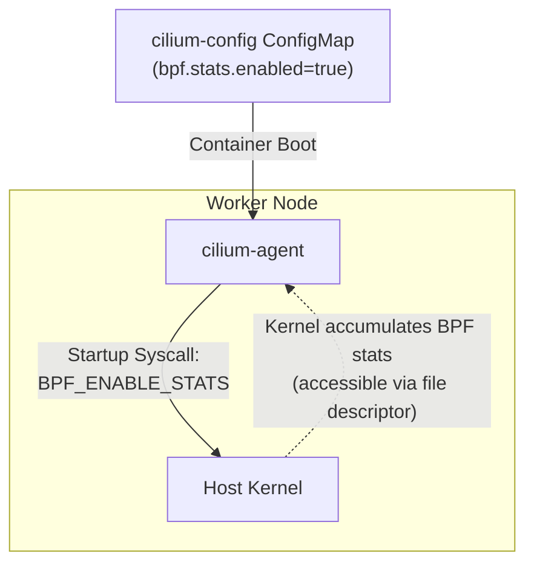
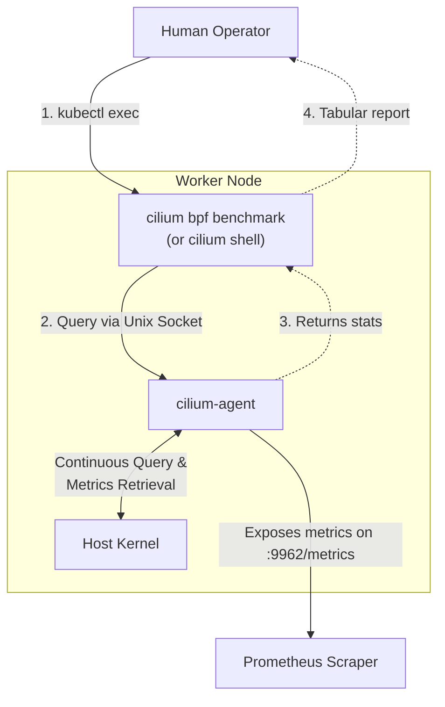
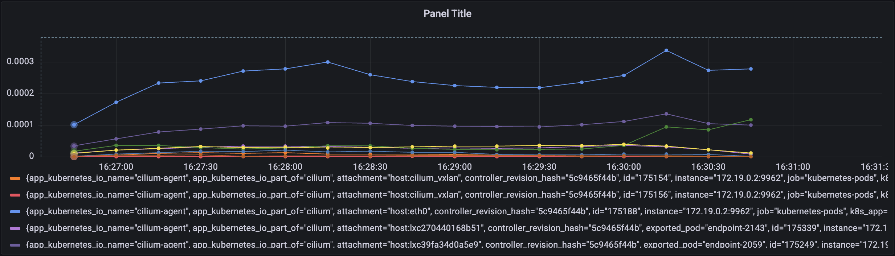

# CFP-46760: Cilium eBPF Runtime Benchmarking

**SIG:** SIG-Datapath, SIG-Observability  
**Sharing:** Public  
**Begin Design Discussion:** 2026-06-26  
**Cilium Release:** 1.21  
**Authors:** Anshul Chelapurath <achelapurath@google.com>  
**Status:** Draft  

---

## Summary

This proposal aims to introduce a native mechanism for benchmarking and monitoring eBPF program runtime performance in Cilium. By leveraging the Linux kernel's BPF execution statistics syscall (`BPF_ENABLE_STATS`), Cilium will track cumulative execution runtimes (`run_time_ns`) and counts (`run_cnt`) for loaded BPF programs.

The proposal outlines two core interfaces:
1. **Shell & CLI Interface**: Native Hive shell commands `bpf/benchmark/report` and `bpf/benchmark/diff` (accessible via `cilium shell`), with corresponding aliases under `cilium bpf benchmark` in `cilium-dbg`.
2. **Prometheus Exporter**: Integration with the `cilium-agent` metrics exporter to expose counters representing BPF program runs and runtime totals for visualization and monitoring in Grafana.

## Motivation

Reliably analyzing the performance impact of changes to Cilium's eBPF datapath or configuration in a complex and large environment (such as thousands of Cilium-enabled clusters where other BPF-based solutions run simultaneously) is difficult. Currently, there is limited visibility into the performance impact of changes to eBPF programs and limited ability to pinpoint where time is spent during execution.

This feature proposal makes it easy to capture and surface eBPF program performance metrics for individual pods or nodes to better understand where time is spent in the datapath and the relative performance impact of eBPF changes.

## Goals

- **Agent Configuration**: Enable operators to toggle BPF statistic tracking node-wide via a standard `cilium-agent` command-line flag.
- **Tabular & Structured Reporting**: Expose BPF runtime statistics in a tabular format within the CLI for easy interpretation.
- **Prometheus Telemetry Integration**: Periodically scrape and expose cumulative run counts and execution times on the `cilium-agent` BPF metrics endpoint.
- **Local Performance Comparison (Diff)**: Compare BPF runtime statistics from local test runs against baseline configurations to catch performance changes during development.

## Non-Goals

- **Granular Tail-Call Latency Isolation**: The stats timer hooks in the Linux kernel only run pre-invocation of the entry program and post-completion of the final exit return. Isolating individual tail-called program latencies within the aggregated metric is out of scope.
- **Packet-Level Latency Percentiles (p50/p90/p99)**: BPF_ENABLE_STATS only exposes cumulative execution counts and runtime. It does not record individual packet latencies, therefore deriving true percentile distributions is not possible. Deriving from average runtime would be misleading. 
- **Resolution of Classic TC Attachments on Older Kernels**: The resolution mechanism relies on `BPF_PROG_QUERY` for performance. Since `BPF_PROG_QUERY` does not support classic TC (`clsact` qdisc) attachments, the tool cannot resolve these legacy attachments to interfaces/pods on kernels without TCX support. They will appear as `(global)` or be omitted in filtered views.

---

## Proposal

### Overview

The proposed design establishes a path for collecting native BPF execution statistics, routing them to the operator via on-demand CLI queries, and exposing them continuously via Prometheus metrics.

There are two separate pathways:
1. **On-Demand Benchmarking**: The user runs the benchmark commands (either via `cilium shell` or the `cilium bpf benchmark` CLI wrapper) locally within the `cilium-agent` container (typically by using `kubectl exec` to run the command inside the target pod). The CLI queries the local `cilium-agent` daemon's Hive shell over a Unix domain socket to retrieve the statistics.
2. **Prometheus Scraping**: Prometheus scraping is still driven by the cilium flag but also with the prometheus metric toggle that is already present in the cilium-agent CLI. Once enabled, it is activated to scrape the metrics everywhere where it is exposed. The telemetry lifecycle integrates directly into Cilium's existing metrics cell (AgentCell) by extending the current bpfCollector to register and expose these new runtime statistics alongside existing BPF metrics. This exposes cumulative totals directly on the native cilium-agent metrics endpoint (:9962/metrics), with the scrape frequency determined by the external Prometheus server's configuration.

**1. BPF Stats Enablement & Lifecycle**


**2. Interactive Queries & Telemetry Export**


### 1. CLI Hierarchy & Command Flow

This proposal introduces native Hive shell commands `bpf/benchmark/report` and `bpf/benchmark/diff` (run via `cilium shell`). For ease of use, these are also exposed as aliases under `cilium-dbg`: `cilium bpf benchmark` (which internally executes them via the Hive shell).

#### A. Agent Configuration Flag
To enable or disable BPF stats collection, the user can set the `enable-bpf-stats` option in the `cilium-config` ConfigMap to `true` or `false`. The default value is `false`. 

When enabled, the daemon calls the `BPF_ENABLE_STATS` syscall on startup and keeps the returned file descriptor open to ensure the kernel continuously accumulates statistics. Users can then safely `kubectl exec` into the running agent to run the benchmark commands.

#### B. Tabular Reporting & Aggregation
To view metrics on-demand, an operator can run the report command.

Using the `cilium-dbg` alias via `kubectl exec`:
```bash
# kubectl exec -n kube-system ds/cilium -c cilium-agent -- cilium bpf benchmark report
```

Or using the Hive shell directly:
```bash
# kubectl exec -it -n kube-system ds/cilium -c cilium-agent -- cilium shell
cilium-node-1> bpf/benchmark/report
ATTACHMENT POINT      BPF PROGRAM          TYPE             TOTAL RUNS   TOTAL RUNTIME   AVG LATENCY
(host:cilium_host)    cil_from_host        SchedCLS                 24       632.83 us      26368 ns
coredns-xxxx          cil_from_container   SchedCLS                 11       283.69 us      25790 ns
(host:eth0)           cil_from_netdev      SchedCLS                439         7.43 ms      16934 ns
(global)              cil_sock4_connect    CGroupSockAddr          102         2.12 ms      20784 ns
```

**Supported Options:**
- `--sort=<field>`: Sort by `avg` (default), `total`, or `runs`.
- `--pod=<pod>`: Filter results by pod name(s).
- `--device=<device>` Filter results by device/interface name(s).
- `--global` Filter results by BPF programs that apply to the entire node (such as root cgroup or socket programs).
- `--prog-type=<type>`: Filter results by BPF program type (e.g. `SchedCLS`).
- `--json`: Output report in JSON format.

### 2. Prometheus Metric Exporter Integration

The BPF collector (`bpfCollector`) inside `pkg/metrics/bpf.go` is extended to collect and expose runtimes.

#### Exposed Metrics
Two counters are exposed:
- `cilium_bpf_prog_total_runs`: Total executions of a BPF program.
- `cilium_bpf_prog_runtime_total_seconds`: Total execution time of a BPF program in seconds.

Each metric features the labels `node`, `id`, `pod`, `attachment`, `name`, and `type` to differentiate programs and prevent metric registration collisions:
- `node`: The name of the node where the program is running.
- `id`: The kernel's BPF program ID.
- `pod`: The resolved Kubernetes pod name, falling back to `endpoint-<id>` if the pod name is unavailable (empty for host-level or global programs).
- `attachment`: The device identifier, formatted as `host:<interface_name>`. This label is solely for identifying the device/interface and does not contain pod names. It is empty for global programs.
- `name`: The name of the BPF program (e.g., `cil_to_netdev`).
- `type`: The BPF program type (e.g., `sched_cls`).

#### Prometheus Metric Feature Toggle
Metrics are exposed on the native metrics endpoint (`:9962/metrics`). Benchmarking metrics can be disabled via the config CLI:

```bash
# Disable benchmarking metrics
cilium config set metrics "-cilium_bpf_benchmark"

# To re-enable
cilium config set metrics "+cilium_bpf_benchmark"
```

#### Prometheus / Grafana PromQL Queries
To aggregate rates over time windows and across multiple nodes, average latencies are calculated dynamically in Grafana using rate division:

- **Per-Node Average Latency**:
  `rate(cilium_bpf_prog_runtime_total_seconds[5m]) / rate(cilium_bpf_prog_total_runs[5m])`
- **Per-Program Average Latency (Node-Wide)**:
  `sum by (name, type) (rate(cilium_bpf_prog_runtime_total_seconds[5m])) / sum by (name, type) (rate(cilium_bpf_prog_total_runs[5m]))`




### 3. Pod and Device Name Resolution

To provide meaningful context in reports and metrics, the agent resolves BPF program attachments via their kernel interface indexes to Kubernetes pod names or host device/interface names.

The resolution process follows these steps:
1. **Endpoint Mapping**: The agent retrieves the list of active Cilium endpoints and builds a mapping of interface indexes (`ifindex`) to pod names. If a pod name is not available, it defaults to `endpoint-<id>`.
2. **Interface Scanning**: The agent retrieves all network interfaces present on the host and iterates over them.
3. **Context Resolution**: For each interface, the agent determines the context:
   - **Pod Context**: If the interface index maps to an endpoint, the context is the resolved pod name.
   - **Host Context**: Otherwise, the context is a host device/interface (e.g., `eth0`, `cilium_host`, or `vxlan`).
4. **Program Querying & Association**: Using `BPF_PROG_QUERY` (supporting TCX, XDP, and Netkit), the agent finds BPF programs attached to the interface and maps them to the resolved context, which avoids traversing BPF links and ignores detached/dead interfaces.
5. **Global Fallback**: BPF programs not found during the interface scan (e.g., cgroup/socket programs, or legacy classic TC programs which do not support `BPF_PROG_QUERY`) default to a node-wide context `(global)`.

This resolved context is exposed as follows:

#### A. CLI Report Representation
The CLI report (e.g. `cilium bpf benchmark report`) displays the resolved context directly in the **Attachment Point** column. 

#### B. Prometheus Metric Labels
Prometheus metrics split the resolved context into two separate labels to allow structured querying:
- `pod`: Contains the resolved Pod Name (empty for host devices/interfaces and global programs).
- `attachment`: Contains the device/interface identifier, formatted as `host:<interface_name>` (empty for global programs).
- These are decoupled to allow for more efficient PromQL queries.

### 4. Relative Performance Comparison (diff)

The CLI provides a `diff` command to evaluate execution differences based on average nanoseconds per run between saved JSON files.

```bash
# cilium bpf benchmark diff baseline.json pr_build.json
                             BASELINE              TEST_RUN_BUSY
ns/run cil_to_netdev         820.45 (   0.00%)     1140.22 ( +38.97%)
ns/run cil_from_container    610.12 (   0.00%)      615.38 (  +0.86%)
ns/run cil_to_host           450.20 (   0.00%)      595.82 ( +32.35%)
ns/run cil_from_host         390.15 (   0.00%)      395.40 (  +1.35%)
```

Using `--fail-on` evaluates a threshold regression percentage (e.g. 5% slowdown) and exits with code 1 if violated else 0. This can allow for automatic test failures in continuous integration pipelines.

---

## Future Milestones

- **Cilium Connectivity Perf Integration**: Implement a `--bpf-stats` flag in `cilium connectivity perf` to automatically collect BPF stats pre- and post-test runs to calculate performance overhead under heavy synthetic network loads.
- **Developer Local Unit Test Microbenchmarks**: Integrate BPF benchmark automation with existing local Cilium BPF unit test cases (`make run_bpf_tests`), allowing developers working locally to easily automate benchmarking of their BPF code changes before deployment.
- Tail-Call Runtime Visibility: Provide runtime metrics for tail-called BPF programs, possibly using the [Datapath Plugin framework](https://github.com/cilium/design-cfps/pull/76)
