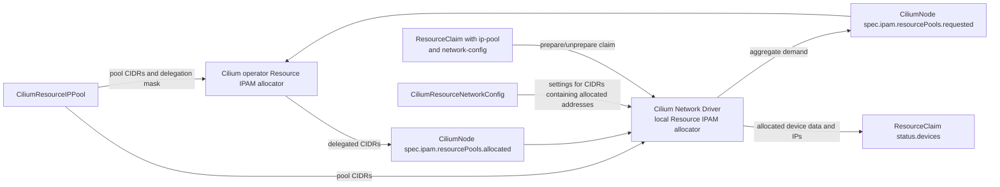
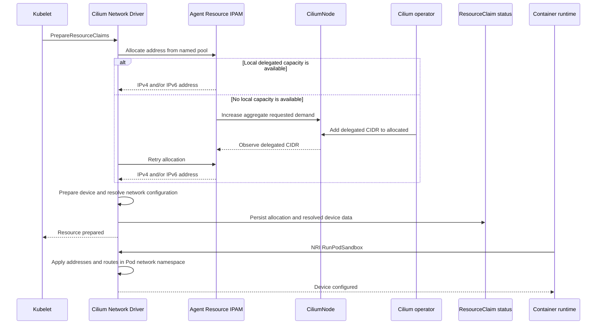

# CFP-48090: Multi-Pool Resource IPAM for the Cilium Network Driver

**SIG:** SIG-IPAM, Network Driver

**Begin Design Discussion:** 2026-08-21

**Cilium Release:** 1.21

**Authors:** Fabio Falzoi <fabio.falzoi@isovalent.com>

**Status:** Draft

**Related Issue:** [cilium/cilium#48090](https://github.com/cilium/cilium/issues/48090)

**Related CFP:** [CFP-43295: Cilium Network (DRA) Driver](./CFP-43295-cilium-network-driver-dra.md)

## Summary

This CFP proposes Multi-Pool Resource IPAM, a dedicated IP address management
subsystem for network devices allocated by the Cilium Network Driver through
Kubernetes Dynamic Resource Allocation (DRA).

Cluster operators define named, cluster-wide address pools. The Cilium operator
delegates CIDR blocks from those pools to nodes according to demand, and the
Cilium Network Driver allocates individual addresses locally while preparing DRA
`ResourceClaim` objects. Separate `CiliumResourceNetworkConfig` objects define
optional interface prefix lengths and static routes for allocated addresses.
Addresses are released when claims are unprepared.

Resource IPAM is separate from Pod IPAM. It can be enabled alongside any Pod
IPAM mode and does not allocate from, or write allocation state to,
`CiliumPodIPPool` resources.

## Motivation

The Cilium Network Driver allows workloads to claim network devices such as
SR-IOV virtual functions. A claimed device commonly needs an IPv4 address, an
IPv6 address, or both before it can be used by the workload.

Embedding static addresses in `ResourceClaim` or `ResourceClaimTemplate`
configuration is not a scalable solution. In particular, a
`ResourceClaimTemplate` is reused to create multiple claims, so a static address
in the template risks being assigned to more than one device. Static assignment
also requires cluster operators to coordinate address ownership with workload
and claim lifecycles manually.

Existing Pod IPAM modes cannot be used directly for these addresses. Pod IPAM
manages the primary Cilium interface and follows the CNI endpoint lifecycle.
Network Driver addresses belong to secondary DRA resources and follow DRA
prepare and unprepare operations. Sharing the same pool objects and allocation
state would couple otherwise independent capacity and lifecycles.

The IPAM section of CFP-43295 was deferred so that allocation models could be
evaluated separately. In particular, centrally allocating every address in the
operator can improve aggregate pool utilization, while delegating CIDRs to
nodes avoids an API and operator transaction for every claim. This proposal
selects node-local allocation from operator-delegated CIDRs, following the
existing Multi-Pool Pod IPAM control-plane model.

## Goals

- Allocate IPv4 and IPv6 addresses dynamically for network devices prepared by
  the Cilium Network Driver.
- Support multiple named, cluster-wide address pools for independent secondary
  networks and device classes.
- Keep Resource IPAM configuration, capacity, and allocation state independent
  from Pod IPAM.
- Allocate and release individual addresses locally without a Kubernetes API
  transaction for every address operation.
- Scale local pool capacity according to per-node demand and return unused
  delegated CIDRs safely.
- Preserve successful allocations across Cilium agent restarts and make DRA
  prepare and unprepare retries idempotent.
- Support IPv4-only, IPv6-only, and dual-stack Network Driver configurations
  independently of Pod IPAM.
- Apply basic per-CIDR network settings from a configuration object selected by
  the DRA device request.
- Surface allocated addresses through standard DRA allocated-device status.

## Non-Goals

- Changing how the Cilium Network Driver discovers, publishes, or allocates
  network devices.
- Managing primary Pod addresses or changing any existing Pod IPAM mode.
- Establishing or validating the underlying network connectivity, integrating
  the secondary interface with the Cilium datapath, or supporting configuration
  beyond interface prefix lengths and static routes, such as VLANs or sysctls.
- Integrating external IPAM providers in the initial implementation.
- Making IP pool capacity or topology part of DRA scheduling decisions.
- Selecting different Resource IPAM pools for IPv4 and IPv6 within one device
  request in the initial implementation.

## Proposal

### Overview

Multi-Pool Resource IPAM is an additive Network Driver capability. It is not a
new value of Cilium's global `ipam.mode` setting. The Resource IPAM components
run when the Cilium Network Driver is enabled, but address allocation is opt-in
for each DRA device request: a request that does not name a Resource IPAM pool
does not receive a dynamically allocated address from this subsystem.

The design reuses the control-plane model and allocator primitives of
Multi-Pool Pod IPAM, with separate Kubernetes resources and separate fields in
`CiliumNode`:



The operator owns the cluster-wide view of each Resource IPAM pool and assigns
non-overlapping CIDRs from a pool to nodes. Each Network Driver instance,
embedded in the node-local agent, owns individual address allocation within its
delegated CIDRs. The driver reports aggregate demand and the delegated CIDRs
still in use; it does not report every individual allocation through
`CiliumNode`.

### Cluster-wide pools

A new cluster-scoped `CiliumResourceIPPool` (`cilium.io/v2alpha1`) resource
defines an allocation domain for Network Driver resources. Its address-family
configuration intentionally follows `CiliumPodIPPool`, but it omits Pod and
Namespace selection because a DRA device request selects the pool explicitly.
The resource is intentionally limited to IP address management so that changes
to network settings do not affect pool capacity or allocation state.

```yaml
apiVersion: cilium.io/v2alpha1
kind: CiliumResourceIPPool
metadata:
  name: blue-network
spec:
  ipv4:
    cidrs:
      - 10.20.0.0/24
      - 10.20.1.0/24
    maskSize: 28
    pool:
      - cidr: 10.20.0.0/24
        reservedRanges:
          - start: 10.20.0.1
            end: 10.20.0.10
      - cidr: 10.20.1.0/24
        reservedRanges:
          - start: 10.20.1.1
            end: 10.20.1.10
  ipv6:
    cidrs:
      - fd00:20::/64
    maskSize: 80
    pool:
      - cidr: fd00:20::/64
        reservedRanges:
          - start: fd00:20::1
            end: fd00:20::a
  allowFirstIP: false
  allowLastIP: false
```

The fields have the following meaning:

- `cidrs` defines the cluster-wide address space owned by the pool. The prefix
  length of the pool CIDR containing an allocated address is the default prefix
  configured on the workload interface.
- `maskSize` defines the CIDR size delegated to an individual node. It controls
  allocation and delegation only and is never used as the prefix configured on
  the workload interface.
- `pool[].reservedRanges` reserves address ranges for static use; see
  [Coexistence with statically managed addresses](#coexistence-with-statically-managed-addresses).
- `allowFirstIP` and `allowLastIP` control whether the first and last address of
  each delegated CIDR can be allocated. For `/31`, `/32`, `/127`, and `/128`
  CIDRs, addresses remain usable regardless of these settings.

The mask sizes and first/last-address settings are immutable because changing
their interpretation while nodes hold delegated CIDRs could make live
allocations invalid. Pool CIDR lists can be extended at runtime. Removing CIDRs
or deleting a pool stops the operator from delegating new CIDRs from that
capacity. CIDRs already delegated to nodes remain reserved until the agents can
release them safely, and their remaining local capacity may still satisfy
allocations during that transition.

The pool name scopes uniqueness. Cilium guarantees that two live allocations
from the same `CiliumResourceIPPool` do not receive the same address. Different
pools are independent allocation domains and may intentionally use overlapping
address space when they represent isolated networks. It is the responsibility
of cluster operators to ensure that pool addressing is aligned with the
underlying network infrastructure to avoid undesired side effects.

### Basic network configuration

Most Network Driver use cases require basic settings such as an interface
prefix length and static routes in addition to an address. This CFP therefore
also introduces a separate, cluster-scoped `CiliumResourceNetworkConfig`
(`cilium.io/v2alpha1`) resource to provide those settings without expanding
`CiliumResourceIPPool` beyond IP address management:

```yaml
apiVersion: cilium.io/v2alpha1
kind: CiliumResourceNetworkConfig
metadata:
  name: blue-network-config
spec:
  ipv4:
    - cidr: 10.20.0.0/16
      prefixLength: 20
      routes:
        - destination: 10.40.0.0/16
          gateway: 10.20.0.1
  ipv6:
    - cidr: fd00:20::/48
      prefixLength: 56
      routes:
        - destination: fd00:30::/48
          gateway: fd00:20::1
```

Each entry in the optional `ipv4` and `ipv6` lists contains a `cidr` and can
define the `prefixLength` assigned to an allocated address and a list of static
`routes` to install on the claimed resource. A route contains a `destination`
and may contain a `gateway` from the same address family.
Gateway addresses that belong to the selected Resource IPAM pool must be
reserved from dynamic allocation as described in
[Coexistence with statically managed addresses](#coexistence-with-statically-managed-addresses).

Each family list uses Kubernetes list-map semantics with `cidr` as its key,
preventing duplicate entries for the same CIDR. Entries in `ipv4` must use IPv4
values for CIDRs, route destinations, and gateways, while entries in `ipv6`
must use IPv6 values. A `prefixLength`, when specified, must be valid for the
corresponding address family.

`CiliumResourceNetworkConfig` is independent of
`CiliumResourceIPPool`: its CIDRs select addresses to configure and do not need
to equal, or otherwise correspond one-to-one with, the CIDRs of any pool. A
single network configuration entry can therefore provide common settings for
addresses allocated from multiple pool CIDRs.

For an allocated address, the Network Driver first looks in the
`CiliumResourceNetworkConfig` selected by the DRA request for an entry whose
`cidr` contains that address. If multiple entries match, it selects the most
specific entry using longest-prefix matching. The selected entry's
`prefixLength`, when present, is applied to the address. If it is omitted, the
prefix length of the selected entry's `cidr` is applied instead. The selected
entry's routes are installed for the claimed resource. For example, the
`10.20.0.0/16` entry above applies to addresses allocated from both
`10.20.0.0/24` and `10.20.1.0/24` in the example pool.

If no network configuration is selected, or the selected configuration has no
entry containing the allocated address, the Network Driver uses the prefix
length of the pool CIDR containing that address and installs no static routes.
The pool's `maskSize` is not considered when choosing the interface prefix.

The Network Driver watches both `CiliumResourceIPPool` and
`CiliumResourceNetworkConfig` objects and resolves the selected configuration
during resource preparation. An omitted `routes` list installs no static
routes.

Network configuration is resolved during resource preparation and stored with
the prepared device. It is applied later in the Pod network namespace when the
NRI `RunPodSandbox` hook configures the device. Updating or deleting a
`CiliumResourceNetworkConfig` has no effect on resources prepared with its
previous contents, so NRI configuration and restart recovery do not depend on
the current object.

### Per-node demand and CIDR delegation

`CiliumNode.spec.ipam` gains a separate `resourcePools` section with the same
request/allocation handshake used by Multi-Pool Pod IPAM:

```yaml
apiVersion: cilium.io/v2
kind: CiliumNode
metadata:
  name: worker-1
spec:
  ipam:
    resourcePools:
      requested:
        - pool: blue-network
          needed:
            ipv4-addrs: 3
            ipv6-addrs: 3
      allocated:
        - pool: blue-network
          cidrs:
            - 10.20.0.16/28
            - fd00:20:0:0:1::/80
          allowFirstIP: false
          allowLastIP: false
```

The fields have the following ownership:

- The agent writes `requested`, expressing the number of addresses it needs
  from each pool and family.
- The operator adds CIDRs to `allocated` until the delegated usable capacity
  satisfies the request.
- The agent removes a delegated CIDR from `allocated` only after all addresses
  from it have been released and the CIDR is no longer needed.

The operator runs a second instance of the existing Multi-Pool allocator for
Resource IPAM. Separate field accessors ensure that the Pod and resource
allocators reconcile only their respective `CiliumNode` fields. Separate pool
objects and allocator instances prevent a Network Driver allocation from
consuming Pod IPAM capacity, regardless of the Pod IPAM mode in use.

### Selecting IPAM and network configuration from a DRA request

The Network Driver's opaque DRA configuration gains two parameters:

- `ip-pool` contains the name of a `CiliumResourceIPPool` from which addresses
  are allocated.
- `network-config` contains the name of a `CiliumResourceNetworkConfig` whose
  entries configure allocated addresses within their CIDRs.

The parameters are associated with one or more device requests through the
standard DRA `config.requests` field. They can be specified directly in a
`ResourceClaim` or through the `ResourceClaimTemplate` shown below:

```yaml
apiVersion: resource.k8s.io/v1
kind: ResourceClaimTemplate
metadata:
  name: sriov-blue-network
spec:
  spec:
    devices:
      requests:
        - name: network-device
          exactly:
            deviceClassName: sriov.cilium.k8s.io
      config:
        - requests:
            - network-device
          opaque:
            driver: sriov.cilium.k8s.io
            parameters:
              ip-pool: blue-network
              network-config: blue-network-config
```

The Resource IPAM pool is distinct from the DRA `ResourceSlice` pool recorded
in device allocation results. The former selects an address allocation domain;
the latter identifies the device pool from which Kubernetes allocated the
hardware resource.

There is no implicit default and no fallback to another Resource IPAM pool. If
`ip-pool` is omitted, Resource IPAM performs no allocation for that request. If
the named pool does not exist, does not provide a required address family, or
is exhausted, claim preparation fails with a retryable error rather than
configuring the device for a different network.

The `network-config` parameter is optional. When it is present, the Network
Driver retrieves the named `CiliumResourceNetworkConfig` and selects the most
specific entry whose CIDR contains the allocated address. If it is omitted, or
if the selected object has no entry containing the address, the driver uses the
prefix length of the pool CIDR containing that address and installs no static
routes. If the named `CiliumResourceNetworkConfig` does not exist, claim
preparation fails with a retryable error rather than silently using the
defaults. Specifying `network-config` does not itself trigger address
allocation; that remains controlled by `ip-pool`.

Address-family support for Network Driver resources is controlled independently
by the `--enable-network-driver-ipv4` and `--enable-network-driver-ipv6` options.
They respectively enable the assignment of IPv4 and IPv6 addresses, regardless
of the families enabled for the Cilium agent's Pod IPAM. This separation is
intentional because DRA resources can represent a different network topology
and dataplane from the one used by pods.

### Claim preparation and allocation

The Cilium Network Driver allocates addresses as part of
`PrepareResourceClaims`, before applying the final device configuration:



The Network Driver and Agent Resource IPAM are shown as separate participants
to clarify their responsibilities, but both are embedded components in the same
Cilium agent binary and communicate in-process.

An address allocation is local when a delegated CIDR has free capacity. If no
address is available, the agent records a pending allocation, updates aggregate
demand in `CiliumNode`, and retries while the operator assigns capacity. The
kubelet can retry claim preparation if capacity cannot be obtained during the
current call. An unavailable operator therefore prevents allocations that need
new CIDRs, but allocations from capacity already present on the node continue
without the operator.

The driver records allocation and device state in two places in
`ResourceClaim.status.devices`:

- The driver's opaque `data` contains the selected Resource IPAM pool, the
  selected network configuration, and the complete resolved device
  configuration needed by NRI and for restore and release.
- Standard `networkData.ips` exposes the addresses to Kubernetes and users.

If the Network Driver cannot resolve or validate a prefix length or route from
the matching network configuration entry, resource preparation fails and the
error is returned to the kubelet. As with any other failure after address
allocation, the driver releases newly allocated addresses and rolls back
partial device setup. If applying the resolved configuration during
`RunPodSandbox` fails, Pod sandbox setup fails while the prepared allocation
remains available for a later retry. If the Kubernetes status update fails, the
device setup and address allocations performed by that preparation attempt are
also rolled back, allowing a later retry to start cleanly.

### Demand and preallocation

For each pool and family, the agent computes demand from:

- addresses currently in use by successfully prepared resources;
- allocations currently pending because local capacity is exhausted; and
- an optional per-pool preallocation buffer.

The preallocation buffer defaults to zero. A value of zero requests capacity
only in response to current or pending use. When the buffer is greater than
zero, the Network Driver requests addresses in advance so that subsequent
resource preparations can allocate locally without waiting for the operator to
delegate additional CIDRs. Demand is increased in buffer-sized steps to keep at
least the configured number of addresses available above current use once the
operator has satisfied the request.

Cluster operators should choose the buffer size based on:

- the number of DRA resources available on each node; and
- how much underutilization of the global pool is acceptable when addresses are
  delegated to nodes but remain unused.

For example, consider an IPv4 pool containing a single `/26` CIDR with
`maskSize: 30`, `allowFirstIP: true`, and `allowLastIP: true`. All 64
addresses are usable, and the operator delegates them to nodes in `/30` CIDRs
containing four addresses each. The cluster has four nodes, and each Network
Driver uses a preallocation buffer of eight addresses. At startup, each driver
requests eight addresses and receives two `/30` CIDRs. The four nodes therefore
hold 32 addresses in total, leaving 32 addresses undelegated in the global
pool.

If DRA resources are then prepared only on one node, its capacity changes as
follows after the operator has reconciled each satisfiable request:

| Prepared resources | Requested capacity | Delegated capacity | Free addresses on the node | Undelegated global capacity | Result |
|---:|---:|---:|---:|---:|---|
| 0 | 8 | 8 | 8 | 32 | Startup preallocation assigns two `/30` CIDRs to every node. |
| 1 | 16 | 16 | 15 | 24 | Preparation uses local capacity; the driver then requests two more `/30` CIDRs. |
| 4 | 16 | 16 | 12 | 24 | No additional CIDRs are needed. |
| 8 | 16 | 16 | 8 | 24 | The full eight-address buffer remains available. |
| 9 | 24 | 24 | 15 | 16 | The driver requests two more `/30` CIDRs. |
| 16 | 24 | 24 | 8 | 16 | The full buffer remains available. |
| 17 | 32 | 32 | 15 | 8 | The driver requests two more `/30` CIDRs. |
| 24 | 32 | 32 | 8 | 8 | The full buffer remains available. |
| 25 | 40 | 40 | 15 | 0 | The driver receives the last two undelegated `/30` CIDRs. |
| 32 | 40 | 40 | 8 | 0 | Allocations continue from local capacity. |
| 33–40 | 48 | 40 | 7–0 | 0 | The request for more CIDRs cannot be satisfied, but preparation continues while local addresses remain. |
| 41st attempt | 56 | 40 | 0 | 0 | No local or undelegated capacity remains, so preparation retries and eventually fails. |

The other three nodes still retain eight addresses each even if no DRA resource
is prepared on them, because those addresses satisfy their configured buffers.
They do not return the corresponding CIDRs while the buffers remain configured.
Consequently, 24 addresses remain unused when the busy node exhausts its local
capacity, illustrating the global pool underutilization that larger
preallocation buffers can introduce.

After startup restore is complete, the agent returns excess, completely unused
CIDRs by removing them from `CiliumNode.spec.ipam.resourcePools.allocated`. A
CIDR containing any restored or live allocation is never returned.

### Unprepare and restart recovery

`UnprepareResourceClaims` releases the addresses recorded for each device back
to the node-local pool. Repeated unprepare calls are safe when the allocation is
already absent.

On agent restart, existing Pod sandboxes, interface addresses, and routes remain
in place. The Network Driver first waits for the local `CiliumNode` resource so
that all delegated CIDRs are available, then restores local device and address
ownership from `ResourceClaim.status.devices`. After the NRI plugin reconnects,
the container runtime reports the running Pod sandboxes, allowing the Network
Driver to rebuild its in-memory mapping from Pod UIDs to network namespaces.
Existing interfaces, addresses, and routes are not reapplied because they
remain configured across an agent restart. Only after all local claims have
been processed does the driver mark IPAM restore complete and allow unused
delegated CIDRs to be returned. This ordering prevents the agent from releasing
a CIDR before rediscovering a live address from it.

After a node reboot, Pod sandboxes and their network namespaces are recreated,
so their interface addresses and routes must also be recreated. The Network
Driver restores the prepared allocation from `ResourceClaim.status.devices`,
and repeated `PrepareResourceClaims` calls reuse that allocation. When the
container runtime creates the new sandbox, the NRI `RunPodSandbox` hook applies
the stored address prefixes and routes in the new Pod network namespace. It
uses the resolved configuration stored with the device rather than reading the
current `CiliumResourceNetworkConfig`.

If a node is deleted, the operator can reclaim its delegated CIDRs using the
existing Multi-Pool node lifecycle. A node that is unreachable but still exists
retains its CIDRs, preventing them from being reassigned while allocations may
still exist.

Successful preparations are idempotent because retries reuse the allocation
stored for the same Pod, claim, and device.

### Configuration and feature activation

Multi-Pool Resource IPAM is available only when the Cilium Network Driver is
enabled. It does not require `ipam.mode=multi-pool`; the cluster may use any
supported Pod IPAM mode.

- The Network Driver can independently enable address assignment for each
  family with `--enable-network-driver-ipv4` and `--enable-network-driver-ipv6`.
  These options default to `true` and `false`, respectively, so only IPv4
  address assignment is enabled by default.
- The operator can auto-create pools at startup with
  `--auto-create-cilium-resource-ip-pools`.
- The agent can configure warm capacity per pool with
  `--resource-ipam-multi-pool-pre-allocation=<pool>=<addresses>`. See
  [Demand and preallocation](#demand-and-preallocation) for allocation behavior
  and sizing guidance.

Cluster operators can manage both resource types through the Kubernetes API.
The Cilium chart installs both CRDs and grants the operator and agent permission
to observe `CiliumResourceIPPool`; the agent can also watch
`CiliumResourceNetworkConfig`.

### Observability

The following Kubernetes objects expose the allocation path:

- `CiliumResourceIPPool` shows the configured cluster-wide capacity and node
  allocation granularity.
- `CiliumResourceNetworkConfig` shows the interface prefix lengths and static
  routes available to DRA requests.
- `CiliumNode.spec.ipam.resourcePools` shows per-node demand and delegated
  CIDRs.
- `ResourceClaim.status.devices[].networkData.ips` shows addresses allocated to
  a prepared device.
- Allocated addresses are also recorded in the
  [`networkdriver-dra-devices` StateDB table introduced by cilium/cilium#47558](https://github.com/cilium/cilium/pull/47558)
  and can be inspected with
  `cilium-dbg shell -- db/show networkdriver-dra-devices`.

Operator and agent logs report missing pools or network configurations,
exhausted families, pending capacity, allocation failures, network
configuration failures, and unsafe pool updates. Resource IPAM metrics should
expose delegated, used, free, and pending address counts by pool and family,
plus allocation failures, without using individual addresses as metric labels.
Sysdump collection should include `CiliumResourceIPPool`,
`CiliumResourceNetworkConfig`, and the relevant `CiliumNode` state.

## Impacts / Key Questions

### Allocation model: delegated CIDRs versus per-address coordination

The primary trade-off is address utilization versus allocation-path
coordination:

| Model | Allocation path | API/control-plane load | Utilization | Failure behavior | Complexity |
|---|---|---|---|---|---|
| Per-node CIDR delegation (proposed) | Agent allocates locally | One update per demand or CIDR change | May strand free addresses on nodes | Existing node capacity remains usable without the operator | Reuses Cilium Multi-Pool allocators |
| Central per-address allocation | Operator assigns every address | At least one coordinated transaction per allocation/release | High aggregate utilization | Every new allocation depends on operator and API availability | Central ownership is straightforward, but claim integration and throughput must be implemented |

This CFP chooses per-node CIDR delegation because Network Driver allocations
occur on the node, allocation latency is part of Pod startup, and the existing
Multi-Pool implementation already provides CIDR ownership, demand signaling,
restore ordering, and safe CIDR return.

### Address utilization and fragmentation

Delegating CIDRs can strand free addresses on nodes, especially when a pool is
used by few resources per node. The pool's `maskSize` bounds this cost. A `/32`
or `/128` delegation minimizes fragmentation but approaches the API behavior of
central per-address allocation; larger blocks reduce API churn and claim
latency but reserve more capacity per active node. Preallocation introduces the
same deliberate utilization/latency trade-off.

### Pool representation: CIDRs versus arbitrary ranges

For the initial implementation, `CiliumResourceIPPool` represents pool capacity
as CIDRs, following the API and implementation of Multi-Pool Pod IPAM. This
allows Resource IPAM to reuse the existing Cilium allocator interfaces and
fixed-size CIDR delegation logic.

This initial choice does not preclude adding an explicit range representation
in the future, using `startAddr` and `endAddr`. Such a representation could
describe non-CIDR-aligned address plans more compactly. Supporting it will
require defining how ranges are divided into node delegation units and how
range updates interact with existing ownership. Until then, an arbitrary range
can be expressed as a set of CIDRs, at the cost of a potentially longer pool
specification.

### Separate Resource IP pools versus reusing Pod IP pools

Reusing `CiliumPodIPPool` would reduce the number of CRDs, but it would mix
capacity and lifecycle ownership between primary Pod interfaces and DRA
resources. Pool selectors also operate on Pods and Namespaces, while Resource
IPAM selection is attached to a DRA device request.

`CiliumResourceIPPool` deliberately duplicates only the address-management
portion of the Pod pool API so that the two allocation systems remain
independent. Shared Go types and allocator components limit implementation
duplication. The cost is a separate pool CRD and operator reconciliation state.

### Pool-scoped versus separate network configuration

Keeping `CiliumResourceIPPool` focused on IP address management gives pool
changes a single purpose: controlling capacity, delegation granularity, and
address allocation policy. Keeping Network Driver-specific settings out of the
pool API also makes `CiliumResourceIPPool` easier to reuse for IP address
management in contexts other than the Cilium Network Driver. Prefix lengths and
routes have a different lifecycle and can change without changing IPAM state,
so this proposal places them in `CiliumResourceNetworkConfig` and makes DRA
requests select that object independently with `network-config`.

This separation also allows a network configuration to be reused across IP
pools without coupling its CIDRs to the pool definitions. For example, one
broader configuration CIDR can provide common settings for addresses allocated
from several fragmented pool CIDRs. The trade-off is an additional CRD and an
explicit parameter in each request that needs non-default settings. During
resource preparation, the Network Driver selects the most specific
configuration CIDR containing each allocated address; if none exists, it falls
back to the prefix length of the pool CIDR containing that address.

### Overlapping pools

Global overlap validation would reject valid deployments in which isolated
secondary networks reuse the same addresses. The allocator therefore treats
each `CiliumResourceIPPool` as a separate uniqueness domain. This flexibility
also makes misconfiguration possible: overlapping pools attached to the same
network can allocate duplicate addresses. The documentation and status tooling
must make pool identity visible wherever an address is shown.

### Operational complexity compared with Cluster Pool IPAM

Multi-Pool extends the Cluster Pool allocation model. In the simplest
configuration, the operator's
`--auto-create-cilium-resource-ip-pools` option creates a single `default` pool
and the cluster uses only that pool, providing practically the same operational
experience as Cluster Pool IPAM.

The additional complexity is optional: operators that need multiple allocation
domains can define separate named pools backed by different address ranges.
This provides the flexibility required when secondary networks or device
classes must draw addresses from independently managed ranges without burdening
the single-pool case.

### Coexistence with statically managed addresses

Static and dynamic address management can coexist through the
[`reservedRanges` mechanism proposed for `CiliumPodIPPool`](https://github.com/cilium/cilium/pull/46880).
It keeps reserved addresses within a pool's configured CIDRs while preventing
the Multi-Pool allocator from delegating any allocation CIDR that overlaps
them. Operators can therefore retain ranges for static address management
without risking their reuse by dynamic allocation.

Multi-Pool Resource IPAM will provide the same reservation mechanism in
`CiliumResourceIPPool`. Operators will be able to declare the portions of a
resource pool reserved for static assignments. When dividing the pool into
`maskSize`-sized CIDRs, the operator will not delegate any CIDR that intersects
a reserved range. For example:

```yaml
apiVersion: cilium.io/v2alpha1
kind: CiliumResourceIPPool
metadata:
  name: blue-network
spec:
  ipv4:
    cidrs:
      - 10.20.0.0/24
    maskSize: 28
    pool:
      - cidr: 10.20.0.0/24
        reservedRanges:
          - start: 10.20.0.1
            end: 10.20.0.10
  allowFirstIP: false
  allowLastIP: false
```

The `pool` entry associates the reserved range with its containing pool CIDR.
Although only `10.20.0.1` through `10.20.0.10` are explicitly reserved, the
operator cannot delegate `10.20.0.0/28` because that allocation CIDR overlaps
the range. The next CIDR available for delegation is `10.20.0.16/28`.
Reservations are explicit; Resource IPAM will not discover statically assigned
addresses automatically. Because exclusion operates at delegation-CIDR
granularity, pool boundaries and `maskSize` should be chosen so that
reservations do not make more dynamic capacity unavailable than intended.

## Future Milestones

### Per-family pool selection

Allow a DRA request to select different IPv4 and IPv6 Resource IPAM pools. This
would support deployments in which address families are administered through
different allocation domains.

### Topology-aware network configuration

Extend `CiliumResourceNetworkConfig` with topology-specific gateways and routes,
VLANs, sysctls, and other settings that can differ between nodes while
remaining appropriate for the allocated addresses.

### Alternative allocation backends

If measurements show unacceptable fragmentation for large or sparse clusters,
add a centralized per-address or shared-pool backend behind the Network Driver
IPAM interface without changing the DRA request lifecycle.

### External IPAM integration

Allow Network Driver resource addresses to be allocated by an external IPAM
provider while preserving idempotent DRA prepare, unprepare, and restart
semantics.

## Prototype implementation

The following PRs, merged into the Network Driver `feature/dra-driver` branch,
form an earlier prototype of Multi-Pool Resource IPAM. They can be used as
implementation references, but they are non-normative and do not constitute the
definitive implementation of this CFP:

- [cilium/cilium#44081: Add the Multi-Pool Resource IPAM operator cell](https://github.com/cilium/cilium/pull/44081)
- [cilium/cilium#44124: Add agent and Network Driver support for Multi-Pool Resource IPAM](https://github.com/cilium/cilium/pull/44124)
- [cilium/cilium#46645: Add script-based coverage for Resource IPAM allocation paths](https://github.com/cilium/cilium/pull/46645)
- [cilium/cilium#46758: Support first- and last-address allocation policy](https://github.com/cilium/cilium/pull/46758)
- [cilium/cilium#46862: Correct the Resource IPAM preallocation flag description](https://github.com/cilium/cilium/pull/46862)

## References

- [Resource IPAM feature issue](https://github.com/cilium/cilium/issues/48090)
- [Cilium Network Driver feature issue](https://github.com/cilium/cilium/issues/43295)
- [CFP-43295 review discussion deferring IPAM](https://github.com/cilium/design-cfps/pull/85#discussion_r3101632653)
- [Cilium Multi-Pool Pod IPAM](https://docs.cilium.io/en/stable/network/concepts/ipam/multi-pool/)
- [Kubernetes Dynamic Resource Allocation](https://kubernetes.io/docs/concepts/scheduling-eviction/dynamic-resource-allocation/)
